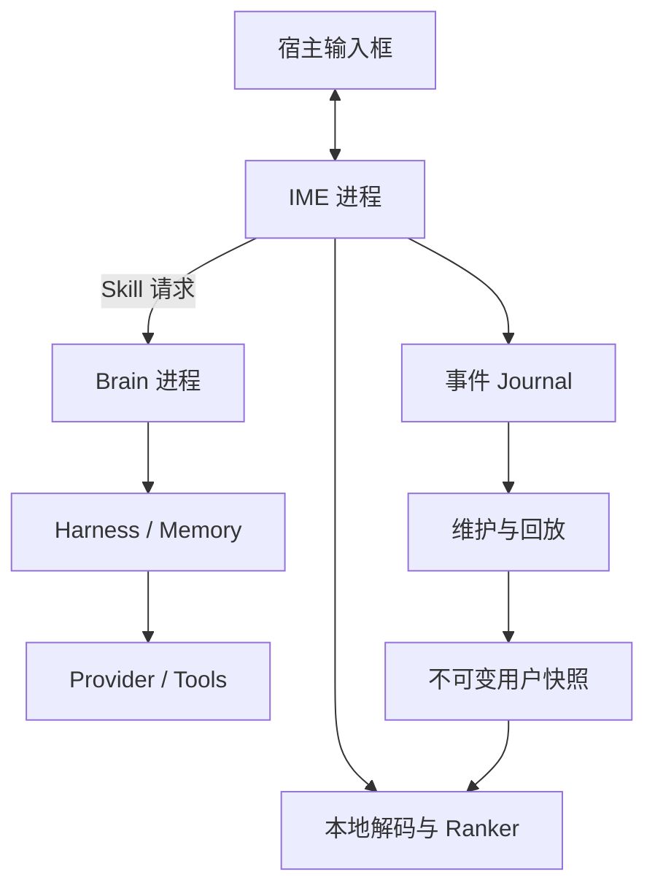

# Sense 输入法（先思输入法）

> Android 原生高性能中文输入法：普通输入完全本地运行，AI、记忆与工具能力通过可配置的长按方向 Skill 显式触发。

**项目状态：** `v0.4.5.beta.1` 键盘架构与固定签名预发布

**当前版本：** `v0.4.5.beta.1`（`versionCode 22`）

**更新日期：** 2026-07-29
**目标平台：** Android 10+（`minSdk 29`，首版按 `targetSdk 36` 建设）

本文基于《GlassIME Android AI 中文输入法产品与技术设计文档 v0.1》重新整理，并统一改名为：

| 项目项 | 定义 |
|---|---|
| 英文名 | Sense |
| 中文名 | 先思输入法 |
| 产品称呼 | Sense 输入法 / 先思输入法 |
| 仓库名 | `Sense` |
| 暂定 Android namespace | `io.github.ethanbird.senseime` |
| 默认主题 | Arctic Glass |

Android 官方要求自 2026 年 8 月 31 日起，新应用和更新需面向 Android 16（API 36）或更高版本，因此项目从第一天按 API 36 的行为约束构建，而不是后期再迁移。

## 0. 当前迭代：v0.4.5.beta.1 键盘架构与固定签名

`v0.4.5` 在 v0.4.4 的开放工具、完整 Agent Journal 和本地记忆之上，把 Skills
交付为可配置、可修订、可由 Agent 智能读取和管理的长期系统：

- 长按可绑定按键后向四个方向滑动选择 Skill，Space AI、Delete repeat 和字符 flick
  保持独立；再次选择当前 Skill 会取消激活；
- 激活按键使用 exact owner child layer 绘制动态极光，不改变键盘高度、不弹窗，也不
  让整张键盘跟随动画重绘；
- 设置首页采用 Provider、记忆（Soul）、工具、Skills 分层结构，每个键位可单独配置；
- Skill 正文、绑定和激活状态使用不可变 revision/catalog generation，旧版本和崩溃
  窗口中的完整数据不会被覆盖或删除；
- 默认 Agent 只看到简短 description，需要正文时调用分页 `skill_read`；用户开启管理
  后，Agent 可通过 `skill_manage` 创建、修改、绑定和解绑 Skill；
- 一次 Agent run 冻结 exact catalog generation 和 active Skill revision，避免多轮
  推理混用设置页刚刚更新的内容；
- IME 只读取后台内存 projection，目录观察、文件锁和持久化不进入按键主线程；
- 现有 `web_search`、`web_fetch`、`calculator`、`memory_search`、完整 Agent Journal
  与联网工具开关继续保留。

现有 Agent 状态机、上滑锁定、停止、流式预览、generation 隔离和编辑器
hash/CAS/写后验证继续有效；这些边界防止状态错写，但不限制用户已授权的数据能力。
内置 `smart_edit`、`answer`、`rewrite`、`continue`、`translate`、`format` 可继续作为
初始 Skills，并允许用户完整修改或另行创建。

### Agent 架构与工程文档

- [AI Agent 深度架构：事件记忆、工具、Skills 与长期兼容性](docs/design/agent-event-memory-architecture-v1.0.md)
- [Agent 工程开发方案：从 Evidence Event Mesh 到可交付的 M9 / M10](docs/development/agent-engineering-plan-v1.0.md)
- [ADR 0019：开放 Agent 工具与完整历史](docs/adr/0019-v0.4.4-open-agent-tools-and-complete-history.md)
- [ADR 0020：v0.4.5 Skills 运行时、键盘手势与 Agent ABI](docs/adr/0020-v0.4.5-skills-runtime-and-keyboard.md)
- [Skills 工程开发文档：交互、不可变存储、工具与设置](docs/development/skills-engineering-plan-v1.0.md)
- [Skills 互操作与 Android 边界研究记录](docs/research/skills-interop-and-android-boundaries-2026-07-27.md)
- [X-02 Stage Substrate 实施记录](docs/development/x02-stage-substrate-implementation.md)

`v0.4.5` 已交付方向选择器、已提交状态驱动的 Aurora、
分层设置、不可变 revision/catalog、精确 `skill_read`、有代际门禁的 `skill_manage`
以及三类 Provider 工具循环。键盘选择以原子 `ACTIVATE|DEACTIVATE` intent 提交，Aurora
用 request token 与 exact physical owner 等待权威 projection；工具页可以分别关闭
`skill_read` 和 `skill_manage`，且不会删除任何用户数据。完整草稿使用原子 recovery
snapshot 与有界生命周期 durability handoff。

`v0.4.5.beta.1` 进一步拆分键盘尺寸策略、主布局、图标绘制、颜色、滚动投影与候选栏
深模块。候选发布、测量缓存、分页、命中检测和横向拖动不再堆叠在 View 中；同一场景
复用缓存，510 项候选宽度走 primitive path，异步 pending → ready 也会切断旧候选的
滚动状态。此版本同时建立固定的 Sense release signer v1，后续 GitHub Release 继续使用
同一证书完成覆盖升级。公开证书 SHA-256 为
`76db888ff42b04d52d4d19a573fe8f8df2fa3af0ab36bd6a08c6f70a8aace984`。

API 36 x86_64 模拟器已实际运行四个模块的 18 项 AndroidTest：17 项通过，显式
opt-in 的固定实体设备绝对性能门禁 1 项明确跳过。当前环境没有临时 Provider Key，
4 个真实网络探针均为 `SKIPPED`，固定实体设备 `p95 <= 32 ms` 证据也尚未补齐；
这些事实作为 v0.4.5 已知证据边界保留，不会写成通过。

| 门禁 | v0.4.5 要求 |
|---|---|
| Skill 数据 | revision/catalog 完整保留、冲突检测、崩溃恢复与超长正文重载 |
| 键盘交互 | 四向选择、精确 physical owner、极光隔离、停止与 reduced motion |
| Agent ABI | description discovery、分页 read、代际 manage、单 Run 冻结 |
| Android 设备 | Parcel、FileObserver/StrictMode、MotionEvent、Settings recreation |
| 既有质量 | AI、IME、UI、Core、M0–M6、Lint、APK、签名、权限与资产哈希无回退 |
| APK 元数据 | `versionCode 22`、`versionName 0.4.5.beta.1`、`minSdk 29`、`targetSdk 36` |

仓库不再运行 GitHub Actions；测试、Lint、性能门禁、APK 构建和签名校验统一在 Windows
本地执行。完整本地验证与构建：

```powershell
powershell -ExecutionPolicy Bypass -File tools/local_release.ps1
```

当前提交推送到 GitHub 后，由同一脚本创建预发布、上传 APK 与校验和，并下载资产复核：

```powershell
powershell -ExecutionPolicy Bypass -File tools/local_release.ps1 -Publish
```

`-SkipTests` 与 `-SkipBuild` 仅用于本地诊断复用已有产物，不用于正式发布。

标准工程验证命令：

```bash
python3 tools/test_build_pinyin_lexicon.py
python3 tools/test_build_bigram_model.py
python3 tools/test_m4_core_assets.py
python3 tools/test_m5_mixed_assets.py

./gradlew \
  :ai-protocol:test \
  :brain-api:test \
  :ai-brain:test \
  :ai-runtime:testDebugUnitTest \
  :memory-protocol:test \
  :memory-protocol:jar \
  :event-journal:test \
  :event-journal:jar \
  :core-input:test \
  :ime-service:testDebugUnitTest \
  :core-input:m0HostBenchmark \
  :core-input:m1PinyinBenchmark \
  :core-input:m2AdaptiveBenchmark \
  :core-input:m3SentenceBenchmark \
  :core-input:m4CoreBenchmark \
  :core-input:m5MixedInputBenchmark \
  :core-input:m6InputPolishBenchmark \
  :ime-ui:testDebugUnitTest \
  :ai-runtime:lintDebug \
  :ime-service:lintDebug \
  :ime-ui:lintDebug \
  :app:lintDebug \
  :app:assembleDebug \
  :app:assembleBenchmark \
  :benchmark:assembleBenchmark
```

在 Maven 仓库不可达、但已安装 API 36 SDK 与 Gradle 8.13 的环境，可运行离线门禁并产出工程 debug 签名 APK：

```bash
ANDROID_SDK_ROOT=/path/to/android-sdk \
SENSE_GRADLE_HOME=/path/to/gradle-8.13 \
tools/offline_verify.sh
```

从 `v0.4.5.beta.1` 起，GitHub Release 使用固定的 Sense release signer v1，并通过
本地发布脚本的指纹门禁校验；后续版本继续使用同一证书且递增 `versionCode`，即可直接覆盖升级。
此前由 runner 临时 debug 证书签名的发布资产属于另一条签名链。AI 编辑基础威胁模型见
[`ADR 0010`](docs/adr/0010-v0.3.5-m8-ai-editor-harness.md)，Soul 与 Provider 延迟决策见
[`ADR 0011`](docs/adr/0011-v0.3.7-m8-agent-soul-provider-latency.md)，本轮锁定、受限上下文
和语音设计见 [`ADR 0012`](docs/adr/0012-v0.4.0-interruptible-ai-and-speech-surface.md)，
本轮恢复边界与工具箱见
[`ADR 0013`](docs/adr/0013-v0.4.1-bounded-stream-and-system-speech-recovery.md)，本轮 Agent
状态机与多轮反馈见
[`ADR 0014`](docs/adr/0014-v0.4.2-agent-session-state-machine.md)。

> **文档权威边界：** 下文第 1–17 节保留了最初的 v0.1 产品/工程构想，用于解释项目来路，
> 不是当前 Agent / M9 实施规范。它所写的“首版”、固定队列、固定超时、固定 Segment
> 阈值或无条件完整性承诺均不得直接转成代码。发生设计冲突时，权威顺序为：已接受 ADR
> → Agent v1.0 架构 → Agent 工程计划 → 本历史档案；当前运行时代码只证明已经实现的事实，
> 当前 `v0.4.5` 已继承跨 Session Agent Journal 与本地词法召回，并加入可修订
> Skills；v0.3 的
> `SCHEMA_ONLY` Gate 资料保留为研究/高保障 profile 记录，不再是默认产品阻断条件。

## 1. 项目结论

Sense 不是把聊天机器人塞进键盘，而是先做成一款足够快、足够稳定的中文输入法，再把输入法天然拥有的上下文、长期行为数据和即时操作入口编译成三种能力：

1. 更准确的本地中文候选与纠错；
2. 任意键长按后向四个方向选择的 Skill；
3. 不进入按键热路径的记忆、Provider 与工具执行系统。

最重要的架构边界是：**按键、解码、候选、绘制与上屏永远不等待网络、Provider、Harness、历史数据库或后台任务。** AI 故障时，Sense 仍然必须是一款完整可用的中文输入法。

## 2. 产品原则

- **输入优先：** 短按只负责输入；AI 不参与逐键候选生成。
- **运行时零弹窗：** Provider、模型、工具、输出策略与 Skill 绑定均在设置 App 中预先配置。
- **显式触发、静默执行：** 长按进入 Skill 层，中心释放保留原数字/符号，四方向执行已绑定 Skill。
- **证据化采集、有限激活：** “全量归档”只是历史愿景，不是现行授权。当前不采集跨
  Session 记忆；未来也只能采集 CapturePolicy 明确许可的事件，并以有界激活集供模型读取。
- **固定热路径：** M2 逐键不访问 SQLite；冷启动仍会加载用户词，长期档案独立性尚待后续快照阶段完成。
- **单层玻璃：** 毛玻璃只作用于键盘底板；不对每个键帽重复模糊。
- **可回放、可测量：** 候选、纠错、Skill、Provider、存储和性能均能通过统一事件重放评估。

## 3. 历史 v0.1 规划范围

### 3.1 纳入 v0.1

- Android 手机、平板与折叠屏的竖屏/横屏输入；
- QWERTY 全拼、候选栏、联想、简繁、中英文混输、数字与常用符号；
- 成熟中文解码底座与 Sense 自定义 Ranker（M2 先以纯 Kotlin 验证，librime 保留为后续 spike）；
- 任意键四方向 Skill 绑定、中心长按字符、滑出取消；
- Arctic Glass 真模糊、拟态玻璃和高对比纯色三级回退；
- OpenAI-compatible Provider，后续通过同一接口扩展其他 Provider；
- 6 个首批 Skill：润色、简短、扩写、中英翻译、回复建议、记录事项；
- 二进制 Journal、不可变 Segment、稳定随机 logical Blob、authenticated locator 与离线回放；
- 输入排序侧的词频、纠错和近期短语继续由独立 `PersistentUserLexicon` 管理；Agent
  `HotSnapshot` 只允许非用户 Skill/route/schema/version/compiled metadata，不承载用户
  词汇、偏好或风格；
- 设置 App、Provider 测试、Skill 键位编辑器、主题预览和性能实验室。

### 3.2 暂不纳入

- iOS、桌面端、Web 端；
- 通用聊天面板、任意脚本执行和无边界自主 Agent；
- Skill 商店、支付、公开第三方插件生态；
- 跨设备同步与账号体系；
- 在回放与真机数据不足时重写完整成熟拼音内核；
- 大型知识图谱和逐键大模型推理；
- 数据治理、合规和安全体系的完整产品设计。

这份 v0.1 构想曾计划让事件从首版开始保留 `schema_version`、`source`、`session_id`、
`app_id`、`timestamp` 与 `lineage`。v0.4.4 从 Agent Run 开始完整保留新历史，但不会
伪造 v0.4.3 以前从未写入的旧 Session。新实现以稳定 sequence 和事件关系为主，墙钟时间
只作为可缺失、可质疑的属性。

## 4. 成功标准

以下是工程预算，不是已经验证的成绩；每个阈值都必须由真机和回放数据校准。

| 指标 | v0.1 目标 | 门禁 |
|---|---:|---|
| 按键视觉反馈 p95 | ≤ 8 ms | 超预算阻断合并 |
| 候选更新 p50 / p95 | ≤ 12 / 24 ms | p95 回退 > 5% 阻断合并 |
| 热启动显示 p95 | ≤ 80 ms | Macrobenchmark |
| 冷启动显示 p95 | ≤ 180 ms | Macrobenchmark |
| 连续输入掉帧 | < 0.5% | 60/90/120 Hz 真机 |
| IME RSS 空闲 / 输入 | ≤ 45 / 70 MB | 多机型 P90 |
| 每键 JVM 分配 | 接近 0，目标 < 128 B | Allocation 测试 |
| Skill 本地开销 | Provider TTFB 外 < 100 ms | 端到端 trace |
| Skill 成功率 | ≥ 97% | Provider 错误单列 |
| Journal 平均 CPU | < 1% 单核 | 连续输入 30 分钟 |
| 长期档案独立性 | 10 年档案无显著延迟回退 | 合成档案回放 |

候选质量使用 Top-1/Top-3 命中率、平均候选位次、按键节省率、上屏后三秒回删率衡量；Skill 质量使用首 token、总耗时、整段撤销率、用户修改距离和重复使用率衡量。

## 5. 总体架构


```mermaid
flowchart TD
    Host[宿主输入框] <--> IME[IME 进程]
    IME --> Decoder[本地解码与 Ranker]
    IME --> Journal[事件 Journal]
    IME -->|Skill 请求| Brain[Brain 进程]
    Brain --> Harness[Harness / Memory]
    Harness --> Provider[Provider / Tools]
    Journal --> Worker[维护与回放]
    Worker --> Snapshot[不可变用户快照]
    Snapshot --> Decoder
```

### 5.1 进程边界

| 进程 | 负责 | 明确禁止 |
|---|---|---|
| `:ime` | InputMethodService、Canvas UI、本地 Decoder、Ranker、用户词写入队列 | 网络、Provider SDK、逐键数据库查询、同步写盘、JSON 解析 |
| `:brain` | Harness、记忆检索、Provider、工具、流式 trace | 持有 IME View 或长期持有 InputConnection |
| `main` | 设置 App、配置编译、维护任务调度、性能实验室 | 参与逐键解码与绘制 |

### 5.2 线程模型

- **IME Main：** 触摸、局部绘制、候选 UI、InputConnection；
- **Decoder：** 增量拼音解码与候选生成；
- **Journal Writer（历史构想）：** 曾设想 SPSC 队列；当前 Agent 工程方案先在端口后使用
  有界 `ArrayBlockingQueue.offer`，是否替换只能由真机预算证据和 ADR 决定；
- **Brain Engine / HTTP Worker：** Provider 流、结构化 Harness、超时和取消；
- **Maintenance Worker：** 压缩、索引、Embedding、快照编译和回放。

### 5.3 关键技术决策

| 领域 | 决策 | 原因 |
|---|---|---|
| IME UI | 自定义 `View/Canvas`；设置 App 使用 Compose | 控制逐帧分配和绘制范围 |
| 中文内核 | M2 纯 Kotlin 紧凑词典 + 自适应层；librime 作为后续对照 spike | 先冻结可测闭环，再用回放与真机数据决定迁移 |
| Ranker | 确定性特征 + 可选小型量化重排 | 不让神经模型成为候选可用性的前置条件 |
| IPC | 私有 Service + Messenger/有界 Bundle 流式回调、取消与死亡监听 | 隔离 Brain 崩溃和系统回收 |
| 配置 | 版本化 AtomicFile，API Key 用 Android Keystore 包装 | IME 热路径不读取 Provider 配置 |
| 原始事件 | Journal → Segment + Blob | 避免每键一行 SQLite/Room |
| 个性化 | 后台编译不可变 mmap 快照 | 热路径成本不随历史增长 |
| 玻璃主题 | 真模糊、拟态、纯色三级实现 | Android 12+ 也可能因 GPU/OEM/节电关闭模糊 |

## 6. 工程结构

当前按输入热路径、AI 协议、Provider 引擎和 Android 运行时拆分九个可验证模块：

```text
Sense/
├── app/                 # 设置 App、启用向导、配置与主题编辑
├── ime-service/         # InputMethodService、InputConnection、生命周期
├── ime-ui/              # Canvas 键盘、候选栏、手势、Arctic Glass
├── core-input/          # 输入状态、候选协议、中文/英文 Ranker
├── ai-protocol/         # 快照、Patch、严格 JSON 和有界会话
├── brain-api/           # Provider Profile、Transport、run contracts
├── ai-brain/            # Responses/Chat、SSE、Harness、repair
├── ai-runtime/          # :brain Service、Messenger、Keystore、HTTP
├── benchmark/           # Macrobenchmark、输入回放、长期档案压测
└── docs/                # ADR、协议、测试记录和设计资料
```

当任一模块出现独立发布节奏、独立依赖边界或明显构建瓶颈时再拆分；不为“看起来架构完整”提前制造空模块。

## 7. 核心交互设计

### 7.1 长按方向 Skill

| 动作 | 行为 |
|---|---|
| 短按 | 永远输入当前键，不允许 Skill 覆盖 |
| 长按中心释放 | 输入原数字或符号 |
| 长按向上/左/右/下 | 执行绑定的 U/L/R/D Skill |
| 滑出取消区 | 不输入字符，也不执行 Skill |

初始参数为：进入 Skill 层 220 ms、中心死区 10–14 dp、方向激活 22–30 dp、方向锁定 ±35°。这些值必须通过单手/双手、手机/平板和不同触控采样率的误触实验确定，不能直接当作最终常量。

### 7.2 编辑事务

每次 Skill 在手指松开时冻结 `EditorTransaction`，记录会话、editor revision、选区、光标前后文和 composing 文本。结果返回后：

- revision 未变化：按策略替换或插入；
- 用户继续输入但锚点仍有效：在锚点插入，不覆盖新输入；
- 选区或上下文变化：结果降级到候选栏；
- InputConnection 失效：写入短期结果缓存；
- 自动插入文本作为一个事务块，第一次删除可整块撤销。

## 8. 中文输入与个性化

### 8.1 首批中文能力

- 全拼、模糊音、首字母缩写；
- 中英文、数字、日期、时间、金额、邮箱、URL 混输；
- 简繁、中文标点、Emoji、用户词和专有名词；
- 拼音纠错、候选纠错学习、上屏后回删识别；
- 下一词预测只占低优先级候选，不挤占正在输入的拼音结果。

### 8.2 排序顺序

`base_language_score + user_frequency + recency + app_profile + context_ngram + correction_gain + optional_neural_reranker`

前六项本地确定性计算；神经重排最多处理前 16–32 个候选。Ranker 只读取编译后的特征快照，不查询完整历史。

### 8.3 学习信号

- 用户输入、候选选择和主动纠错是强信号；
- 粘贴文本是低权重信号；
- AI 生成和工具结果默认权重为 0；
- AI 结果只有在用户保留、修改或重复使用后才形成学习信号；
- 每个 App 分别维护语言、词汇、语气和 Skill 质量画像。

## 9. 事件档案与回放（历史构想）

历史方案曾设想固定头、变长整数、批量写入和 4–16 MiB 的封段阈值。当前工程规范改为
版本化 Frame、稳定随机 logical Blob、authenticated locator 和不可变 Segment；封段大小、批量与 flush 策略全部保持
`UNSET`，只有通过 Android 真机 Measurement Contract 后才能写入 Budget Profile。索引、
Embedding 和模型快照仍只能是可删除、可重建的派生物。

落盘优先级：输入语义事件 > 编辑与 Skill 事件 > Provider trace > 高频性能采样。队列接近满时仅允许降低非关键性能采样，不允许阻塞 IME Main。

离线回放以同一真实会话比较不同解码器、Ranker 和快照，至少输出：Top-1 命中、平均位次、按键节省、纠错概率、延迟分布与内存峰值。

## 10. Harness、Provider 与工具（历史 v0.1 预算）

v0.1 的 Harness 是**有界执行器**，不是自由规划 Agent：

- 默认最多 2 个工具步骤；
- 当时曾规划 Provider 连接 / 首事件 / 流空闲 / 总超时为 8 / 8 / 8 / 30 秒；这些数值已被
  `v0.4.2` 状态机取代，不是当前常量；
- 单工具超时 3–5 秒；
- 最多并行 2 个工具；
- 默认最大返回文本 4 KiB；
- 每次执行可取消、可超时、可回放；
- 所有流式 delta、tool call、tool result 和错误进入 trace。

Provider 先实现 OpenAI-compatible 适配器，并抽象 `fast`、`smart`、`embed` 三个逻辑 Profile。Skill 依赖逻辑能力而不依赖厂商；首 token 超时、5xx 或能力不匹配时按预设 fallback，运行时不弹窗。

## 11. 里程碑

| 阶段 | 主要交付 | 退出条件 |
|---|---|---|
| M0 工程与基线 | Gradle 工程、IME 壳、Canvas 空键盘、基准、CI | Debug APK 可安装启用；冷/热启动和帧指标可重复 |
| M1 离线输入闭环 | 字母/符号、composing、候选栏、上屏/删除、横竖屏 | 断网可稳定完成完整输入闭环 |
| M2 中文引擎 | 纯 Kotlin 全拼、扩充词典、短码/纠错、基础 Ranker、SQLite 用户词 | Host 门禁通过；等待候选 p95 与进程恢复真机验收 |
| M3 句级排序与候选分页 | 词典派生字符 bigram、有界句级重排、候选展开与分页 | Host 正确性和回放门禁通过；等待真机候选质量与分页交互验收 |
| M4 渐进式输入与高速键盘 | 简拼索引、自动分词、异步解码、多指触控、加速退格、候选展开 | Host 回归保留在后续所有发布门禁；等待真机高速输入验收 |
| M5 混输与交互收敛 | 20k 英文词典、hybrid 拼音、稳定候选发布、连续 Emoji、剪贴板与文字编辑页 | `v0.3.2-m5` CI 通过后，完成 Android 真机混输、滚动、选择和视觉验收 |
| M6 输入精修与候选交互 | 空 composition 修复、英文独立组合态、候选横滑、Emoji 惯性、分类符号与语义候选 | `v0.3.3-m6` CI 通过后，完成 Android 真机宿主兼容、滚动和字体验收 |
| M7 固定几何与词库扩充 | 输入前后固定键盘高度、单行顶部槽位、成语词库、四字简拼优先 | `v0.3.4-m7` CI 通过后，完成 Android 真机高度、字体与候选质量验收 |
| M8 AI 编辑 Harness | 协议、Provider、私有 Brain、长按空格、固定高度 AI Surface、快照、原子 Patch 与真实网络一次集成 | 松手取消 0 次误覆盖；旧快照 0 次上屏；Brain 故障不影响普通输入 |
| M9 事件与记忆底座 | Journal、Segment、Blob、Manifest、加密 Recall 与非用户路由快照 | 高负载采集不影响输入；只对已确认 `DurableAck` cut 保证连续，其他损失形成显式 gap；完整性回执和回放结果可重复 |
| M10 Skill 与工具 | 可配置 Skill、受限工具、上下文检索、质量回放 | 每个 Skill 可取消、可审计、可回退且不阻塞输入 |
| M11 稳定化 | 机型矩阵、24h 压测、固定签名、故障降级、发布检查 | 所有 P0 门禁通过，形成首个内测版本 |

连续多轮真实输入反馈使 M3–M7 优先关闭候选质量、渐进选词、高速触控、工具面板、中英混输、字符可达性、键盘几何和默认词库缺口。M8 优先交付用户明确要求的 AI 编辑 Harness；协议基础已由先前预览冻结，其余 Provider、交互、编辑事务和真实模型合并为一次可安装预览，完整事件归档、长期记忆和四方向 Skill 顺延，但仍保留模块边界。

## 12. 迭代记录：M0 可运行骨架

以下保留 M0 的实施记录；当前代码位于 `v0.4.5.beta.1` 键盘架构与固定签名预发布阶段。
现有输入仍需继续完成 Android 真机安装、SQLite/剪贴板进程恢复、空
composing 跨宿主兼容、候选与 Emoji 惯性、符号字体和高速输入性能验收。

### 12.1 实施清单

1. 初始化 Gradle Wrapper、Version Catalog、Kotlin/Android convention plugin；
2. 固定 `minSdk 29`、`compileSdk/targetSdk 36`，启用 arm64-v8a 与 x86_64 测试 ABI；
3. 创建 `app`、`ime-service`、`ime-ui`、`core-input`、`benchmark` 五个首批模块；
4. 实现 Sense 设置首页、输入法启用与切换入口；
5. 注册带 `BIND_INPUT_METHOD` 的 `SenseInputMethodService`；
6. 用单个自定义 View 绘制 QWERTY、候选栏、按下态与基础 Arctic Glass B；
7. 实现短按、删除、空格、回车、大小写、composing 和假候选数据闭环；
8. 建立无网络的 `FakeDecoder`，先冻结 Kotlin 与 native 解码接口；
9. 加入帧时间、输入延迟、冷/热启动与每键分配基准；
10. 建立 lint、单元测试、构建 Debug APK 的 CI；
11. 输出首份基准报告与至少一张实际运行截图；
12. 用 ADR 记录 namespace、模块边界、渲染方案和后续 librime 接入点。

### 12.2 M0 验收

- `./gradlew test lint assembleDebug` 全部通过；
- APK 能安装、启用、切换到 Sense，并在系统文本框输入；
- Provider 不存在、网络关闭时行为完全一致；
- 键盘高度稳定，候选栏不导致宿主页面反复重排；
- 60 Hz 模拟器或真机连续点击无可见卡顿；
- 基准结果以机器可读文件纳入版本控制；
- 不把 librime、Provider SDK 或事件存储提前耦合到 UI。

## 13. 必做技术验证

| Spike | 要回答的问题 | 通过标准 |
|---|---|---|
| P1 librime/JNI | ABI、词典体积、首启部署、候选延迟、内存是否满足预算 | arm64/x86_64 可重复构建；首批基准达标后锁定版本 |
| P2 IME Window Blur | Android 12+ 各 OEM 是否允许稳定跨窗口 blur | 任何时候关闭 blur 都能无闪烁切回拟态背景 |
| P3 Messenger Streaming | Brain 重启、断流、取消、Binder death 是否可控 | 反复杀死 Brain 不影响逐键输入 |
| P4 Gesture Lab | 四方向与中心符号的误触边界 | 多尺寸、多刷新率下取消率和误触率可测且可调 |
| P5 Journal Replay | 100 万事件写入、封存、损坏恢复、重放 | IME Main 不做 IO；事件顺序和校验可复现 |

librime 当前正式版本线已到 1.17.x，但项目不会因为“最新”就直接锁定；先完成 Android ABI、依赖、体积、许可证和性能验证，再把精确 commit 固定到版本目录。

## 14. 测试策略

- **单元测试：** 输入状态机、拼音状态、候选排序、方向判定、EditorTransaction、事件编解码；
- **属性测试：** 任意按键序列不破坏 composing 状态，Segment 编解码可逆；
- **仪器测试：** InputConnection、横竖屏、WebView、进程回收、主题切换；
- **黄金图测试：** Arctic Light/Dark、Glass B/Solid、不同 DPI 与字体缩放；
- **Macrobenchmark：** 冷/热启动、首帧、连续输入、候选更新；
- **回放测试：** 空档案、1 月、1 年、10 年合成档案；
- **故障注入：** Provider 超时/断流、Brain 被杀、快照损坏、Journal 队列高水位；
- **真机矩阵：** Pixel、Samsung、小米/Redmi、OPPO/vivo 的低中高端代表机，覆盖 60/90/120 Hz。

## 15. 风险与止损线

| 风险 | 早期信号 | 处理 |
|---|---|---|
| librime 包体或首启过重 | M2 前已超冷启动/RSS 预算 | 词典分包、延迟部署；必要时评估替代内核 |
| 毛玻璃 OEM 差异大 | 真模糊启用率低或频繁掉帧 | Glass B 成为默认视觉，真模糊仅增强 |
| 模块过多拖慢构建 | 空壳模块多、跨模块改动频繁 | 维持七个稳定边界，按实际依赖拆分 |
| 事件采集干扰输入 | 队列高水位、CPU/IO 抖动 | CapturePolicy 默认拒绝普通键入；仅 allowlist 事件使用固定上限非阻塞入队，并受 Budget gate 约束 |
| Skill 异步覆盖新文本 | stale transaction 测试失败 | 禁止自动应用，统一降级到候选或缓存 |
| AI 输出污染个性化 | AI 短语排名自行升高 | 来源标签强制参与学习权重，AI 默认 0 |
| Provider 适配失控 | Skill 出现厂商分支 | 以能力快照与逻辑 Profile 隔离厂商协议 |

如果中文与混输内核无法在中端 Android 设备上满足候选延迟与 RSS 预算，项目暂停叠加 AI，优先修复输入内核；后续 Brain 影响 IME 稳定性时，Brain 整体必须可关闭并继续发布纯输入版本。

## 16. Definition of Done

任一里程碑只有同时满足以下条件才算完成：

- 功能在真实 InputConnection 中可用，不只在 Demo Activity 中展示；
- 正常路径、降级路径和进程回收路径均有测试；
- 对应性能预算有可重复数据；
- 新增协议带版本，新增数据可回放；
- 没有网络和 AI 服务时普通输入不退化；
- 文档、ADR、基准结果与实现同步提交；
- 没有以 TODO 代替会影响下一阶段的核心行为。

## 17. 参考资料

- [Android Developers：Create an input method](https://developer.android.com/develop/ui/views/touch-and-input/creating-input-method)
- [Android Developers：InputMethodService](https://developer.android.com/reference/android/inputmethodservice/InputMethodService)
- [Android Developers：Google Play target API 要求](https://developer.android.com/google/play/requirements/target-sdk)
- [AOSP：Window blurs](https://source.android.com/docs/core/display/window-blurs)
- [Android Developers：Baseline Profiles](https://developer.android.com/topic/performance/baselineprofiles/overview)
- [Android Developers：Startup Profiles](https://developer.android.com/topic/performance/startupprofiles/dex-layout-optimizations)
- [Android Developers：WorkManager](https://developer.android.com/develop/background-work/background-tasks/persistent/getting-started)
- [Rime：librime](https://github.com/rime/librime)

---

**下一步：** 在 Pixel、Samsung、小米/Redmi、OPPO/vivo 上验收长按/松手竞态、自定义编辑器兼容、Brain 进程故障、真实 Provider 以及键位缝隙命中手感。
