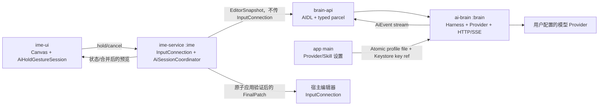

# ADR 0010：M8 AI 编辑 Harness 与长按空格交互

- 状态：Accepted（M8-A 实施中）
- 日期：2026-07-24
- 目标版本：`0.3.5-m8`
- 基线：`main@bda3177e89d88f21f7b325871e3aafc8cb5b910b`（`0.3.4-m7`）

## 1. 结论

Sense 的第一版 AI 不做聊天机器人，也不把模型输出直接写入输入框。

它应当是一个有界的 **AI 编辑事务系统**：

1. 短按空格完全保留现有语义；
2. 空格静止长按达到阈值后，抑制普通空格并启动 AI；
3. IME 捕获当前编辑器的不可变快照；
4. 键盘在总高度不变的前提下切换为 AI 流式工作区；
5. 模型可以生成用户可见预览，但预览永远没有编辑权限；
6. 模型最终只能提交一个严格的 `sense.editor.patch.v1` 终结协议；
7. IME 在本地重新校验输入框、会话代际和手指仍按住后，才执行一次原子替换；
8. 在最终替换前松开空格，立即作废会话并中断网络，迟到结果不得覆盖输入框；
9. 普通输入热路径不加载 Provider、HTTP、JSON Harness 或大型运行时。

## 2. 为什么不能只接一个聊天 API

直接把流式文本 `commitText()` 到输入框会产生不可接受的失败模式：

- 网络断流会留下半句话；
- 模型输出 Markdown、解释文字或伪协议时会污染正文；
- 用户或宿主应用在推理期间修改文本时，旧结果会覆盖新内容；
- 松手取消与网络完成恰好并发时，可能发生取消后仍上屏；
- 不同 Android 编辑器对全文读取、选区和批量编辑的实现并不一致；
- Provider 的工具调用、结构化输出和流式格式各不相同；
- AI 崩溃、OOM 或 SDK 初始化不能拖垮普通键盘。

因此，必须把“模型生成”和“编辑器提交”隔成两个权限域。

## 3. 微信输入法调研结论

截至 2026-07-24，微信输入法公开功能包括：

- 问 AI，支持 DeepSeek/Hunyuan 深度回答；
- 文案生成、润色排版、灵动表达、文字整理；
- 复制内容后问 AI、选中文本快捷分享；
- 表情推荐、定制表情、文字图片；
- 多语言语音输入、智能标点、分段、去口水词和语序整理；
- 边写边译、常用语、剪贴板、手写找字、拼写检查；
- 跨设备剪贴板、文件传送、词库和设置同步。

官方预览图显示：宿主输入框保留原问题，整个键盘区域切换为“问 AI”结果面板，并提供继续提问、发送和关闭入口。这一“固定区域接管”值得借鉴。

但公开资料不能证明微信输入法：

- 自动读取了整个输入框；
- 逐 Token 展示生成过程；
- 在生成完成后自动原子覆盖全文；
- 真正中断了已关闭界面的网络请求；
- 支持用户配置 OpenAI-compatible Provider；
- 使用了可验证的结构化编辑协议。

Sense 应借鉴它的面板形态，而不是照搬不透明的“发送”动作。

参考：

- [腾讯应用宝：微信输入法](https://sj.qq.com/appdetail/com.tencent.wetype)
- [Apple App Store：微信输入法](https://apps.apple.com/cn/app/%E5%BE%AE%E4%BF%A1%E8%BE%93%E5%85%A5%E6%B3%95/id1618175312)
- [NousResearch/hermes-agent](https://github.com/NousResearch/hermes-agent)
- [MaxGfeller/open-harness](https://github.com/MaxGfeller/open-harness)

## 4. 产品交互

### 4.1 空格的确定性语义

```text
SPACE ACTION_DOWN
    │
    ├─ 380ms 内 ACTION_UP ───────────────→ 原有 Space，仅触发一次
    │
    ├─ ACTION_CANCEL / 失去输入连接 ─────→ 什么都不提交
    │
    └─ 静止达到 380ms
             │
             ├─ 震动一次
             ├─ 抑制 Space
             ├─ 收敛当前 composing
             ├─ 捕获 EditorSnapshot
             └─ 进入 AI 工作区并启动 Harness
                         │
                         ├─ 最终协议前松手 → 同步作废 generation
                         │                    + 取消 Binder/协程/HTTP
                         │                    + 不修改输入框
                         │
                         ├─ 编辑器发生变化 → 取消，不覆盖
                         │
                         ├─ 协议无效/超时 → 显示失败，不覆盖
                         │
                         └─ 合法 FinalPatch 且仍按住
                                      │
                                      ├─ 再读编辑器并校验 hash
                                      ├─ 原子替换
                                      └─ 保持“已写入”页直至松手
```

M8 不加入“松手继续”或“上滑锁定”。默认严格实现用户要求的 dead-man switch：按住才允许继续，松手即取消未完成任务。

如深度模型普遍超过 15 秒，后续可另行评估可选锁定手势，但不能偷偷改变 M8 的取消语义。

### 4.2 composing 的处理

进入 AI 前如果仍有中文或英文 composing：

1. 使用现有 Space 的首选词提交语义收敛 composing；
2. 不额外插入空格；
3. 等待当前候选解码最多 120ms；
4. composing 提交成功后再捕获快照；
5. 之后取消 AI 不撤销已经完成的正常文字输入。

这样可避免把 `zhongwen` 等未完成拼音误发给模型，同时不需要让 AI 理解 IME 内部 composing span。

### 4.3 AI 工作区

AI 工作区接管当前键盘内容，但继续使用 M7 固定高度：

- 竖屏：`358dp`
- 横屏：`258dp`
- 不改变 IME Window 高度；
- 不改变宿主输入框的位置；
- 不在普通界面额外插入标题行；
- AI 激活期间，原始 space pointer 始终由 `AiHoldGestureSession` 持有；
- AI surface 只能覆盖在同一个键盘根 View 上，不能在手指按住期间移除或替换原 View；
- 其他 pointer 暂停输入，避免事务执行期间文本继续变化。

建议布局：

```text
┌──────────────────────────────────────┐
│ Sense AI · Provider / Model · 1.8s   │
├──────────────────────────────────────┤
│ 正在理解输入 / 正在组织表达 / 校验中  │
│                                      │
│ 用户可见的流式草稿……                  │
│                                      │
│                                      │
├──────────────────────────────────────┤
│ 按住继续 · 松手取消                   │
└──────────────────────────────────────┘
```

显示规则：

- 可以显示本地阶段状态；
- 可以显示 Provider 返回的公开草稿，或从流式 tool arguments 中安全解码出的暂定正文；
- 不把原始 JSON、SSE 行、tool arguments 或 Provider 调试信息直接绘制给用户；
- 暂定正文只用于预览，允许与最终正文不同，最终正文仍以完整协议校验结果为准；
- 不显示、保存或依赖模型隐藏思维链；
- 流式 delta 每 32–50ms 合并一次再跨 Binder/重绘；
- 最终协议通过后显示“已写入”，但不突然恢复键盘；
- 手指松开后再恢复普通键盘，避免 release 落到新按键上。

## 5. 默认 AI 任务

空格长按绑定一个可配置的默认 Skill。M8 默认使用 `smart_edit`：

- 有选区：只处理选区；
- 无选区：目标为整个输入框；
- 内容是明确问题或指令：生成可直接发送的答案；
- 内容是草稿：润色、整理或补全，保持原意；
- 内容不足以判断：返回 `no_change`，不得编造编辑目标。

设置页后续可选择：

- 智能处理 `smart_edit`
- 润色 `rewrite`
- 续写 `continue`
- 翻译 `translate`
- 排版 `format`
- 自定义 Prompt Skill

Harness 会把任务写成固定、明确的系统合同。输入框内容始终包在 `UNTRUSTED_EDITOR_CONTENT` 数据边界内，输入框中伪造的系统指令、JSON 或工具调用不得改变 Harness 规则。

## 6. 进程与模块边界



### 6.1 新模块

#### `ai-protocol`

纯 Kotlin/JVM：

- `EditorSnapshotV1`
- `HarnessRequestV1`
- `EditorPatchV1`
- `AiEvent`
- 严格 JSON parser/validator
- session state machine
- patch guard

不得依赖 Android、HTTP 或 Provider SDK。

#### `brain-api`

极小 AIDL：

```text
start(request, callback)
cancel(requestId, generation)
```

回调事件：

- `Started`
- `Status`
- `PreviewReset`
- `PreviewDelta`
- `Usage`
- `FinalPatch`
- `Cancelled`
- `Failed`

每个回调信封都必须携带由本地生成的 `requestId` 和 `runGeneration`。它们不由模型生成；IME 用它们在解析正文前丢弃迟到事件。

#### `ai-brain`

运行于私有 `:brain` 进程，`exported=false`：

- Provider registry
- 原生 HTTP/SSE transport
- 有界 Harness loop
- 超时、重试、取消和断路
- tool call / JSON Schema 归一化
- 协议解析和第一层校验

#### `ime-service`

唯一允许持有 `InputConnection`：

- 收敛 composing；
- 捕获快照；
- 维护 editor generation；
- 绑定/解绑 Brain；
- 丢弃迟到事件；
- 重新读取并校验；
- 执行 patch。

#### `ime-ui`

只负责：

- 长按手势；
- pointer ownership；
- 固定高度 AI surface；
- 合并后的流式绘制；
- 不接触网络、Provider 或 `InputConnection`。

### 6.2 不引入的内容

不把 Hermes/OpenHarness 本体嵌入 APK，也不在 M8 引入：

- Python、Node 或 Termux runtime；
- shell、文件系统、浏览器和任意 HTTP 工具；
- MCP、子智能体、cron、长任务 checkpoint；
- 自动创建/修改 Skill；
- 通用多轮聊天历史；
- 重型 Provider SDK。

借鉴它们的 Provider 分层、typed event stream、请求级取消和 session 边界，但使用轻量 Kotlin 实现。

## 7. Provider 配置

设置页新增版本化 `ProviderProfile`：

```json
{
  "schema_version": 1,
  "id": "primary",
  "display_name": "My Provider",
  "api_style": "openai_responses",
  "base_url": "https://api.example.com/v1",
  "key_ref": "android-keystore-alias",
  "model": "model-name",
  "reasoning_effort": "medium",
  "structured_mode": "native_tool",
  "stream": true,
  "connect_timeout_ms": 4000,
  "first_event_timeout_ms": 5000,
  "idle_timeout_ms": 5000,
  "total_timeout_ms": 15000,
  "max_output_chars": 4096,
  "headers": {}
}
```

M8 首批支持：

1. OpenAI Responses API；
2. OpenAI-compatible Chat Completions；
3. 自定义 Base URL；
4. 自定义模型名和 API Key；
5. `Auto / Responses / Chat Completions`；
6. 流式开关、reasoning effort、超时；
7. 测试连接与能力探测。

后续 Provider adapter：

- Anthropic Messages
- Google Gemini
- OpenRouter
- DeepSeek
- Ollama / vLLM

Provider Profile 只声明能力与参数，Transport 负责请求。不能在设置页、Brain 和 Harness 三处重复硬编码同一 Provider。

配置采用 `AtomicFile` 原子写入；API Key 用 Android Keystore 包装。不要依赖跨进程 `SharedPreferences` 的即时一致性。

- Keystore 中保存不可导出的加密密钥，API Key 密文保存在应用私有目录；
- 用户尚未解锁设备时不解密 Key、不启动远端 AI；
- Base URL 默认只接受 HTTPS；M8 不默认放开任意明文 HTTP；
- “测试连接”不得把 API Key、响应正文或完整 URL query 写入日志。

## 8. 编辑器快照

### 8.1 能力等级

Android 不保证所有 `InputConnection` 返回全文，因此快照必须声明能力：

```text
FULL_DOCUMENT
SELECTION_ONLY
SURROUNDING_WINDOW
UNAVAILABLE
```

只有 `FULL_DOCUMENT` 可以自动覆盖整个输入框。

`SELECTION_ONLY` 只允许替换冻结选区；`SURROUNDING_WINDOW` 只能生成预览，M8 不自动覆盖；`UNAVAILABLE` 立即失败并恢复键盘。
后两种能力的 `target` 必须为 `null`，不能借由非空选区绕过只读边界。

### 8.2 读取顺序

1. `getExtractedText()` 获取文本、`startOffset` 和选区；
2. 使用 `getSelectedText()` 交叉校验选区；
3. 使用 `getTextBeforeCursor()` / `getTextAfterCursor()` 验证边界并作为退化路径；
4. 超过最大上下文长度时标记截断，不假装是全文；
5. 密码、可见密码和数字密码字段不读取、不联网；
6. `IME_FLAG_NO_PERSONALIZED_LEARNING` 默认不允许远端 AI，可在未来设计显式全局策略，但 M8 fail closed。

`EditorSnapshotV1`：

```json
{
  "protocol": "sense.editor.snapshot.v1",
  "request_id": "uuid",
  "snapshot_id": "uuid",
  "editor_generation": 42,
  "field_identity": "session-local-id",
  "capability": "FULL_DOCUMENT",
  "text": "输入框完整内容",
  "text_start_offset": 0,
  "selection": {"start": 8, "end": 8},
  "target": "whole_field",
  "base_sha256": "...",
  "captured_at_monotonic_ms": 123456,
  "truncated": false,
  "max_output_chars": 4096
}
```

`field_identity` 只在本地使用；Provider 不需要收到包名、View ID 或其他无助于文本任务的数据。

`base_sha256` 的规范算法固定为 `SHA-256(UTF-8(snapshot.text))`，输出 64 位小写十六进制；
IME 与 Brain 必须复用 `ai-protocol` 的同一实现，不得各自定义摘要编码。

### 8.3 快照失效

以下任一事件增加 `editor_generation` 并取消当前 AI：

- `onStartInput`
- `onFinishInput`
- `onUpdateSelection` 出现非本次 patch 导致的变化
- 当前 `InputConnection` 改变
- 宿主文本 hash 改变
- IME Window 隐藏
- 横竖屏重建
- Brain Binder death

## 9. Harness 协议

### 9.1 唯一终结工具

M8 只向模型提供一个终结工具：`submit_editor_patch`。

工具调用只产生 Proposal，不执行编辑。

```json
{
  "protocol": "sense.editor.patch.v1",
  "request_id": "9b...",
  "snapshot_id": "4f...",
  "base_sha256": "ab...",
  "intent": "answer",
  "operation": {
    "type": "replace",
    "target": "whole_field",
    "text": "最终可直接使用的文字",
    "selection_after": "end"
  }
}
```

允许的 `operation.type`：

- `replace`
- `no_change`

允许的 `target`：

- `whole_field`
- `selection`

模型不返回绝对字符偏移。Android 使用 UTF-16 索引，模型计算偏移容易在 Emoji、组合字符和代理对上出错；目标范围由本地冻结快照映射。

### 9.2 严格校验

Schema 规则：

- `additionalProperties: false`
- `protocol`、`request_id`、`snapshot_id`、`base_sha256` 使用常量校验
- 恰好一个终结调用
- `intent` 必须是已知枚举
- `text` 不得超过本地上限
- 拒绝 NUL、孤立 surrogate 和非法 Unicode
- `selection` 不存在时拒绝 `target=selection`
- 快照非全文时拒绝 `target=whole_field`
- `no_change` 不得携带替换正文

解析优先级：

1. Provider native tool calling；
2. Provider strict JSON Schema；
3. 严格解析完整 JSON；
4. 最多一次格式修复；
5. 仍失败则 `PROTOCOL_INVALID`，绝不上屏。

输入框中即使包含看似合法的 `sense.editor.patch.v1`，也只是未受信任的数据，不能被本地 parser 当成模型终结结果。

### 9.3 有界 Harness

M8 Harness：

- 单模型请求；
- 只有一个 terminal tool；
- 默认最多一次格式修复；
- 不执行外部工具；
- 总超时 15 秒；
- 首事件超时 5 秒；
- stream idle 超时 5 秒；
- 最大正文 4096 字符；
- Provider fallback 最多一次，且必须发生在尚未显示草稿时。

## 10. 流式事件与取消

### 10.1 内部事件

```kotlin
sealed interface AiEvent {
    data class Started(...) : AiEvent
    data class Status(val phase: Phase, val label: String) : AiEvent
    data class PreviewReset(val attempt: Int) : AiEvent
    data class PreviewDelta(val text: String) : AiEvent
    data class Usage(...) : AiEvent
    data class FinalPatch(val patch: EditorPatchV1) : AiEvent
    data class Cancelled(val reason: CancelReason) : AiEvent
    data class Failed(val code: ErrorCode) : AiEvent
}
```

Provider 的 reasoning delta 不作为编辑协议，也不原样当作隐藏思维链展示。可以显示 Provider 明确标注为用户可见的 reasoning summary。

### 10.2 松手取消的竞态门禁

松手时必须按以下顺序执行：

1. UI 线程同步将 `runGeneration` 标记为无效；
2. 状态从 `ARMING/STREAMING/VALIDATING` 转为 `CANCELLING`；
3. 禁止任何新的 `FinalPatch` 进入 `APPLYING`；
4. 调用 Binder `cancel(requestId, generation)`；
5. Brain 取消 Coroutine Job；
6. 当前请求的 OkHttp `Call.cancel()`；
7. 关闭 SSE body/source；
8. 丢弃所有 generation 不匹配的迟到事件；
9. 恢复普通键盘。

网络取消只是资源回收手段，**generation + 状态 CAS** 才是防止误覆盖的最终安全边界。

合法提交需要同时满足：

```text
currentGeneration == event.runGeneration
pointerStillDown == true
state CAS VALIDATING -> APPLYING 成功
snapshotId / baseSha256 匹配
editorGeneration 未变化
重新读取的目标文本与 selection 匹配
```

## 11. 原子应用

API 34+ 优先：

```text
InputConnection.replaceText(start, end, text, 1, textAttribute)
```

API 29–33：

```text
beginBatchEdit()
finishComposingText()
setSelection(targetStart, targetEnd)
commitText(replacement, 1)
setSelection(selectionAfter, selectionAfter)
endBatchEdit()
```

要求：

- `beginBatchEdit()` 与 `endBatchEdit()` 必须一一对应；
- 应用前保留短时 `EditorCheckpoint`；
- 每一步检查连接和返回值；
- 应用后重新读取并验证目标文本；
- 若宿主只支持部分操作，返回 `EDITOR_REJECTED`，不得继续猜测；
- M8 仅保证纯文本，富文本样式可能丢失；
- checkpoint 不进入模型上下文；
- 自动恢复前必须确认当前文本仍等于“刚写入”的 hash；无法证明时不自动回滚，避免覆盖宿主的并发修改；
- 后续“撤销 AI”同样使用 compare-and-swap，只撤销仍未被用户继续编辑的那次结果。

## 12. 性能边界

普通输入：

- 未长按空格时不绑定 Brain；
- 不加载 HTTP、JSON Schema 或 Provider 配置；
- 不增加候选解码线程工作；
- 不给每次按键增加文件读取、Binder 或网络调用；
- M7 的 2ms 多触点事件与 key queue 行为保持不变。

AI：

- AI surface 在长按阈值后一个绘制帧内出现；
- UI delta 合并后刷新频率不高于屏幕帧率；
- Binder 单事件正文限制 2KB，较长 delta 分块；
- 取消状态可见延迟目标 `<16ms`；
- HTTP 取消发起目标 `<100ms`；
- Brain 在空闲 30 秒后释放大对象和连接；
- Brain 崩溃只结束 AI session，不杀死 `:ime`。

## 13. 权限与发布门禁变化

当前 CI 和 `offline_verify.sh` 明确禁止 `android.permission.INTERNET`。接入 Provider 后必须更新门禁：

- APK 必须且只能新增 `INTERNET` 这一项 AI 必需权限；
- `BrainService` 必须 `exported=false`；
- 禁止 `ime-service` 依赖 HTTP transport；
- 通过依赖图/Forbidden Imports 检查确保网络代码只存在于 Brain；
- 普通输入无 Provider 时仍完全离线；
- API Key 和正文不得写入日志；
- 密码字段不得启动 AI；
- Release 继续校验 APK、签名、zipalign、资产和许可证。

Android 权限是 APK 级，无法只授予 `:brain` 进程。分进程隔离的是崩溃、内存和代码加载边界，不是系统权限。

## 14. 测试与门禁

### 14.1 纯 Kotlin

`AiHoldGestureSessionTest`

- 短按只输出一个空格；
- 长按不输出空格；
- 松手立即取消；
- ACTION_CANCEL；
- 两指 ownership；
- 长按完成与 ACTION_UP 同帧竞态；
- AI 页面重建后 owner pointer 不丢失；
- 2ms 连续按键不回归。

`EditorPatchProtocolTest`

- fragmented JSON / UTF-8；
- 多个工具调用；
- 错误 request/snapshot/hash；
- 未知字段；
- 超长文本；
- 非法 Unicode；
- selection/whole-field 能力不匹配；
- 取消后迟到 FinalPatch。

`EditorPatchGuardTest`

- 文本变化；
- 选区变化；
- 切换输入框；
- composition 未收敛；
- 完整/部分/不可用快照；
- Emoji/代理对；
- API 34 与兼容应用路径。

### 14.2 Provider

使用 MockWebServer：

- SSE 分片；
- 首 Token 超时；
- stream idle；
- 429/5xx；
- native tool call；
- JSON Schema fallback；
- 格式修复最多一次；
- 取消后 socket/body 关闭；
- Provider 已流式输出后不得静默拼接重试结果。

### 14.3 Android instrumentation

- 标准 `EditText`
- Compose `BasicTextField`
- WebView/contenteditable
- 单行/多行
- 有选区/无选区
- 密码/OTP/NO_PERSONALIZED_LEARNING
- 横竖屏
- 输入法窗口隐藏
- 宿主进程死亡
- Brain 进程死亡

### 14.4 UI 与性能

- `IDLE → ARMING → STREAMING → CANCELLED/APPLIED` 全程高度相同；
- 空闲、候选和 AI 状态的字母区顶部不跳动；
- 普通输入 p95/p99 不劣化；
- AI delta 合并不产生持续大对象分配；
- 取消后任何延迟 FinalPatch 都无法修改 FakeInputConnection；
- 真实 Provider 集成测试不能替代 Fake Provider 的确定性回归。

## 15. 实施阶段

### M8-A：协议和 Fake Harness

- 新建 `ai-protocol`
- 固化状态机、快照、patch Schema
- Fake Provider 流式/取消/无效协议测试
- 不新增网络权限

### M8-B：Provider 设置与 Brain 边界

- Provider Profile 设置页
- AtomicFile + Keystore
- `brain-api` AIDL
- 私有 `:brain` Fake Service
- 测试连接的离线 fake endpoint

### M8-C：长按空格和 AI Surface

- `AiHoldGestureSession`
- 固定高度 AI UI
- generation/CAS 取消
- Fake stream 全链路
- 不执行真实编辑

### M8-D：Editor Snapshot 与 Patch Executor

- 全文/选区/窗口能力识别
- stale guard
- API 34 `replaceText` 与兼容路径
- FakeInputConnection 和 instrumentation 矩阵

### M8-E：真实 Provider

- 增加 `INTERNET`
- OpenAI Responses
- OpenAI-compatible Chat Completions
- SSE、超时、取消、严格结构化输出
- CI 权限和依赖边界门禁

每个子阶段都必须先通过本阶段测试和全量回归，再编译 APK、通过 ChatGPT GitHub connector 提交，并发布可安装的 GitHub Pre-release：

| 阶段 | versionCode | GitHub 标签 | 发布性质 |
| --- | ---: | --- | --- |
| M8-A | 11 | `v0.3.5-m8-a` | Pre-release |
| M8-B | 12 | `v0.3.5-m8-b` | Pre-release |
| M8-C | 13 | `v0.3.5-m8-c` | Pre-release |
| M8-D | 14 | `v0.3.5-m8-d` | Pre-release |
| M8-E | 15 | `v0.3.5-m8` | 正式 Release |

任何阶段门禁失败都不创建标签或 Release。M8-E 必须额外通过真实 Provider、APK、真机松手取消和权限边界门禁；版本全程保持在 `0.3.x`。

## 16. 验收标准

M8 只有同时满足以下条件才能称为完成：

1. 短按空格、中文首选提交和英文空格均无回归；
2. 长按后键盘高度与 M7 完全一致；
3. AI 流只显示在键盘，不边流边修改宿主文本；
4. 松手后 0 次误覆盖，包括完成/取消竞态；
5. 只有合法 `sense.editor.patch.v1` 能进入应用阶段；
6. 输入框变化后旧结果 0 次覆盖；
7. 不能确认全文时 0 次全文覆盖；
8. 密码字段 0 次联网；
9. Brain 崩溃不影响普通输入；
10. Provider 未配置、离线、超时、断流时均可立即恢复键盘；
11. 普通输入性能门禁不劣化；
12. GitHub Actions 完成测试、Lint、APK、权限、签名、zipalign 和 Release 校验。
