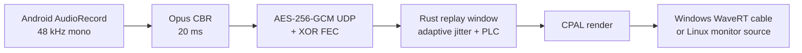

# ADR 0026：Sense Mic 手机到电脑虚拟麦克风

- 状态：Accepted / Implemented
- 日期：2026-08-19
- 范围：Android `mic-runtime`、Rust `sense-mic-client`、Windows `SenseMicVAD`、Linux PipeWire/Pulse

## 1. 决策背景

Sense 需要在输入法之外拥有一套稳定的手机麦克风服务：用户在设置页显式开启后，
Android 即使关闭设置 Activity、切换输入法或锁屏，仍可向电脑持续发送音频；电脑侧要
呈现真正可被会议、直播、游戏和浏览器选择的系统录音端点，而不是扬声器回放工具。

## 2. 参考实现对比

| 项目 | 可复用思想 | 主要边界 | 对 Sense 的结论 |
|---|---|---|---|
| [WO Mic](https://wolicheng.com/womic/tutorial.html) | 手机服务、桌面 client、Windows 虚拟麦克风三段式产品；Wi-Fi/USB/Bluetooth 多传输 | 协议和驱动闭源 | 采用三段式产品模型，不依赖其二进制或协议 |
| [MicYou](https://github.com/LanRhyme/MicYou) | Android foreground `AudioService`、Rust 桌面端、TCP 控制 + UDP 音频、FEC、发现 | 桌面 UI/协议与 Sense 生命周期不同 | 采用控制/音频分面和显式前台服务，重新定义认证和丢包处理 |
| [scrcpy audio](https://github.com/Genymobile/scrcpy/blob/master/doc/audio.md) | 20 ms 级编码帧、Opus/AAC/FLAC、独立音频 socket、可控缓冲，ADB 链路清晰 | 目标是镜像/转发，不提供通用 Windows capture driver | 采用 Opus 与独立传输面；v1 优先稳定局域网，USB/ADB 保留为独立 transport 扩展 |
| [AndroidMic](https://github.com/teamclouday/AndroidMic) | 小型 Rust receiver、TCP/UDP/ADB、多后端、RNNoise 可选 | raw PCM 带宽高，虚拟音频通常依赖外部 cable | 保留 Rust/CPAL 跨平台路线，网络默认改为 Opus，Windows 自带驱动 |
| [Mumble](https://github.com/mumble-voip/mumble) | 低延迟 Opus、UDP、jitter/PLC、持续质量统计 | 完整语音会议系统远大于单路麦克风需求 | 采用 jitter、PLC、心跳和统计思想，不引入房间/混音协议 |

## 3. 最终选型

### 3.1 Android

- 新建独立 `:mic-runtime` Android library，不把 socket、编码和 `AudioRecord` 放进
  `InputMethodService`；
- 使用 `connectedDevice|microphone` foreground service，`START_STICKY` 保持运行所有权；
- 服务开启且无客户端时只运行 UDP discovery 与 TCP control；双方认证后才申请 wake/Wi-Fi
  lock 并创建 `AudioRecord`；
- 通知始终提供静音与停止，设置页显示状态、端点、统计、配对码、码率和原始采集开关；
- 配对码/码率/采集 profile 变化时轮换握手材料并关闭当前会话，避免半程混用配置。

这符合 Android 对 microphone foreground service 类型、运行时权限和可见状态启动的要求：
[Android foreground service types](https://developer.android.com/develop/background-work/services/fgs/service-types)。

### 3.2 网络与音频

- discovery：UDP 49173；control/认证/心跳：TCP 49174；audio：UDP 动态回程端口；
- 音频：48 kHz mono、960 samples/20 ms、Opus VOIP CBR；
- 可靠性：每四个等长 CBR packet 发送一个 XOR parity，覆盖单包丢失；其余丢失交给
  Opus packet-loss concealment；
- jitter：基础 80–240 ms，按 RFC3550 风格 transit delta 平滑估计动态增加，最多 12 帧；
- 桌面实时队列：40 ms pre-roll，500 ms 硬上限；欠载补零，溢出清空陈旧队列；
- 存活：2 秒 PING/PONG，7 秒无音频判定会话结束，自动指数退避重连。

没有选择 raw PCM：48 kHz mono PCM16 约 768 kbit/s，Opus 只需 32–96 kbit/s，且能使用
语音优化与 PLC。没有把全部音频塞入 TCP：独立 UDP 避免重传造成 head-of-line blocking。

### 3.3 会话认证

1. 手机发现响应返回临时 P-256 public key、server nonce、稳定 device id；
2. 桌面生成临时 P-256 key 与 client nonce；
3. 六位本地配对码经 PBKDF2-HMAC-SHA256 80,000 次派生 pair key；
4. client/server 分别对完整 transcript 做 HMAC proof；
5. ECDH shared secret 以 pair key 为 salt，经 HKDF 得到 256-bit session key；
6. UDP nonce 为 `session_id || packet_counter`，header 作为 GCM AAD；
7. 128-bit replay bitmap 接受有限乱序并拒绝重复包。

服务按源 IP 限制失败频率；配对码不会通过网络发送。设置页轮换配对码会同时轮换临时
密钥与 nonce。

### 3.4 Windows 虚拟驱动

采用 Microsoft 官方 [SysVAD](https://github.com/microsoft/Windows-driver-samples/blob/main/audio/sysvad/README.md)
同类 WDM/PortCls WaveRT 架构，而不是把内核音频路径放进 Rust。Microsoft 的
[`windows-drivers-rs`](https://github.com/microsoft/windows-drivers-rs) 尚未提供等价的
PortCls/WaveRT audio miniport 抽象；Rust 负责用户态网络、加密、jitter 和 CPAL，
C++ WDK driver 只负责稳定的 render-to-capture 字节路由。

驱动暴露固定 48 kHz stereo PCM16 的 `Sense Mic Playback` 与 `Sense Mic`。两端格式一致，
因此内核 ring 不做浮点、重采样、分配或 codec。过载采用 latest-wins，欠载补零。

构建固定到 WDK NuGet `10.0.26100.6584`。Microsoft 官方支持通过 NuGet 获取 WDK：
[Install the WDK using NuGet](https://learn.microsoft.com/windows-hardware/drivers/install-the-wdk-using-nuget)。
仓库构建脚本还固定并校验 WDK VSIX，最终强制运行 Inf2Cat 和 InfVerif。

### 3.4.1 驱动签名与发行门禁修订（2026-08-21）

驱动构建与公开发行拆成三个不可混用的类别：

| 类别 | 产物标记 | 用途 | 公开 Release |
|---|---|---|---|
| `Test` | `development-test-only` | 开发机测试签名 | 禁止 |
| `Submission` | `unsigned-partner-center-staging` | CAB 签名与 Partner Center 输入 staging，包含 PDB | 禁止 |
| `MicrosoftSigned` | `microsoft-whql-or-hlk` | Partner Center 返回目录 | 通过验证后允许 |

正式组合包不会用本地 PFX 或 Authenticode 签名冒充 Microsoft 签名。门禁验证 catalog 的
Microsoft Windows Hardware Compatibility Publisher signer、Windows Hardware Driver
Verification EKU、`signtool /kp /c` 对 INF/SYS 的 catalog 成员关系与 kernel policy，并生成
独立验证 manifest。没有 Partner Center 返回目录时只发布名称和 manifest 都明确标识的
`client-only` 包。根据 Microsoft 2026 年更新的
[attestation 支持边界](https://learn.microsoft.com/windows-hardware/drivers/dashboard/code-signing-attestation)，
面向普通用户强制走 HLK/WHQL；attestation 仅进入其支持的测试场景，组合打包脚本会终止
将其标记为公开发行资产。Microsoft-signed
分类按官方 [EKU 验证方法](https://learn.microsoft.com/windows-hardware/drivers/dashboard/code-signing-validate)
执行。

Rust 安装命令只负责以 `pnputil` 注册/移除包，管理员权限与最终内核信任仍由 Windows
裁决。公开发行资产的标准自动发现目录只由通过上述门禁的 Microsoft-signed 组合包创建；
测试包使用带 `development-test` 的独立文件名并保留相同目录布局。

### 3.5 Linux

Linux 不安装内核模块。Rust client 调用 `pactl load-module module-null-sink` 创建
`sense_mic`，应用读取其 `sense_mic.monitor`。PipeWire 的 Pulse 兼容层支持同一命令；
底层等价能力可由 [PipeWire loopback module](https://pipewire.pages.freedesktop.org/pipewire/devel/page_module_loopback.html)
表达。客户端启动时检查并补建端点，退出不销毁，显式 `driver uninstall` 才卸载。

## 4. 生命周期

| 事件 | Android | Desktop |
|---|---|---|
| 用户开启 | 前台启动 service，显示等待通知 | discover/serve 可连接 |
| 无电脑 | 不创建 AudioRecord | 自动发现/退避 |
| 认证成功 | 获取 lock，启动 capture/encode | 打开虚拟 render endpoint，启动 jitter |
| 设置页关闭/IME 隐藏 | 会话继续 | 无变化 |
| 网络抖动 | FEC/持续发送 | jitter/FEC/PLC |
| TCP 心跳断开 | 停 capture，回到等待 | 关闭 session 并重连 |
| 用户静音 | 编码全零 PCM，连接保持 | 连续输出静音 |
| 用户停止 | 关闭 socket/record/lock/notification | 超时后进入重连或 Ctrl+C 退出 |
| 配置变更 | 轮换 key/nonce，结束旧 session | 自动重新认证 |

## 5. 延迟预算

默认基础 jitter 100 ms，加桌面 40 ms 预滚和 Android 20 ms framing，常见稳定局域网端到端
约 140–220 ms。用户可选 80 ms 基础缓冲；跨 AP、拥塞 Wi-Fi 或需要完整四帧 FEC 恢复时
使用 100–160 ms 更稳。

## 6. 已实现文件

- Android：`mic-runtime/`、`app/.../MicSettingsScreen.kt`；
- Rust：`sense-mic-client/src/`；
- Windows driver：`sense-mic-client/driver/windows/SenseMicVAD/`；
- reproducible driver build：`sense-mic-client/driver/windows/build-driver.ps1`；
- 使用与诊断：`sense-mic-client/README.md`。

## 7. 后续兼容扩展

- transport interface 预留 USB/ADB 双 socket 与 BLE control；
- QR 配对可把六位手输码升级为随机高熵 token；
- 桌面 tray UI 可复用 Rust library，不改变协议、driver 或 Linux backend；
- Windows ARM64 可复用同一 driver source，新增 ARM64 package 与签名矩阵。
