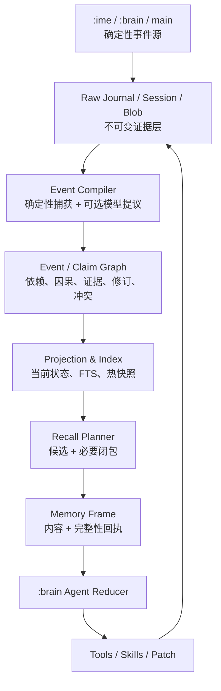
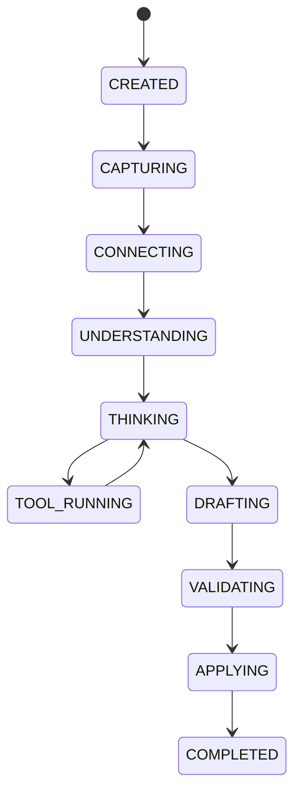

# Sense 输入法 AI Agent 深度架构设计

## 事件记忆、工具、Skills 与长期兼容性

**文档版本：** 1.0<br>
**研究快照：** 2026-07-26<br>
**适用基线：** Sense v0.4.2<br>
**文档性质：** 架构方案，不是下一版本功能清单，也不授权本轮修改运行时代码<br>
**决策状态：** 架构原则 Accepted；M9.1+ 语义 schema 仍为 Proposed；Gate 0 实施细节以
ADR 0015–0018 为 authority；Release Identity/Owner/Signing Authority、Platform
Certification、Root Bootstrap 与 Memory runtime operational gates 均未通过<br>
**仓库路径：** `docs/design/agent-event-memory-architecture-v1.0.md`<br>
**研究方法：** Agent 生态、事件/证据记忆、Android 输入法落地三条并行研究；再分别进行事实、认识论和移动端实现的独立反向审查。所有外部链接按研究快照日期核对。

---

## 0. 结论先行

> **Gate 0 解释边界：** 本文的 Event 模型从 M9.1 phase gate 才成立；M9.0 只写
> `record_id` 明确的 Journal/Session record，两类身份永不混用。Blob 使用稳定随机 logical
> ID 与 authenticated locator，不是内容寻址对象。当前
> `ReleaseOwnerContinuityGateV1`、release identity、
> `LocalErasureControlPhaseGateV1` 与 `LocalErasureCapabilityGateV1` 均未通过，
> effective stage 为 `SCHEMA_ONLY`，不持久化任何 Memory（包括 synthetic `DARK`）。

Sense 不应在输入法里复刻某个现有 Agent 框架，也不应把“长期记忆”交给摘要、向量数据库或另一个大模型。适合输入法、且能承受未来模型和协议变化的内核应是：

> **不可变证据 Journal + 依赖/证据/因果关系图 + 可重建投影 + 有完整性回执的召回 + 有类型的工具与 Skill ABI。**

这套设计可以浓缩为七条原则：

1. **原始保留，派生可毁。** Session、可见消息、工具回执和编辑效果是证据；摘要、画像、图谱、向量、当前状态都是可重建投影。
2. **事件优先，时间降权。** 因果、依赖、修订和分支构成主拓扑；时间只是有效期、记录时刻、截止期等属性。
3. **模型提议，宿主验证。** 宿主只裁决可机械验证的结构、来源、权限和可观察效果；开放世界语义保持为带 provenance 的断言、假设或冲突。
4. **结构定序，文字施力。** 结构化事件是源，自然语言“事件卡”是一等、可版本化的模型面对投影。
5. **闭包召回，遗漏显式。** 召回不是 Top-K 文本拼接，而是候选事件加证据、修订、冲突和因果闭包；放不下的内容必须返回边界与继续读取句柄。
6. **Session 保底，事件旁路。** 事件层负责快速跨 Session 定位；对于已捕获、已 DurableAck、仍保留且策略允许读取的 transcript，Session/Journal 提供字节精确核验。二者不是替代关系。
7. **前台确定，后台理解。** `:ime` 热路径不运行模型、数据库、图遍历或网络；语义提取和索引维护全部异步。

用户提出的“工具、记忆、Skills”可以继续作为 Agent 执行能力的三大载荷，但宿主内核还必须补齐三项基础设施：

- **状态与事件：** Agent 真实经历了什么；
- **权限与效果：** 它打算做什么，以及环境确认它做成了什么；
- **验证与纠错：** 结果是否满足目标，错误如何被追加式修正。

没有这三项，工具会重复执行，Skill 会不可审计，记忆会把模型推断洗成历史事实。

---

## 1. 问题重述

### 1.1 记忆问题不是“存不下”

大模型记忆的根本困难，不是数据库容量不足，而是四种对象经常被混为一谈：

- “用户说过 X”；
- “X 是事实”；
- “模型从上下文推断 X”；
- “当前任务暂时按 X 工作”。

传统 RAG 或向量数据库只解决“找回看起来相近的片段”，不能证明：

- 找回的片段是否完整；
- 是否遗漏了后来的纠正；
- 是否存在反证；
- 片段中的话是谁说的；
- 这是观察、声明、意图、假设，还是模型推断；
- “没有搜到”究竟表示不存在，还是索引尚未覆盖。

因此，向量检索可以是候选生成器，但不能成为事实本体、真值裁判或完整性证明。[RAGTruth](https://aclanthology.org/2024.acl-long.585/) 对 RAG 输出中不受支持和与证据矛盾的声明进行了系统分析，也说明“检索到了文本”并不等于“生成被证据约束”。

### 1.2 去时间化应准确表述为“去全局时钟中心化”

用户关于“时间只是事件的一个要素或属性”的判断是合理的。更严格的工程表述是：

> **因果关系优先于墙上时钟；保留时间语义，但不让时间戳充当事件身份、真值或唯一顺序。**

Lamport 对分布式事件的经典论证表明，事件首先形成的是“发生在前”的偏序，而不是天然存在的全局时间线；逻辑时钟构造出的全序也不等于现实因果。[Time, Clocks, and the Ordering of Events in a Distributed System](https://lamport.azurewebsites.net/pubs/time-clocks.pdf)

因此 Sense 应：

- 用每个写入源内部的单调序列证明局部连续性；
- 用统一关系账本中的 `DEPENDS_ON` 表示跨进程、跨 Session 的宿主已知依赖；
- 允许没有因果关系的事件保持“并发或顺序未知”；
- 只在日程、过期、现实先后、用户明确时间查询等场景使用墙上时间；
- 不使用 UUIDv7、ULID 等带时间含义的 ID 作为语义顺序依据。

### 1.3 “绝对无遗漏”需要改造成可证明的工程契约

有限上下文无法装入无限历史，任何语义检索也不能证明“世界上不存在尚未发现的相关信息”。能够诚实保证的是：

> **相对于明确声明的来源范围、事件前沿和查询契约，不发生静默遗漏。**

这比“模型已经读完所有相关记忆”更克制，也更强：每次召回都要返回覆盖范围、缺口、冲突、截断和继续读取方式。系统可以不知道，但不能假装知道。

---

## 2. 设计范围与非目标

### 2.1 本方案要解决

- 输入法内 Agent 的最小稳定内核；
- 工具、记忆、Skills 的边界和 ABI；
- 跨 Session 的事件记忆旁路；
- 事件描述、自动生成、修订、分支、合并和事件线维护；
- 因果优先、时间降权的顺序模型；
- Session 原文与事件召回的协作方式；
- “可读取完整性”的机器可判定定义；
- Android 多进程、磁盘、IPC、崩溃恢复和性能边界；
- 面向 MCP、Agent Skills、A2A、未来模型和未来记忆技术的兼容口；
- 分阶段落地、评估门禁与明确延期事项。

### 2.2 本方案不做

- 不把某个云厂商的 conversation ID 当作 Sense 的 canonical state；
- 不在 Android 输入法内嵌 LangGraph、CrewAI、AutoGen 等通用运行时；
- 不默认启用多 Agent 角色扮演；
- 不在 `:ime` 进程执行任意 Python、Shell、Dex、Wasm 或模型生成代码；
- 不把向量库、知识图谱、摘要或用户画像定义为真相；
- 不展示或持久化模型私有思维链；
- 不承诺“手机有限存储下无限期保存无限字节”；
- 不把每个 SSE 分片、token、触摸采样和传输包都提升为永久语义事件；
- 不在本轮确定跨设备同步、Skill 市场、云端长期任务和远程多 Agent 的产品形态。

### 2.3 对“研究所有 Agent”的边界说明

开源项目可以研究其代码和公开架构；闭源产品只能研究公开接口和可观察交互，不能从产品表现反推其内部记忆实现。本方案采用“按架构谱系覆盖代表系统”的方法，而不是假装逐一穷尽所有仓库和内部系统。

研究覆盖的谱系包括：

1. 最小工具循环；
2. 确定性工作流和状态图；
3. 环境型长程 Agent；
4. 记忆优先 Agent；
5. 多 Agent/分布式运行时；
6. 工具、Skill 和 Agent 互操作协议。

---

## 3. Sense v0.4.2 是本方案的地基

[Sense v0.4.2](https://github.com/EthanBird/Sense/tree/v0.4.2) 已经拥有适合继续演进的骨架：

- `:ime`、`:brain`、主进程三进程划分；
- Agent 会话状态机；
- 公开进度、工具 call-id 和多轮工具协议；
- 上滑锁定与执行状态解耦；
- generation/requestId 隔离迟到回调；
- 结构化 Patch、输入框快照、哈希/CAS 和写入后验证；
- Provider、工具结果、编辑效果和终态的明确边界；
- Journal、Segment、Blob 和不可变快照的长期方向。

本方案不取代现有 ADR，而是在其上增加事件记忆与稳定 ABI：

- [ADR 0011：Agent Soul、Provider 与延迟](https://github.com/EthanBird/Sense/blob/v0.4.2/docs/adr/0011-v0.3.7-m8-agent-soul-provider-latency.md)
- [ADR 0012：AI 锁定、流式输出与编辑器安全](https://github.com/EthanBird/Sense/blob/v0.4.2/docs/adr/0012-v0.4.0-interruptible-ai-and-speech-surface.md)
- [ADR 0013：有界恢复与工具箱](https://github.com/EthanBird/Sense/blob/v0.4.2/docs/adr/0013-v0.4.1-bounded-stream-and-system-speech-recovery.md)
- [ADR 0014：Agent Session 状态机](https://github.com/EthanBird/Sense/blob/v0.4.2/docs/adr/0014-v0.4.2-agent-session-state-machine.md)

需要特别保留两条现有纪律：

1. 锁定手势只转移 UI 控制权，不得重建 RunState；
2. 最终写入必须继续经过结构化 Patch 和编辑器租约验证，记忆或 Agent 自信都不能绕过它。

---

## 4. Agent 研究谱系：吸收原语，不照搬系统

| 系统/协议 | 可确认的公开设计 | Sense 应吸收 | Sense 不应照搬 |
|---|---|---|---|
| [Hermes Agent](https://github.com/NousResearch/hermes-agent) | 完整消息、工具调用和结果入库；`session_search` 以 FTS 返回原消息；支持工具、MCP 和 Agent Skills | 完整 Session 慢路、精确原文召回、跨端连续性、Telegram 式真实反馈 | 可编辑文本记忆或外部记忆成为事实；Agent 默认自由修改当前 Skill |
| [OpenAI Agents SDK](https://openai.github.io/openai-agents-python/) | Agent loop、tools、handoff、sessions、tracing、RunState/HITL，以及 sandbox Capability/Skills 等当前接口 | 有类型 RunEvent、可暂停恢复、完整 trace、handoff-as-tool 和 Capability 边界 | 将 SDK 内部 Session、sandbox 实现或厂商 ID 变成 Sense 本体 |
| [ChatGPT Work](https://help.openai.com/en/articles/20001275-chatgpt-work-and-codex) | 公开表现包括长任务、连接应用、进度、改向和重要操作确认 | 可打断、可改向、持续反馈的交互契约 | 闭源内部架构不可推断，不能作为记忆设计证据 |
| [Claude Agent SDK](https://code.claude.com/docs/en/agent-sdk/sessions) / [Claude Code checkpoint](https://code.claude.com/docs/en/agent-sdk/file-checkpointing) | SDK 公开 Session resume/fork、hooks、权限、MCP、subagent、Skills；文件 checkpoint 只覆盖特定编辑工具 | transcript 与外部效果分离、hook 拦截点、权限优先级、Skill 渐进加载 | 假定并行 hook 有确定完成顺序；把有限文件 checkpoint 说成完整会话/效果回滚；把代码 Agent 的开放执行面搬进 IME |
| [Google ADK](https://google.github.io/adk-docs/) | 明确区分 Event、Session、State、MemoryService 和 Artifact | 领域对象分离、显式 memory ingestion、trajectory evaluation | 直接把其云/服务抽象当移动端持久化实现 |
| [Gemini CLI](https://geminicli.com/docs/) | MCP、Skills、subagent、session 管理、checkpoint 和模型路由 | 开放兼容、降级路由、可回退会话 | 文本上下文文件成为证据本体 |
| [LangGraph](https://docs.langchain.com/oss/python/langgraph/persistence) | reducer、thread checkpoint、跨 thread store、interrupt/resume | 显式 reducer、checkpoint 和 interrupt 语义 | 在输入法内嵌通用图运行时 |
| [Letta / MemGPT](https://arxiv.org/abs/2310.08560) | 工作记忆、recall/archival memory、持久有状态 Agent | 显式记忆分层和上下文分页 | 让模型维护的 block 或 consolidation 覆盖原始证据 |
| [OpenHands](https://docs.openhands.dev/sdk/arch/conversation) | 追加式不可变 Event log、增量持久化、condensation、stuck detection | 事件账本、事件流 UI、循环检测、可重放 | 容器和代码执行假设进入 IME 内核 |
| [AutoGen](https://github.com/microsoft/autogen) | actor/event-driven core、AgentChat teams、状态保存与 memory 协议；官方仓库现已进入 maintenance mode，并引导新项目采用 Microsoft Agent Framework | 保留其事件契约和异步消息边界作为历史参考 | 普通输入任务默认多 Agent 对话，或把 maintenance-mode API 设为新内核基线 |
| [Microsoft Agent Framework](https://learn.microsoft.com/en-us/agent-framework/overview/) | Microsoft 将其定义为 AutoGen/Semantic Kernel 的直接继任者；包含 Agents、Harness、类型化 Workflow、Session、checkpoint/HITL、MCP 与集成端口 | workflow-first、显式状态、checkpoint、中间件和类型化路由 | 把企业/云运行时搬进 Android，或把其 memory provider 当证据本体 |
| [CrewAI Flows](https://docs.crewai.com/en/concepts/flows) | Flow 与 Crew 分离；事件驱动、有状态、checkpoint | 默认确定性 Flow，仅局部开放 Agent 自治 | 常驻角色扮演式 Crew |
| [smolagents](https://huggingface.co/docs/smolagents/index) / [PydanticAI](https://pydantic.dev/docs/ai/core-concepts/agent/) | 小型工具循环；有类型依赖、输出、工具和 durable execution 适配 | 极小透明内核、强类型边界、失败反馈给下一步 | Python 运行时或任意代码执行 |
| [Graphiti](https://github.com/getzep/graphiti) / [Mem0](https://arxiv.org/abs/2504.19413) | 事件来源、实体/关系、时间属性、抽取和混合检索 | 来源、双时间属性、候选图遍历、可失效投影 | LLM 自动抽取和冲突判断成为唯一真值裁判 |
| [MCP](https://modelcontextprotocol.io/specification/2025-11-25) | tools/resources/prompts、能力协商、progress/cancel，durable Tasks 仍属实验面 | 未来工具传输适配器 | Sense 内部状态机、事件或记忆本体 |
| [Agent Skills](https://agentskills.io/specification) | `SKILL.md` 加 scripts/references/assets，渐进披露 | Skill 导入导出的开放基线 | 未签名任意代码直接在输入法执行 |
| [A2A v1.0.0](https://a2a-protocol.org/v1.0.0/specification/) | Agent Card、Task、Status、Artifact、stream/cancel、版本协商和扩展；v1.0 相对旧版本有破坏性变化 | 未来远程 Agent 网关，适配器显式协商版本并保存未知扩展 | 内部单 Agent 输入任务的核心协议 |
| [AG-UI Events](https://docs.ag-ui.com/concepts/events) | 面向 Agent—前端的 lifecycle、text、tool、state、activity 和 interrupt 事件 | 未来 `AgentUIPort` 的映射参考 | 取代 Sense 内部 RunEvent 或暴露私有 reasoning |

研究得到的稳定共识不是某个“终极 Agent”，而是六类原语：

- 有类型的工具调用和结果；
- 可暂停、取消、恢复的执行状态；
- 可回放的事件或轨迹；
- 按需加载的 Skills；
- 外部效果的验证、幂等和补偿；
- 作为派生视图的跨 Session 记忆。

Sense 应把这些原语收进很小的宿主内核，把厂商 SDK、MCP、A2A、向量索引和未来记忆系统都留在适配器边界。

---

## 5. 核心概念：五类对象必须分开

| 对象 | 定义 | 可否原地修改 |
|---|---|---|
| **Raw Record** | 原始可见消息、工具回执、编辑器快照、Patch、系统观察等证据记录 | 否 |
| **Event** | 一次发生、声明、观察、调用、结果、纠正或派生动作 | 否 |
| **Claim** | Event 中可被支持、反驳、修订或限定作用域的命题 | 否；以新版本追加 |
| **Projection** | 当前偏好、任务头、摘要、实体视图、FTS、向量等读取模型 | 是；可删可重建 |
| **Memory Frame** | 针对一次 Agent 任务生成的召回包及完整性回执 | 查询产物 |

还需要两个组织对象：

- **Episode：** 一组相关事件的有界来源包，可以对应 Session、Agent run、工具事务或编辑任务，但不覆盖其中的原始记录。
- **Thread/Event Line：** 对事件关系图的命名视图，例如“Sense Agent 设计”“某项用户偏好”“某个文档任务”；它不是唯一时间线。

关键认识论边界：

- “用户说 X”是一个可观察事件；
- “X 为真”是一个 Claim；
- “模型根据用户的话推断 X”是一个派生 Claim；
- “当前任务暂按 X 工作”是一个 Projection；
- 后续用户纠正 X 时，旧事件仍然发生过，只是当前工作投影改变。

---

## 6. 总体架构：Evidence Event Mesh

本方案将长期记忆内核命名为 **Evidence Event Mesh（证据事件织体，EEM）**。名称强调它不是单一时间线、知识库或向量库，而是证据、事件、命题、关系和读取证明的组合。



### 6.1 五个平面

1. **证据平面**
   - 原始 Journal、已捕获 Session transcript、公开消息、工具请求/结果、编辑效果、Blob；
   - append-only，任何模型都不能覆盖；
   - 是 canonical capture record：它权威记录 Sense 捕获了什么，但不自动证明记录内容是世界事实。

2. **事件平面**
   - Event、Claim、因果边、证据边、修订边、冲突边；
   - 确定性事实与模型派生严格分层；
   - 旧 schema 原始 bytes 在 retention、擦除和读取策略允许的范围内可读取。

3. **投影平面**
   - 当前偏好、当前任务、Thread heads、FTS、实体别名、摘要、可选向量；
   - 带生成版本和 watermark；
   - 随时可删除并从证据重建。

4. **召回平面**
   - 查询契约、候选生成、闭包、预算打包、Session 回退；
   - M9.1 只输出 local Memory Frame 和 `AssemblyCompletenessReceipt`；
   - M9.2 才增加 Provider handoff audit；它不能反向成为 M9.1 completeness 的组成部分；
   - “未找到”永不自动解释成“事实为假”。

5. **执行平面**
   - RunReducer、Agent 状态机、工具、Skills、验证、Patch 和效果账本；
   - 每一步生成可回放事件；
   - 崩溃后从 checkpoint 与尾部事件恢复。

---

## 7. Android 进程拓扑

### 7.1 推荐职责

| 进程 | 负责 | 明确禁止 |
|---|---|---|
| `:ime` | InputMethodService、渲染、候选、编辑器租约、固定开销事件入队、只读 `HotSnapshotPort`；off-main host recall coordinator，也是 Agent 路径唯一的 `MemoryBroker` client | Room、FTS、图闭包、压缩、网络、Provider、主线程 Broker 调用 |
| `:brain` | Agent 状态机、Provider、可信内置工具、自己的进程 Journal writer；M92-06 后仅接收 host 授权的 `AuthorizedProviderMemoryFrameV1`，并由自己的 final request factory 物化 Provider request | 查询/绑定 MemoryBroker、直接打开记忆数据库、依赖 Room/WorkManager/memory-runtime、跨进程共享追加文件、接受裸 MemoryFrame |
| 主进程 | 设置、单一 `MemoryBroker`、Room/FTS、索引、归档、WorkManager | 执行 Provider 流、阻塞 IME |
| 可选 `:tool_sandbox` | 将来的纯计算不可信工具 | 网络、密钥、任意应用文件和应用权限 |

不建议为 Memory 再增加第四个常驻进程。v0.4.2 主进程当前主要承载设置；M9 将新建 MemoryBroker/WorkManager 所有权。由它独占可重建数据库，可以避开多进程 Room、WAL 和缓存失效。

需要明确：`:ime` 和 `:brain` 与应用仍共享 UID。`android:process` 提供崩溃、堆和主线程隔离，不是权限安全沙箱。真正不可信的执行只能进入 `isolatedProcess`，并通过受控 Capability Broker 请求外部能力。[Android `<service>` / `isolatedProcess`](https://developer.android.com/guide/topics/manifest/service-element)

### 7.2 每个进程拥有独立追加段

```text
journal/open/ime/owner.lease
journal/open/ime/<writer-epoch>/{segment,frontier-a,frontier-b,lease,recovered-seal.<content-digest>?}
journal/open/brain/owner.lease
journal/open/brain/<writer-epoch>/{segment,frontier-a,frontier-b,lease,recovered-seal.<content-digest>?}
journal/open/main/owner.lease
journal/open/main/<writer-epoch>/{segment,frontier-a,frontier-b,lease,recovered-seal.<content-digest>?}
```

- 进程主线程只入队，专用 writer 批量追加；
- 多进程绝不同时写同一个文件；
- Broker 常规导入 seal 段，也可以按已发布 durable offset 安全读取 open 段前缀；
- 每个 writer kind 先取得 installation-scoped `owner.lease` exclusive lock，再取得目标
  epoch `lease`；两个原 inode/handle 在整个 live epoch 持有。锁只串行化 ownership，不让
  多进程共享追加同一 segment；
- orphan reaper 也必须按 `owner.lease → epoch lease` 同一顺序取得锁，之后仅获得旧 epoch
  的只读 recovery ownership并可发布 recovered-seal sidecar；该 ownership 不是 writer
  ownership，reaper 不原地截短或续写旧段；
- 每个 writer 用局部序列与 durable frontier 证明已持久化范围的连续性；
- 跨 writer 仅通过显式 `RelationAssertion(DEPENDS_ON)` 形成偏序。

### 7.3 模块依赖方向

为避免 `app → ai-runtime` 与 Brain 反向引用 app 中 Broker 实现形成依赖环，M9 建议新增：

```text
memory-protocol   // 纯 Kotlin DTO、Receipt、协议版本
event-journal     // 无 Room 的 writer、frame、open-tail/orphan recovery
memory-ipc        // Android Binder/Messenger/PFD wrapper，无业务逻辑
memory-runtime    // Broker、Room、FTS、PFD、WorkManager
```

依赖保持单向：

```text
memory-ipc    → memory-protocol
ai-runtime    → ai-protocol + memory-protocol + event-journal
ime-service   → memory-protocol + memory-ipc + event-journal
memory-runtime→ memory-protocol + memory-ipc + event-journal
app           → memory-runtime + 既有组装依赖
```

protobuf bytes 和协议版本属于 `memory-protocol`；`memory-ipc` 只封装 Android component、Binder/PFD codec 和 death/cancel plumbing，不复制 schema 或引用 Broker 实现。所有 `Application` 初始化按进程守卫，避免 Room、WorkManager 和索引代码在 `:ime`、`:brain` 被意外初始化。

这里的 owner 边界是双层的：主进程 `memory-runtime` 独占 Broker service、Room 和
WorkManager；Agent recall 的唯一 client/请求 owner 是 `:ime` 内 off-main host
coordinator。`:brain` 的 production/runtime classpath 不得出现
`MemoryBrokerClient`、Room、WorkManager 或 `memory-runtime`；它不能因为 host 死亡或
Binder 失败而自行 bind、open 或初始化这些组件。

### 7.4 MemoryBroker 生命周期

- 非 exported、默认主进程、非 direct-boot 的绑定服务；
- 只有 IME/host recall coordinator按 Run懒绑定，Run结束后解绑，不为了记忆长期拉起主
  进程；Brain不持有 Broker Binder、PFD cursor或重绑权；
- DB、FTS、PFD 和闭包计算运行在 Broker I/O executor，不占 Binder/主 Looper；
- 协议携带 requestId/generation、major/minor、取消和 Binder death；
- 只允许一次有界重绑；
- Stop 传播到 Recall 查询和 PFD 流；
- PFD/pipe envelope 必须带长度、SHA-256、上限、取消和双方关闭责任，只传只读 descriptor/blob ref，不传任意文件路径；
- `memory-ipc` 以固定 class-name 常量构造显式 `ComponentName`，manifest contract test 防止
  package/service 漂移且不让 IPC 模块反向依赖 runtime class；
- pipe 写入使用独立有界 `PfdPumpExecutor`；容量耗尽返回 `BROKER_BUSY`，Stop/Binder death
  从独立 control path 关闭两端，不能让慢 reader 占满 Broker I/O executor；
- Broker 进程不可用时，host给 Run返回 `MEMORY_UNAVAILABLE`，Brain只使用当前 Run的内存
  transcript；它不能绕过 host边界自行打开 Room/Journal。HotSnapshot只服务 IME的非敏感
  本地路由，不是 Provider Memory。

### 7.5 Release identity 与 owner continuity 是长期记忆的 Gate 0

ADR 0015 把稳定 `DataOwnerIdentityV1` 与可演进 `ReleaseIdentityV1` 分开，并把
artifact `ReleaseIdentityGateV1`、local owner `ReleaseOwnerContinuityGateV1`、
release-entry `ReleaseSigningAuthorityGateV1` 与 device/real-data
`PlatformCertificationGateV1` 分成独立输出。当前均为 `BLOCKED`。单有固定 production
signing identity 仍不足以证明 owner manifest、升级、lineage rotation、实体设备验收与灾难
恢复连续性。

release policy 在 ADR 0015 中仍只是由 revision/length/digest 约束的 opaque continuity
blob。identity/owner 可以验证 exact bytes 与单调性，但 publication/capability 不能解释其
内容；`ReleasePolicySemanticsPhaseGateV1=BLOCKED`，只有 closed schema/evaluator/caps/
unknown-field rules 接受后才可能 PASS。

owner local A/B 自己又需要一个目录，因此不能用“没有 local state”自证 owner gate PASS。
future `RootBootstrapControlPhaseGateV1` 必须先冻结一次性
`AuthorityBootstrapPermitV1`：它不是 FeatureStage，只能在 external owner/installed APK、
clean namespace 与 `LocalErasureControlPhaseGateV1=PASS` 时创建 root shell、bootstrap
lock 和 owner-signed local A/B；不创建 Keyring/data key、record、Journal、Blob 或读取
正文。local owner state durable reopen 后 owner gate 才可能 PASS，再进入独立 Keyring
bootstrap。当前 bootstrap/control phase 也为 `BLOCKED`，所以仍禁止创建任何 root。

normal product `DARK` 与 real-data 路径还要求
`LocalErasureCapabilityGateV1=PASS`。在它尚未建立时，唯一可能触碰持久化 synthetic bytes
的是 ADR 0018 的一次性 `SyntheticMeasurementPermitV1`；该许可不是 FeatureStage/DARK。
被测对象仍是 signer-WORM 中 exact production APK/applicationId/code path，只是由不可转正
的 candidate authority/root/run taint、已知语料、预承诺 attempts与 external zero-census
隔离；另一个 applicationId只允许作为 companion harness，不能替代被测 app。

应用的 `minSdk=29` 不等于 persistent Memory 的 capability floor。Android API 29–30 因
官方 documented symmetric-key unlocked-device exception，persistent Memory 固定
`SCHEMA_ONLY`；API 31–36.0 只有 exact build fingerprint/OEM 的锁定行为证据与同步 runtime
fence 都 PASS 才可能启用；API 36.1+ 还必须同时验证
`KeyInfo.isUnlockedDeviceRequired()` getter 与行为证据。IME/AI 的非 Memory 功能仍可在
minSdk 29 运行。

APK 只能内置 stable DataOwner/root/discovery pin。绑定当前 full signed APK digest 的
ReleaseIdentity、BuildSubject、BudgetProfileSet、Classifier、
ProfileAcceptanceReceipt、OwnerManifest 与 PlatformCertification必须在签名后由 external
owner ledger发布；把它们写回 APK 会形成不可实现的 self-hash。sidecar dependency必须是
canonical present-tuple DAG，任何 digest cycle、self-reference或 half-present profile group
均拒绝。设备从 installed `sourceDir` 计算 exact
APK bytes 并与 owner-signed inner bundle cache 比较；cache 可以继续证明已安装 immutable
artifact 的 scoped identity/owner binding，但 baseline owner wrapper 不能证明 selected
single/pair globally latest。resolver 临时离线不会伪造签名失效，却会让独立 freshness gate
保持非 PASS，因此 real-data path 降为 `SCHEMA_ONLY`。

无硬件/外部单调锚点时，old-valid owner single/pair（其无密钥 wrapper 可重算）以及完整旧
data-plane/stage A/B pair 连同旧 app/dependency 的一致回放，都无法仅靠本地 generation
检出；real-data `SHADOW+` 必须等待后续
`StageRevocationFreshnessGateV1`。

现有 `PersistentUserLexicon` 继续是 `:ime` 内独立的输入排序资产。它不迁移到 Agent
Memory，也不能被解释成用户陈述或事件证据。

---

## 8. 事件模型

本章定义 M9.1 及以后的事件语义，不是 Gate 0 已冻结的 M9.0 wire。M9.0 的 Journal record
只保留产生后续 Event 所需的原始 provenance；`record_id` 不升级、别名或转换为
`event_id`。

### 8.1 不可变事件信封

第一版建议使用 ProtoLite payload，外层使用可恢复二进制 frame。以下是语义模型，不在本方案冻结字段号：

```text
EventEnvelope {
  event_id                 // 随机、稳定、无时间语义
  schema_uri
  schema_version

  correlation_id?
  branch_id?

  event_kind
  epistemic_class
  actor
  subject_refs[]
  scope

  original_narrative? {
    text
    language
    producer
  }

  source {
    producer_identity
    asserted_actor_or_speaker?
    acquisition_channel   // DIRECT / IMPORT / ASR / TOOL / MODEL
    evidence_kind
    authentication_status?
    raw_blob_ref
    evidence_locators[]
    source_event_ids[]
  }

  payload | payload_ref

  producer_diagnostics? {
    boot_id?
    elapsed_realtime_nanos?
  }

  occurred_at?             // 来源明确给出时才填写
  recorded_at              // 审计属性，不用于单独推断因果
  time_precision?
  time_source?

  producer
  build_version
  model_or_tool_version?
  skill_hash?
  payload_hash
}
```

`EventEnvelope` 是先于 writer dequeue/sequence allocation 冻结的 persisted payload，因此
它**不自存**自己的 `writer`、`writer_epoch` 或 `writer_sequence`。否则 producer 必须先
猜 sequence再序列化，而 ADR 0016 又要求 writer dequeue后才分配 sequence，形成不可实现的
self-reference。事件自身的 canonical origin由 reader在验证外层 Journal后构造，且不写回
payload：

```text
EventOriginCoordinateV1 {
  writer                    // authenticated segment header +
                            // installation/owner continuity 映射出的 WriterRefV1
  writer_sequence           // enclosing accepted Journal frame 的 sequence
  record_id                 // enclosing validated SessionRecordV1
}
```

该 coordinate 只有在 frame 位于 selected durable cut、segment/header/frame/AEAD 与
`SessionRecordV1` 全部通过 ADR 0016 validator后成立。Projection保存 coordinate时只能复制
这个已验证结果，并把自己的 projection generation/watermark与 source frame绑定；不得从
目录字符串、payload字段、mtime或模型输出重建。

compaction/relocation不能改变这个逻辑 origin。若 future archive用新 physical segment与新
DEK重写 durable prefix，必须先由独立 phase ADR冻结 authenticated relocation envelope：
它逐字节保留 source `WriterRefV1 + writer_sequence + record_id`、exact record bytes与
record commitment；compactor自己的 epoch/sequence只属于 physical attempt provenance，
不得成为 Event origin。发布 manifest的 fixed cut在任一时刻必须使 old或new恰一份逻辑
record可达；双可达、双不可达、commitment变化或 coordinate变化全部 fail closed。在该
relocation wire/selector/kill matrix接受前，event-bearing Journal只能保留原 physical
record，不能用“重建索引”名义重包。

事件引用**已经持久化的其他来源**时使用不同类型，不能把自己的 outer coordinate塞回
payload，也不能只存一个裸 sequence：

```text
PersistedRecordProvenanceLocatorV1 {
  writer                    // full WriterRefV1
  writer_sequence
  record_id
  exact_record_commitment
}
```

`PersistedRecordProvenanceLocatorV1` 只能定位在引用事件序列化前已经进入 selected durable
frontier的 record；跨 writer必须携带完整 WriterRef。`source_event_ids[]` 继续表达语义
Event引用，`evidence_locators[]` 可携带上述 typed locator；二者都不是事件自身 origin。
若 source coordinate不可验证，Event只能带显式 GAP/UNRESOLVED provenance，不能用当前
writer coordinate、墙上时间或相邻 sequence替补。

`ime/brain/main` 只是在路径中的 canonical directory token，唯一映射自
`WriterKindV1.IME/BRAIN/MAIN`；Event schema不接受自由文本 `writer_id`、字符串 kind别名
或从目录名反推 authority。negative fixtures必须拒绝这些 alias、unknown enum和
WriterRef/segment不一致。

设计约束：

- `event_id` 与内容 hash 分开：同内容可以发生两次，同一事件也可以有新的解释；
- producer/API 传入任何“本事件 writer/epoch/sequence”字段都必须被 schema或 validator
  拒绝，不能静默忽略后再造成签名/审计歧义；
- queue/retry持有的 `EventEnvelope` exact bytes不可变；epoch在 dequeue前退休时，新的
  writer只改变 enclosing frame的 `EventOriginCoordinateV1`，不得重写 payload；
- `original_narrative` 只保存事件产生时的原始文字，不随 renderer 升级而改写；
- Protobuf field number 永不复用，删除字段必须 reserve；
- 未识别 payload 必须以 opaque bytes 原样保存；
- 新 reader 可以通过确定性 upcaster 生成新读取形式，但不能重写旧段；
- `DEPENDS_ON` 只表达请求—结果、状态迁移和事务依赖等宿主已知硬关系；它不等于现实语义中的因果；
- `CAUSES/HAPPENS_BEFORE/TRIGGERED_BY/RESPONDS_TO` 是彼此不同的 `RelationAssertion`；模型猜测只能生成带 provenance 的关系断言；
- `recorded_at` 用于审计和诊断，不是跨设备真序；
- 时间范围必须携带精度和来源，避免把“去年”“大约周一”伪装成精确时间点。
- 同次启动内可用 `boot_id + elapsed_realtime_nanos` 诊断延迟和局部次序，但不能跨启动或跨设备比较；
- typed `EvidenceLocator` 可以定位 UTF-8 byte range、JSON Pointer、工具字段、音频区间或多个来源；locator 证明可定位，不证明 Claim 被来源蕴含。
- `EventEnvelope` 不内嵌关系内容；同一个 `EventBatch` 可以原子追加一个 Event 和若干 `RelationAssertion`，但边始终只有关系账本这一份 canonical 表示。

### 8.2 事件、认识类别和修订是三个正交轴

不要再用一个 `type` 同时表达“发生了什么”“我们怎么知道”和“它是否替代旧内容”。

```text
event_kind:
  MESSAGE_RECORDED
  RUN_STATE_CHANGED
  TOOL_REQUESTED
  TOOL_RESULT_RECORDED
  EDIT_PATCH_PROPOSED
  EDIT_EFFECT_VALIDATED
  SETTING_CHANGED
  DERIVATION_RECORDED
  RELATION_ASSERTED
  ERASURE_COMMITTED

epistemic_class:
  OBSERVED
  ASSERTED
  INFERRED
  HYPOTHETICAL

revision_relation:
  CORRECTS_RECORD
  CORRECTS_ASSERTION
  CHANGES_STATE_AFTER
  RETRACTS_COMMITMENT
  REVISES_INTERPRETATION
  INVALIDATES_DERIVATION
  COMPENSATES_EFFECT
```

- `event_kind` 描述宿主记录的操作边界；
- `epistemic_class` 描述内容的认识地位；
- revision 是新事件指向旧对象的关系，方向统一为 `new → target`；
- 撤回承诺不会否认“用户曾说过 X”；
- 状态变化不等于历史纠错；
- 工具结果只是 Observation；只有指定 verifier 复核后，才产生 Effect validated record；
- LLM 只能产生有来源的 `INFERRED/HYPOTHETICAL` 派生，不能伪造宿主 Observation 或已验证 Effect。

### 8.3 Claim 模型

不是每个事件都需要拆成三元组；只有需要跨 Session 推理、冲突和当前状态计算的命题才进入 Claim 层。

模型只可输出不带 canonical identity 的 `ClaimProposalV1`。host
`ClaimNormalizerV1` 先生成 canonical normalized proposition bytes，再由 host 用独立
CSPRNG铸造 canonical `claim_id`。`claim_id` 是非零随机 id128，不编码文字、时间或内容
hash；相同 proposition是否复用已有 identity，只能由 host projection查候选并在解密后对
canonical bytes逐字节复验，不能由 digest相等直接裁决。

用于 exact match、lineage 和 conflict discovery 的三个索引 key是 host-only、
domain-separated purpose-3 keyed projection，不是 canonical Claim ID，也不得让模型或
Provider看到：

```text
claim_match_token = HMAC-SHA-256(
  K_INDEX_WRAP,
  "sense-memory-claim-match-v1" || normalizer_generation ||
  exact_normalized_proposition_bytes
)

claim_lineage_token = HMAC-SHA-256(
  K_INDEX_WRAP,
  "sense-memory-claim-lineage-v1" || registry_generation ||
  exact_normalized_lineage_dimensions
)

claim_conflict_token = HMAC-SHA-256(
  K_INDEX_WRAP,
  "sense-memory-claim-conflict-v1" || registry_generation ||
  exact_normalized_exclusivity_dimensions
)
```

三者输入域分别是完整 proposition、predicate registry声明的 revision dimensions和
exclusivity dimensions；公式中的 `||` 表示 schema-versioned、type-tagged、
length-prefixed injective tuple encoding，不是歧义裸拼接。不能复用 token或把粗 conflict
token当 match。Room只保存 token、
opaque CSPRNG ID与 generation；canonical normalized bytes和 Claim value仍只在加密
Journal/Blob。HMAC hit只是候选，host必须解密并 byte-equal verify；collision、缺 key或
无法复验都不能合并 identity。

token miss也不是 mint authority。只有
`ClaimIdentityProjectionCompletenessReceiptV1(purpose3_key_generation,
fixed_canonical_cut)` 对 match/lineage/conflict三类 projection均为 `COMPLETE`，且当前
没有 `STALE/GAPPED/ROTATING/REBUILDING/ERASING`，host才可考虑新 ID。host单 writer事务
持 Claim mint authority后，preflight receipt cut必须逐字节等于当前 selected source head，
并重新查询 `(token,key_generation)`、解密全部 candidate canonical bytes逐字节比较：

- exact hit复用既有 CSPRNG `claim_id/lineage_id/conflict_key`，只 append新的
  derivation/evidence assertion；
- complete miss才各自铸造所需的新 CSPRNG ID；canonical Claim
  identity/assertion进入 Journal并取得 DurableAck是唯一线性化点，随后 Room projection按
  record ID幂等 apply，绝不声称 Journal+Room跨 store原子提交；
- 同 token允许多个 collision candidate，禁止用 SQL unique-token约束把它们误合并；强制
  collision时逐个 byte-equal，出现多个不同 ID却相同 canonical bytes是 identity fork并
  fail closed；
- projection缺失/被删、rotation switch中、receipt cut落后或无法解密时返回
  `PARTIAL/IDENTITY_PROJECTION_UNAVAILABLE`，不能把 miss升级成“全新 Claim”。

若在 Journal Ack后、Room apply/watermark前 kill，canonical identity已经存在；Room
watermark机械落后 selected source head，因此即使没有机会另写“STALE”标志也必须视为
stale并从 Journal重放。Ack前 kill则没有 canonical mint，重试仍须重新取得 current-cut
completeness receipt与事务内二次查询。

```text
ClaimAssertion {
  claim_id
  lineage_id               // host CSPRNG opaque id128；由 keyed lineage projection解析
  subject
  predicate
  object_or_value
  polarity                 // POSITIVE / NEGATIVE
  modality                 // OBSERVED / SAID / INTENDED /
                           // REQUESTED / INFERRED / HYPOTHETICAL
  scope
  temporal_constraint?
  branch_or_environment?
  derivation_provenance
  extractor_version
  normalization_status     // EXACT / POSSIBLE / UNRESOLVED
}

EvidenceEdgePayload {
  evidence_locators[]
  entailment_check?        // verifier、版本、结果
}

ConflictConstraint {
  conflict_key             // host CSPRNG opaque id128；由 keyed conflict projection解析
  predicate
  exclusivity_rule         // SINGLE_VALUE / MUTUALLY_EXCLUSIVE /
                           // EXPLICIT_ONLY
  scope_rule
  validity_overlap_rule
  registry_version
}
```

provider/model不能选择 `claim_id/lineage_id/conflict_key` 或 purpose-3 token，也不能通过换
lineage逃避已有 correction、refutation或 exclusivity constraint。normalizer
version/policy generation与 encrypted、per-assertion salted proposal commitment进入不可变
assertion provenance；该 commitment也不能以裸 proposal digest出现在 clear domain。新
normalizer产生并行 generation或显式 append-only normalization decision，绝不原地改旧
Claim。

`claim_id`、`lineage_id`、`conflict_key`、proposal commitment和三个 keyed token统一分类为
`SENSITIVE_DERIVED_COMMITMENT`：不得进入 HotSnapshot、日志、UI、telemetry、崩溃报告或
默认 export；debug只能显示不可关联的本次运行 ordinal。purpose-3 rotation时 canonical
CSPRNG IDs保持不变，Broker从仍可读取的加密 canonical cut构建全新 generation的三类
token projection，完整复验并原子发布后才 drain/删除旧 generation。选择性擦除必须从新
cut重建并销毁旧 projection/token generation；旧 key缺失或 canonical source不可读时返回
`PARTIAL/KEY_UNAVAILABLE`，不得沿用 stale match、lineage或 conflict结论。

`SENSITIVE_DERIVED_COMMITMENT` 在本文只是 M9.2 security-policy design label，不是 ADR
0017/Gate 0 已接受的 wire token或 classification enum。M92-03/M92-06 security
descriptor/ADR尚未冻结 closed enum、unknown handling、retention/erasure与 reader policy
前，不得持久化该类工件，Gate 0 reader也不得“提前认识”这个名字。

Claim 和承载证据的 `RelationAssertion` 都不可变；`EvidenceEdgePayload` 只是 `SUPPORTS/REFUTES/MENTIONS` 边的类型化附加信息，不形成第二套边模型。支持/反驳集合由 Projection 计算，不嵌入并不断修改 Claim。每个规范化 Claim 的证据状态与生命周期也必须分开：

| 支持 | 反驳 | 状态 |
|---|---|---|
| 无 | 无 | `NEITHER` |
| 有 | 无 | `SUPPORTED` |
| 无 | 有 | `REFUTED` |
| 有 | 有 | `BOTH` |

```text
lifecycle:
  ACTIVE
  SUPERSEDED
  RETRACTED
  EXPIRED
  STALE
  UNSUPPORTED
```

两个不同 value 只有在 subject、scope、有效区间和假设环境重叠，且 predicate registry 声明排他时才冲突。`2024 使用 DeepSeek` 与 `2026 使用 OpenAI` 通常是状态变化；`当前默认 Provider=DeepSeek` 与同一作用域下的 `当前默认 Provider=OpenAI` 才可能由 `SINGLE_VALUE` 约束判为冲突。负极性 Claim 也不自动等于另一 Claim 的反证，必须有明确的 `SUPPORTS/REFUTES` 关系断言或排他规则。

这是一种克制的证据状态维护，而不是给模型生成看似精确的“置信度”。用户对自身偏好的声明在该作用域内权威；工具回执对“工具返回了什么”权威；二者都不能自动外推成世界事实。修订使派生 Claim 失去全部有效支持时，Projection 必须把它标记为 `STALE/UNSUPPORTED`。

### 8.4 关系词表

所有依赖、证据、因果、修订、别名和工具关联统一写入同一关系账本：

```text
RelationAssertion {
  relation_id
  relation_type
  from_ref
  to_ref
  producer
  epistemic_class
  provenance {
    source_event_ids[]
    evidence_locators[]
    model_or_tool_version?
  }
  scope
  temporal_constraint?
  registry_version
  payload?                  // 例如 EvidenceEdgePayload
}

RelationValidationDecision {
  decision_id
  relation_id
  verifier_id
  verifier_version
  registry_version
  decision                 // HOST_CONFIRMED /
                           // STRUCTURALLY_VALID_UNVERIFIED /
                           // EFFECT_VALIDATED / REJECTED
  evidence_refs[]
  predecessor_decision_digest?
  decision_provenance
}
```

Assertion 与 validation decision都不可变；Projection按 closed successor规则推导当前
validation view，不能回填 assertion字段。模型不能确认自己的 relation、选择 verifier、
制造 predecessor fork或把 `REJECTED/EFFECT_VALIDATED` 降级成较弱状态。
`HOST_CONFIRMED` 只用于宿主直接知道的运行时依赖/配对；结构校验只证明端点、方向、类型、作用域和来源满足 registry，它不能把 `INFERRED` 升格成 `OBSERVED`，也不能把模型关系变成现实事实。`EFFECT_VALIDATED` 只允许由该 ToolDescriptor 指定的效果 verifier 产生。

第一版应冻结少量关系类型：

```text
DEPENDS_ON
CAUSES
HAPPENS_BEFORE
TRIGGERED_BY
RESPONDS_TO
PART_OF
ABOUT
DERIVED_FROM
SUPPORTS
REFUTES
MENTIONS
CORRECTS_RECORD
CORRECTS_ASSERTION
CHANGES_STATE_AFTER
RETRACTS_COMMITMENT
REVISES_INTERPRETATION
INVALIDATES_DERIVATION
BRANCHES_FROM
MERGES
DUPLICATE_OF
ALIAS_OF
TOOL_REQUEST_OF
TOOL_RESULT_OF
COMMITS
COMPENSATES_EFFECT
GAP_BEFORE
```

其中：

- writer sequence 直接表达来源内记录顺序，不再额外制造 `CAUSES`；
- dependency 子图必须保持 DAG；
- 证据、别名和冲突关系不必被强迫为单一树；
- `SUPPORTS/REFUTES/MENTIONS` 的方向固定为 `evidence_or_assertion → claim`，证据定位放在其 `EvidenceEdgePayload`；
- `ALIAS_OF` 不执行破坏性实体合并；
- 模型提出的实体同一、因果和冲突只先记录为 proposed relation；
- 只有验证器通过后才能进入工作投影。

每种关系还必须由版本化 registry 冻结方向、domain/range、是否对称、是否传递、是否要求无环以及允许的 producer。后到关系以独立 `RelationAssertion` 追加，不能回填不可变 EventEnvelope。

语义可参考 [W3C PROV-DM](https://www.w3.org/TR/prov-dm/) 的 Entity、Activity、Agent、generation、usage、derivation、revision 和 invalidation，但 Sense 无需完整实现 PROV 词表。

---

## 9. 事件文字：证据是源，结构定界，文字施力

用户提出“事件文字本身对 AI 推理有明确的泛模型作用力”，这是本方案的重要设计输入。结论不是放弃结构化，而是让自然语言成为一等、可审计、可重新渲染的投影。

### 9.1 稳定事件卡语法

```text
[E:8F2C | USER_ASSERTION | 当前项目]
主体：用户
事件：明确表示，不接受向量检索作为默认事实记忆。
依据：session:S17 / message:M91 / span:18..46
修订：无
冲突：无

[E:912A | DESIGN_DECISION / DERIVATION | Sense 架构]
主体：Sense 架构方案
事件：将事件闭包和 Session 核验设为默认召回路径。
依据：用户断言 E:8F2C + 架构约束 P:MEMORY-03
修订：无
冲突：无
```

用户原话与系统设计结论必须拆成两个事件，不能用同一个 source span 把推导结果“洗白”为用户声明。

规范：

- 开头明确 `用户声明 / 工具返回 / 系统观察 / 模型推断`；
- 明写否定、假设、计划、完成、失败、取消；
- 一张事件卡只表达一个主要变化；
- 尽量消除“它、这个、之前”等代词歧义；
- 重要实体保留稳定 ID 和人类可读名称；
- 修订、冲突和未知必须显式；
- 时间只在任务需要时出现，并保留精度；
- provider-neutral renderer 是默认；模型族特化 renderer 只能是可删除投影。

### 9.2 三份内容同时存在

1. 原始证据；
2. 结构化 Event/Claim；
3. 自然语言事件卡。

事件卡本身也是有来源的派生工件：

```text
EventCapsule {
  source_event_ids[]
  renderer_version
  language
  text
  projection_commitment    // encrypted、per-capsule salted；不是公开裸 text hash
}
```

自然语言有推理作用，但不是唯一真相。未来模型偏好的措辞发生变化时，可以升级 renderer
并重新生成事件卡，不触碰原始证据和结构化关系。某次 Run装配过的事件卡必须记录 ordered
component manifest、renderer version、encrypted `projection_commitment` 与 assembly
receipt digest；默认
不另存 Provider input Blob。M9.1到 local assembly receipt为止；M9.2实际 handoff只以
encrypted per-attempt salted commitment、disclosure binding和 §13.4.1 local body-sink
terminal审计，不保存裸 input digest，也不把 sink close误称为远端已接收。

---

## 10. 事件如何自动生成

### 10.1 确定性捕获路径

M9 默认只持久化**用户显式唤醒的 Sense AI Session**及其执行边界，不把普通输入法变成跨应用原文记录器。M9.0 由程序直接生成 record；M9.1 phase gate 后才从保留 provenance 的 record 产生 Event，不让 LLM 判断“值不值得记”：

- AI run 开始、暂停、停止、失败和完成；
- 用户明确确认、拒绝、纠正和撤销；
- Agent 目标、计划节点和状态迁移；
- Provider turn 的语义边界；
- 工具请求、进度、结果、取消和超时；
- 显式 AI run 所需的受限输入框快照、最终 Patch、校验和应用结果；
- 设置与明确偏好变更；
- 文档导入及来源清单；
- Skill 加载、版本、调用、结果和迁移；
- 显式 AI 编辑的接受、撤销和再次采用等行为反馈。

M9 基线不捕获普通键入；任何未来普通输入聚合都必须另过 phase ADR、显式 allowlist，并证明不可逆且不含原文。`CapturePolicy` 一旦命中密码变体、`IME_FLAG_NO_PERSONALIZED_LEARNING`、无痕模式、应用拒绝列表或“禁止个性化”，就同时禁止所有内容派生聚合，包括 n-gram、罕见词、按应用词频和可用于重识别的稀疏统计；不能以“已经聚合”为由绕过排除。app/package 和字段标识只能作为本地 opaque scope，不进入 Provider Memory Frame；继续冻结 v0.4.2 不向 Brain/Provider 暴露宿主 package 元数据的边界。

`CapturePolicy` 使用两阶段判定：metadata-only preflight 在读取正文、创建 ID/token、占用
queue、分配 writer sequence、创建 Blob、初始化 Cipher 或任何内容派生**之前**执行；
只有 preflight 返回有界 read permit 才对来源读取一次，finalize 只消费该 bounded body。
任一阶段 deny 都不留下持久/稀疏痕迹。策略至少覆盖密码变体、数字密码、
`IME_FLAG_NO_PERSONALIZED_LEARNING`、无痕模式和应用拒绝列表。Android 无法可靠识别所有
OTP/支付字段；无法确定时保守地不读取/持久化原文。其他捕获范围由设置中的固定策略决定，
不在键盘运行时弹窗询问。

对公开语义文本，流式 delta 可以合并为稳定 chunk/blob；这不承诺保留 SSE ID、分包和异常点等传输级细节。Provider 内容诊断默认关闭，只保留无正文指标。后台语义提取默认使用确定性或本地提取器；把历史原文发送给云端提取器必须单独显式授权。

运行时存储继续使用 credential-protected、明确排除 Android Backup 的空间，并保持 v0.4.2 的 `allowBackup=false`、`directBootAware=false` 边界。

### 10.2 异步理解路径

```text
Raw records
  → 确定性分段
  → 模型提出无 canonical ID 的 EventProposal / ClaimProposal / RelationProposal
  → EvidenceLocator、否定、modality、实体和调用配对校验
  → 追加 DERIVATION / RELATION_PROPOSED
  → 更新工作投影
```

约束：

- host按 derivation attempt/batch ordinal、normalized content/edge与 provenance分配
  `event_id/relation_id`；模型不得自选、复用或碰撞 canonical ID。relation endpoint与
  registry validation在铸造 assertion前完成；
- 每个模型派生物必须引用一个或多个 typed `EvidenceLocator`；
- 提取 attempt 的唯一键是：

```text
DerivationAttemptKeyV1 {
  source_snapshot_id
  source_id
  coordinate_system
  exact_source_range
  range_hash
  processor_id
  processor_version
  policy_version
  relation_registry_generation
  claim_normalizer_generation
}

DerivationAttemptIdentityV1 {
  work_key_digest
  attempt_ordinal
  precommitted_retry_schedule_digest
}
```

- 每个 attempt ordinal调用模型前先 durable append intent；输出经 canonical encoding后先提交 output
  commitment，再以一个有界原子 `EventBatchV1` 同时追加 proposed events、claims、
  relations与 ProcessingCoverage，最后提交 receipt。状态只允许
  `INTENT_COMMITTED -> OUTPUT_COMMITMENT_COMMITTED -> BATCH_COMMITTED`；
- same attempt identity + same canonical output bytes是幂等 exact resume；同一 attempt
  identity出现不同 bytes是永久 fork，不能覆盖或择优；
- 只有证明旧 attempt在任何 output commitment前已 durable
  `CLOSED_FAILED/CANCELLED`，才可按结果前预承诺的 retry schedule消费下一 ordinal。旧 attempt
  永久保留，迟到 output按 ordinal拒绝；传输失败本身不要求伪造新的 processor version；
  已产生 output后若算法/规范需改变，才提升 processor/registry generation形成新 work key；
- crash/unknown commit先按 attempt identity、commitment与 batch receipt精确 reconcile，绝不因为模型
  “大概率给相同答案”而再次调用随机模型；
- 提取失败不影响原文读取；
- 新提取器生成新派生版本，旧版本可审计；
- 模型输出本身以不可变 `DERIVATION_RECORDED` 保存；Room/Claim Projection 从已记录派生事件重建，而不是通过重新调用模型假装确定性重放；
- 新提取器产生并行 generation，不覆盖历史 generation；
- 模型不得原地修改事件或 Claim；
- 用户纠正、环境效果和工具回执的权限只在各自作用域内生效；
- 任何无法消解的实体或指代保持 `UNRESOLVED`。

### 10.3 Processing Coverage Ledger

为了防止“模型只提取了它感兴趣的半段”，每个纳入事件化的来源范围都要有覆盖账本：

```text
ProcessingCoverage {
  source_snapshot_id
  source_id
  coordinate_system
  source_range
  range_hash
  processor_id
  processor_version
  policy_version?
  disposition:
    EVENTIZED
    NON_SEMANTIC
    DEFERRED
    EXTRACTION_FAILED
    POLICY_EXCLUDED
    REDACTED
    ERASED
    UNSUPPORTED_FORMAT
  disposition_provenance
  event_ids[]
  reason?
}
```

Coverage 之前先冻结来源清单：

```text
ProcessingCoverageSourceManifestV1 {
  source_snapshot_id
  source_id
  content_hash
  coordinate_system
  declared_ranges
  durable_cut
  policy_domain
}
```

只有来源 cut 内每个范围都有 disposition，系统才能声称“该输入范围已被处理或明确分类”。它**不能**证明模型正确发现了所有语义事件，也不能证明分类本身正确。

- manifest的 `declared_ranges` 必须在其 coordinate system中 canonical sort、互不重叠且
  boundary合法；Coverage ranges对每个
  `(source_snapshot_id,source_id,processor/version,policy/registry generation)` 必须
  canonical sort、无 overlap/duplicate/gap，并且 exact union byte-equal declared union。
  gap、重复、冲突 disposition、UTF-8 byte/code-point boundary混用或越界使该 coverage
  generation INVALID，不能取“最新一条”掩盖；
- `ERASED/REDACTED` 只能以 append-only successor decision累计收紧；旧 range/disposition
  不被修改，Projection按 source erasure authority推导 current view；
- `NON_SEMANTIC` 仍需保留来源范围、判定器和版本；
- 如果 `NON_SEMANTIC` 来自模型，它只是可重跑的派生判断；
- ledger 采用紧凑块/区间表示，只对明确进入事件抽取的来源启用；
- 第一版以 message/record/结构化字段为粒度；只有确需证明的文本再记录 byte range，避免字符级账本膨胀；
- 未擦除且策略允许的原始范围可以由新提取器重新处理；
- 文档不得把 processing coverage 简写成 semantic completeness。

---

## 11. 事件如何迭代：正常修订不覆盖，只追加纠正

### 11.1 修订规则

- 捕获、导入、转录或元数据确有错误：追加 `CORRECTS_RECORD`；
- 用户表示“我之前说错了”：保留“用户曾说过”的 capture record，新增 Assertion、反证边和 `CORRECTS_ASSERTION` 或 `RETRACTS_COMMITMENT`；
- 当前状态后来改变：追加 `CHANGES_STATE_AFTER`；
- 用户撤回承诺：追加 `RETRACTS_COMMITMENT`；
- 新提取器改变解释：追加 `REVISES_INTERPRETATION` 或 `INVALIDATES_DERIVATION`；
- 外部动作失败后补偿：追加 `COMPENSATES_EFFECT`；
- 后到证据改变过去有效状态：增加有效区间和新证据，不改旧记录；
- schema 升级：保留原始 bytes，以 upcaster 生成新读取形式；
- 摘要变化：生成新版本，旧摘要不参与当前投影但仍可审计。

“事件发生过”与“事件里的命题当前仍成立”是两件事。旧事件不能因为被纠正就消失。

每种 revision relation 在 registry 中冻结允许的 from/to 类型；`CORRECTS_RECORD` 不能被实现成修改原始用户消息。

### 11.2 时间作为可选双属性

必要时保留：

- **valid time：** Claim 在现实中何时成立，主要属于 Claim/状态约束；
- **recorded time：** Sense 何时获得这条信息。

这允许表达“后来才知道过去发生了什么”，但仍然不把时间设为事件主键或因果替代物。双时间思想可参考 [XTDB Temporal Model](https://docs.xtdb.com/about/time-in-xtdb.html)；第一版无需引入双时间数据库。

### 11.3 分支与合并

当多个假设或冲突解释并存时：

- 分支是一个事件前沿和假设环境，不复制整段历史；
- 合并事件引用多个前沿；
- 合并证据集合，但不删除冲突；
- 当前工作结论只是某个 Policy 计算出的 Projection；
- 高风险动作遇到 `NEITHER`、`BOTH` 或 `GAP` 时必须核验，不能凭“最近一条”强行决断。

这类设计与 [Assumption-based Truth Maintenance System](https://dl.acm.org/doi/10.1016/0004-3702%2886%2990080-9) 的“多个假设环境并存”思想一致，但 Sense 只实现所需的最小支持/反驳/作用域机制。

### 11.4 显式删除不是普通修订

Append-only 只表示“在一个 retention epoch 内不做隐式覆盖”，不能否定用户删除数据的权利。普通纠正保留旧证据；显式删除采用独立协议：

- 追加 `ERASURE_REQUESTED/ERASURE_COMMITTED/PAYLOAD_TOMBSTONED/KEY_DESTROYED`；
- 从可见投影、FTS、快照和召回中移除目标；
- 通过物理重写/压实删除 Journal 和 Blob 中的目标 payload，或销毁其独立加密密钥；
- 只保留不含原文的最小范围/digest 记录，用于解释序列缺口；
- Receipt 将该范围标记为 `ERASED/POLICY_RESTRICTED`，不得把它解释成从未发生；
- 归档、备份和派生索引必须遵循同一删除清单。

具体加密和备份策略留给实现 ADR，但事件 schema 必须从第一版预留 redaction 与 key epoch，避免未来因为“不可变”而无法删除。

---

## 12. 事件线如何维护

“线条”不应是一段被模型不断改写的故事，而应是对 DAG 的查询结果或物化视图。M9.1 不增加新的 canonical `EventLine` 对象，只用显式 dependency/revision 边计算；以下仅是将来的投影形状：

```text
EventLine {
  line_id
  title
  anchor_query
  root_event_ids[]
  head_event_ids[]
  membership_rule_version
  projection_generation
  covered_frontier
  line_digest
}
```

### 12.1 维护规则

- 同一事件可以属于多条线：项目、人物、应用、Skill、任务、偏好；
- 线可以有多个 head，不能假装冲突已经解决；
- 确定性边自动纳入；
- 模型只能提出 membership proposal；
- 明确修订更新 head 集，不删除旧成员；
- 无因果关系的事件在展示时使用稳定拓扑排序，并标注“顺序未知”；
- line digest 和 projection generation 用于缓存失效；
- 历史 line 只能从已记录的 membership assertions、固定 reducer 和 registry 版本重建；不能靠重新调用模型获得“同一结果”。

自动 membership、多 head 工作投影和复杂分支合并延后到 M9.2 以后；第一版只保证显式关系可追踪。

### 12.2 不应采用的做法

- 用最新时间戳覆盖旧状态；
- 用一个摘要替代整条线；
- 每次新消息都重写“用户画像”；
- 自动把相似人名永久合并；
- 因为 Top-K 没召回旧纠正就宣称它不存在。

---

## 13. 可读取完整性

这是整套设计的核心，不应交给提示词。

### 13.1 完整性不是一个等级，而是一组正交证明

先定义 `source_cut`：它是一组冻结的 writer epoch/sequence ranges、Session/来源清单前沿、retention epoch 和 policy domain。没有固定 cut，分页过程中新增事件会造成重复或遗漏，也无法讨论“读完”。

| 维度 | 能证明什么 | 不能证明什么 |
|---|---|---|
| **capture admission** | 冻结 CapturePolicy 枚举了哪些准入/排除来源 | 未捕获的现实经历不存在 |
| **durability/reference** | 已 DurableAck 的 frame、Blob、引用和段在 cut 内连续，缺口显式 | DurableAck 之前的进程死亡窗口 |
| **processing accounting** | ProcessingCoverageSourceManifestV1 范围被指定提取器处理或分类 | 所有语义均被正确发现 |
| **discovery enumeration** | exact predicate 或 exhaustive scan 枚举了 cut 内满足条件的记录 | 启发式 FTS/向量/模型 anchors 没漏 |
| **dependency/conflict closure** | 已发现种子的指定关系、修订和 conflict registry 闭包完成 | 所有自然语言矛盾都已发现 |
| **local materialization** | 哪些正文真正进入 host-local Memory Frame | 仅有 handle 的内容已展开；或 Provider/模型已读取、理解 |
| **Provider body binding（M9.2）** | 哪个 authorized provider view进入 exact application request body | socket/远端已接收，或模型已读取、理解 |
| **replayability** | 能否从已记录事件重建 reducer/projection | 重调模型、工具或新 Skill 会得到相同结果 |

这些维度不能压成 C0–C5 标量。例如，一个 Raw Journal 可以完全可重放，却没有 Claim 冲突层；一个 Claim 闭包可以精确完成，但其他 writer 仍有 gap。

### 13.2 发现保证与关系闭包必须分开

令 \(K\) 为冻结且有限的 source/knowledge cut，\(m\) 为发现模式：

\[
D=\operatorname{Discover}(q,K,m)
\]

\[
C_q=\mu X\left[D\cup RequiredNeighbors_{P,K}(X)\right]
\]

其中 \(P\) 冻结关系 registry、Claim normalizer 和冲突规则版本。

`RequiredNeighbors` 必须是在固定有限图上的单调函数；扩展只能增加节点，且有显式终止/预算规则。否则最小不动点公式不能成为实现保证。

- `EXACT_ENUMERATION`：在明确命名且 coverage 完整的数据域上按 ID、结构化字段或有限目录精确枚举；
- `EXHAUSTIVE_EVALUATION`：对有限数据域的每个元素运行 total、deterministic、versioned predicate evaluator；
- `HEURISTIC`：FTS 排名、向量、图扩散或模型 anchor。

只有前两种可以在其明确 domain、predicate 和 cut 上声明 discovery complete。扫描所有记录但用 LLM 判断语义相关性，仍是 `HEURISTIC`；对 Claim 表精确枚举也不代表对原始 transcript 完整，若 in-scope 范围存在 `DEFERRED/EXTRACTION_FAILED/POLICY_EXCLUDED`，不得把 Projection 的完整枚举外推成原始语义问题完整。启发式种子即使完成全部关系闭包，也只能声明：

```text
HEURISTIC_DISCOVERY_WITH_COMPLETE_CLOSURE
```

闭包证明不等于发现证明；conflict closure 也只对指定 conflict registry 成立，不能证明所有自然语言语义冲突均被发现。

### 13.3 本地装配、Provider 绑定与“可继续读取”分开

对已计算的闭合组件：

- 正文完整内联进 host-local Memory Frame，才可将该组件标为
  `LOCALLY_MATERIALIZED`；
- 仅提供 handle/digest 时，它只是 `ADDRESSABLE`；
- 如果任务契约要求理解该组件，必须展开后再继续；
- 图尚未计算完时：`verdict=PARTIAL` 且 limitation 包含 `CLOSURE_FRONTIER_REMAINS`；
- 图已算完但必要正文未进入 local frame时：`verdict=PARTIAL` 且 limitation 包含
  `NECESSARY_COMPONENT_NOT_MATERIALIZED`；
- 未完成图遍历时不能伪造节点数或 closure digest；
- digest 只证明已计算集合的身份，不证明没有遗漏，更不证明模型理解。M9.1只能声明 local
  assembly；M9.2 encrypted intent才证明 exact application body绑定了哪个 authorized
  provider view，而 body-sink terminal仍不证明远端或模型实际读取/理解。

### 13.4 Assembly Completeness Receipt

```text
AssemblyCompletenessReceipt {
  verdict                 // COMPLETE_FOR_DECLARED_CONTRACT /
                          // PARTIAL / FAILED
  limitations[]           // 可并存：GAPPED / STALE /
                          // POLICY_RESTRICTED / ERASED /
                          // HEURISTIC_DISCOVERY / TRUNCATED...

  contract_ref
  contract_hash

  snapshot {
    capture_policy_hash
    source_manifest_digest
    retention_epoch
    admission_summary
    durable_heads[]
    volatile_heads[]
    dependency_closed
  }

  discovery {
    mode
    domain_kind            // RAW_RECORD / EVENT /
                           // CLAIM_PROJECTION...
    domain_manifest_digest
    domain_coverage_status
    seed_set_digest
    predicate
    predicate_evaluator_id?
    predicate_evaluator_version?
    complete_for_predicate
    index_generation?
    index_watermark?
  }

  closure {
    policy_hash
    graph_generation
    complete
    computed_ranges[]
    computed_digest?
    frontier_handles[]
  }

  conflict {
    registry_version
    normalizer_version
    mode                    // EXACT_KEY / EXPLICIT_EDGE /
                            // HEURISTIC
    evaluated_conflict_keys_digest
    unresolved_claim_ids[]
    belief_projection_policy_hash
    complete
  }

  local_materialization {
    memory_frame_body_length
    memory_frame_body_digest
    locally_materialized_ranges[]
    addressable_components[]
    uncomputed_frontier[]
  }

  ordered_component_manifest_digest
  unresolved_references[]
  known_gaps[]
  next_cursor?
  verifier_version
}
```

`memory_frame_body_digest` 只覆盖 renderer输出的 exact MemoryFrame body bytes，明确排除该
receipt自身与 transport/Provider envelope，因此 receipt可以嵌入 frame而不形成 self-hash。
它证明 assembly cut、闭包、冲突、ordered components和本地 materialization，不证明最终
Provider request实际包含了哪些其它 system/user/tool bytes。M9.1 的 receipt边界到此为止；
它不定义、产生或依赖下面的 Provider attempt record。

#### 13.4.1 M9.2 Provider input handoff

M9.2 中，host/IME coordinator只把通过 disclosure/erasure read gate的
`AuthorizedProviderMemoryFrameV1` 交给 Brain；host不拼最终 Provider body，也不持有
Provider adapter的 serializer。`:brain` 的 versioned final request factory把该 frame与
本轮 system/user/tool bytes、Provider schema物化成一份有界、不可变的 exact
**application request-body bytes**，并另生成 canonical non-secret envelope descriptor
（method、已授权 destination、content type和允许的非秘密 header shape；不含
Authorization/cookie/secret value）。此处绝不声称冻结 HTTP/2 frame、HPACK、TLS record、
socket write或其它 network bytes。最终 application body只有这个 factory拥有，任何
adapter不得二次 JSON round-trip、重排字段或在 intent后注入隐藏 prompt。

factory完成 exact bytes后、创建 HTTP call/request-body sink或发出首个 network byte前，
`:brain` 必须先向自己的 encrypted Brain Journal追加：

```text
ModelInputMaterializationIntentV1 {
  intent_id
  run_id
  provider_operation_id
  attempt_id
  attempt_ordinal
  non_secret_envelope_descriptor_commitment
  assembly_receipt_digest
  disclosure_grant_digest
  provider_attempt_lease_digest
  erasure_read_binding_digest
  application_request_body_length
  commitment_salt             // per-intent CSPRNG 256-bit；只存在于 encrypted record
  application_request_body_commitment
  renderer_and_request_factory_versions
}
```

`non_secret_envelope_descriptor_commitment` 对上述 canonical descriptor exact bytes，
`application_request_body_commitment` 对
`domain || intent_id || commitment_salt || exact_final_body_bytes` 的 versioned、
length-delimited SHA-256；二者使用同一 salt但不同 domain。禁止保存裸
`SHA-256(body)` 或可跨 attempt比较的稳定 digest：低熵 prompt/目的地会形成离线字典与
相等性 oracle。salt、commitment、length以及下面的 receipt整体分类为
`SENSITIVE_DERIVED_COMMITMENT`，只可位于 AEAD加密 Journal payload；不得复制到 clear
frame/header/AAD、Room/WAL/FTS、HotSnapshot、文件名、日志、UI、telemetry、崩溃报告或
默认 export。获准解密 intent的 verifier本来就位于 plaintext read authority内；该 salted
commitment不得离开此域。

salt只消除 public/precomputed dictionary与跨 attempt稳定 equality；它**不能**阻止一个
已经获准解密 salt+commitment的 reader对单条低熵候选逐个猜测。因此 decrypt reader固定为
持 current erasure/read lease的 Brain attempt reducer/verifier最小集合，不向一般
diagnostics、Broker projection或 UI开放。intent/receipt的 retention不得长于它绑定的
source/disclosure/Provider attempt审计寿命；source选择性擦除、retention compaction或
whole-run擦除必须把该派生 commitment纳入同一 manifest并物理移除，不能留下“无正文但可猜”
的孤儿 commitment。

如果未来 commitment、salt或destination binding需要离开 encrypted Journal domain，
或产品要求比上述 residual per-record guessing更强的承诺，M9.2 security ADR必须先在
ADR 0017 registry中新增独立 purpose并完成 key
authorization/rotation/erasure/budget gate；V1不能借用 purpose-3、frontier MAC或任何
Provider API key充当该密钥。

intent必须取得 `DURABLE_REQUIRED` Ack；Ack为 failed/indeterminate时不得构造 HTTP call、
sink或发送。Provider attempt不是 Tool effect，不写未来 M10 Effect Ledger，也不让 M9.2
反向依赖 M10。attempt收敛后，Brain向同一 encrypted Journal追加以下 terminal receipt并
取得 DurableAck；receipt**绝不嵌回模型输入**：

```text
ModelInputMaterializationReceiptV1 {
  receipt_id
  intent_id
  intent_digest
  predecessor_state_digest       // V1恰等于 intent_digest
  run_id
  provider_operation_id
  attempt_id
  attempt_ordinal
  non_secret_envelope_descriptor_commitment
  assembly_receipt_digest
  disclosure_grant_digest
  provider_attempt_lease_digest
  erasure_read_binding_digest
  application_request_body_length
  commitment_salt
  application_request_body_commitment
  renderer_and_request_factory_versions
  terminal              // CLOSED_WITHOUT_SEND |
                        // CANCELLED_BEFORE_SEND |
                        // REQUEST_BODY_TRANSPORT_ACCEPTED |
                        // SEND_INDETERMINATE
  verifier_version
}
```

receipt中的 duplicated binding必须与 intent逐字节相等；每 intent恰有一个 committed
terminal successor，同 predecessor双 successor/fork拒绝。`CLOSED_WITHOUT_SEND` 只表示
live Brain在尚未创建 call/sink时明确关闭了该 attempt；`CANCELLED_BEFORE_SEND` 还要求
同一 live attempt观察到用户取消且可证明 call/sink从未创建。二者都不是可继续的
“MATERIALIZED”状态。
`REQUEST_BODY_TRANSPORT_ACCEPTED` 的 exact boundary只是本地 HTTP adapter确认 exact
`application_request_body_length` bytes全部写入并正常关闭 request-body sink；response headers
不能替代该证明，因为服务端可能在未读完 body时提前响应。它不证明远端完整接收、推理或
产生效果，也不证明 socket write、HTTP/2/TLS bytes或网络交付。仅创建 call、写入零或部分
bytes、body close异常、callback丢失、完整性计数不符或 body正常关闭前收到 response
headers都收敛到 `SEND_INDETERMINATE`。

closed attempt reducer固定为：

```text
FACTORY_MATERIALIZED_VOLATILE
  → INTENT_DURABLE
  → {CLOSED_WITHOUT_SEND | CANCELLED_BEFORE_SEND
     | SINK_CREATED → BODY_WRITING → BODY_CLOSED_EXACT
     | SEND_INDETERMINATE}
  → TERMINAL_DURABLE

BODY_CLOSED_EXACT → REQUEST_BODY_TRANSPORT_ACCEPTED → TERMINAL_DURABLE
```

任何 network/call/sink状态都不能出现在 `INTENT_DURABLE` 前；任何 product success/failure
都不能出现在 `TERMINAL_DURABLE` 前。恢复看到 durable intent但没有 durable terminal时，
不利用“没有记录”证明 sink未创建：统一追加 `SEND_INDETERMINATE`。在 intent Ack后但
call创建前杀进程也故意得到 indeterminate；这是消除盲重发所付的保守代价。terminal frame
可能已 durable但 callback未到时，恢复按 predecessor选择唯一 terminal，不能再追加第二个。

cancel、进程死、早到 headers或 callback丢失不能让 attempt消失，也不能 blind retry同一
attempt/lease。需要再次请求时，Reducer必须先完成旧 attempt的 terminal与用户/策略允许的
retry decision，再生成新的 `intent_id`、attempt ordinal、Provider lease、salt和 exact
bytes；logical `provider_operation_id` 保持不变，但 `attempt_id`、intent、ordinal、
lease与salt全部必须新建；旧 lease或旧 commitment一律拒绝。非幂等 Provider POST不因连接失败、429/5xx或
“看起来没收到响应”自动重放。

默认禁用 HTTP automatic redirect。未来若某 Provider确需 redirect，每个 hop必须重新做
destination/disclosure检查，并持有新的 Provider operation lease、intent和 terminal；
Authorization不得跨 origin继承，原 hop不能因 redirect response被改写成“未发送”。没有
这套 per-hop contract就 fail closed，而不是让 HTTP client自动重发 body。

两种 record默认不复制或长期持久化 Provider body/MemoryFrame正文。以后若要保存 exact
body，必须另立 retention/erasure/disclosure phase ADR；不能把 commitment当作可恢复正文。
[RFC 9110 §9.2.2](https://www.rfc-editor.org/rfc/rfc9110.html#section-9.2.2) 对非幂等请求
自动重试保持保守，[RFC 9112 §8](https://www.rfc-editor.org/rfc/rfc9112.html#section-8)
也说明不完整消息必须按不完整处理。

ID 列表本身可能超过 Binder 预算，因此优先使用连续范围、数量、digest 和固定-cut cursor。

`verdict=COMPLETE_FOR_DECLARED_CONTRACT` 只允许在 Query Contract 要求的准入、durability、exact enumeration/exhaustive evaluation、依赖/冲突闭包和必要正文 materialization 全部完成时出现，并且：

```text
snapshot.dependency_closed == true
discovery.mode in {EXACT_ENUMERATION, EXHAUSTIVE_EVALUATION}
discovery.domain_coverage_status == COMPLETE
discovery.complete_for_predicate == true
closure.complete == true
conflict.complete == true              // Contract 要求冲突闭包时
required unresolved_references == empty
closure.frontier_handles == empty
local_materialization.uncomputed_frontier == empty
known_gaps == empty
```

任何启发式 Contract 解释/发现、影响查询的 unresolved Claim、必要正文未 materialize、stale/gap、擦除或 policy restriction 都必须降为 `PARTIAL` 或 `FAILED`，并列出 limitations。`PARTIAL` 只可用于继续召回、询问或低风险展示；`FAILED` 表示最低 assurance 未达到，禁止驱动 Tool、Patch 或高风险判断。

最重要的语义是：

- `not found` 只表示“在声明 cut、predicate、发现模式和索引代际内未找到”；
- 它不表示“事实为假”；
- `STALE/GAPPED/POLICY_RESTRICTED` 可以同时发生；
- stale index 不能宣称启发式查询 complete；
- 缺失或擦除 Blob 不能由模型补写；
- 任何静默省略都是协议错误。

---

## 14. 召回：候选 + 必要闭包 + Session 回退

### 14.1 Query Contract

Agent 在召回前先生成受宿主约束的查询契约：

```text
RecallContract {
  contract_interpretation {
    original_query_ref
    original_query_hash
    mode                     // STRUCTURED_EXACT /
                             // DETERMINISTIC /
                             // MODEL_INTERPRETED
    producer
    ambiguities[]
    user_confirmed?
  }
  task_type
  scopes[]
  anchors[]
  entities[]
  claim_predicates[]
  required_relations[]
  knowledge_cut             // 当时系统已经知道什么
  valid_at_or_interval?     // 查询现实中何时成立
  branch_or_environment?
  relation_policy_hash
  discovery_mode
  required_assurance_vector
  conflict_policy
  max_bytes
  max_tokens
  overflow_policy
}
```

模型可以提出 anchors，但宿主根据当前 app、输入框、Skill、用户显式引用和 active run 固定最终 scope。`MODEL_INTERPRETED` 且仍有语义歧义时，Receipt 必须包含 `HEURISTIC_CONTRACT_INTERPRETATION`；后续即使对该 Contract 读取完整，也不能冒充“用户原问题已被完整理解”。

### 14.2 默认召回顺序

1. 当前 run、编辑器快照和热状态；
2. 直接 Event/Session/Entity ID；
3. 明确 app、项目、人物、Skill、任务 scope；
4. SQLite FTS4、中文 n-gram/确定性分词字段和别名索引产生候选；
5. 事件图邻域扩展；
6. 证据、修订、冲突、工具请求—结果和因果闭包；
7. 已定位 Session 的原文窗口；
8. 可选向量或图扩散补充候选；
9. 仍不完整时返回缺口，而不是编造结论。

向量索引即使未来启用，也只能返回 Event/Message ID；随后仍必须走相同闭包和完整性检查。它不能改变 authority，不能生成“未检索到即不存在”的结论。

### 14.3 五个稳定入口

```text
session_catalog(cut, filters, cursor)
session_search(query, cut, discovery_mode, cursor)
session_recall(session_id, cut, cursor, max_bytes)
journal_recall(source_handle, cut, cursor, max_bytes)
event_recall(contract)
```

- `session_catalog/search` 解决“尚不知道相关 Session ID”的发现问题；
- `session_recall/journal_recall` 对已捕获、已 DurableAck、仍保留且 policy 允许的公开 transcript 返回字节精确记录，摘要不能替代；
- `event_recall` 负责跨 Session 的高效定位和关系闭包；
- `event_recall` 回执为 partial/gapped/stale 时，Planner 可以进入 catalog/search/recall 或精确来源读取；
- 慢路不必阻塞 IME 主线程；Agent UI 应显示真实的“正在核对原会话”，并可被 Stop 中止。

所有 cursor 绑定 query hash 和固定 cut。Session 回退不绕过 app、Skill、用户和擦除策略；导入 Session 可能本来就有头尾缺口；一个字节精确 Session 仍可能大于模型上下文。Session 证明“记录中说了什么”，不证明内容为真，也不能保证发现所有相关 Session；回退本身必须返回同类 Receipt。

### 14.4 Memory Frame

Memory Frame 不是一段散乱拼接文本：

```text
MemoryFrame {
  task_contract
  current_constraints[]
  observed_events[]
  validated_effects[]
  active_claims[]
  corrections[]
  conflicts[]
  open_questions[]
  tool_effects[]
  event_capsules[]
  source_handles[]
  assembly_completeness_receipt
}
```

打包顺序优先考虑目标、硬约束、纠正和冲突，而不是简单的“最近优先”。关键约束置于稳定位置，避免长上下文中的 lost-in-the-middle。

M9/M91 的 MemoryFrame是 host-local assembly，不得交给 Provider。只有 M91-00D冻结
disclosure authority、M92-05通过 capability/evidence、M92-06接线后，host才可将它封装成
不可伪造的 `AuthorizedProviderMemoryFrameV1`。此时 Provider输入中的 frame必须被标记为
**历史数据**而非指令。导入网页、邮件、文档或旧对话中的命令句不继承系统权限；Policy、
Tool grant 和当前用户意图位于独立控制通道，不能被历史事件卡覆盖。

handoff不是把 host-local DTO原样序列化。host保留完整
`AssemblyCompletenessReceipt`、Claim/source handles和 purpose-3 token，只向 authorized
frame写入获准正文、限制枚举与 per-attempt non-linkable ordinal组成的
`ProviderCompletenessSummaryV1`；禁止 stable
claim/lineage/conflict/event/session/record ID、keyed token、source cursor或其 digest进入
Brain/Provider。Brain只能把该 sealed provider view交给 final request factory，不能从摘要
反查 Broker。local intent通过 assembly/disclosure commitment审计两者绑定，不向 Provider
暴露 host-only identity。

为审计历史 Run，M9.1 Journal只记录 local assembly的 ordered-component manifest、
EventCapsule renderer version、assembly receipt与 Skill/runtime artifact binding；不记录
Provider materialization。M9.2 才由 Brain按 §13.4.1 在 encrypted Journal中记录
disclosure/attempt binding、final body length和 salted per-intent commitment，禁止裸
input digest；默认仍不持久化 exact Provider body/MemoryFrame Blob。历史 replay指从已记录的
canonical events/effects重建状态，或在同一授权明文域对后来提供的候选 bytes复验
commitment，不指重新调用模型、工具或提取器，也不声称 commitment可重建正文。

---

## 15. Agent 执行模型

### 15.1 默认 Workflow，必要时才进入 Agent loop

普通润色、翻译、改写和格式整理应继续走固定 workflow，通常只需一次模型调用和一次本地验证。只有任务需要工具、开放式分解、多步环境反馈或显著歧义时，才进入 Agent loop。

键盘前台默认只允许一个 active Run。将来的 subagent/remote agent 以有 call-id 的 Tool/Task 出现在该 Run 内，不在输入法 UI 中制造多个彼此竞争的自治会话。

这符合 [Anthropic 对 workflow 与 agent 的区分](https://www.anthropic.com/engineering/building-effective-agents)：优先使用最简单、可验证的模式，只有收益明确时才增加自治。

### 15.2 保持宏状态稳定，Recall 作为正交步骤

v0.4.2 已有严格的 `AgentExecutionState` 转换表和 UI 映射。本方案不直接把 Recall、Recording、等待原因全部塞进顶层枚举，避免组合状态爆炸。用户可见宏状态继续保持：



Recall 和 Recording 以真实 `AgentSessionStep/ActivityEvent` 叠加：

```text
INPUT_CAPTURE
MEMORY_RECALL_PLANNING
MEMORY_RECALL
SOURCE_VERIFY
PROVIDER_CONNECT
TOOL_EXECUTION
PATCH_VERIFY
MEMORY_RECORDING
```

现有 `AgentProgressKind.OBSERVATION` 会驱动宏状态到 `CAPTURING`，不能复用于运行中或终态后
的 Memory step。M9.0a 应升级 Messenger protocol minor，引入不改变宏状态的
`AgentActivityUpsertV1`；旧 UI 明确忽略未知 activity message。Provider progress 与
Memory activity 必须经过同一个 run-scoped sequencer 分配唯一 public revision，不能让
`AiBrainEngine` 和 Orchestrator 各自从 1 计数。

`WAITING_INPUT/WAITING_APPROVAL/PAUSED` 是正交 `SuspensionReason`；`CANCEL_REQUESTED` 是控制面状态；`RECOVERING/COMPENSATING/FAILED/CANCELLED` 继续服从既有转换规则。输入法内默认使用设置中预先确定的策略；只有不可替代的高风险外部动作才允许显式中断。

如果未来确实增加宏状态，必须升级 protocol major/minor，并给旧 UI 明确 fallback。Memory Frame 解码、PFD 读取和闭包组装不得运行在当前 Messenger 主 Looper 回调中。

### 15.3 公开进度必须是真事件

可以展示：

- 正在读取输入框；
- 找到 3 条当前约束；
- 发现 1 条冲突，正在核对原 Session；
- 已连接 Provider；
- 工具 X 正在运行；
- 工具结果已验证；
- 正在校验 Patch；
- 已写入并复读一致。

不应展示模型虚构的“我正在深度思考”“我已理解一切”。私有 reasoning 不进入 UI、Journal 或 Memory。

### 15.4 记忆也是动作前门禁

在 `WRITE_EDITOR / WRITE_LOCAL / NETWORK_WRITE / EXTERNAL_EFFECT` 之前，宿主执行一次确定性的 Pre-Action Recall：

- 查找同一 run/call-id 的既有效果回执；
- 查找当前输入框 generation、用户撤销和最新约束；
- 查找同一动作的已知失败、补偿和冲突；
- 校验 Skill/Tool grant 与 Memory Frame 的完整性状态。

这个门禁可以阻止重复发送、重复写入和沿用已被纠正的偏好，但它不能仅凭模型记忆授权新能力。`GAPPED/BOTH/STALE` 时，外部效果必须重新核验或停止。

### 15.5 Stop 优先，timeout 退居资源保护

- Stop 产生一等 `CANCEL_REQUESTED` 事件；
- 本地成功发出取消后产生 `CANCEL_DISPATCHED`；只有远端/执行器给出真实确认才产生 `CANCEL_ACKNOWLEDGED`，只有确认已终止才产生 `TOOL_CANCELLED/CANCELLED`；
- 取消沿 run → provider → tool 协作式传播；远程 Provider/MCP Tool 可以忽略或来不及处理取消，[MCP Cancellation](https://modelcontextprotocol.io/specification/2025-11-25/basic/utilities/cancellation) 也不是强制终止保证；
- 没有确认或连接丢失时，本地控制面进入 `DETACHED/CANCEL_UNCONFIRMED`，而不是伪造取消成功；
- UI 控制面可以立即显示“用户已停止”，并用 generation/call-id 拒绝迟到内容写入；
- 迟到的远程 Effect 不能因此从 Effect Ledger 消失：Broker 仍要记录、核验和必要时补偿；
- transport connect/idle deadline 只识别断链；
- 收到真实 progress 可以延展软期限；
- 仍保留不面向用户的绝对 watchdog，防止资源泄漏；
- watchdog 不是正常控制流，也不能被 UI 表述成“Agent 思考超时”。

### 15.6 恢复不等于从头重试

- 从最后一个完整语义 checkpoint 恢复；
- 已验证工具结果按 `(runId, callId)` 复用；
- 已确认外部效果不再次执行；
- 稳定文本前缀不重放；
- 输入框 generation 已变化时只保留草稿，不自动应用 Patch；
- Provider 原生 resume 由 adapter 声明，通用协议不假设它存在；
- 循环检测使用“工具 + 参数 digest + 结果 digest + 状态未前进”的签名，而不只是固定轮数。

---

## 16. Tool：有类型的效果原语

Tool 不是提示词，也不是 Skill。它是一个有明确输入、输出、效果和恢复语义的最小可执行能力。

```text
ToolDescriptor {
  tool_id
  version
  descriptor_digest
  input_schema_hash
  output_schema_hash
  operation_effect          // PURE / READ / WRITE
  target_scope              // EDITOR / LOCAL_STORAGE /
                            // NETWORK / EXTERNAL_SYSTEM
  repeatability             // IDEMPOTENT /
                            // NON_IDEMPOTENT / UNKNOWN
  reversibility             // REVERSIBLE / COMPENSATABLE /
                            // IRREVERSIBLE / UNKNOWN
  data_classification
  egress_policy
  approval_policy
  required_capability_refs[]
  cancellation_support      // CONFIRMED / COOPERATIVE /
                            // UNSUPPORTED / UNKNOWN
  progress_schema
  timeout_policy
  max_input_bytes
  max_output_bytes
}
```

Tool 的来源、Provider、adapter 和外部 schema 版本写入调用 provenance，不进入稳定能力语义。外部 Tool 缺少 repeatability、reversibility 或 cancellation 元数据时一律映射为 `UNKNOWN`：不得自动重试，不得声称可补偿，外部写入按高风险策略处理。

Capability 描述宿主“拥有怎样的实现组合”，Grant 才表示某个主体在某次运行中“被授权使用什么”：

```text
CapabilityDescriptor {
  capability_id
  version
  descriptor_digest
  effect_surface_digest
  tool_refs[]               // id + version + descriptor digest
  hook_refs[]
  resource_limits
  policy_constraints        // 只能收紧，不能授予
}
```

```text
Grant {
  grant_id
  subject
  tool_or_capability_ref {
    id
    version
    descriptor_digest
    effect_surface_digest
  }
  resource_scope
  data_scope
  egress_scope
  run_or_session_scope
  approval_policy
  issued_by
  decision_policy_revision
  authority_id
  authority_epoch
  issue_frontier_ordinal
  valid_from_frontier_inclusive
  valid_until_frontier_exclusive?
  consume_ordinal
  revoke_frontier_ordinal
  audit_wall_time?          // 仅展示/取证，不参与授权判断
}
```

Capability 声明不能自行授予权限；Skill 中的 `required_tools/allowed-tools` 也只能作为需求或导入提示，不能等价为 Grant。已批准 Grant 精确绑定版本、descriptor digest 与 effect-surface digest；升级后只要效果面扩大、数据范围增加或约束放松，就必须重新授权，不能沿用旧 Grant 静默扩权。Tool、Capability constraint、Grant、宿主策略冲突时取最严格交集；任何一层都不能单独扩大权限。

授权先后、有效区间、consume与 revoke只由 owner/policy的 authenticated monotonic frontier
决定，不能用系统墙钟、文件 mtime或客户端时间。每个实际 operation从 grant铸造不可延长的
`OperationValidityLeaseV1`，绑定 boot id、当前 authority frontier、consume ordinal与
elapsed-realtime deadline；reboot或 boot-id变化立即失效并要求新 grant。墙钟只作审计/UX，
回拨、未知或网络校时不能延长权限。每个 effect/byte前重验 lease与 revoke frontier。

每次调用至少产生：

```text
TOOL_REQUESTED
TOOL_STARTED
TOOL_PROGRESS*
TOOL_SUCCEEDED | TOOL_FAILED
CANCEL_REQUESTED | CANCEL_DISPATCHED
CANCEL_ACKNOWLEDGED? | CANCEL_UNCONFIRMED
TOOL_CANCELLED?
EFFECT_CONFIRMED? | EFFECT_UNKNOWN?
```

工具回执包含 call-id、输入 digest、输出 Blob ref、attempt、幂等键、效果验证和来源。模型说“已完成”不能替代 `EFFECT_CONFIRMED`。

`CANCEL_DISPATCHED` 只表示本地已发出取消。MCP notification 或远程断链若没有真正确认，不得伪造 `CANCEL_ACKNOWLEDGED/TOOL_CANCELLED`；本地 Run 可以进入 `DETACHED/CANCEL_UNCONFIRMED` 终态，但 effect ledger 必须保留 `EFFECT_UNKNOWN` 并继续后台对账。

MCP 只作为 `ToolGatewayPort`：

```text
MCP ToolDescriptor/Call/Result/Progress/Cancel
           ↕ adapter
Sense ToolDescriptor/ToolEvent/EffectReceipt
```

Sense 内部协议不能被 MCP 某个版本绑死。

---

## 17. Skill：版本化程序性知识

Skill 是“怎样完成一类任务”的可审计工件，不是单次工具，也不是模型临时学到的一段偏好。

### 17.1 Skill Manifest

```text
SkillManifest {
  skill_id
  skill_version
  abi_major
  abi_minor
  min_sense_version

  entrypoint
  input_schema_hash
  output_schema_hash
  required_tool_refs[]      // 精确版本与 descriptor digest
  required_capability_refs[]

  readable_memory_namespaces[]
  proposable_event_namespaces[]
  recall_contract_template
  memory_write_policy

  supports_streaming
  cancellation_points[]     // 显式 step/边界
  resource_budget

  source_format
  source_spec_revision
  source_digest
  bundle_digest
  signer_digest?
  tests[]
  migrations[]
}
```

Manifest 中的 `required_*` 与 memory namespace 只是声明需求；每次调用的实际可用集合是编译快照、当前 Grant、CapturePolicy 和 Run scope 的最严格交集。

### 17.2 第一版的克制边界

- 兼容导入 [Agent Skills](https://agentskills.io/specification) 的 `SKILL.md`、references 和 assets；
- 原始 Agent Skills bundle 与 `source_format/source_spec_revision/source_digest` 一并保留，authoring source 再编译为不可变运行时快照；快照固定所用 Tool/Capability 的版本、descriptor/effect-surface digest 和 policy revision，IME/Brain 不在热路径解析 YAML/Markdown；
- 长按方向绑定 `skill_id + pinned version`，升级策略独立；
- v1 Skill 只允许提示模板、状态 DAG、内置工具组合和声明式 hooks；
- 默认不允许任意 Dex/JAR/Wasm/native code；
- Skill 不能直接写 canonical capture ledger，只能提交带 schema、来源和 Grant 的 event intent；
- Skill 自修改只能生成 diff/proposal，不能静默替换当前激活版本；
- ABI major 不兼容，minor 只能增加可忽略字段；
- 未知非执行字段可以 opaque 保留；未知脚本、二进制和可执行资源必须隔离、限额且不可激活。

幂等性不能由 Skill 全局声明，必须落在每个 Tool/步骤及其效果协议上。

### 17.3 Tool、Capability、Grant、Skill 的关系

- **Tool：** 一个可执行原语；
- **Capability：** 宿主提供的一组实现、工具、hook、policy 和资源；
- **Grant：** 绑定主体、资源、数据、run/session 和批准策略的运行时授权；
- **Skill：** 使用 Capability 完成某类任务的版本化程序性知识；
- **Agent：** 在 RunState、Memory Frame 和 Policy 约束下选择/编排 Skill 与 Tool。

这五者必须分开，才能让未来模型、工具协议和 Skill 格式替换而不破坏内核。

---

## 18. 互操作与未来兼容层

| 外部生态 | Sense 端口 | 内核态度 |
|---|---|---|
| OpenAI、Anthropic、Gemini、DeepSeek 等 | `ModelPort` | 映射内容、工具调用、usage、停止原因和可恢复错误；厂商状态不 canonical |
| MCP | `ToolGatewayPort` | 工具传输适配器 |
| Agent Skills | `SkillPackagePort` | 导入、验证、编译、签名、版本化 |
| A2A v1.x | `RemoteAgentPort` | 协商版本并验证 Agent Card schema、接口与认证；签名存在或策略要求时再验签，未签名 Card 由本地信任策略决定；将内部 Run 映射为远程 Task/Status/Artifact，并保留未知外部 envelope |
| AG-UI | `AgentUIPort` | 映射 lifecycle/text/tool/state/activity/interrupt；内部 RunEvent 不依赖它 |
| OpenTelemetry 等 | `ObservabilityPort` | 诊断 trace 与长期 Memory Ledger 分离，使用独立保留和隐私策略 |
| LangGraph、Temporal、DBOS、Restate | `DurableRunPort` | 未来云端长任务适配，不进入 Android 内核 |
| Letta、Mem0、Graphiti 等 | `DerivedMemoryProvider` | 只能提供候选和派生结果 |
| Hermes archive | `TranscriptImportPort` | 保留原消息、工具边界和 provenance |

核心 ABI 必须满足：

- provider-neutral；
- schema versioned；
- unknown-field preserving；
- event replayable；
- tool effect 明确标注 repeatability/reversibility，并有 EffectReceipt；
- Skill package replaceable；
- search backend replaceable；
- raw evidence independent from projection technology。

---

## 19. Journal、Room、FTS、Blob 与热快照

长期 Session 和跨应用输入上下文具有高敏感性。OS app sandbox 只能作为最低边界；M9.0a 在持久化原文前必须完成独立安全 ADR，至少覆盖 segment/blob 内容加密、Android Keystore 包装的数据密钥、key epoch、备份排除、导出和密钥销毁擦除。具体密码套件可由 ADR 选择，但格式从 v1 预留；加解密不进入 IME 主线程，也不能让“已加密”被误解成事件内容已经真实或完整。

所有 Memory 文件以 credential-protected `Context.noBackupFilesDir/sense-memory/v1` 为根，
不得自行拼接普通 `filesDir`。`allowBackup=false` 和 data extraction rules 是第二道门，
不能替代正确目录。Room、WorkManager 和 Broker graph 只在主进程按进程守卫惰性初始化；
`:ime`、`:brain` 不触发 AndroidX Startup 的默认 WorkManager 初始化。

加密边界不能只覆盖 Journal/Blob，却把原消息重新明文写进 Room、WAL、临时文件和 FTS shadow table。M9 的默认基线是：

- 每个 segment 使用独立数据密钥，逐 frame/chunk AEAD；Journal V1 frame nonce恰为
  `ASCII("SMF1") || writer_sequence_u64_be`，segment separation来自独立 per-segment
  DEK，segment-header digest另进入 AAD。唯一性依赖
  `(independent segment DEK, injective writer sequence nonce)`，不得把 segment identity
  偷偷加入或替换 exact nonce bytes；
- 任何 crash、write 异常/结果不确定或 fsync-equivalent 失败都会永久退休旧 open segment：恢复
  只可按 durable frontier 发布 recovered-seal sidecar 或 quarantine，不原地截短也不续写；
  后续写入必须创建新 writer epoch、新 segment identity 与新 segment DEK，从结构上保证
  同一 DEK handle/ordinal不被恢复重用；per-DEK nonce按 sequence注入。跨独立随机 256-bit
  DEK的相等风险按 ADR 0017 V1 lifetime cap给出 birthday bound，不能声称数学上的零概率；
  物理裁剪只能由 compaction/GC 写入新 DEK 后回收旧文件；
- segment key 由 Android Keystore 包装并带 key epoch；逐 frame 边界必须兼容 open-tail、随机恢复和 durable offset；
- EventCapsule、Session 原文和敏感 Claim value 只保存在加密 Blob/Journal，Broker 按需解密；
- Room/FTS 只存 opaque ID、非敏感结构字段、keyed normalized bigram token，以及 §8.3
  host-only purpose-3 Claim projection；查询端用同一 key generation生成 token并对命中
  canonical bytes复验，避免原文字词进入 WAL/FTS；
- 这仍可能泄露记录数量、访问模式和 token 频率，安全 ADR 必须明确残余风险；
- 跨进程大页只走 reliable pipe/PFD，不创建 file-backed PFD temp。
- `ModelInputMaterializationIntentV1/Receipt` 即使没有正文也属于
  `SENSITIVE_DERIVED_COMMITMENT`，只能进入加密 Brain Journal，不进入上述任何投影或
  HotSnapshot。

### 19.1 Journal frame

ADR 0016 是 segment header、frame、normal footer、256-byte frontier slot 与 256-byte
`RecoveredSealV1` 的唯一 normative physical/canonical authority；本架构不维护第二份 offset
镜像。实现仍必须遵守：hand-rolled integer 采用 ADR 指定的 big-endian，而 Proto
`fixed32/fixed64` 使用标准 little-endian；reader 在分配前做 checked length/cap/feature
验证，再依次验证 commit marker、CRC32C、AEAD、Proto 与 validator；commit marker、CRC 或
有效 AEAD 都不能把 durable frontier 后的 bytes 升格。payload hash 对原始存储 bytes
计算，不能 parse 后重新序列化 Proto；跨版本透明扩展使用显式 type/schema id 的 opaque
bytes，不经 JSON round-trip，也不依赖开放 `oneof` 保留未知 payload。

同一 segment/DEK 下每个 writer sequence 只能初始化一次 AEAD。`writeFully` 遇到有进展的
短写时可以继续写同一次初始化产生的 immutable ciphertext；短写本身不退休 segment。
write 抛错/结果不确定、进程崩溃、fsync-equivalent 失败或需要重新初始化同 key/nonce 时才永久退休。
recovered segment 不产生新 frame；orphan seal 只写 sidecar，不用旧 DEK 向原段追加 footer。

段大小、flush batch 和 seal 阈值不在架构宪法中冻结，由设备基准 ADR 决定。除了容量阈值，每个 AI turn、工具效果前后和 Run 终态都发布语义 checkpoint/durable offset，避免近期 Session 长期困在 `.open`。

### 19.2 持久化前沿与队列

```text
CREATED
  → VOLATILE_ACCEPTED
  → APPENDED
  → DURABLE_LOCAL
  → INDEXED
  → ARCHIVED
```

- 只有已达到 `DURABLE_LOCAL` 的记录，且 cut 不超过对应 durable head，才能声明 ledger continuity；
- `VOLATILE_ACCEPTED` 到 durable ack 之间的进程死亡窗口不能承诺无遗漏；
- writer 队列固定容量，关键 Session/Tool/Effect record 有优先级，但所有容量都允许耗尽；
- admission 按 durability 返回 record id/可选 ack token；writer dequeue 后才分配 sequence，避免 `offer`
  拒绝形成假空洞或 consumer 读到未初始化 sequence；
- 非语义 progress 可以合并或丢弃，但必须按策略计数；关键事件不能静默丢弃；
- 队列满不能阻塞 IME 主线程；系统先暴露 degraded 状态，恢复写入后补记可确认的 gap；
- 低频事件除了 size/count batch，还需要 bounded flush deadline；具体值由 ADR 和设备测试决定；
- Blob 使用稳定随机 logical ID；物理对象同目录临时写入、file fsync、close/reopen 校验、
  publish-no-replace、parent directory fsync 并从 final path 全量复读；随后 locator 必须
  完成 `PREPARED → peer ACTIVE → original ACTIVE`、close/reopen 后得到 adjacent-generation
  same-mapping `ACTIVE/ACTIVE`，之后 record 才能引用；
- 外部非幂等效果的 intent 与结果使用专门 durable protocol，不能停在普通异步队列。

`DurableAck` 的 fixed proof order 唯一导入 ADR 0016，并在本节后文随 admission/Ack
contract 只展开一次；这里不维护第二份摘要。任一步不确定都不能用“磁盘上看得到 bytes”
降格成成功；frontier durable 而 callback 丢失则进入 exact record/commitment
reconciliation。

durable frontier 使用预创建的固定大小 A/B 双槽。segment bootstrap 在
`journal/open/<writer>` 下创建同文件系统临时 epoch 目录，写 segment header，A 写
generation=0 empty COMMITTED frontier，B 写与 A byte-identical 的 generation=0 empty
COMMITTED mirror；对 segment/A/B 分别 file fsync，并在临时目录
仍不可见时通过 `LeaseLockPortV1` 从 pinned dirfd/openat no-follow取得并复验 `lease` 的
opaque descriptor、取得 exclusive handle。writer 必须从取得该 handle起
持续持有同一 inode/handle，经过临时 epoch directory fsync、原子 rename 为最终
`<epoch>`、`journal/open/<writer>` parent fsync 和最终路径复读，直到正常关闭或进程死亡；
取得锁失败则不发布目录。只有保持锁且全部步骤验证成功才返回 writable handle。Memory root
与固定 writer parents 必须在根初始化时逐层持久化。任意 bootstrap kill-point 只会产生
未发布 temp 或 recovered/uncertain final segment，不得恢复 writable。

每次 checkpoint 先向 deterministic first target写 generation `g+1`，file fsync、
close/reopen/full-reread，并验证它与未改 peer组成 exact adjacent `(g,g+1)`；再把同一
canonical `g+1` bytes写入 peer，file fsync、close/reopen/full-reread。只有两槽成为
same-generation byte-identical committed mirror后才可回调 DurableAck。恢复 candidate 必须
同时通过 fixed header/reserved/checksum/MAC、segment/header/owner 绑定、generation 规则、
`byte_offset ≤ file length`、完整 frame 边界、末 frame writer sequence 一致，以及对精确
prefix bytes 重算 digest；同 generation 内容分歧 fail closed。crash/reopen/unknown后，
无论 single、adjacent或 exact mirrored pair都不得镜像 peer或恢复旧 segment/DEK的 writable
ownership。只读 reconcile、发布 recovered seal、永久退休旧 epoch/segment/DEK后，以新
epoch/segment/DEK继续。只有同一连续 writer lifetime、lease、last-committed frontier与
DEK-usage witness完整时，才可完成一次 live interrupted mirror。完整旧 A/B pair rollback仍是显式 freshness
限制。没有 current pointer、slot rename 或 checkpoint directory mutation/fsync。目录持久化
失败只阻断 bootstrap、Blob/new manifest/new sidecar 等目录项
发布，不是普通 checkpoint 的错误。

临时文件按所有权分区：Blob temp只允许同目录；live writer只能凭 exact attempt ownership
清理本次 known-aborted temp，writer epoch lease单独绝不授权 unlink。crash residual只有
主进程 Broker同时持 canonical physical-attempt cleanup lease、
`blobs/.sense-memory.namespace.lock` 与 durable terminal/locator census时，才能按 exact
inode unlink、parent fsync、reopen验证；live/unknown attempt不得删。projection 的
DB/WAL/SHM/rollback/staging只在 `index/projection` closed grammar内，禁止建立第二份
projection authority或跨 parent staging；PFD 使用 reliable pipe，不落 file-backed temp。Broker
冷启动不能无条件清空任何共享 temp。owner state 先由 future root-bootstrap control lock串行
建立；它 durable 后，Keyring 只能在 `KeyringBootstrapControlPhaseGateV1` 冻结且
`KeyringBootstrapCapabilityGateV1` 以独立实体 kill/reopen 证据通过的 canonical
intent/recovery transaction 中 bootstrap。只有 main/Broker 可发起 rotation，任何 writer
都不能再以“看见空目录”为依据各自生成 installation/keyring。

```text
AppendAdmission {
  status                    // ACCEPTED_VOLATILE /
                            // REJECTED_BACKPRESSURE /
                            // STORAGE_UNAVAILABLE
  record_id?
  ack_token?
}

JournalAck {
  status                    // DURABLE / FAILED / INDETERMINATE
  ack_token
  record_id
  record_commitment
  durable_frontier?
  closed_reason_code?
}
```

producer 入队对象不含 sequence；`offer` 成功后，writer dequeue 才分配 sequence。admission
不返回 sequence。`DURABLE_REQUIRED` accepted 必须有 `record_id + ack_token`；
`BEST_EFFORT` accepted 只有 `record_id` 且永不产生 Ack；rejected 两者都缺失。拒绝不制造
虚假的 durable 序号，consumer 也不会看到未初始化值。关键
Tool/Effect/turn checkpoint 收到 `REJECTED_*` 时，Run 进入 `PERSISTENCE_BLOCKED` 并暂停或
失败，不能继续外部效果。若无法回滚的编辑效果已经发生而回执未持久化，只能在 volatile
health 中标为 unknown，并在存储恢复后追加可确认的 gap，不能宣称完整。

DurableAck 顺序固定为：

1. 引用 Blob 已 file fsync、temp 全量复读、同目录 publish-no-replace、parent directory
   fsync，并从 final path 再次全量复读；
2. locator 依次完成 `PREPARED → peer ACTIVE → original ACTIVE`，每步 slot fsync、
   close/reopen、A/B 全量复读，最终 selector 必须选到相邻 generation、mapping 完全相同的
   双 `ACTIVE`；
3. frame `writeFully` 并执行明确的 file-data fsync-equivalent；
4. 以 deterministic target写 canonical generation `g+1` frontier，file fsync、
   close/reopen/full-pair read必须得到并验证 exact adjacent `(g,g+1)` 与 predecessor/cut；
5. 把**同一份** `g+1` bytes写入 peer，file fsync、close/reopen后分别全量验证 A/B，
   必须得到 same-generation、byte-identical mirrored pair且 selected cut覆盖该 record；
6. 才向调用方返回 Ack。

checkpoint 不创建/rename 文件、不写 pointer、不改变目录项。统一不变量为：

```text
DurableAckObserved ⇒ FrontierCommitted；反向不成立。
RecoveredOrUncertain(segment) ⇒ PermanentlyReadOnly(segment, DEK)。
NextWriter ⇒ NewWriterEpoch ∧ NewSegmentIdentity ∧ IndependentDEK。
Checkpoint ⇒ DataForce → FirstTargetWrite/Fsync/Reopen/AdjacentVerify →
              ExactPeerMirror/Fsync/Reopen/ByteIdenticalPairVerify →
              SelectedFrontierCoversRecord；
              no pointer, no rename, no directory mutation。
```

slot 可以在 callback 前已经 durable；进程此时死亡，恢复能读到 record 而调用方没收到 Ack。
只有 producer 仍持有相同 `record_id`、首次序列化精确 bytes 与 commitment 的 immutable
`ProducerAppendAttempt` 时才允许幂等重试。attempt 丢失时禁止盲重试或换 ID 重放原效果；
只能等待恢复、按固定 cut 对账，或追加不声称原尝试存在/不存在的诚实 gap record。

“不静默丢失”的诚实版本是：

> Sense 只对已返回 DurableAck、仍在 retention 内且策略允许读取的记录保证 ledger continuity。关键用户可见 record 选择有界 durable acknowledgement；普通低价值信号可以明确采用 best-effort capture。

### 19.3 Open tail 与 orphan recovery

MemoryBroker 不能只消费 sealed 段：

- 每个 `.open` 带 writer epoch 所有权和已发布 durable offset；
- writer 在整个 epoch 生命周期持有独占 ownership lock/lease；reaper 只有成功取得只读
  recovery ownership 后才可验证 frontier、发布 recovered-seal sidecar 或 quarantine；
  recovery ownership 不能变成原 segment 的 writer ownership，不能原地 truncate/append；
- durable offset 按“segment file-data fsync-equivalent → 覆写较低 generation 的固定 A/B slot → slot file fsync”
  发布；slot 带 generation/checksum/keyed MAC/prefix digest；
- Broker 可以只读扫描到最后一个长度/CRC 均有效且不超过已发布 durable offset 的前缀；
- 任一槽损坏时独立验证 A/B；唯一 valid survivor只形成
  `READ_ONLY_SINGLE_FRONTIER_UNCERTAIN` cut用于只读/对账，不镜像、不推断另一个“上一已确认”
  cut，也不能凭有效 CRC、AEAD 或 commit marker 推断 durable；
- 只有 I/O 状态确定的 live writer 才能在 turn/checkpoint/终态主动正常 seal 或发布新
  durable offset；orphan reaper 只能 sidecar seal；
- Broker 启动、绑定和维护任务开始时扫描未消费前沿；
- writer 进程死亡且 reaper 取得独占 ownership 后，只可按已发布 frontier 记录 gap 并发布
  recovered-seal sidecar/quarantine；原 segment 不截短，旧 epoch/segment/DEK 永不恢复
  append，后续 writer 必须新建 epoch、segment identity 和 DEK；
- 不依赖 `onDestroy`，也不把 WorkManager 当作近期 Session 可见性的前提。

崩溃恢复：

- 尾部半 frame：frontier 后全部逻辑忽略，按已发布 durable frontier 发布
  recovered-seal sidecar；原段不截短、不续写；需要回收空间时由 compaction 用新
  segment/new DEK 重写 durable prefix，再按擦除协议移除旧文件；
- 中间损坏：隔离整段并追加 `RECOVERY_GAP`；
- 序号跳跃：追加 `DROPPED_RANGE`；
- 索引损坏：从 Journal 重建；
- 任何缺口都进入 `AssemblyCompletenessReceipt`，不能由模型补全。

`RecoveredSealV1` 是原 segment 之外、确定性且不可覆盖的 256-byte 逻辑封存记录；exact
offset、reserved bytes、checksum/MAC coverage 与 cap 只以 ADR 0016 为 authority。canonical
bytes 不含墙上时间，其 digest 进入文件名
`recovered-seal.<content-digest>`。发布顺序是同 epoch temp `writeFully` → sidecar file
fsync → publish-no-replace → epoch directory fsync → final path 复读；之后新 writer 才能
追加 Recovery record。同名只接受逐字节相同，多个不同的有效 sidecar、绑定不一致、原文件
变化或目录持久化不明都 fail closed/quarantine。任何 sidecar kill-point 都可幂等重试，
原 segment bytes 始终不变。

所有 owner/epoch/namespace ownership只经 `LeaseLockPortV1`：
输入是 `FileIdentitySafetyPortV1` 产生的 opaque directory/file handle与 closed lock role，
不是 path/raw fd；`tryAcquireExclusive` 只返回
`ACQUIRED(handle)|CONTENDED|UNSUPPORTED|INTEGRITY_FAILURE`。`CONTENDED` 是正常 busy且零
mutation；其它失败或 path↔descriptor inode变化 fail closed。handle持有到显式 close或
进程死亡，hidden duplicate禁止或纳入同一 ref-count lifetime。Java `FileChannel` 若作为
内部实现，也只能包裹已验证 descriptor。目录创建使用 dirfd-relative `mkdirat` +
no-follow reopen/fstat/parent fsync，不能用 canonical String path恢复 authority。

### 19.4 Room 是可丢弃目录

主进程单一 Room 可以保存：

```text
segment
event_catalog
relation_assertion
claim
claim_evidence_projection
entity_alias
session
session_message
derivation
skill
tool_grant
index_state
gap
fts_public_text
```

- `:ime` 和 `:brain` 不打开 Room；
- Room/SQLite 不是 canonical source；
- **首次 open/upgrade 也属于 allocation，不能先打开再测 mode。**
  `ProjectionWriteCoordinator` 必须先持
  `index/projection/.sense-memory.namespace.lock`，向 MAIN 自有 Journal durable append
  `ProjectionStoreBootstrapIntentV1` 并取得 `DurableAck`，再由
  `ProjectionStorageCapacityPortV1` 原子取得
  `ProjectionStoreBootstrapReservationV1`。intent绑定 exact APK/Room/SQLite build、F022
  volume、existing DB header/previous receipt（若有）、目标 schema、closed filename set、
  page/reader/checkpoint/migration bounds与 success/failure/indeterminate cleanup；
- 对不存在 DB、首次 WAL激活或无法在零写只读检查中认证 prior mode的情形，pre-open
  reservation必须取 approved WAL与 rollback两支的 conservative union：main DB、`-wal`、
  `-shm`、rollback journal、Room identity/schema pages、bounded migration/rebuild scratch及
  parent-directory positive delta。它同时预留 F013/F014/F019/F020/F022 的 create/replace/
  orphan terminal；任何 SQLite可能产生但 descriptor未列名的 temp/statement journal使该
  build/device role BLOCKED；
- open后立即认证 resolved mode、exact filenames/page size/build与 reservation branch，
  只能收缩未用额度，不能把 pre-open不足后补记成 PASS。bootstrap/upgrade checkpoint、
  close/reopen census与 exactly-one terminal receipt完成前，projection不可供查询；
- existing DB只有在 no-follow read-only header + prior bootstrap receipt足以证明 build/
  schema/mode未变时才可走较窄 reopen envelope；APK/Room/SQLite/schema/mode/OEM identity
  任一变化，都必须在 open/upgrade前重新走 union reservation。没有 pre-open durable intent
  或 reservation时调用 Room builder/open是静态与运行时双重违规；
- 可以请求 `JournalMode.AUTOMATIC`，但实际 resolved journal mode必须在 open后由
  `ProjectionStorageCapacityPortV1` 认证；不能假定所有 OEM/framework SQLite相同；
- port绑定 exact Room/SQLite build、resolved WAL/rollback mode、page/sector size、
  DB/WAL(or rollback journal)/SHM与 parent directory physical identity；
- 单一 writer；每 transaction有 closed `max_changed_pages`，每个 reader有 hard lifetime，
  writer count、reader gap和 checkpoint cadence都有不可绕过上限；
- transaction前按 resolved mode保守展开 DB + WAL/rollback + SHM +
  parent-directory transient/final charge，原子 reserve ADR 0018 F013/F014/F019/F020/F022
  closure；terminal checkpoint/rollback后做 physical reconcile与 close/reopen census；
- `journal_size_limit`、`max_page_count`、短事务或“通常会 checkpoint”都不是写前 hard cap：
  WAL reader starvation/大事务无法证明有限上界时，projection/index/HotSnapshot capability
  保持 BLOCKED，不退回无界 `AUTOMATIC`；
- power loss、reader泄漏、checkpoint busy/failed、WAL/SHM orphan、ENOSPC与 OEM mode变化都
  进入 kill/property/device matrix。[SQLite WAL](https://www.sqlite.org/wal.html)

### 19.5 FTS 优先，向量默认关闭

Sense 最低 Android API 和 OEM SQLite 差异决定第一版使用 Room FTS4 更稳妥：

- 从允许检索的事件卡、消息和别名生成 keyed normalized token；Room/FTS 不保存其明文，只保存 opaque ID、token、事件类型和非敏感来源类别；
- FTS4 只产生 candidate IDs；它没有 FTS5 的内建 `bm25()`，排序使用基于 `matchinfo()` 或独立本地 scorer 的明确实现；
- 中文可重建最低基线在 M9.0 冻结为版本化 Unicode normalization + bigram token；Sense 既有确定性分词只能增加辅助字段，不能取代基线。normalization/tokenizer generation 写入索引版本，不能依赖 `unicode61` 自动解决无空格中文；
- EvidenceLocator 指向的原文仍在 Journal/Blob；
- 索引带 generation 和 watermark；
- 向量索引通过 `SearchBackend` 保留接口，默认关闭；
- 只有在自有评测证明它显著改善 recall 且不提高错误当前信念率时才启用。

参考：[Room FTS4](https://developer.android.com/reference/androidx/room/Fts4)、[SQLite FTS](https://www.sqlite.org/fts3.html)。

### 19.6 HotSnapshotPort：mmap 只是候选实现

内核只冻结 `HotSnapshotPort`：不可变、只读、可重建、带 generation/hash、发布原子、校验失败可退回前一代，并且绝不包含原文、个人数据或可关联用户的派生标识。mmap 是当前 Android 上的候选实现，不是 Memory ABI；实现 ADR 可以在设备证据更好时改为普通文件读取、共享内存或其他只读载体。

热快照只用于读多写少的数据：

- closed registry中的 opaque built-in/non-user Skill ID与 route ID；
- schema、protocol、router和compiled artifact version；
- 不含用户输入的 compiled route digest；
- stage enum、generation、artifact hash/length等非个人发布元数据。

下列内容无论是否“只有 ID/hash/count”、是否声称匿名，都禁止进入 HotSnapshot：
user/installation/session/run/record/event/claim/lineage/conflict/thread/entity ID或其 digest，
用户偏好 ID与计数、候选/访问/事件 cardinality、token/词频、个性化词典、语言模型、风格
向量/标签、Provider/应用使用历史，以及任何由用户内容决定的 route。个人 Memory、偏好和
风格只能由 host coordinator按当前授权 cut向加密 Broker请求有界 page，再经 reliable
pipe/PFD在本轮消费；不得把 page或其稳定摘要回写 HotSnapshot。既有
`PersistentUserLexicon` 仍是 `:ime` 内独立输入排序资产，不升级为 Agent Memory或
HotSnapshot字段。

若采用 mmap，规则是：

- 单代上限由 Budget ADR 和设备矩阵冻结，reader 在映射前按 header 拒绝超限；
- 写同目录临时 generation、file fsync、校验 SHA、publish-no-replace、parent directory
  fsync并从 final path全量复读；随后才按 accepted StageSnapshot protocol推进预创建的
  authenticated A/B manifest slots并 close/reopen/full-reread；
- IME 只读映射；
- 保留当前和前一代；
- 不覆盖或截断正在映射的文件；
- 不把完整事件图映射进 IME；
- schema validator采用 closed allowlist；unknown field、user-derived extension、
  `SENSITIVE_DERIVED_COMMITMENT` 以及任何不在上述四类中的字段一律拒绝整代 snapshot；
- 只有主进程单一发布者可推进 authenticated manifest A/B；`AtomicFile` 不构成当前
  authority，exact slot wire在 `StageSnapshotAuthenticationPhaseGateV1` 接受前保持 BLOCKED；
- 映射通常要等 ByteBuffer 不可达并被 GC 后才解除，因此控制换代频率；校验失败继续使用旧代，不阻塞输入。

### 19.7 AppSearch 暂缓

AppSearch 是合理的未来 SearchBackend，但第一版同时维护 Room、AppSearch、低版本兼容和 OEM 差异会增加双写与迁移风险。只有在 ADR 0018 W4 精确
100,000/1,000,000 eligible M9 `SessionRecordV1` 基准中证明其冷检索 p95、磁盘或功耗显著优于 FTS 后再采用；原始 Journal 无需迁移。M9.1 Event规模另行 recertify，不能提前借用。

---

## 20. 性能与容量预算

架构宪法冻结的是路径边界，不是未经设备矩阵证明的小数：

| 路径 | 硬约束 |
|---|---|
| IME 主线程 | 零同步磁盘、Room、JSON、模型和网络；固定容量非阻塞 enqueue |
| IME RSS | 不放宽现有 45/70 MiB 门禁 |
| Binder 内联 | 单次序列化 payload 硬上限 48 KiB（包含 envelope）；超过即走只读 pipe/PFD 或 Blob ref |
| Broker 候选包 | 每个固定-cut 逻辑页硬上限 1 MiB；达到上限必须返回 cursor，不能继续膨胀同一响应 |
| Provider Memory Frame | ADR 0018-B 前为 `UNSET`；16 KiB/4k tokens 只能是显式、不可晋级的实验参数 |
| Tool 输出 | 服从 ToolDescriptor 的更小上限；跨 IPC 每页仍不超过 1 MiB，大对象分块写 Blob，不得默认整包送给模型 |
| HotSnapshotPort | 只含非敏感紧凑数据；单代字节上限由实现时 Budget ADR 冻结，协议必须在加载前可判定并拒绝超限 |
| 诊断正文 | 默认预算为 0 |

PFD/pipe 协议必须携带 `content_length`、SHA-256、content type、固定 cut/cursor 和 protocol
version；reader 在分配前验证长度、读取后验证 digest，并由双方各自关闭持有的 fd。单个
PFD 逻辑页同样不得超过 1 MiB；更大内容只能用分页 Blob ref。M9 基线只允许 reliable
pipe，不允许 file-backed PFD temp；pipe 不产生落盘明文，但同样受长度、trailing bytes、
cursor/cut、取消、`closeWithError/checkError`、双端关闭和 exactly-one terminal 协议约束。

M9.0 的 Budget ADR 分三个状态接受。0018-A Semantic Measurement Contract 已 Accepted，
冻结 metric/profile JSON、workload/required tuple、统计、verdict/reason 与 capability DAG；
`DeviceSuiteManifest`、raw rows、outcome ledgers、evidence bundle 的 exact schema/cap/
digest/signature 仍属于 0018-E，`BudgetEvidenceWirePhaseGateV1=BLOCKED`。0018-B
budget values 仍 Pending：`BudgetProfileV1` 恰有 99 个字段，其中 90 个 required 产品值为 `UNSET`，
其余 9 个是 FIXED/METHOD/BUILD references（descriptor/security/measurement/build/device/
statistics），不是可随意解释的产品阈值。正常 product `DARK` 不能在 BudgetProfile PASS 前
自举预算；只有 owner/root/key-use substrate、local-erasure control、0018-E evidence
wire、measurement control、attested harness 与专用隔离先行证据通过后，一次性
`SyntheticMeasurementPermitV1` 才能运行 calibration/confirmatory synthetic suite。
calibration 只产生 `MEASURED_NO_BUDGET`；完整 profile proposal 预绑定唯一 primary
confirmatory run 后，第二次完整 S0–S8 证据才可支持 0018-B 冻结总磁盘 soft cap、最低剩余
空间、capture 停止点、队列/flush、turn checkpoint `DurableAck`、warm/process-cold
recall、功耗、写放大和 HotSnapshot 数值。
任一 required 值仍为 `UNSET` 时 overall 至少为 `MEASURED_NO_BUDGET`，不得晋级到
real-data `SHADOW/CANARY/DEFAULT`。现有 M0–M6 GitHub Host JVM
基准只负责算法回归，不是 Android 设备预算证据。DurableAck 只能在 writer/Broker I/O
线程执行；等待期间 UI 显示真实 `MEMORY_RECORDING` 步骤，并受资源 watchdog 保护，绝不能
卡住 IME 主线程。

### 20.1 容量策略

实现 ADR 必须定义一个**总 on-device soft cap**、最低剩余磁盘保护和 capture 停止策略；Room/FTS/Blob 的预算按 canonical 数据比例和实测 write amplification 分配，不能假定各自固定 24 MiB 永远足够。

预算到达时的顺序：

1. 删除可重建 cache；
2. 删除并重建低价值派生索引；
3. 压缩/seal 冷段；
4. 提示设置中的外部归档或导出策略；
5. 不静默删除仍在 retention 内的 capture record；
6. 若设备无法继续持久化，先在内存状态和设置页暴露 degraded；恢复写入后再补记可确认的 gap，因为“磁盘已满”时连 gap record 也可能写不进去。

有限手机磁盘不能承诺无限历史常驻本机。Sense 只对 DurableAck cut 承诺连续性；更长保留需要用户配置的导出或外部冷归档。

### 20.2 压缩策略

- 开放段和近期段不压缩；
- M9.0 允许只 seal 原段；是否采用 Deflate 或块压缩由真实数据的磁盘、CPU 和冷召回基准决定；
- 已压缩音频、图片不二次压缩；
- 大 Blob 只有预计节省超过阈值才压缩；
- 删除源段前必须写入、file fsync、复读校验 archive hash，并原子提交 manifest；
- 只有实测冷召回不达标，才升级到独立压缩块和段内索引。

### 20.3 测量契约

每个数值门禁都必须在实现 ADR 中注明：

- 设备档位、Android/OEM 版本和存储状态；
- warm query 的起点是 Broker/Room 已启动且页缓存状态明确；
- cold broker 的起点是主进程未运行，单独测“bind → 首个可见结果”；
- 是否包含 Room open、PFD、中文 scorer、闭包、序列化和 Provider TTFT；
- 并发输入、GC、后台负载、样本量以及 p50/p95/p99；
- Pixel、HyperOS、中端机和低内存设备。
- 每个正式 ModelPort 使用用户显式提供、仅经进程内注入的真实 Key 做 opt-in 端到端探针，验证多轮工具、公开进度、取消、迟到效果、结构化终态和 Provider 差异；测试不记录 Key、正文或私有 reasoning。

逐操作延迟必须来自 ADR 0018 exact window的单次采样或 Perfetto slice，报告其
nearest-rank/declared statistic；不得把少量“批次总耗时 ÷ 操作数”的平均值称作尾延迟。
Gate 0正式 verdict不定义 Memory OFF/ON delta，也不把两个不同执行图相减后冒充某个 F
field。可选 disabled-control run只作非权威诊断，必须单独标记且不能进入 required tuple、
threshold、PASS/FAIL或 acceptance policy；若未来要使用 delta，必须先新增版本化 paired
cohort/window/attribution contract。
正式 verdict 只使用 ADR 0018 为该 metric 冻结的 nearest-rank/declared statistic 与
threshold 直接比较：边界相等按 profile 规定的方向判定；任一安全不变量失败为 `FAIL`。
confidence interval 只用于诊断，不得把 direct-statistic 的 PASS/FAIL 改写为
`INCONCLUSIVE`。attempt/row/evidence 不完整、样本不足或 outcome 不守恒才是
`INCONCLUSIVE`，RC 不得把它当通过。

设备端门禁使用精确 100,000 和 1,000,000 eligible M9 `SessionRecordV1`；10,000,000
records只做桌面格式兼容、流式归档和离线重放
压力，不要求手机全量索引。冷 Recall 必须区分普通量产机可证明的
`PROCESS_COLD_PAGE_CACHE_UNKNOWN` 与仅 rooted/userdebug 实验室可做的
`PROCESS_AND_PAGE_CACHE_COLD`。冷 Recall 期间 UI 立即显示真实 Recall step，而不是空屏等待。

---

## 21. WorkManager 与维护

WorkManager 只做可延迟维护：

- seal 段导入目录；
- FTS/Claim/Thread projection 更新；
- 已授权的本地模型事件提议；
- 冷段压缩；
- 全量重建和一致性扫描；
- snapshot 生成。

约束：

- V1 lane registry恰为 `{ALLOCATION_REBUILD, DELETE_ONLY_CLEANUP}`；不接受
  producer-supplied `frontier_key`、每 source动态 slot、第三 lane或自由任务名。
  `MaintenanceDispatchStateV1` 的 authority必须是 future phase-accepted、authenticated、
  fixed A/B non-Room control pair，独立位于 future
  `manifests/maintenance-dispatch`，并新增相应 namespace lock-map、fixed EOF/cap与
  create/reopen/census预算。它不能位于或依赖 `index/projection`，否则 Room损坏/重建和
  low-storage cleanup恰会丢失调度 authority。当前 ADR 0017 closed root/layout没有该
  parent/pair，ADR 0018也没有覆盖 WorkManager外部 DB，所以 M9C-04 maintenance scheduling
  保持 `BLOCKED`；实现不得先用 Room row、WorkInfo或 SharedPreferences冒充 durable
  control；
- 每 lane generation恰为 `(control_epoch: CSPRNG nonzero id128, ordinal: u64)`。
  ordinal到 `UINT64_MAX` 时只设置 fixed `overflow_pending`，禁止 wrap/saturating increment；
  只有 processed追平 requested、旧 worker/WorkSpec全部 terminal且完整 durable-head census
  闭合后，才可在同一 A/B transaction新建 CSPRNG control epoch并从 ordinal 0开始；
- 每次 writer 发布新 durable frontier 时，MemoryBroker 的 I/O executor 立即登记该范围并更新当前 Session 的 exact catalog/tail；`session_recall` 可直接扫描 durable Journal，因此近期可见性不依赖 FTS 或 Worker；
- FTS/Claim 等派生投影可以异步追赶，Receipt 必须报告其 generation/watermark，不能把旧索引的 miss 当成不存在；
- 活跃 recall、Agent、Tool 不通过 WorkManager 调度；
- WorkManager 只在主进程初始化，`:ime`/`:brain` 不直接调度，且不使用 expedited work；
- Broker 与 Worker 任一可在 main 首次触发惰性 `MemoryRuntimeGraph`；两者共享
  `ProjectionWriteCoordinator` 单写 executor/事务 CAS，不能各自打开独立 Room writer；
- 不把每次 frontier通知变成一条 WorkSpec链，也不依赖
  `APPEND_OR_REPLACE`“只会追加一个 leaf”的错误假设。每个 closed maintenance lane持有
  durable、受自己的 future `manifests/maintenance-dispatch` namespace lock保护的
  `MaintenanceDispatchStateV1 { IDLE | QUEUED | RUNNING,
  requested_generation, processed_generation, queued_work_id?,
  running_attempt_id?, active_slice_ordinal?, slice_lease?,
  slice_terminal?, processed_durable_head_vector_digest,
  processed_projection_watermarks[], completed_target_coverage_receipt_digest?,
  dispatch_gate,
  transient_attempt_count, failure_fence? }`；`dispatch_gate`恰为
  `ACTIVE | PAUSED_FAILURE | BLOCKED_BUDGET`，与三态正交。requested/processed generation
  只是 wake/coalescing counter，不是 source coverage、projection watermark或墙上时间。
  maintenance control lock不能被 `ProjectionWriteCoordinator`/Room lock替代；需要同时提交
  projection时，future lock map必须冻结两把锁的 rank与 operation lock plan，当前不得猜
  顺序；
- notify先在同一 lock/CAS中推进 `requested_generation=max(current, observed)`。只有
  `dispatch_gate=ACTIVE` 下的 `IDLE→QUEUED` 能预分配一个 CSPRNG `queued_work_id` 并
  请求 enqueue；暂停/预算阻断时只记录 coalesced wake，状态已是
  `QUEUED/RUNNING` 时只 coalesce requested generation，不能增加 WorkSpec。enqueue失败、
  Broker重启或 WorkManager DB恢复后，reconciler用同一个 stable UUID +
  `ExistingWorkPolicy.KEEP`重试并做 WorkSpec census，不能另造并行请求；`QUEUED`必须先
  durable再 enqueue；
- 第一个 Worker incarnation取得 `QUEUED→RUNNING` 时冻结 target generation并 claim
  `active_slice_ordinal=0` 的 one-shot slice lease，所有 projection transaction都绑定该
  lease。相同 Work UUID的新 incarnation只有在旧 slice已 durable
  `RETRY_REQUESTED/STOPPED_CONFIRMED`，或 owner lease/process-death census证明旧执行者死亡
  且逐 transaction ledger reconcile完成、旧 execution lease已释放后，才可在 control仍为
  `RUNNING + same Work UUID`时 claim ordinal `+1` 和新的 slice lease；不要求伪造一次
  `QUEUED→RUNNING`。旧 slice仍 live时 duplicate incarnation必须零业务 mutation退出。
  `onStopped()` callback本身不是 durable stop证明，不能释放 lease或授权新 slice；
- Worker按 watermark扫描尚未处理前沿。
  bounded slice未覆盖 frozen target时只能提交可验证的中间 projection/cleanup watermark，
  **不得**推进 `processed_generation`。只有 exact durable-head vector与该 lane全部 required
  projection/cleanup watermarks已证明覆盖 frozen target，才能在同一 control transaction
  推进 processed counter并绑定 `CompletedTargetCoverageReceiptV1` digest；随后仍须重读
  全部 durable heads。counter相等、crash恢复、overflow或 WorkInfo状态都不能单独证明
  source已覆盖。若仍落后且本 WorkSpec可继续，必须先 durable提交
  `slice_terminal=RETRY_REQUESTED`，再返回 `Result.retry`复用同一个 UUID和 active
  attempt，不能创建 successor；下一 incarnation按上述 fence取得新 ordinal/lease。
  transient/permanent failure、Stop或kill前不得把尚未覆盖的 target标成 processed。系统
  抢占/进程死亡只有在 recovery census与 transaction reconcile后才能追加
  `STOPPED_CONFIRMED`并重启同 UUID。决定正常 return时先 durable
  `slice_terminal=COMPLETED`；`RETURNING_SUCCESS`还必须绑定上述 coverage receipt与digest。
  control state仍保持
  `RUNNING + same running_attempt_id`，旧 worker绝不能在自己变成 finished前改成
  `IDLE/QUEUED`或调用 KEEP——未完成的 unique work会让 KEEP丢弃新请求；
- transient retry只能在 frozen retry classifier命中时使用同 UUID `Result.retry`，并受
  per-lane attempt ceiling、backoff和WorkSpec/CPU/DB budget约束；超出任一上限先 durable
  `BLOCKED_BUDGET`或 `PAUSED_FAILURE`，不得继续 retry；
- main进程 WorkInfo observer只在旧 UUID已呈 finished后触发 reconciler。只有 WorkInfo
  `SUCCEEDED`、matching `slice_terminal=COMPLETED`且 `dispatch_gate=ACTIVE`时，
  reconciler才持 maintenance control lock核对 active ID与 durable
  processed/requested generations：若仍落后，执行一次 `RUNNING→QUEUED`、生成一个新
  stable UUID并在 durable state提交后用 KEEP enqueue；否则转 `IDLE`。`FAILED/CANCELLED`
  或 permanent classifier必须 durable写 `failure_fence + PAUSED_FAILURE`，禁止自动
  successor；只能由新的 authenticated repair/config/authority generation显式解除。
  notify、boot、Broker bind与每次 WorkInfo变更都调用同一 reconciler，关闭
  “final scan → worker return → new frontier”窗口。WorkInfo只提供调度触发/finished证据，
  永不推进 watermark或覆盖 durable heads；
- `QUEUED`但 WorkSpec缺失时只能用同 UUID补 enqueue；`RUNNING`但 WorkManager DB丢失或
  状态未知时，必须先证明旧 worker/attempt lease不再 live并 durable关闭该 scheduler
  attempt，不能把 missing row当 finished。每 lane任一时刻至多一个 queued或一个 running
  UUID；任意 leaf fan-out、重复 successor、unknown active attempt或 state/WorkSpec census
  不一致都 fail closed。不得对未知 leaf集合调用 `APPEND_OR_REPLACE`；官方
  [ExistingWorkPolicy](https://developer.android.com/reference/androidx/work/ExistingWorkPolicy)
  的 `APPEND_OR_REPLACE` 会向所有 leaf追加，不能充当本地 coalescing primitive；
- 新 seal 段达到阈值后合并提交一次 work；
- allocation/rebuild lane覆盖投影写入、索引、snapshot、压缩与全量重建，至少要求
  BatteryNotLow + StorageNotLow；重压缩/全量重建再增加 charging/device-idle；
- 独立 delete-only cleanup lane**不设置 StorageNotLow**，但每 attempt必须先取得 exact
  physical-attempt cleanup lease、reader drain、locator/manifest/tombstone authority与
  ADR 0018预留的 intent/terminal/census字节。它只能 unlink closed census中已不可达的
  明确 physical file并 fsync/reopen parent；不得建 projection、Blob、temp、迁移文件或
  借“清理”重写 canonical data。无预留 terminal空间或 authority时宁可报告
  `CLEANUP_BLOCKED`，不能无回执删除；
- WorkSpec proto/input、唯一任务 metadata、progress/output、WorkManager自身 Room
  DB/WAL/SHM、scheduler transaction、重试与 crash orphan位于 ADR 0018 V1
  `sense-memory` root三 storage class之外，当前预算不能覆盖。M9C-04启用前必须先做
  Budget schema/minor bump，冻结 external volume/path identity、WorkSpec/input/count hard
  cap、DB/WAL/SHM增长、prune/checkpoint/rollback/orphan与 close/reopen census，并把
  IO/RSS/bytes纳入同一 operation reservation/reconcile；不得只计算业务 projection文件。
  exact WorkManager/SQLite build在 crash/retry/DB-recovery下的 hard bound无法冻结或实测
  时，maintenance capability保持 BLOCKED；
- 云端语义提取必须单独 opt-in，并增加 NetworkType、电量和出境约束；默认不发送历史原文；
- worker 使用 staged output + manifest，分段处理、检查停止、幂等提交，中断后由下次任务恢复；
- 当前 Session 的 durable checkpoint 和可见索引不能等待 WorkManager；
- 周期任务只做兜底，不依赖精确执行时间。[WorkManager 定义任务](https://developer.android.com/develop/background-work/background-tasks/persistent/getting-started/define-work)

---

## 22. 崩溃、取消与外部效果恢复

### 22.1 Brain 崩溃

1. Client 立即撤销当前编辑器应用权限；
2. IME writer 记录 `BRAIN_DISCONNECTED`；
3. Broker 恢复时检测无终态 Run，并追加 `RUN_INTERRUPTED_INFERRED`；已经死亡的 Brain 不能替自己写终态；
4. RunReducer 只从 A/B 选出的已 DurableAck prefix 重建；frontier 后即使 CRC/AEAD 有效也
   只能作为 volatile loss 证据，不能进入状态；
5. 半个 token 不作为恢复点；
6. 已执行工具按 call-id、repeatability 和效果回执查询现状；
7. 输入框 generation 和原快照仍匹配时才允许继续；
8. 输入框已变化则只保留草稿，不自动应用。

### 22.2 MemoryBroker 与索引故障必须分开

- Broker 活着、派生索引损坏：Broker 可以扫描 Journal/open durable prefix，提供较慢的 exact Session/Journal 读取；Receipt 标记 `STALE`；
- Broker 进程死亡或无法绑定：Brain 不直接打开 Room/Journal，只能使用当前 Run 内存
  transcript，并返回 `MEMORY_UNAVAILABLE`；IME的非敏感 HotSnapshot不进入 Brain或
  Provider，也不能被当作长期记忆 fallback；
- Journal/Blob 本身损坏或擦除：Receipt 同时标记 `GAPPED/ERASED/POLICY_RESTRICTED`；
- 后台重建目录、FTS 和投影；
- 重建前不得以“没有搜到”做否定判断；
- 任务契约决定无记忆继续、明确失败或要求用户核验，不能静默降级。

### 22.3 外部效果

Exactly-once 通常无法对外部系统保证，因此采用：

- 写入并 DurableAck `TOOL_EFFECT_INTENT`；
- 执行外部动作；
- 写入并 DurableAck `EFFECT_CONFIRMED` 或 `EFFECT_UNKNOWN`；
- 幂等工具使用 idempotency key；
- 可查询工具在恢复时先查询现状；
- 必要时追加 `COMPENSATES_EFFECT`。

只有 Tool 明确声明幂等，或能够查询远端现状时，才自动重试。超时后效果未知且无法核验时，禁止自动重放。UI 已停止也不取消对迟到外部效果的对账责任。

Broker 每次启动和 Run 恢复时必须扫描“已有 durable `TOOL_EFFECT_INTENT`、但在同一 cut 内没有任何 terminal receipt”的 call-id，追加 `EFFECT_UNKNOWN_INFERRED`。它只陈述“回执缺失”，不陈述动作未发生；随后按 ToolDescriptor 选择远端查询、人工核验或保持 unknown，绝不能把 intent-only 状态自动重放成第二次外部写入。

---

## 23. 评估体系

### 23.1 自有 Sense EventBench

必须覆盖：

- 同一已记录 Journal 在相同 reducer/schema/config 下得到相同的纯确定性 Projection；不把 FTS 排序、LLM 重抽取或 Provider 响应纳入该承诺；
- 纠正不删除原声明；
- 否定词不被事件卡或摘要丢失；
- 单值 predicate 下 `provider=OpenAI` 与 `provider=DeepSeek` 冲突；有效区间不重叠时不得误判冲突；
- `SAID(X)` 与 `OBSERVED(not X)` 保持不同认识状态；
- 状态变化、历史纠错、撤回承诺和解释修订互不混淆；
- 冲突召回同时暴露支持与反驳；
- 人工删除来源段后必须出现 GAP；
- 分别在 enqueue 前后、frame append 后、frame fsync-equivalent 后、slot 半写、slot 完整但未 fsync、
  slot fsync 后 callback 前和 callback 后杀死进程；Receipt 只能承诺 A/B 选定 durable cut，
  callback 未送达时只有精确 `ProducerAppendAttempt` 才能按 record ID 幂等重试；
- 在 epoch temp mkdir/file fsync/lease-lock/child-dir fsync/rename/parent-dir fsync/复读
  各点杀进程，未确认 bootstrap 绝不产生 writable handle；并在 rename 后到最终复读之间
  交错启动 reaper，`LeaseLockPortV1.tryAcquireExclusive()` 必须始终返回 `CONTENDED`，
  直到原 writer退出/死亡才可取得 recovery
  ownership；
- Session 边界不改变同一 case 的召回；
- 无明确因果时不得用时间戳强推先后；
- producer-supplied self `writer/epoch/sequence` 必须拒绝；同一 immutable Event payload在
  enqueue/retry与 writer epoch退休交错中不得重序列化，Projection得到的
  `EventOriginCoordinateV1` 必须逐字段等于 authenticated enclosing frame，不能等于
  producer猜值；
- `PersistedRecordProvenanceLocatorV1` 的 record/commitment/WriterRef/sequence任一错绑都
  fail closed；Event自身 outer coordinate不能替代 source provenance locator；
- 对 authorized relocation在 new DEK write、fsync、manifest switch、old drain/unlink各点
  kill并 round-trip；重写前后所有 `EventOriginCoordinateV1` 与 record commitment必须
  byte-equal，manifest cut只能 old/new恰一份逻辑可达，compactor epoch替换 source
  coordinate或双可达一律 fail closed；
- writer sequence不得自动生成 `CAUSES`；
- 每条派生 Claim 都能追到 typed EvidenceLocator；
- Claim proposal携带 canonical ID或 purpose-3 token必须拒绝；同 proposition HMAC hit后仍
  要求 decrypted canonical bytes逐字节相等。purpose-3 rotation与选择性擦除后从新 cut
  重建 match/lineage/conflict projection，旧 token generation从 Room/WAL/SHM、snapshot、
  log、telemetry和默认 export的 byte scan中完全消失；并发相同 proposal、stale cut miss、
  DB删除/重建、rotation switch和 forced HMAC collision中，只有 complete fixed-cut receipt
  下的事务内二次 miss可 mint，hit只追加 evidence，identity fork/unique-token误合并拒绝；
  在 canonical Journal Ack前后与 Room apply/watermark前后 kill，Ack后 projection必须仅凭
  watermark落后判 STALE并幂等重放，绝不能要求跨 store原子提交或再次 mint；
- 故意让 FTS 漏掉一条纠正，闭包不得返回 `COMPLETE_FOR_DECLARED_CONTRACT`；
- 图遍历未完成时不得伪造节点数或 closure digest；
- 每个已计算但未 locally materialize 的组件都有范围、digest 和 expand handle，并返回
  `PARTIAL + NECESSARY_COMPONENT_NOT_MATERIALIZED`；
- stale index 不能返回 `COMPLETE_FOR_DECLARED_CONTRACT`；
- `POLICY_EXCLUDED/ERASED` 不得被 Session fallback 绕过；
- 导入缺少头尾消息的 Session 必须暴露 source gap；
- 分页期间追加新事件，cursor 仍绑定原 fixed cut；
- 模型错误抽取不能污染 Observation/Effect；
- 用户擦除 payload 后，Receipt 和 replayability 必须降级；
- 在不重新执行 Provider、Tool 和 Skill 的前提下，用已记录事件重建的历史 RunState 与原终态一致；
- M9.1 fixture只能产生 `AssemblyCompletenessReceipt`，出现任何
  `ModelInputMaterialization*` record即 phase violation；M9.2必须证明 host只交付
  `AuthorizedProviderMemoryFrameV1`，而 exact Provider body由 Brain final request
  factory唯一物化；将 host-local receipt、stable Claim/Event/Session/record ID、
  purpose-3 token或 source cursor塞进 provider view必须拒绝；
- 对 Provider attempt在 factory完成、intent append、intent Ack callback前后、call/sink
  创建、零/部分/全部 body write、body close、早到 headers、cancel、terminal append/fsync
  与 terminal callback各点 kill；intent未 DurableAck时网络 side effect计数必须为零，
  intent-only恢复一律 `SEND_INDETERMINATE`，exact body close前不得
  `REQUEST_BODY_TRANSPORT_ACCEPTED`，同 predecessor不得出现双 terminal；
- 429/5xx、连接断开、callback丢失和旧 lease不得 blind retry；显式 retry必须使用新
  intent/ordinal/lease/salt。automatic redirect保持关闭；测试 adapter若开启 redirect，
  每 hop必须有独立 destination gate、intent/terminal且不跨 origin转发 Authorization；
- 用低熵 corpus证明裸 body/destination digest被 validator拒绝，并 byte-scan
  clear Journal header/AAD、Room/WAL/FTS、HotSnapshot、路径、日志、UI、telemetry、crash
  artifact和默认 export均不存在 `ModelInputMaterialization*` commitment/salt/length；
  同 body不同 attempt的salt/commitment必须不同，并明确记录已获准 decrypt reader仍能做
  per-record guessing的 residual risk；source选择性擦除/compaction后对应 encrypted
  intent/receipt commitment不得残留；
- 工具崩溃后不重复外部效果；
- 在 `TOOL_EFFECT_INTENT` DurableAck 后、terminal receipt 前杀进程，恢复必须得到 `EFFECT_UNKNOWN_INFERRED`，不得自动重放；
- 外部 Tool 缺失 repeatability/reversibility/cancellation 元数据时必须落为 `UNKNOWN`，所有自动重试与“已取消”断言均被拒绝；
- Tool/Capability 升级扩大 effect surface 后，旧 Grant 必须失效；Skill 编译快照仍指向旧 digest；
- 只发送 MCP cancel notification、不给确认时，只能得到 `CANCEL_DISPATCHED/CANCEL_UNCONFIRMED`；
- Stop 后迟到内容不得写入 UI/编辑器，但迟到外部效果必须进入 Effect Ledger 对账；
- 活 writer 持有 epoch ownership 时 orphan reaper 不能发布 sidecar；writer 死亡并成功接管
  后只能把已发布 durable frontier 声明为逻辑结尾，不能原地修改或续写旧段；
- recovered-seal 前后原 segment 字节 digest 必须相同；frontier pointer 文件必须不存在；
  全部 fault/retry 路径不得重复任何 `(AEAD key identity, nonce)`；
- sidecar temp/file-fsync/publish-no-replace/dir-fsync kill-point 与重复 recovery 幂等；
- frontier slot 的 segment/epoch 错绑、offset 越界/半 frame、末 sequence 不符和精确 prefix
  digest 不符全部 fail closed；
- 对每个 maintenance lane并发注入 10^N frontier notify、enqueue失败、WorkManager DB
  rollback/row loss、Broker/Worker kill，以及
  `final scan → processed commit → return success → WorkInfo FINISHED → reconcile`每个
  边界的新 frontier竞态；`requested_generation`最终追上全部 durable heads，旧 worker
  finished前不能出现新 UUID，任一时刻每 lane至多一个 active queued-or-running UUID，
  且每次 finished最多生成一个 successor。`Result.retry`必须复用同 UUID；QUEUED enqueue
  crash只能同 UUID补发；WorkInfo mutation不得推进 watermark。对同 UUID注入 duplicate
  `ListenableWorker`、`onStopped`后旧 worker继续运行、process death与 retry重建：live
  slice只能有一个 lease，ordinal严格递增，未 durable
  `RETRY_REQUESTED/STOPPED_CONFIRMED`或未完成 transaction reconcile时新 incarnation零
  mutation；未覆盖 frozen target的 failure/Stop/kill不得推进 processed counter，
  `RETURNING_SUCCESS`必须复验 CompletedTargetCoverageReceipt。长时间 low-storage下
  allocation lane不运行，delete-only lane仍只能按 cleanup lease/census删除并消耗预留
  terminal字节；unknown lane/dynamic frontier key拒绝，`UINT64_MAX`只走
  overflow-pending + full census + new CSPRNG epoch，永不 wrap；
- 对永久 Room/schema错误、authority revoke、反复 cancel、transient retry ceiling和
  external DB/CPU cap耗尽分别注入 10^N finished notifications；只能产生一个 durable
  `PAUSED_FAILURE/BLOCKED_BUDGET` fence，零自动 successor，直到不同的 authenticated
  repair/config/authority generation解除后才允许一个新 UUID；
- 在未接受 maintenance A/B control wire和 ADR 0018 external WorkManager DB budget bump时，
  构造 WorkRequest必须被 phase gate拦截且 filesystem census为零；接受后再覆盖 WorkSpec
  cap、input超限、DB/WAL/SHM hard-bound、prune/checkpoint、row loss与 orphan reconcile；
- 在 Worker 最后一次扫描与新 durable head 发布之间制造竞态，新范围必须由 Broker exact
  tail立即可读，并由 coalesced successor最终索引；
- 扫描 Room/WAL/FTS/temp，不得出现 Session 原文或敏感 Claim value；断言 file-backed PFD
  temp 不存在；篡改 AEAD frame 必须失败关闭；
- 构建期扫描 `:brain` production/runtime dependency graph、merged manifest与 bytecode：
  出现 Room、WorkManager、`memory-runtime`、`MemoryBrokerClient`或 Broker Binder bind
  call即失败；运行时在 Brain进程触发对应 initializer也必须 fail closed且测试进程不产生
  Room/WorkManager文件；
- 逐字段 fuzz HotSnapshot closed allowlist；任何 user/installation/session/run/record/
  event/claim/lineage/conflict/thread/entity ID、count、word/style/token频率或 user-derived
  route使整代拒绝，只有 non-user Skill/route/version/compiled digest/stage metadata通过；
- 精确 100,000、1,000,000 eligible M9 `SessionRecordV1` 的设备索引、冷启动和召回压力；
  10,000,000 records只做桌面归档/格式/离线重放；M9.1 Event另行 recertify；
- 中间 frame 损坏、尾部半写、WAL 损坏和低存储恢复；
- Pixel、HyperOS、中端机和低内存设备。

### 23.2 外部评测参考

- [LongMemEval](https://arxiv.org/abs/2410.10813)：信息提取、多 Session、知识更新、时间推理和拒答；
- [LoCoMo](https://snap-research.github.io/locomo/)：超长对话记忆；
- [TimeBench](https://arxiv.org/abs/2311.17667)：时间理解和复杂时间推理；
- [RAGTruth](https://aclanthology.org/2024.acl-long.585/)：检索增强回答中的不受支持和矛盾声明。

外部 benchmark 只能补充，不能代替输入法特有的编辑器租约、性能、取消、恢复和效果一致性测试。

### 23.3 核心指标

```text
EvidenceLocator provenance coverage
event extraction precision / recall
false current-belief rate
conflict exposure rate
revision-chain completeness
unknown-vs-false calibration
session fallback rate
receipt correctness
warm/cold recall p95/p99
Memory Frame bytes/tokens
Journal CPU / disk / write amplification
tool duplicate-effect rate
crash replay determinism
```

不以“模型主观回答看起来更聪明”作为主要验收标准。

### 23.4 真 Key Provider 门禁

模拟器、录制流和确定性 fixture 负责 CI 可重复性，但不能替代真实协议。每个准备标记为“正式支持”的 ModelPort，Release Candidate 必须至少用一次用户显式提供的真实 Key 通过 opt-in 端到端探针：

1. 流式首包、公开 progress 与正常终态；
2. `tool call → tool result → next turn → final patch`；
3. thinking、流式正文和 Tool 运行中的 Stop，以及迟到帧隔离；
4. 连接中断、断链识别、有界恢复和稳定前缀；
5. `finish_reason`、usage、结构化错误、空包和超限响应；
6. phase-correct Memory boundary：`M92-06` 前验证 Provider body中 Memory absence、裸
   MemoryFrame/grant拒绝；`M92-06` 后才用固定 synthetic non-user Memory corpus验证纠正/
   冲突/Session 回退，并要求 valid parent disclosure grant、每 HTTP attempt新的 one-shot
   disclosure lease与 current erasure binding；私有 reasoning始终不进入 UI 或 Journal。

Key 只通过进程内短生命周期 secret channel 注入，不写源码、命令历史、fixture、Journal、报告或 CI artifact。探针只持久化 adapter/model 版本、被测 commit/config digest、scenario ids、事件种类、耗时、取消/工具/终态判定和脱敏错误类别；不记录正文、工具敏感参数或私有 reasoning。至少分别验证正常多轮、Stop/迟到隔离、断链恢复、Memory 冲突/Session 回退，并形成绑定被测主体 digest 的脱敏 attestation；不能用一句“真 Key 已通过”代替。外部服务临时不可用可以标记为基础设施阻塞，但不能把未实际通过的 adapter 宣称为正式支持。

探针由被测 subject phase机械选用 closed scenario set：`M92-06` 前是
`MEMORY_ABSENT_IN_PROVIDER_BODY / RAW_MEMORY_FRAME_REJECTED /
DISCLOSURE_GRANT_NOT_INPUT`；之后才是
`SYNTHETIC_AUTHORIZED_MEMORY_FRAME / VALID_PARENT_GRANT /
FRESH_ATTEMPT_LEASE / CURRENT_ERASURE_BINDING`。后者禁止用户历史和 production Memory
root，并覆盖 destination/tenant/model/retention mismatch、lease replay、redirect/rebind和
mid-stream erasure；任一场景缺失都不能提升正式支持等级。

---

## 24. 分阶段路线

每项能力按同一生命周期推进：

```text
SCHEMA_ONLY → DARK → SHADOW → CANARY → DEFAULT
```

远端配置只能关闭或降级，不能静默升级阶段；每次晋级绑定 schema、policy、model 与
benchmark digest。owner continuity 或 `LocalErasureControlPhaseGateV1` 未通过时
effective stage 固定为 `SCHEMA_ONLY`，不得创建 data-plane root 或 persistent bytes；
`LocalErasureCapabilityGateV1` 未通过时 normal `DARK` 与 real data 也 blocked，只有前述
measurement permit 的窄实验旁路。stage 按 capability 独立计算，并机械消费 ADR 0018
closed GateId registry/capability DAG；本文不维护另一份近似 gate 清单。M9A local exact
recall仅为 measurement path，不能成为产品 activation捷径；
`M9A recorder → local-erasure control`、
`M9B product Session recall → M9A exact path + Broker + WriterSourceAuthorityManifestV1`、
`semantic → event recall → unified Session recall`、
`external Tool → Effect Ledger → M9.2 audit boundary` 等依赖缺失时 fail closed。
`SHADOW` 也不能绕过 CapturePolicy 或用户授权去新增原文捕获。

纯 `FeatureStagePolicy`、DAG validator 与 immutable snapshot 属于 `memory-protocol`，从
M9.0a 起由 `:ime/:brain/main` 各自执行；`memory-runtime` 只在后续负责晋级发布和 rollout
ledger，不是唯一 enforcement 点。snapshot 缺失、损坏或 unknown major 时一律
`SCHEMA_ONLY`；Broker 死亡只关闭依赖 Broker 的 capability，不妨碍 M9.0a 的 local exact
codec/内存验证。Budget/erasure capability 尚未 PASS 时，持久化 local exact 只能由
non-FeatureStage measurement permit在 exact production APK/applicationId中的不可转正
candidate authority/root/run驱动，不能称为 synthetic/lab `DARK`；另一个 applicationId只
能是 companion。

每个活跃进程还必须在非主线程运行 `FeatureStageWatcher`。显式 control broadcast与
FileObserver事件只作低延迟 signal，不是 authority。watcher在启动、每次 signal、overflow、
periodic reconciliation与每个敏感 operation admission时都重新打开、完整验证 authenticated
A/B slots、selected generation和 exact snapshot；不假设 parent-directory replacement具有
跨进程原子通知语义。敏感边界只读取验证后的内存快照。generation 回退、同代不同 hash、watcher overflow/失效或验证失败都
立即降为 `SCHEMA_ONLY`；有效降级必须撤销 active Grant、取消依赖能力并在 capture 创建
ID/sequence/Blob 前生效。

### M9.0a：显式 AI Session 的单 writer 证据地基

- Gate 0 四份 ADR 先作为决策基线接受；artifact identity、owner continuity、signing
  authority、release-policy semantics、platform certification、root/keyring bootstrap、
  local-erasure control/capability、measurement/evidence wire 与 0018-B operational gate
  均不得冒充已通过；
- `X-02` 先建立 `memory-protocol`/`event-journal` 最小骨架与 fail-closed stage snapshot，
  默认 `SCHEMA_ONLY` 且不创建 Memory root/Key/用户数据；
- `M9A-01` 只增加 Common/Journal/Session record schema、validator 与纯 codec；
- 先冻结无数据的 local-erasure control schema 与 root-bootstrap control wire，再
  由 `M9A-02O` 建立 owner-signed local A/B；owner continuity PASS 后才允许
  `M9A-02K` Keyring bootstrap intent/recovery、purpose-5 attempted-use authority 与
  key-use safety；
- 先实现 0018-E evidence wire、measurement control 与 typed
  `SyntheticMeasurementPermitV1`；它只建立未来运行实验的 control/evidence contract，
  此时还没有足够的 production-exact subject，不能先跑 calibration；
- Brain Journal、公开工具边界和 Brain 终态；
- turn 级 DurableAck checkpoint；
- 单 writer fixed-cut exact recall；
- CapturePolicy、备份排除与独立 typed local-erasure control：host/main coordinator先
  fence/drain，再按 `owner.lease → epoch lease` 做 delete-only恢复；Brain死亡、Provider或
  网络失败不影响其继续；
- segment/blob 加密和 key epoch；
- Provider 正文诊断默认关闭。

M9.0a 的 recorder/Blob/frontier/Ack/recall/erasure 被测路径必须先完整实现成
production-exact、normal stage blocked、permit 可驱动的 measurement subject。M9.0a
结束不表示 calibration/BudgetProfile/normal DARK 已发生。

目标只限定为“已 DurableAck 的单 writer local evidence 可精确读取”，不宣称跨进程完整
Session。

### M9.0b：多进程 Journal 与 Broker

- 每进程 writer 和固定容量队列；
- writer epoch、A/B selected open durable prefix、read-only orphan recovery/recovered-seal sidecar；
- segment CRC/digest/gap；
- `memory-protocol / event-journal / memory-ipc / memory-runtime`；
- 主进程 MemoryBroker、PFD IPC、Broker death 降级；
- writer-head `WriterSourceAuthorityManifestV1`、`:brain`/`:ime` fixed cut 聚合与统一 Session recall；
- 只有 IME 的 post-apply observation 可形成成功 Session 终态；
- catalog、导出、忘记和跨 writer 擦除；
- durable/volatile/indexed/archived 前沿。

### M9.0c：可用的本地发现

- Session catalog/search；
- 版本化 Unicode normalization + bigram 基线；既有确定性分词仅作附加字段；
- FTS4 candidate index 和本地 scorer；
- 精确 100,000/1,000,000 eligible M9 `SessionRecordV1` 设备基准；
- 总磁盘 soft cap、低存储和 capture degradation；
- 索引崩溃后的 Journal 扫描与重建。

M9.0 不做 Claim 图、向量、自动摘要或模型事件抽取。

### M9.0a/b/c 共同的证据与激活顺序

完整 S0–S8 不得早于被测实现。顺序唯一为：

1. 先完成 M9.0a recorder/local recall/Blob/frontier/Ack/local-erasure 的
   production-exact measurement-ready path；这里的 local recall仍只服务 measurement，
   不构成产品 recall；
2. 再完成 M9.0b Broker/PFD/export/transfer/multi-writer 的 production-exact
   measurement-ready path；
3. 再完成 M9.0c index、HotSnapshot、rebuild/maintenance 的 production-exact
   measurement-ready path；normal worker/search 仍 blocked；
4. `M9-08V`、`R-03/R-04` 与 fresh special-evidence/root preflight完成后，
   `M9-08C` 使用第一个独立 permit 对全部 required capability执行完整 calibration
   S0–S8，只能得到 candidate/`MEASURED_NO_BUDGET`；
5. `M9-08P` 独立生成并冻结 volume rules、`BudgetProfileSetV1` proposal、acceptance
   policy与 SLO envelope；`M9-08K4`重做 fresh special/root preflight后，`M9-08B` 使用
   第二个唯一 permit/primary run重跑完整 confirmatory
   S0–S8；calibration rows 不进入 confirmatory statistic；
6. 只有 confirmatory deterministic verifier、ProfileAcceptanceReceipt、
   PlatformCertification、final owner manifest与 exact cached publication全部闭合，才执行
   `M9-ACT-0 → M9-ACT-A-S → M9-ACT-B-S → M9-ACT-C-S`；A-S不开放 recall，第一条产品
   recall是 B-S。真实数据再独立执行
   `M9-ACT-A-R → M9-ACT-B-R → M9-ACT-C-R`，每个 operation仍消费 current authority。

Local-erasure、Blob/source/tombstone、transfer、HotSnapshot、capacity 等 gate 都是上述
suite 的输出，不是 measurement permit 的循环前置。任一路径仍是 stub/mock、required
tuple 缺失、四 role profile 不完整或任一 required value UNSET，所有 normal activation
保持 blocked。

### M9.1：确定性事件旁路

- EventEnvelope v1；
- 确定性事件类型；
- dependency、来源、修订、工具请求—结果五类核心边；
- Query Contract；
- `AssemblyCompletenessReceipt`；
- `event_recall` + Session fallback。

不让 LLM 参与 canonical operational record 生成；EventLine 仍只是显式关系查询视图。
本阶段的 conflict closure 仅覆盖宿主已记录的纠正、撤回和显式矛盾关系；自然语言
Claim/ConflictConstraint 的语义冲突属于 M9.2。M9.1 不定义
`ModelInputMaterializationIntentV1/Receipt`，也不因尚无 Provider handoff audit而降低或
夸大 `AssemblyCompletenessReceipt`。

### M9.2：派生语义与真值维护

- Processing Coverage Ledger；
- 模型 event/claim/relation proposal；
- typed EvidenceLocator 校验；
- 统一 RelationAssertion、EvidenceEdgePayload、ConflictConstraint 和 evidence/lifecycle state；
- 可选 EventLine materialized view；
- renderer-versioned Event Capsules；
- extractor version、派生 generation 和从已记录派生事件重建。
- host授权的 `AuthorizedProviderMemoryFrameV1` handoff，以及 Brain-owned final request
  factory、encrypted `ModelInputMaterializationIntentV1/Receipt` 和 per-attempt
  send/redirect/kill reducer。

模型仍不能写 Observation/Effect。

### M9.3：可选高级检索

- SearchBackend ABI；
- 评估 AppSearch；
- 可选 embedding/图扩散候选；
- 只有在 EventBench 显著增益且完整性、错误信念、磁盘和功耗门禁通过时启用。

默认仍是 exact + FTS + graph closure + Session。

### M10.0：Tool / Skill ABI

- 前置依赖 M9.2 的事件命名空间、来源、冲突、Coverage 与审计边界稳定；
- ToolDescriptor、EffectReceipt、Capability、Grant；
- Agent Skills 导入；
- 声明式 Skill runtime；
- Skill 版本、hash、测试、迁移和固定按键绑定；
- transport-neutral `ToolGatewayPort`；本阶段不实现 MCP adapter。

### M10.1 以后：保留给后人

- MCP/A2A 传输 adapter；
- isolated tool sandbox；
- A2A 远程 Agent；
- 云端 durable run；
- 多设备事件同步和 CRDT；
- 外部冷归档；
- Skill 签名生态与市场；
- Wasm 或其他可验证执行后端；
- 新的图、向量或神经记忆算法。

这些能力的接口应预留，但第一版不实现。

---

## 25. 明确延期：防止过度工程化

第一阶段不要做：

1. 完整知识图谱、自动实体永久合并和复杂时态逻辑；
2. 向量数据库与多路 RAG；
3. Room 与 AppSearch 双写；
4. 任意下载 Skill 代码、Dex/Wasm/native plugin；
5. 每个 Tool 一个进程；
6. Merkle DAG、区块链式 Journal；
7. 跨设备 CRDT 和全局同步；
8. 自研数据库；
9. 共享可写 mmap Journal；
10. 永久保存每个 token、SSE 和触摸点；
11. 把多 Agent 变成普通改写任务的默认路径；
12. 让模型自动修改当前激活 Skill 或 canonical capture ledger。

未来兼容不是提前实现所有未来，而是：

- 保留原始证据；
- 保留未知字段；
- 稳定事件和效果边界；
- 让派生层可替换；
- 让新算法可以重放历史重新计算。

---

## 26. 风险与应对

| 风险 | 影响 | 约束 |
|---|---|---|
| 事件爆炸 | 磁盘、索引和上下文膨胀 | Raw Record 与 semantic Event 分层；稳定 chunk；Episode bundling |
| 模型误抽取 | 错误记忆被循环强化 | 认识论类型、EvidenceLocator、模型只能提议、派生输出本身入账并可并行重算 |
| 修订丢失 | 旧结论错误复活 | 修订/冲突闭包是 Recall 的硬要求 |
| 启发式发现漏种子 | 闭包完整但遗漏关键事件 | discovery guarantee 与 closure 分离；只有 exact enumeration / exhaustive evaluation 才可能达到 `COMPLETE_FOR_DECLARED_CONTRACT` |
| Ack callback 前崩溃 | 恢复可能选到旧 frontier，也可能选到已提交的新 frontier；调用方不能从 callback 缺失推断 | A/B durable frontier；仅精确 ProducerAppendAttempt 可按 record ID 重试；`DurableAckObserved ⇒ FrontierCommitted` 但反向不成立 |
| open 段孤儿 | 近期 Session 永久不入索引或错误续写导致 nonce 重用 | immutable orphan segment、selected durable frontier、read-only reaper 与 recovered-seal sidecar |
| 时间去除过度 | 日程、有效期、现实顺序失真 | 时间保留为带精度和来源的属性 |
| 图关系漂移 | 新模型生成不同图 | extractor version、派生图可删、旧证据不变 |
| 索引陈旧 | “没搜到”被误判为不存在 | watermark + STALE receipt；Broker 可用时 exact Journal/Session 慢路 |
| token 预算不足 | 证据或反证未进入模型 | materialized 与 addressable 分离；必要 handle 未展开即 PARTIAL |
| 进程崩溃重复动作 | 外部副作用重复 | repeatability、durable EffectReceipt、查询现状、补偿 |
| Android/OEM SQLite 差异 | WAL、FTS、性能不一致 | 主进程单一 DB、Journal capture record、设备矩阵 |
| ABI 被厂商绑死 | Provider/协议变化导致重构 | ModelPort/MCP/A2A/Skills adapters |
| Memory prompt injection | 历史文本诱导越权 | 记忆是数据，不是 Policy；PolicyAndVerifier 独立 |
| 实体误合并 | 两个人或两个项目混淆 | provisional alias、支持证据、不可破坏合并 |
| 输入法过度捕获 | 演变为被动跨应用原文记录器 | 默认仅显式 AI Session；CapturePolicy preflight 在 body read/record ID/token/queue/sequence/Blob/Cipher 前执行 |
| 删除与不可变冲突 | 用户原文残留在派生副本 | retention epoch、擦除清单、物理压实/密钥销毁 |
| 无限保存承诺 | 设备磁盘耗尽 | 总 soft cap、外部归档、显式 degradation；只承诺 DurableAck cut |
| 发布签名或 owner 漂移 | 覆盖安装/owner continuity 失败，Keystore 与长期数据可能不可用 | identity/owner 独立 gate；owner/control 非 PASS 时 `SCHEMA_ONLY`；erasure capability 非 PASS 时仅可受 permit 约束的 measurement |
| 系统变得过重 | 输入体验退化 | M9 分阶段、性能硬门、任何派生层可关闭 |

---

## 27. 需要冻结与需要保留开放的部分

### 27.1 应现在冻结

- capture record 在 retention epoch 内 append-only，显式擦除走独立协议；
- 默认只持久化显式 AI Session，CapturePolicy preflight 在读取正文和创建任何 record
  identity/内容派生前执行；
- stable data owner continuity 与 local-erasure control 是 root/substrate 前置；
  local-erasure capability 是 normal DARK/real-data 前置；release identity、policy
  semantics、budget、freshness、consent/backup 是 real-data 阶段的共享 gate；
- Event 与 Claim 分离；
- Observation/Effect 不能由模型伪造；
- 时间不是 ID 和唯一顺序；
- 事件修订只追加；
- 只对 DurableAck cut 声明 ledger continuity；
- Session/Journal 对已 DurableAck、仍保留且 policy 允许的 transcript 提供字节精确回退；
- Recall 必须分开 discovery、closure、conflict 和 local materialization，并返回
  `AssemblyCompletenessReceipt`；M9.1到此为止。M9.2实际 Provider input另有不递归嵌入、
  只写加密 Brain Journal的 `ModelInputMaterializationIntentV1/Receipt`；
- FTS/向量/图/摘要都是可重建派生层；
- 模型派生输出本身入账；历史 replay 不重新调用模型/Tool/Skill；
- Tool 必须有 call-id、schema、repeatability、reversibility、取消和效果回执；缺失效果语义默认 `UNKNOWN`；
- Capability 不能授予权限，Grant 与 Skill 分离；Grant 固定 descriptor/effect-surface digest，升级不得静默扩权；
- Skill 必须版本化、可审计、声明需求，并保留原 bundle 与编译快照；
- UI 进度只能来自真实状态和工具事件；
- `:ime` 热路径零数据库、零模型、零网络。

### 27.2 应留给实现试验

- Proto 字段号和具体 schema registry；
- 段大小、批量大小和压缩算法；
- proposition 规范化与 ConflictConstraint registry；
- 图遍历深度和 Memory Frame packer；
- 中文 n-gram/分词的具体 scorer、字典版本和升级策略；
- AppSearch/embedding 的采用阈值；
- 本机归档容量和外部归档产品形态；
- 多设备同步；
- Skill 签名和分发生态；
- tool sandbox 后端；
- 云端长任务与远程 Agent。

这正是“保留一切能保留的东西，剩下的留给后人智慧”的工程化表达：冻结不可替代的不变量，推迟可替换的算法。

---

## 28. 最终架构判断

Sense 最值得做的，不是一个更会“记住用户”的模型，而是一个能对自己的记忆负责的 Agent 宿主。

它应当能够回答：

- 这条记忆来自哪里；
- 是谁说的，还是模型推断的；
- 哪个工具真正验证过；
- 后来是否被纠正、撤回或反驳；
- 当前结论在哪个作用域内成立；
- 这次召回覆盖了什么；
- 哪些内容因为预算、索引、权限或损坏没有读到；
- 如何回到仍被保留且策略允许的原始 Session/Journal 记录；
- 崩溃后如何不重复动作并继续；
- 未来新模型、新索引和新 Skill 如何在不改历史的情况下重新解释。

因此，本方案的最终设计宪法是：

> **保留原始，派生一切；事件优先，时间降级；结构定序，文字施力；模型提议，宿主验证；发现与闭包分离，遗漏显式；Session 保底，事件旁路；前台确定，后台理解。**

如果 M9 的第一版只能完成一件事，就应先完成：

> **任何记忆都知道自己从哪里来、被谁反驳、在什么 durable cut 和证明维度下成立，以及在 retention/policy 允许时如何回到原始证据。**

这比“聪明地记住一切”更慢热，却更可能成为十年后仍然正确的内核。

---

## 29. 研究资料的可复现边界

本文研究结论的统一访问日为 **2026-07-26**。规范或 tag 可稳定定位时直接固定版本；只有 rolling documentation 的项目只能证明“访问当日公开设计”，不能据此冻结 Sense ABI。

| 资料组 | 本文固定点 | 实现时要求 |
|---|---|---|
| Sense | `v0.4.2` tag | ADR 必须记录基线 commit |
| MCP | specification `2025-11-25` | adapter 记录协商版本与未知字段 |
| A2A | specification `v1.0.0` | adapter 记录实际 protocol/interface version |
| AutoGen | 官方仓库 `main`，访问日已标明 maintenance mode | 只作历史研究；新实现优先重新核对 Agent Framework |
| Hermes、OpenAI Agents SDK、Claude Agent SDK、Google ADK、Agent Skills、AG-UI | rolling docs / repository | 开发 ADR 必须固定 tag、commit、package version 或内容 SHA-256 |
| Lamport、W3C PROV、ATMS 与论文评测 | 文中链接的论文/规范版本 | 引用具体版本，不用后来网页摘要替代 |

任何真正进入实现的外部协议、SDK、Skill 格式和模型行为都必须建立 `DependencyEvidence`：记录 resolved version/commit、schema digest、兼容测试和访问日期。研究表是方向证据，不是可自动升级的依赖清单。

---

## 参考资料

### Sense

- [Sense v0.4.2 README](https://github.com/EthanBird/Sense/blob/v0.4.2/README.md)
- [Sense Agent 状态机](https://github.com/EthanBird/Sense/blob/v0.4.2/ai-protocol/src/main/kotlin/io/github/ethanbird/senseime/ai/protocol/AgentSessionStateMachine.kt)
- [Sense v0.4.2 ADR](https://github.com/EthanBird/Sense/blob/v0.4.2/docs/adr/0014-v0.4.2-agent-session-state-machine.md)

### Agent 与记忆

- [Hermes Agent](https://github.com/NousResearch/hermes-agent)
- [Hermes Sessions](https://hermes-agent.nousresearch.com/docs/user-guide/sessions)
- [Hermes Memory](https://hermes-agent.nousresearch.com/docs/user-guide/features/memory)
- [OpenAI Agents SDK](https://openai.github.io/openai-agents-python/)
- [OpenAI Agents SDK Capability](https://openai.github.io/openai-agents-python/ref/sandbox/capabilities/capability/)
- [Claude Agent SDK Sessions](https://code.claude.com/docs/en/agent-sdk/sessions)
- [Claude Agent SDK Hooks](https://code.claude.com/docs/en/agent-sdk/hooks)
- [Claude File Checkpointing](https://code.claude.com/docs/en/agent-sdk/file-checkpointing)
- [Google ADK Sessions / State / Memory](https://google.github.io/adk-docs/sessions/)
- [LangGraph Persistence](https://docs.langchain.com/oss/python/langgraph/persistence)
- [OpenHands Conversation and Event Log](https://docs.openhands.dev/sdk/arch/conversation)
- [AutoGen repository and maintenance notice](https://github.com/microsoft/autogen)
- [Microsoft Agent Framework](https://learn.microsoft.com/en-us/agent-framework/overview/)
- [MemGPT](https://arxiv.org/abs/2310.08560)
- [Graphiti](https://github.com/getzep/graphiti)
- [Mem0](https://arxiv.org/abs/2504.19413)
- [Generative Agents](https://arxiv.org/abs/2304.03442)
- [CoALA](https://arxiv.org/html/2309.02427v3)

### 事件、因果与证据

- [Lamport: Time, Clocks, and the Ordering of Events](https://lamport.azurewebsites.net/pubs/time-clocks.pdf)
- [W3C PROV-DM](https://www.w3.org/TR/prov-dm/)
- [Microsoft Event Sourcing Pattern](https://learn.microsoft.com/en-us/azure/architecture/patterns/event-sourcing)
- [Microsoft CQRS Pattern](https://learn.microsoft.com/en-us/azure/architecture/patterns/cqrs)
- [de Kleer: An Assumption-based TMS](https://dl.acm.org/doi/10.1016/0004-3702%2886%2990080-9)
- [RFC 2104: HMAC](https://www.rfc-editor.org/rfc/rfc2104.html)
- [RFC 9110 §9.2.2: Retrying Requests](https://www.rfc-editor.org/rfc/rfc9110.html#section-9.2.2)
- [RFC 9112 §8: Handling Incomplete Messages](https://www.rfc-editor.org/rfc/rfc9112.html#section-8)

### 开放协议

- [Model Context Protocol 2025-11-25](https://modelcontextprotocol.io/specification/2025-11-25)
- [Agent Skills Specification](https://agentskills.io/specification)
- [A2A v1.0.0 Specification](https://a2a-protocol.org/v1.0.0/specification/)
- [AG-UI Events](https://docs.ag-ui.com/concepts/events)

### Android 与存储

- [InputMethodService](https://developer.android.com/reference/android/inputmethodservice/InputMethodService)
- [Android Process Lifecycle](https://developer.android.com/guide/components/activities/process-lifecycle)
- [Binder TransactionTooLargeException](https://developer.android.com/reference/android/os/TransactionTooLargeException)
- [Room](https://developer.android.com/training/data-storage/room)
- [SQLite WAL](https://www.sqlite.org/wal.html)
- [Room FTS4](https://developer.android.com/reference/androidx/room/Fts4)
- [AtomicFile](https://developer.android.com/reference/android/util/AtomicFile)
- [Android `Os.fsync`](https://developer.android.com/reference/android/system/Os#fsync(java.io.FileDescriptor))
- [Linux `fsync(2)`](https://man7.org/linux/man-pages/man2/fsync.2.html)
- [Linux `rename(2)`](https://man7.org/linux/man-pages/man2/rename.2.html)
- [Pillai et al.: All File Systems Are Not Created Equal](https://www.usenix.org/conference/osdi14/technical-sessions/presentation/pillai)
- [NIST SP 800-38D: GCM and GMAC](https://csrc.nist.gov/pubs/sp/800/38/d/final)
- [Android `CRC32C`](https://developer.android.com/reference/java/util/zip/CRC32C)
- [WorkManager](https://developer.android.com/develop/background-work/background-tasks/persistent/getting-started/define-work)
- [WorkManager `ExistingWorkPolicy`](https://developer.android.com/reference/androidx/work/ExistingWorkPolicy)
- [Protocol Buffers Encoding](https://protobuf.dev/programming-guides/encoding/)
- [Protocol Buffers Unknown Fields](https://protobuf.dev/programming-guides/proto3/#unknowns)
- [ProtoJSON wire-safety limits](https://protobuf.dev/programming-guides/json/)
- [Protocol Buffers Serialization Is Not Canonical](https://protobuf.dev/programming-guides/serialization-not-canonical/)

### 评测

- [LongMemEval](https://arxiv.org/abs/2410.10813)
- [LoCoMo](https://snap-research.github.io/locomo/)
- [TimeBench](https://arxiv.org/abs/2311.17667)
- [RAGTruth](https://aclanthology.org/2024.acl-long.585/)
