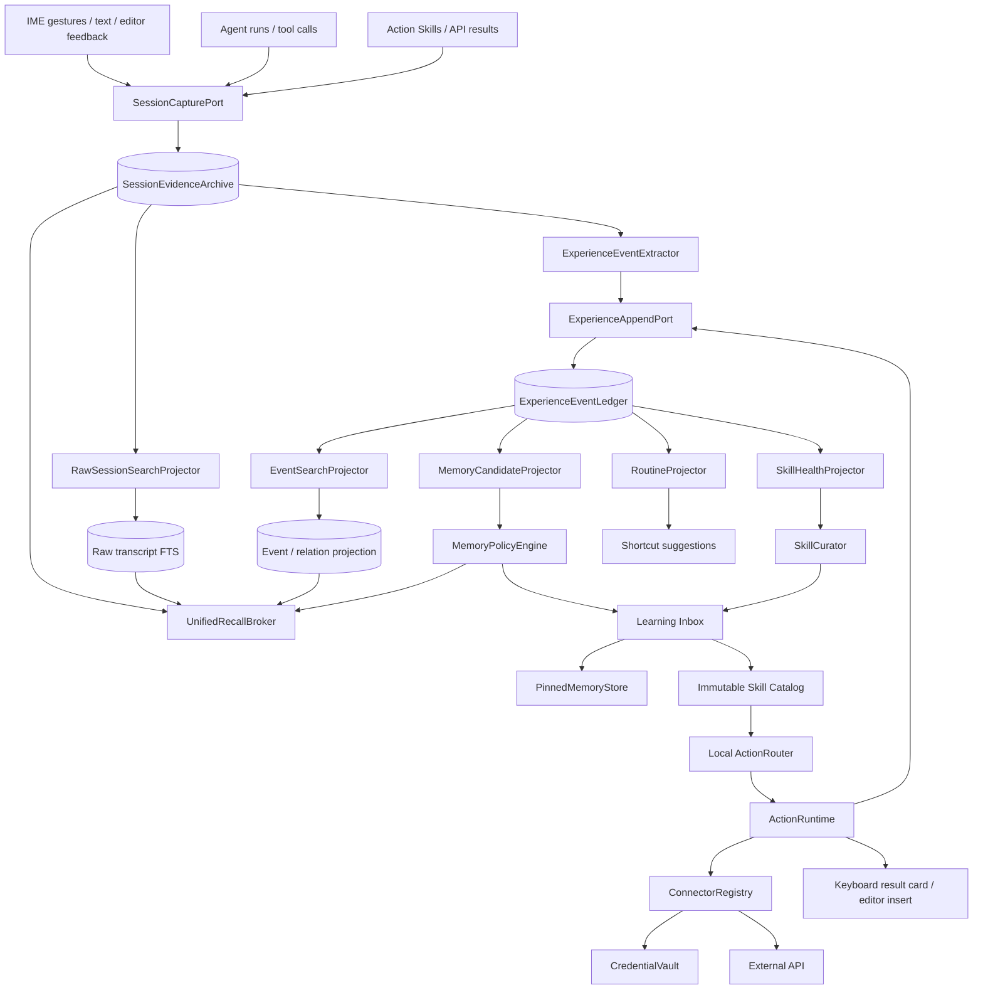
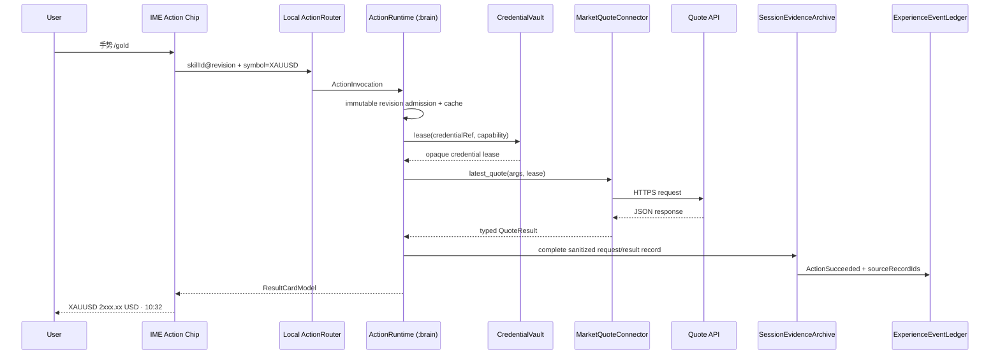

# Sense Agent 可进化架构 v1

## Hermes 启发、事件驱动跨会话记忆与零模型 Token Action Skills

**文档版本：** 1.0
**研究日期：** 2026-08-08
**适用基线：** Sense v0.4.8 → v0.4.9
**决策状态：** Accepted；v0.4.9 已交付首个纵向切片
**目标：** 在保留 Sense 输入法低延迟、跨进程、可中断 Agent 架构的基础上，引入可审阅、可回放、可持续进化的记忆与 Skill 系统，并为确定性 API 能力建立零模型 Token 执行通路。

---

## 实施快照（v0.4.9）

本设计的首个可发布切片已经落地：

- `SessionEvidenceArchive` 继续由 `AgentEventJournal` 完整追加原始记录；
- 新增 `EXPERIENCE_EVENT(12)` 与 `sense.agent.experience.v1`，事件强制引用原始 sequence；
- `JournalAgentMemorySearchSource` 合并原始 Session、经历事件和 Action History，并为
  原始 Session 预留召回配额；
- `AgentRecallFrame` 在 Brain 准入阶段冻结并进入首轮 Prompt；
- `memory_search` 返回 channel、evidence ids、scanned records/bytes 与 truncated；
- 新增 Direct Action API、XAUUSD Connector、追加式 Action History 与 Keystore Vault；
- 输入法 Agent 页面提供 0 Token 行情入口、停止、刷新、分析与外部编辑器写入。

后续切片继续实现通用 Connector Builder、Action Skill 图形化创建/绑定、Pinned Memory、
Evolution Review 收件箱及完整 Recall Inspector。本页后续章节保留这些目标态设计。

---

## 0. 结论先行

Sense 下一阶段不宜把“可进化”理解为让模型持续改写 Soul、把所有历史塞入上下文，或在每轮结束后再调用一次模型。更适合输入法的实现是：

> **完整原始 Session 记录是第一等证据；结构化事件是附着其上的语义旁路；投影、记忆和 Skills 都从两者派生，并始终保留回到原文的路径。**

整体演进链路为：

> **完整 Session Archive + 结构化 Experience Events → 可重建投影 → 确定性策略 → 可审阅学习提案 → 新记忆或新 Skill revision**

同时，Sense Skills 应拆成三种产品对象：

1. **Prompt Skill**：面向模型的过程知识，按需加载，会产生上下文 Token；
2. **Action Skill**：绑定一个确定性操作或 API，请求路径不创建模型会话，模型 Token 为 0；
3. **Hybrid Skill**：先用 Action Skill 获取结构化结果，再由用户选择是否交给 Agent 解读。

这两个方向应共用同一套证据底座：完整 Session、Action Skill 的调用、结果、错误、用户插入/忽略等记录都会被保留；结构化事件在原始记录旁增加类型、因果、修订与关系，用于改善快捷入口、Skill 健康状态和跨会话记忆。模型 Agent、API 快捷动作与输入法行为不再是三套孤立系统。

---

## 1. Hermes 最值得吸收的设计哲学

### 1.1 记忆、历史和 Skills 是三类对象

Hermes 将它们分开处理：

| 对象 | Hermes 中的角色 | Sense 应采用的角色 |
|---|---|---|
| Curated Memory | 很小、稳定、每个新会话注入 | `PinnedMemoryCapsule`，仅保留高价值事实和用户偏好 |
| Session Search | 全量历史，FTS5 按需查原消息 | `SessionSearchIndex`，从事件 Journal 重建，按需召回 |
| Skills | 按需读取的过程知识 | `PromptSkill`，保存完成一类任务的方法，而不是聊天日记 |
| Background Review | 会话后复盘记忆和 Skill | `EvolutionReview`，优先确定性提取，疑难项再走辅助模型 |
| Learning Journey | 将记忆和 Skill 作为可见节点 | “Sense 学到了什么”时间线与学习收件箱 |

Hermes 的收益来自**对象边界清楚**：稳定事实进入小记忆，原始细节留在历史，复杂流程进入 Skills。Sense 应复制这个边界，而不是复制其文件格式或桌面运行时。

### 1.2 渐进披露比“大而全 Prompt”更重要

Hermes 在会话开始只暴露 Skill 索引，完整 `SKILL.md` 和 reference 文件按需读取。Sense v0.4.8 已有 `skill_read` 与 immutable `id@revision`，方向正确，但当前发现目录仍会把最多 64 个描述注入 Prompt。

Sense 下一步应进一步收敛：

- Prompt 只带**本轮已选 Skill**和一个极小的能力摘要；
- 其他 Skills 由本地 `SkillIntentIndex` 发现；
- 命中 Prompt Skill 后才读取正文；
- 命中 Action Skill 后直接执行，不经过 Prompt；
- 大段参考材料作为 Skill resource 分页读取。

### 1.3 进化应在主会话之外发生

Hermes 的后台 review 会复制会话快照，在独立执行上下文中仅开放 memory/skill 管理能力，主会话和 Prompt cache 不被修改；Skill curator 还区分活跃、陈旧、归档和 pinned 状态。

Sense 应保留这个“主运行与学习运行隔离”的原则，但移动端实现更适合：

- 每轮由宿主完整记录 Session 原文、Provider 交互、工具轨迹和可观察效果，同时追加可确定提取的结构化事件；
- 原始记录与事件先完成 durable append，语义总结和学习提案随后异步生成；
- 在会话结束、设备空闲、充电或达到事件阈值时触发 review；
- 先执行本地规则和统计投影；
- 只有存在语义歧义的候选才进入辅助模型队列；
- 学习结果默认形成可见提案，显式“记住”类操作可直接落盘；
- 进化任务通过现有 `:brain` durable runtime 运行，IME 窗口隐藏不影响任务；
- 每个 review 都可暂停、取消，并具有 checkpoint。

### 1.4 Prompt 是编译产物，不是永久知识库

Hermes 将身份、工具说明、记忆、Skills 索引等分层构建，并利用稳定前缀。Sense 当前 `sense.soul.v2` 仍以编辑 Patch 协议为中心，这适合外部编辑任务，却不适合作为对话、Action、长期学习三类运行的共同 Soul。

建议引入 `PromptCompiler`，从稳定组件编译每次 run 的 frozen prompt snapshot：

```text
Identity/Soul
  + RunMode contract (CHAT | EDITOR | HYBRID)
  + frozen capability digest
  + tiny PinnedMemoryCapsule
  + selected PromptSkill body（可选）
  + current editor lease（仅 EDITOR/HYBRID）
  + run-local instructions
```

Soul 描述稳定人格与通用行为；协议由 `RunModeContract` 提供；记忆与 Skills 是结构化输入，不再混写进 Soul。

---

## 2. Sense v0.4.8 的现有基础与主要缺口

### 2.1 已有高 Leverage 基础

| 现有能力 | 源码位置 | 可复用价值 |
|---|---|---|
| 完整 Agent 运行 Journal | `ai-brain/.../memory/AgentEventJournal.kt` | 已有单写者、CRC frame、尾部恢复、搜索与顺序语义 |
| Memory 搜索 Seam | `DefaultAgentToolExecutor.AgentMemorySearchSource`、`JournalAgentMemorySearchSource.kt` | 可把当前词法搜索替换为投影索引，而不扰动工具 ABI |
| immutable Skill revision/catalog | `brain-api/.../AgentSkills.kt`、`ai-runtime/.../AgentSkillStore.kt` | Action Skill 可沿用 generation/revision、一致性和历史恢复语义 |
| Skill 运行准入 | `AgentSkillRunAdmission.kt` | 可冻结 Prompt Skill 或 Action Skill 的精确 revision |
| durable Agent runtime | `SenseAgentHubRuntime`、`AgentDurableRunStore` | 可承载后台 review、API Action 和取消管理 |
| Keystore 加密先例 | `ProviderSettingsStore.kt` | 可抽出通用 `CredentialVault`，复用 AES-GCM、AtomicFile 和跨进程锁思路 |
| 键位手势绑定 | `AgentSkillSlot` 与键盘 picker | Action Skill 可直接绑定，天然适合零模型 Token 入口 |

### 2.2 当前缺口

1. `AgentEventJournal` 当前更像“运行记录”，尚未形成稳定的领域事件 ABI；
2. `memory_search` 仍由模型决定调用，因此召回本身至少占用一次模型工具轮；
3. 当前 Skill 只有 Markdown 指令和 `EditorIntent`，缺少可执行的 typed action；
4. 全目录摘要进入 Prompt，Skill 越多，固定 Token 越高；
5. 记忆没有“候选 → 合并/冲突 → 晋升/失效”的策略层；
6. 用户看不到 Agent 学到了什么、依据是什么、何时生效；
7. API 认证当前围绕模型 Provider，缺少可复用 Connector/Credential 模型；
8. 旧 M9 事件记忆设计很完整，但 `memory-protocol` 与 `event-journal` 仍主要是 gate/scaffold，若等待完整底座后再做产品语义，反馈周期会过长；
9. `sense.soul.v2` 将 Agent 强绑定为 quiet editing agent，普通对话与后台学习缺少独立运行契约。
10. 当前文档与实现尚未把“完整 Session 原文”和“结构化 Experience Event”的双轨 authority 写成统一契约，容易让投影层被误解为原始记录的替代品。

---

## 3. 总体架构：Evolution Engine + Action Runtime



### 3.1 深 Module 与稳定 Interface

架构以五个深 Module 为核心：

#### A. `SessionEvidenceArchive`

- **Interface：** `SessionCapturePort.append(record): RecordReceipt`
- **职责：** 完整保留可持久化的用户消息、Assistant 内容、Provider 请求与输出、Tool/Action 调用与结果、编辑 Patch、应用结果、取消与终态；
- **大对象：** 终端输出、浏览器快照、附件和较大响应进入 content-addressed Blob，Session 记录保存 hash、长度、类型和 locator；
- **Authority：** 原始记录是事实来源，摘要、记忆、事件和搜索索引均为派生层；
- **Retention：** 压缩、分段和冷热迁移保持原文独立存在；用户显式清理产生可审计的 erasure record；
- **Depth：** 上层可按 session、run、record ordinal 和 continuation cursor 读取原始上下文，不感知 frame、CRC 或 Blob 布局。

#### B. `ExperienceEventLedger`

- **Interface：** `ExperienceAppendPort.append(event): AppendReceipt`
- **职责：** 接收由原始记录确定提取或由运行时直接观测的规范化事件、给出持久化 receipt、提供顺序游标；
- **来源链接：** 每个事件携带 `sourceRecordIds`，语义 claim 还携带 supporting/contradicting evidence refs；
- **Implementation v1：** 在当前 `AgentEventJournal` 上为 raw record 与 typed event 建立两个逻辑 namespace；
- **Implementation v2：** 未来将 Adapter 切换到 M9 Evidence Event Mesh；
- **定位：** 事件层增加结构和关系，始终作为 Session Archive 的增量旁路。

#### C. `EvolutionEngine`

- **Interface：** `project(cursorRange)`、`review(trigger)`、`apply(proposalId, decision)`；
- **职责：** 重建投影、产生候选、处理冲突、管理学习提案；
- **Locality：** 所有“为什么学到这条”逻辑集中在此处，Prompt、UI 和 Journal 不各自实现一遍。

#### D. `ActionRuntime`

- **Interface：** `execute(ActionInvocation): ActionExecutionHandle`；
- **职责：** 准入、缓存、认证解析、HTTP 执行、响应映射、结果展示、取消；
- **Depth：** 键盘只提交 Action intent，不接触 HTTP、Secret 或 JSONPath。

#### E. `ConnectorRegistry`

- **Interface：**

```kotlin
interface ApiConnector {
    fun describe(): ConnectorDescriptor
    fun validateConfig(config: ConnectorConfig): ValidationResult
    suspend fun authorize(request: AuthorizationRequest): CredentialHandle
    suspend fun execute(
        operationId: String,
        arguments: Map<String, ActionValue>,
        credential: CredentialLease?,
        cancellation: CancellationToken,
    ): ConnectorResult
    fun redactForJournal(result: ConnectorResult): RedactedConnectorReceipt
}
```

- **Adapter：** No-auth REST、API key、Bearer、OAuth2 PKCE、HMAC；
- **Seam 判据：** 至少落地 No-auth REST 与 API key 两个 Adapter 后，接口进入稳定 ABI。

---

## 4. 事件驱动的跨会话记忆

### 4.1 “记录—记忆”的五层模型

| 层级 | 内容 | 容量/生命周期 | 是否自动进入 Prompt |
|---|---|---|---|
| Source Record | 完整 Session 原文、Provider 交互、工具轨迹、编辑效果、附件/Blob 引用 | 长期、原始 authority | 否，通过搜索和精读进入 RecallFrame |
| Working Context | 当前会话最近消息、编辑器快照、当前工具状态 | 当前 run/session | 是，按预算裁剪 |
| Pinned Memory | 稳定偏好、环境事实、长期目标、重要约定 | 小型、版本化 | 是，冻结快照 |
| Structured Event Memory | 从原始记录提取的事件、实体、因果、修订、冲突和关系 | 长期、可重建 | 否，本地召回后选择性注入 |
| Procedural Memory | Prompt Skills / Action Skills | immutable revision | 命中后按需加载或直接执行 |

`Recall Memory` 不是另一份存储，而是 `Source Record + Structured Event Memory + Pinned Memory` 的统一查询视图。

最重要的边界：**原始 Session 始终独立保留；事件不替代原文；Pinned Memory 不是历史摘要；Skill 也不是事实仓库。**

### 4.2 完整记录与事件旁路的双轨写入

一次 Agent turn 应产生两条彼此关联的 durable 记录链：

```text
Raw record chain（完整证据）
  RequestAccepted
  UserMessageRecord
  EditorSnapshotRecord
  ProviderRequestRecord
  ProviderResponseRecord / StreamRecord
  ToolCallRecord + ToolResultRecord
  AssistantFinalRecord
  EditorApplyRecord
  RunTerminalRecord

Semantic event chain（结构与关系）
  UserMessageAccepted
  ToolCallSucceeded
  UserCorrectionObserved
  SkillApplied
  ResultUndone
  ...
```

双轨契约：

1. `SessionCapturePort` 由宿主运行时调用，记录范围不依赖 Agent 是否认为某段信息“值得记忆”；
2. 每个 raw record 获得稳定 `recordId`、session/run ordinal、长度、hash 和 payload/blob locator；
3. `ExperienceEventExtractor` 消费 raw record receipt，并生成携带 `sourceRecordIds` 的事件；
4. 运行时已经掌握类型的事实可同步生成事件，例如 Tool succeeded、Patch applied、Action cancelled；
5. 语义推断以 `ClaimCandidate` 保存，清楚区分 observed、user-stated、model-inferred；
6. 摘要、压缩文本、Memory 和 Skill revision 都保留回到 raw record 的 evidence refs；
7. 原文搜索与事件搜索分别建立 projection，任何一侧的索引缺口都不会让另一侧记录消失；
8. 大 payload 转入 Blob 后仍可按引用读取，摘要只承担预览和排名职责。

#### 4.2.1 五条强不变量

1. **Record Completeness**：进入 durable admission 的 run，必须具有从请求到终态的连续 record inventory；中止和崩溃也以明确 terminal/recovery record 收尾。
2. **Evidence Reachability**：Memory、claim、event、Skill learning proposal 中的每项结论，都能沿 evidence refs 回到一个或多个原始 record；纯运行时状态事件也要回到对应 state-transition record。
3. **Non-destructive Derivation**：摘要、压缩、合并、embedding、FTS row 和图关系均为派生物；发布派生物不会覆盖 Session 原文。
4. **Recall Union**：跨会话决策的候选集由 Raw Session、Event、Pinned Memory 和 Skill History 做 union；事件层只增加候选和关系，不拥有排除原文候选的权限。
5. **Explicit Coverage**：每次召回返回已查询范围、high-water mark、截断、索引缺口和继续读取 cursor；“本轮未召回”与“历史不存在”保持不同状态。

这里的“完整保留”针对所有进入 Sense 持久化边界且可长期保存的记录。认证材料由 CredentialVault 保存，Session Archive 记录 credential handle、注入位置、用途和 redaction receipt；附件或超大结果由 Blob 保存，Archive 保留完整引用。这样既保留执行证据，也避免把 Secret 复制到 Prompt、FTS 和普通日志。

### 4.3 领域事件 ABI

建议先在 `brain-api` 定义轻量事件 envelope，持久化 Adapter 放在 `ai-runtime` 或独立 `experience-ledger` module：

```kotlin
data class ExperienceEvent(
    val eventId: String,
    val schemaVersion: Int,
    val writerId: String,
    val writerSequence: Long,
    val sessionId: String?,
    val runId: String?,
    val causationId: String?,
    val correlationId: String?,
    val sourceRecordIds: List<String>,
    val observedAtEpochMs: Long,
    val kind: ExperienceEventKind,
    val payload: ByteArray,
    val privacyClass: PrivacyClass,
)
```

首批事件：

```text
SessionOpened / SessionClosed
UserMessageAccepted
AssistantMessageFinalized
EditorPatchProposed / Applied / Rejected / Undone / Redone
ExternalTextCommitted
ToolCallStarted / Succeeded / Failed / Cancelled
SkillSelected / Read / Applied / Failed / Revised
ActionInvoked / CacheHit / Succeeded / Failed / ResultInserted / ResultDismissed
UserCorrectionObserved
ExplicitRememberRequested
MemoryProposalCreated / Approved / Rejected / Superseded
EvolutionReviewStarted / Checkpointed / Finished / Cancelled
```

事件表达已经发生的观察或明确意图，并通过 `sourceRecordIds` 回链完整 Session。诸如“用户喜欢简短回答”属于 candidate/claim，其 supporting evidence 指向原始消息；该 claim 与原文并存。

### 4.4 投影器

所有投影器都遵循：

- 以 `(writerId, writerSequence)` checkpoint；
- 幂等消费；
- 崩溃后从最后 durable checkpoint 继续；
- projection 可删后重建；
- 不回写旧事件；
- 每个结果保留 evidence event IDs。

首批投影：

#### `RawSessionSearchProjector`

- 为用户消息、完整 Assistant 内容、Tool/Action 输入输出、编辑效果和可索引附件正文建立 FTS；
- 保留 `sessionId/runId/messageOrdinal`，支持命中后前后滚动；
- 命中结果返回 raw `recordId`、上下文读取 cursor 和 payload/blob availability；
- CJK 使用现有 n-gram 经验；
- 搜索路径本身不调用模型；
- 后续可增加 embedding 作为候选生成器，Session Archive 继续作为 authority。

#### `EventSearchProjector`

- 为事件 kind、实体、关系、claim、修订链、因果边和 Skill/Action identity 建立结构化索引；
- 每个命中必须返回 `sourceRecordIds`；
- supporting 与 contradicting evidence 分开保存；
- 事件索引用于解释关系和提高排名，原始 Session 搜索保持独立候选通道。

#### `MemoryCandidateProjector`

确定性提取以下信号：

- 用户显式“记住/以后都/默认使用”；
- 同一偏好在不同 session 重复出现；
- 用户对 Agent 输出做明确纠正；
- Agent 结果被应用、撤销、重做或人工替换；
- 工具或 Skill 在相同上下文反复失败后被用户修正；
- 高频 Action 调用形成稳定 routine。

它只产生 `MemoryCandidate`，不直接修改 Pinned Memory。

#### `SkillHealthProjector`

维护：

```text
use_count
success_count
failure_count_by_code
result_insert_rate
undo_after_apply_rate
user_correction_rate
last_used_at
last_success_at
connector_schema_mismatch_count
```

这些指标驱动 stale 检测和修订提案。

#### `RoutineProjector`

从明确重复行为生成快捷动作建议，例如：

- 工作日上午频繁查 XAUUSD；
- 某个 App 中总是使用同一润色 Skill；
- 用户每次得到行情后都选择“插入当前输入框”。

建议只进入学习收件箱，由用户一键绑定键位或工具栏 chip。

### 4.5 Memory Policy Engine

`MemoryPolicyEngine` 使用可解释规则产生五种决策：

```text
PROMOTE       晋升为 Pinned Memory
MERGE         与已有记忆合并为新 revision
SUPERSEDE     新记忆替代旧记忆，旧条目保留来源链
PROPOSE       进入学习收件箱
DROP          保留原事件，不进入高层记忆
```

建议的准入矩阵：

| 信号 | 默认行为 |
|---|---|
| 用户显式要求记住，内容结构清晰 | 直接 PROMOTE，显示轻量通知与撤销入口 |
| 同一稳定偏好跨 2 个 session 重复且无冲突 | PROPOSE；用户可开启自动接受 |
| 对旧记忆的明确纠正 | SUPERSEDE，并保留修订链 |
| 单次任务路径、临时 URL、一次性错误 | DROP，原始 Session 与事件记录仍可搜索 |
| 从模型回复推断出的用户偏好 | PROPOSE，标记 inferred |
| 涉及 Secret、Token、验证码 | DROP，并在事件 Adapter 写入前完成字段级 redaction |

### 4.6 记忆对象

```kotlin
data class PinnedMemoryEntry(
    val id: String,
    val revision: Long,
    val namespace: MemoryNamespace, // USER, ENVIRONMENT, PROJECT, AGENT_POLICY
    val statement: String,
    val status: MemoryStatus,       // ACTIVE, SUPERSEDED, ARCHIVED
    val confidence: ConfidenceBand,
    val origin: MemoryOrigin,       // EXPLICIT, REPEATED, INFERRED, IMPORTED
    val evidenceEventIds: List<String>,
    val supersedesId: String?,
    val createdAtEpochMs: Long,
)
```

Pinned Memory 采用 immutable revision。编辑一条记忆就是发布新 revision；撤销只是切回旧 revision 的等价新修订，不做破坏性覆盖。

### 4.7 跨会话召回路径

Sense 不应等待模型主动调用 `memory_search` 才想起上下文。建议增加本地 `UnifiedRecallBroker`，并将原始 Session 搜索设为独立召回通道：

1. 用户消息进入但尚未创建 Provider request；
2. 本地 tokenizer 产生关键词、实体、Skill/Action alias；
3. 并行查询 Pinned Memory、Raw Session FTS、Event/Relation projection 和 Skill history；
4. 候选集合先做 union，再根据命中强度、冲突、来源和新鲜度排序；事件候选不会预先过滤掉原始 Session 候选；
5. 对前排 Session 命中自动读取小型前后文窗口，形成带原文引用的 evidence cards；
6. 在固定预算内选择 compact `RecallFrame` 注入 run；
7. Agent 可继续调用 `memory_search`/`session_scroll` 按 cursor 获取更长原文；
8. 返回值明确声明每个来源的 high-water mark、截断状态与 continuation cursor。

```kotlin
data class RecallFrame(
    val queryFingerprint: String,
    val pinnedEntries: List<PinnedMemoryRef>,
    val evidenceCards: List<EvidenceCard>,
    val conflicts: List<MemoryConflict>,
    val coverage: RecallCoverage,
    val rawSessionEvidence: List<RawRecordExcerpt>,
    val eventEvidence: List<EventEvidenceRef>,
    val continuations: Map<RecallSource, RecallCursor>,
)
```

`RecallCoverage` 至少包含：

```text
queried_sources
source_high_water_marks
source_failures
truncated_sources
unindexed_record_ranges
continuation_cursors
```

这使常见跨会话记忆自动出现，也让决策明确知道本次读过哪些范围、哪里尚未覆盖。事件提取遗漏某段语义时，原始 Session 仍能通过自己的 FTS 和 session scroll 被找回。

### 4.8 后台 Evolution Review

触发器：

```text
SESSION_CLOSED
N_SIGNIFICANT_EVENTS
EXPLICIT_LEARN
DEVICE_IDLE_AND_CHARGING
SKILL_FAILURE_THRESHOLD
CONNECTOR_SCHEMA_CHANGED
```

执行分三段：

#### Stage A：Local review，零模型 Token

- 去重、计数、显式偏好识别；
- 纠正/撤销/重做关联；
- Skill 成败统计；
- Secret redaction；
- 生成高置信候选。

#### Stage B：Semantic review，可选辅助模型

仅处理：

- 两条记忆是否同义或冲突；
- 一次纠正更适合进入 USER memory 还是某个 Prompt Skill；
- 多轮复杂流程是否值得形成/扩展 Skill；
- 旧 Skill 中应修改的最小 diff。

该运行使用会话 digest 与候选 evidence，而非重放整个 Journal；工具 allow-list 只含 memory proposal 与 skill proposal，且不直接修改用户拥有的 Skill。

#### Stage C：Commit/review

- 高置信显式记忆可直接 commit；
- 推断、合并、Skill 改写进入 Learning Inbox；
- 用户可接受、编辑后接受、拒绝、始终忽略此类建议；
- 每个提案都显示“来自哪些会话/操作”；
- 后台任务在 Agent Hub 显示状态，并提供停止按钮。

### 4.9 “Sense 学到了什么”界面

建议在 Agent 前端加入独立页，而不是埋入设置深处：

1. **记忆**：当前生效的稳定事实与偏好；
2. **技能**：Prompt Skills 与 Action Skills；
3. **待确认**：学习提案；
4. **历程**：事件 → 提案 → revision 的时间线；
5. **健康度**：失败、撤销、响应结构变化等提醒。

每个节点提供：来源、当前状态、修订历史、编辑、暂停使用、归档和回退为新 revision。

---

## 5. 零模型 Token Skills

### 5.1 先精确定义“0 Token”

Hermes 所说的 Skill 渐进披露，是“正文未加载前不占上下文 Token”。一旦 Agent 读取 Skill 并决定调用工具，仍会产生模型输入/输出 Token。

Sense 的零模型 Token Action Skill 是更严格的定义：

> 从用户触发到结果展示的整个执行路径中，不创建 Provider 请求，不做模型分类，不生成模型 Tool Call。

因此，以下触发方式可保证零模型 Token：

- 键位/方向手势绑定到精确 `skillId@revision`；
- 工具栏 Action chip；
- `/gold`、`!xauusd` 等显式命令；
- 本地 exact alias/regex/有限语法解析，例如“xauusd价格”；
- Android Shortcut / Intent 直接携带 ActionSkillId。

任意自然语言的开放语义分类通常需要模型。为了继续保持零模型 Token，出现多个匹配时展示候选 Action chips，让用户点选。

### 5.2 Skill 类型演进

当前 `AgentSkillDefinition` 只有 Markdown `content` 与 `baseIntent`。建议保留它作为 Prompt Skill payload，同时将 catalog 对象提升为 sealed 类型：

```kotlin
sealed interface SenseSkillDefinition {
    val id: String
    val revision: Long
    val name: String
    val description: String
    val ownership: SkillOwnership

    data class Prompt(
        override val id: String,
        override val revision: Long,
        override val name: String,
        override val description: String,
        override val ownership: SkillOwnership,
        val content: String,
        val resources: List<SkillResourceRef>,
        val baseIntent: EditorIntent,
    ) : SenseSkillDefinition

    data class Action(
        override val id: String,
        override val revision: Long,
        override val name: String,
        override val description: String,
        override val ownership: SkillOwnership,
        val manifest: ActionSkillManifest,
    ) : SenseSkillDefinition

    data class Hybrid(
        override val id: String,
        override val revision: Long,
        override val name: String,
        override val description: String,
        override val ownership: SkillOwnership,
        val action: ActionSkillManifest,
        val interpretationPrompt: String,
    ) : SenseSkillDefinition
}
```

迁移时将所有旧 definition 映射为 `Prompt`，旧 catalog 和键位绑定保持可读。

### 5.3 Action Skill Manifest

```yaml
schema: sense.action-skill.v1
id: market.xauusd.quote
revision: 1
name: 黄金现价
description: 获取 XAUUSD 最新报价

triggers:
  aliases: [xauusd, xauusd价格, 黄金现价, 金价]
  commands: [/gold, /xauusd]

input:
  type: object
  properties:
    symbol:
      type: string
      default: XAUUSD
      enum: [XAUUSD]

connector:
  id: market.quote
  operation: latest_quote
  credential_ref: cred.market.primary

request_mapping:
  symbol: ${input.symbol}

response_mapping:
  symbol: $.symbol
  price: $.price
  currency: $.currency
  provider_time: $.timestamp

render:
  compact: "${symbol} ${price} ${currency} · ${provider_time}"
  target: RESULT_CARD
  actions: [INSERT_TO_EDITOR, REFRESH, OPEN_AGENT]

execution:
  timeout_ms: 5000
  cache_ttl_ms: 15000
  retry_count: 1
  stale_if_error_ms: 60000
  rate_limit_bucket: market.quote
  network_required: true
  privacy_class: PUBLIC_MARKET_DATA
```

Manifest 保存映射和 `credential_ref`，不保存 Secret。

### 5.4 为什么 Connector 必须是受控模板

若 Skill 可自由声明任意 URL、任意 Header 和任意 credential，Skill 文档就同时成为网络权限与 Secret 访问权限，边界过浅。

建议由 `ConnectorDescriptor` 声明：

```kotlin
data class ConnectorDescriptor(
    val id: String,
    val revision: Long,
    val allowedHosts: Set<String>,
    val allowedMethods: Set<HttpMethod>,
    val operations: List<ConnectorOperation>,
    val authScheme: ConnectorAuthScheme,
    val responseByteLimit: Int,
    val redirectPolicy: RedirectPolicy,
)
```

Action Skill 只能引用某个 connector 的 operation，并填入该 operation 声明的 typed 参数。自定义 REST 入口也先创建一个 Connector revision，用户测试并确认 host/method/auth 范围后，再供多个 Skills 复用。

这样形成两层稳定权限：

```text
Action Skill capability
    → Connector operation capability
        → Credential grant capability
```

### 5.5 CredentialVault

现有 `ProviderSettingsStore` 已使用 Android Keystore + AES-GCM + AtomicFile。建议抽出通用深 Module：

```kotlin
interface CredentialVault {
    suspend fun create(request: CredentialCreateRequest): CredentialHandle
    suspend fun lease(
        handle: CredentialHandle,
        capability: CredentialCapability,
    ): CredentialLease
    suspend fun rotate(handle: CredentialHandle, material: CharArray)
    suspend fun revoke(handle: CredentialHandle)
    fun metadata(handle: CredentialHandle): CredentialMetadata
}
```

`CredentialHandle` 只包含 opaque ID。`CredentialLease` 只能交给对应 Connector Adapter，Agent、Prompt、Skill manifest、Journal 与 UI 日志都只看到 handle 和脱敏 metadata。

#### 支持的认证类型

| 类型 | 用户入口 | 保存内容 | Connector 注入方式 |
|---|---|---|---|
| NONE | 无需设置 | 无 | 直接请求 |
| API_KEY_HEADER | 输入 key，或扫描/粘贴 | 加密 key | 固定 header name |
| API_KEY_QUERY | 输入 key | 加密 key | 固定 query name |
| BEARER | 输入 token | 加密 token | Authorization header |
| OAUTH2_PKCE | “连接账号” | access/refresh token、到期时间 | 自动刷新后注入 |
| HMAC | 高级配置 | key id + secret | Connector 内生成签名 |

OAuth 登录使用系统浏览器/Custom Tabs 与 Authorization Code + PKCE；callback 交给主进程，token 写入 Vault，`:brain` 只按 capability 获取短生命周期 lease。

#### Credential capability

```kotlin
data class CredentialCapability(
    val connectorId: String,
    val allowedHosts: Set<String>,
    val allowedOperationIds: Set<String>,
    val oauthScopes: Set<String>,
)
```

一个行情 key 可授权给 `market.quote/latest_quote`，不会因此暴露给浏览器、终端、模型工具或另一个 Connector。

### 5.6 XAUUSD 的完整零模型 Token 执行流



执行关键点：

1. `ActionRouter` 命中精确 Skill；
2. `ActionRuntime` 读取 immutable revision 并做本地 schema 校验；
3. cache 命中时立即返回；
4. credential 只在 Connector 内短暂出现；
5. response 先通过 byte limit、content type 和字段映射校验；
6. UI 展示 typed card，用户可插入外部编辑框；
7. Journal 只记录 provider ID、延迟、状态码分类、结果字段摘要和 redaction receipt；
8. 整条路径没有 Provider model transport，模型 Token 精确为 0。

如果用户随后点“让 Agent 分析”，`QuoteResult` 以小型结构化附件进入一个新的 Hybrid run；这一阶段才产生模型 Token。

### 5.7 Typed 失败与恢复

Action Runtime 统一返回：

```text
AUTH_REQUIRED
AUTH_EXPIRED
RATE_LIMITED(retryAfter)
NETWORK_UNAVAILABLE
TIMEOUT
REMOTE_4XX / REMOTE_5XX
RESPONSE_TOO_LARGE
SCHEMA_CHANGED
PARSE_FAILED
CANCELLED
STALE_CACHE_RETURNED
```

结果卡直接提供对应操作：连接账号、更新 key、重试、查看映射、使用带时间戳缓存、停止。错误处理同样不调用模型。

---

## 6. 最容易使用的用户入口

### 6.1 Skills 首页重新分层

```text
Skills
├─ AI 技能（Prompt Skills）
├─ 快捷动作（Action Skills）
├─ 组合技能（Hybrid Skills）
├─ 已连接账号
└─ Sense 学到了什么
```

现有图形键盘绑定器继续复用，但 Action Skill 的卡片要明确显示：

- “0 模型 Token”；
- 数据源与更新时间；
- 是否需要网络；
- 认证状态；
- 当前键位/方向；
- 默认结果目标。

### 6.2 Action Skill 创建向导

1. **选模板**：行情、天气、翻译、Webhook、JSON API、自定义 REST；
2. **试一次**：填样例参数并展示原始响应；
3. **连接账号**：NONE / API key / OAuth / Bearer；
4. **点选字段**：在格式化 JSON 上点击价格、时间等字段，自动生成映射；
5. **设计结果卡**：拖入字段，选择“只显示/插入输入框/复制”；
6. **设置触发**：键盘位置、工具栏、命令、aliases；
7. **保存 revision**：展示 host、method、权限和 Secret 使用范围摘要。

对于 XAUUSD 内置模板，用户体验可以压缩为：

```text
选择“黄金现价” → 选择数据源 → （如需要）连接 API key → 测试成功 → 点键盘位置绑定
```

### 6.3 Connected Accounts

统一账号页显示：

- Provider/账号名与图标；
- auth 类型与 scopes；
- 使用它的 Action Skills；
- 最近成功时间；
- 到期/刷新状态；
- 重新连接、轮换、撤销；
- 每个 Skill 的 capability 范围。

Secret 值保存后不再回显，只展示末尾指纹或账号 metadata。

### 6.4 输入法前端交互

Action Skill 执行时保持输入法高度稳定：

- 工具栏中央入口既可进入 Agent，也可横滑进入 Actions；
- 结果以候选区上方的 compact card 展示；
- 长任务进入左下角 live activity 小框，与终端/浏览器任务一致；
- “插入”调用现有外部 editor lease/CAS 路径；
- 卡片关闭仅关闭显示，不取消已完成 Action；
- 运行中的 Action 有明确停止入口；
- 键盘隐藏后，`:brain` 可继续请求，重新显示时从 durable state 恢复卡片。

---

## 7. Prompt 与 Agent 协议的优化

### 7.1 三种 RunMode

```kotlin
enum class AgentRunMode {
    CHAT,      // 普通对话，最终输出为 assistant message
    EDITOR,    // 针对外部编辑器，最终输出为 editor patch
    HYBRID,    // 对话中可显式提交一次 editor patch
}
```

`sense.soul.v2` 中“只有 patch 才是合法终态”的规则下沉到 `EditorRunContract`。CHAT 不再背负编辑协议；HYBRID 既能对话，也能通过明确的 `editor_apply` 工具写入当前外部输入框。

### 7.2 Prompt 固定前缀与动态后缀

```text
Stable prefix:
  Soul
  RunMode schema
  Tool schemas for frozen allow-list
  Memory behavior guidance
  Skill behavior guidance

Frozen per-session:
  PinnedMemoryCapsule
  capability digest

Per-run suffix:
  selected PromptSkill
  RecallFrame
  editor snapshot/lease
  user request
```

### 7.3 Skill 发现去 Token 化

当前完整 catalog summary 改成：

- `SkillIntentIndex` 本地维护 normalized aliases、tags、App scope、language 和 bindings；
- 用户明确点选的 Prompt Skill 直接注入；
- 自然语言高置信匹配只注入 1–3 个候选摘要；
- 低置信时 UI 展示 Skill chips；
- Action Skill 永不加入模型工具 schema，除非用户在 Agent 会话中明确开放 `action_invoke`；
- Prompt cache key 包含 Soul version、RunMode contract version、tool allow-list digest、memory capsule revision、selected skill revision。

---

## 8. 事件记忆与 Action Skills 的闭环

```text
用户反复调用 XAUUSD Action
  → ActionInvoked / ResultInserted 事件
  → RoutineProjector 发现稳定模式
  → 建议固定到工具栏或某个方向手势
  → 用户接受
  → 新 Skill binding catalog generation

API response 字段变化
  → SCHEMA_CHANGED
  → SkillHealthProjector 累积失败
  → SkillCurator 生成“更新字段映射”提案
  → 用户在响应预览中重新点选字段
  → 新 Action Skill revision

用户多次让 Agent 在行情结果后生成一句播报
  → Action + Agent trajectory 被识别为组合流程
  → 提议创建 Hybrid Skill
  → 以后先零 Token 取价，再按需生成播报
```

可进化能力因此不是抽象人格变化，而是可观察的产品改善：更准确的记忆、更健康的 Skill、更短的触发路径、更少的模型调用。

---

## 9. 模块与源码落点

### 9.1 推荐的新模块

```text
:experience-api
  SessionRecord / RecordReceipt
  ExperienceEvent / AppendReceipt
  RecallFrame / RecallCoverage / LearningProposal

:experience-runtime
  SessionEvidenceArchiveAdapter
  ExperienceEventLedgerAdapter
  ExperienceEventExtractor
  ProjectorRunner
  UnifiedRecallBroker
  MemoryPolicyEngine
  EvolutionReviewCoordinator
  PinnedMemoryStore
  LearningProposalStore

:action-api
  ActionSkillManifest / ConnectorDescriptor / typed result/error

:action-runtime
  ActionRouter
  ActionRuntime
  ConnectorRegistry
  CredentialVault
  HttpConnectorAdapters
```

若首版希望减少 Gradle module 数，可先放入 `brain-api` 与 `ai-runtime` 的独立 package，但 Interface 必须保持清楚；第二个 Adapter 出现时再提取模块。

### 9.2 现有文件的改造方向

| 文件/模块 | 改造 |
|---|---|
| `AgentEventJournal.kt` | 保留完整 run/session 记录；增加 raw-record 与 typed-event 逻辑 namespace，并分别提供 Archive/Event Adapter |
| `JournalAgentMemorySearchSource.kt` | 接入 `UnifiedRecallBroker`，同时读取 RawSessionSearch 与 EventSearch projection，并保留原文 scroll |
| `AgentSkills.kt` | 引入 Skill kind/payload，旧格式迁移为 Prompt Skill |
| `AgentSkillStore.kt` | 保存 Action manifest/resources/ownership/lifecycle metadata |
| `DefaultAgentToolExecutor.kt` | 保留模型工具；另建 ActionRuntime，避免 API Action 绕行 Tool Call |
| `ProviderSettingsStore.kt` | 抽取 Keystore cipher/atomic credential primitive，Provider 迁移成 Vault 的一个 client |
| `OpenAiRequestFactory.kt` | 接入 PromptCompiler、RunMode 与 compact memory/skill context |
| `sense/soul.md` | 收敛为身份层；Patch 终态规则迁入 EditorRunContract |
| `Agent Hub` | 增加 Action/Evolution durable task 类型、checkpoint、停止与恢复 |
| `SkillsSettingsScreen` | 增加 Prompt/Action/Hybrid 分区、Action wizard 与 Connected Accounts |
| `agent-ui` / `ime-ui` | 增加 result card、learning inbox、live action status |

---

## 10. 分阶段实施

### Phase E1：先建立“完整记录 + 事件旁路”，不等待完整 M9

- 定义 `SessionRecord v1`、`ExperienceEvent v1` 与两个 append port；
- 盘点现有 Journal 中 request、response、tool、patch、terminal state 的完整性，并为每类记录分配稳定 `recordId`；
- 用当前 `AgentEventJournal` 同时实现 `SessionEvidenceArchiveAdapter` 与 `ExperienceEventLedgerAdapter`；
- 补齐 editor applied/rejected/undo、Skill、Action 等事件，并回链 `sourceRecordIds`；
- 建立 RawSession FTS 与 Event/Relation 两类 projection；
- `memory_search` 接入 UnifiedRecallBroker，保留直接 session scroll；
- 保留将两个 Adapter 一起迁移到 M9 Event Mesh 的 Seam。

**验收：** 每个已完成 run 均可按顺序恢复完整消息、Provider、工具和编辑记录；每个派生事件均可回到原始 record；删除全部 projection 后可从 Archive 重建；Raw FTS 与 Event Search 可独立命中；召回结果暴露 coverage 和 continuation；同一 checkpoint 重放不产生重复行；崩溃恢复保留全部已 ack raw records 与 events。

### Phase E2：Pinned Memory 与学习收件箱

- `PinnedMemoryStore` immutable revisions；
- `MemoryCandidateProjector`；
- 显式记住、纠正、重复偏好的本地规则；
- Learning Inbox 与来源查看；
- PromptCompiler 注入 frozen capsule。

**验收：** 新 session 能读取已接受记忆；拒绝候选不进入 Prompt；Secret fixture 全路径脱敏。

### Phase A1：No-auth Action Skill

- Skill kind migration；
- ActionRouter、ActionRuntime；
- No-auth REST Connector；
- cache、typed error、result card；
- XAUUSD fixture template；
- 键位/工具栏/command 三种触发。

**验收：** invocation trace 中 Provider request count = 0；模型输入输出 Token = 0；结果可插入外部编辑框。

### Phase A2：API key/Bearer 与 Connected Accounts

- 通用 CredentialVault；
- API key header/query 与 Bearer Adapters；
- capability grant；
- Connected Accounts UI；
- key rotation/revoke；
- Journal redaction gate。

### Phase A3：OAuth2 PKCE 与 Connector Builder

- Custom Tabs/Authorization Code + PKCE；
- refresh token；
- 自定义 REST Connector 创建向导；
- 响应 JSON 点选映射；
- host/method/redirect/byte limit admission。

### Phase E3：后台进化与 Skill Curator

- idle/charging/session-close triggers；
- Local Review；
- 可选辅助模型 Semantic Review；
- Skill lifecycle：DRAFT → ACTIVE → STALE → ARCHIVED；
- pinned 与 user-owned mutation 边界；
- Agent Hub 中断、恢复和通知。

### Phase M9：切换物理 Ledger

当原 M9 durability/security gates 成熟后，同时实现新的 `SessionCapturePort` 与 `ExperienceAppendPort` Adapter，并通过 raw-record byte equivalence、event replay equivalence 和 cross-link integrity 验证切换。上层 projector、policy、Action runtime 和 UI 保持原样。

---

## 11. 测试与指标

### 11.1 零 Token 证明

每个 Action execution receipt 记录：

```text
provider_requests = 0
model_input_tokens = 0
model_output_tokens = 0
action_skill_id@revision
connector_id@revision
cache_status
network_duration_ms
render_duration_ms
```

测试用 fake ProviderTransport 设置为“一旦构造即失败”，Action suite 仍应全绿。这比仅查看账单更可靠。

### 11.2 记忆质量指标

```text
memory_proposal_accept_rate
memory_proposal_edit_rate
memory_proposal_reject_rate
accepted_memory_later_superseded_rate
recall_hit_inserted_into_run_rate
recall_conflict_surface_rate
false_recall_feedback_rate
pinned_memory_prompt_chars
```

### 11.3 Skill 进化指标

```text
prompt_skill_load_rate
action_skill_zero_token_invocations
action_success_rate
action_cache_hit_rate
schema_change_repair_time
undo_after_skill_apply_rate
skill_proposal_accept_rate
stale_skill_count
```

### 11.4 关键回归套件

1. Journal 尾损坏、重复 replay、并发 writer sequence，以及完整 Session record inventory；
2. Raw FTS 与 Event Search 的 CJK/英文/entity 独立命中、候选 union 与 session scroll；
3. 记忆冲突、supersede、拒绝、revision 恢复；
4. Secret 在 Prompt、Journal、UI、异常栈、备份中的全链路扫描；
5. Action cache、timeout、cancel、rate limit、schema change；
6. API key rotation 与 OAuth refresh 并发；
7. IME 隐藏/重现、`:brain` 重启、系统回收后的 Action/Review 恢复；
8. 外部编辑框租约变化后的插入 CAS；
9. 旧 v0.4.8 Skill catalog 迁移与 revision 保持；
10. frozen prompt snapshot 与 run replay 一致性。

---

## 12. 需要形成的 ADR

1. **ADR：完整 Session Archive、ExperienceEvent v1 与投影 authority**
   Session Archive 是原始证据 authority；Experience Event 是带 source refs 的语义旁路；当前 AgentEventJournal 承担物理 Adapter；所有 projection 可重建。

2. **ADR：Pinned / Recall / Procedural Memory 分层**
   规定什么进入 Prompt、什么留在历史、什么进入 Skill。

3. **ADR：Skill kinds 与 immutable payload**
   Prompt、Action、Hybrid 的类型、迁移与 revision 规则。

4. **ADR：零模型 Token Action path**
   明确 Action invocation 不构造 Provider request，模型工具路径与 ActionRuntime 分离。

5. **ADR：Connector 与 Credential capability**
   Skill 只引用 operation 和 credential handle；Secret 不进入模型与事件正文。

6. **ADR：Evolution review ownership**
   agent-created、user-owned、built-in、pinned 的自动修订边界与学习收件箱规则。

---

## 13. 最优先的产品切片

最值得先做的 tracer bullet 是：

> **“黄金现价” Action Skill + 完整调用记录 + 结构化事件 + 自动建议绑定 + 可选交给 Agent 分析**

它能一次验证：

- Skill 类型扩展；
- 零模型 Token 路径；
- API Connector；
- 无认证或 API key 认证；
- 结果卡与外部编辑器插入；
- durable background execution；
- Action 事件；
- RoutineProjector；
- Hybrid 升级路径；
- Learning Inbox。

完成这条竖切后，再增加天气、翻译、Webhook 等模板，只是在同一深 Module 上增加 Adapter 和 manifest，整体 Leverage 最高。

---

## 14. 参考资料

- [Hermes Agent 官方仓库](https://github.com/NousResearch/hermes-agent)
- [Hermes Persistent Memory](https://github.com/NousResearch/hermes-agent/blob/main/website/docs/user-guide/features/memory.md)
- [Hermes Work with Skills](https://github.com/NousResearch/hermes-agent/blob/main/website/docs/guides/work-with-skills.md)
- [Hermes Prompt Builder](https://github.com/NousResearch/hermes-agent/blob/main/agent/prompt_builder.py)
- [Hermes Background Review](https://github.com/NousResearch/hermes-agent/blob/main/agent/background_review.py)
- [Hermes Skill Curator](https://github.com/NousResearch/hermes-agent/blob/main/agent/curator.py)
- [Hermes Learning Graph](https://github.com/NousResearch/hermes-agent/blob/main/agent/learning_graph.py)
- [Android Keystore](https://developer.android.com/privacy-and-security/keystore)
- [RFC 7636: OAuth PKCE](https://www.rfc-editor.org/info/rfc7636/)
- [RFC 8252: OAuth 2.0 for Native Apps](https://www.rfc-editor.org/info/rfc8252/)
