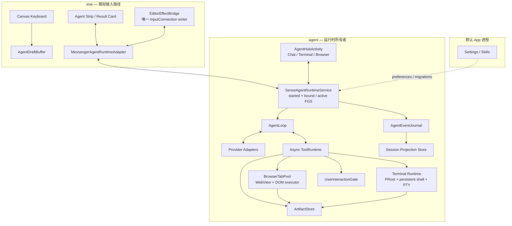

# Sense Agent Runtime v2：面向输入法的 OpenMinis 核心能力设计

> **2026-08-04 UI 决策更新：** Agent 主界面已确定进入输入法前端；设置页只承载配置，Terminal/Browser 作为对话内工具呈现。新的页面结构、视觉基线、IME 状态机与迁移顺序见 [`sense-ime-frontend-agent-openminis-ui-redesign-2026-08-04.md`](sense-ime-frontend-agent-openminis-ui-redesign-2026-08-04.md)。本文的运行时、工具和后台研究继续有效，其中独立 Agent Hub、三页签与轻量 IME 投影等 UI 放置结论由新文档取代。

> 状态：Implemented in Sense `v0.4.7`
> 设计基线：Sense `v0.4.6` / commit [`b8013ea638188fe12dd4516030a041d6573cad9f`](https://github.com/EthanBird/Sense/tree/b8013ea638188fe12dd4516030a041d6573cad9f)
> 参考实现：OpenMinis commit [`9cf3a855fecd27bb5735b84cacbd56852a3ab8dd`](https://github.com/OpenMinis/OpenMinis/tree/9cf3a855fecd27bb5735b84cacbd56852a3ab8dd)
> 配套研究：[OpenMinis Android Agent 架构深度分析](../research/openminis-android-agent-architecture-analysis-2026-08-03.md)
> 建议目标版本：`v0.5.0`；其中“自然语言结果 + 显式应用”可先落在 `v0.4.7`

---

## 0. 一句话决策

Sense 的下一代 Agent 应从“**一次 AI 编辑事务**”升级为“**持续存在的对话与任务运行时**”：

- 自然语言回复本身就是合法结果；
- 编辑器写入只是一个可选 effect，由用户显式触发；
- Agent Run 由独立的 `:agent` 进程持有，IME 只是轻量入口与结果投影；
- 终端、浏览器、文件、用户交互都经统一的异步 `ToolRuntime`；
- 键盘、Agent Hub、通知是同一会话的三种 UI 投影；
- 现有 append-only Journal 继续作为事实源，新增可重建的会话投影，而非另建一套相互竞争的历史。

这不是在 Sense 里塞入一个缩小版 OpenMinis。OpenMinis 的能力链值得复用，Sense 的核心差异则是：**输入法生命周期短、`InputConnection` 只属于 `:ime`、键盘面积有限、普通打字链路对延迟极其敏感**。因此，运行时所有权、WebView 进程、编辑器 lease 和 UI 投影必须重新设计。

---

## 1. v0.4.6 的真实起点

### 1.1 已经具备的好基础

| 基础 | v0.4.6 状态 | v2 里的复用方式 |
|---|---|---|
| 多进程 | IME 在 `:ime`，Brain 在 `:brain` | 将 `:brain` 演进为长期的 `:agent` |
| Provider 适配 | 已统一多个 Provider 的流式响应 | 保留 Adapter，输出归一为 conversation/tool events |
| Agent 工具循环 | 最多 12 轮工具调用，有进度事件 | 保留循环，替换同步工具边界 |
| 工具 | search/fetch/calculator/memory/skills | 作为轻量工具组继续存在 |
| Skills | revision、generation、绑定与管理 | 增加 entry/result policy，仍冻结版本 |
| Journal | request/event/provider/tool 全链路记录 | 继续作为唯一事实源 |
| 编辑保护 | snapshot/hash/事务校验只在 IME | 收缩为 `EditorEffectBridge`，保持写入边界 |
| 键盘 UI | 单 Canvas、Scene/Renderer/Interaction 分层 | 保持普通键盘热路径，只增加小型投影 |

### 1.2 当前严格协议为何浪费 token

当前链路把每次请求都定义成编辑事务：

1. [`HarnessRequestV1`](https://github.com/EthanBird/Sense/blob/b8013ea638188fe12dd4516030a041d6573cad9f/ai-protocol/src/main/kotlin/io/github/ethanbird/senseime/ai/protocol/HarnessRequestV1.kt) 必带 `EditorSnapshotV1`。
2. 终态要求 [`EditorPatchV1`](https://github.com/EthanBird/Sense/blob/b8013ea638188fe12dd4516030a041d6573cad9f/ai-protocol/src/main/kotlin/io/github/ethanbird/senseime/ai/protocol/EditorPatchV1.kt)，其中模型需要回显 request、snapshot、hash、intent、operation。
3. [`OpenAiRequestFactory`](https://github.com/EthanBird/Sense/blob/b8013ea638188fe12dd4516030a041d6573cad9f/ai-brain/src/main/kotlin/io/github/ethanbird/senseime/brain/OpenAiRequestFactory.kt#L513-L757) 同时维护 native tool schema、JSON schema 和 prompt-only contract。
4. Provider 输出了有价值的普通文本，但未形成指定 patch 时，[`AiBrainEngine`](https://github.com/EthanBird/Sense/blob/b8013ea638188fe12dd4516030a041d6573cad9f/ai-brain/src/main/kotlin/io/github/ethanbird/senseime/brain/AiBrainEngine.kt#L713-L930) 会把它当作修复证据，再发一次完整请求。
5. 第二次请求再次携带 snapshot、错误摘要和被拒文档，增加上下文 token、生成 token 与首屏延迟；用户最终还看不到第一次已经可用的文本。

问题并非“JSON 校验写得太严”这么局部。根因是三件事被绑定为一个对象：

```text
Agent Run == Provider Turn == Editor Transaction
```

正确拆分应为：

```text
Agent Session
  └─ Agent Run / Turn                    长生命周期、对话优先
       ├─ Assistant Message              合法结果
       ├─ Tool Calls / Artifacts          可选
       └─ Editor Proposal                 可选 effect
             └─ Editor Apply Transaction  只在 :ime、用户触发、短生命周期
```

### 1.3 当前工具边界的上限

[`AgentToolExecutor`](https://github.com/EthanBird/Sense/blob/b8013ea638188fe12dd4516030a041d6573cad9f/brain-api/src/main/kotlin/io/github/ethanbird/senseime/brain/api/AgentTools.kt#L180-L198) 是一次阻塞调用，只返回一个有界字符串。它适合 calculator 和静态 fetch，却缺少终端与浏览器必需的能力：

- 持续输出与背压；
- 运行句柄、超时、进程组取消；
- 等待用户登录、授权、选择文件或回答问题；
- 截图、下载、长日志等 artifact；
- 后台运行与 UI 重新订阅；
- 工具并发与每会话串行约束。

现有 `web_search` / `web_fetch` 通过 HTTP 拉取与文本提取完成静态访问，[`DefaultAgentToolExecutor`](https://github.com/EthanBird/Sense/blob/b8013ea638188fe12dd4516030a041d6573cad9f/ai-runtime/src/main/kotlin/io/github/ethanbird/senseime/brain/runtime/DefaultAgentToolExecutor.kt#L215-L357) 并没有 WebView、JavaScript、DOM、Cookie、标签页和用户接管语义。

### 1.4 当前生命周期所有权的上限

[`SenseAiBrainClient`](https://github.com/EthanBird/Sense/blob/b8013ea638188fe12dd4516030a041d6573cad9f/ai-runtime/src/main/kotlin/io/github/ethanbird/senseime/brain/runtime/SenseAiBrainClient.kt) 明确定义为 one-request-at-a-time；[`SenseAiEditorCoordinator`](https://github.com/EthanBird/Sense/blob/b8013ea638188fe12dd4516030a041d6573cad9f/ime-service/src/main/kotlin/io/github/ethanbird/senseime/service/ai/SenseAiEditorCoordinator.kt) 同时承担启动、界面投影、指针身份、snapshot、apply 与取消。IME 窗口隐藏、输入视图结束或配置变化时，[`SenseInputMethodService`](https://github.com/EthanBird/Sense/blob/b8013ea638188fe12dd4516030a041d6573cad9f/ime-service/src/main/kotlin/io/github/ethanbird/senseime/service/SenseInputMethodService.kt#L812-L829) 会结束当前 AI 路径。

这套 Locality 对“按住空格快速改写”很好，却不适合下载、安装依赖、浏览器登录、长时间检索和多轮问答。v2 需要把 **Run ownership** 从 IME 窗口与手指状态中抽离，同时保留现有 dead-man 手势的即时性。

---

## 2. 产品模型：输入法原生，而非聊天 App 的缩小版

### 2.1 四种入口

| 入口 | 典型动作 | 默认生命周期 | 结果落点 |
|---|---|---|---|
| 空格按住 | 对选中文本润色、解释、翻译 | 手指松开结束；上滑锁定后转为 durable run | 键盘结果卡 |
| Agent 键 / 工具栏 | 输入一句问题、继续当前会话 | durable run | 键盘 + Agent Hub |
| Agent Hub | 长对话、终端、浏览器、文件任务 | durable session | 完整会话 |
| 通知返回 | 任务完成、等待用户、发生中断 | 恢复既有 session | 精确定位消息或 gate |

### 2.2 两个键盘模式

#### 普通输入模式

- 所有按键仍写向宿主 App 的 `InputConnection`。
- Agent 只以状态 chip、结果卡、工具时间线出现。
- 普通打字不启动 `:agent`、PRoot 或 WebView。

#### Agent Composer Mode

- 键盘按键临时写向 `AgentDraftBuffer`，宿主编辑框保持原样。
- 拼音候选、英文、删除、光标、语音 partial 都通过同一个 `TextSink` Seam。
- 回车键变为发送；返回键退出 Composer；“插入到编辑框”是消息结果上的显式动作。
- 候选栏上方显示一行本地 prompt 与当前 session 名称；长内容转到 Agent Hub 编辑。

建议先做对话结果卡，再引入 Composer。最终形态应使用下列抽象，避免在各个 key handler 里散布 Agent 分支：

```kotlin
interface TextSink {
    fun commitText(text: CharSequence)
    fun deleteBeforeCursor(codePoints: Int)
    fun setComposingText(text: CharSequence)
    fun finishComposing()
    fun moveCursor(deltaCodePoints: Int)
}

class InputConnectionTextSink(...) : TextSink
class AgentDraftTextSink(...) : TextSink
```

键盘 Interaction 层只产生输入意图，`TextSinkRouter` 选择宿主编辑器或 Agent draft。这样 Module 的 Interface 小，Implementation 细节深，普通键盘保持高 Locality。

### 2.3 三类结果，不再只有“写入”

1. **Answer**：解释、计划、搜索摘要、终端结论；默认展示在会话和键盘结果卡。
2. **Artifact**：文件、截图、下载、长日志、代码包；以 `artifactId` 引用。
3. **Editor Proposal**：适合插入或替换的文本；带建议动作，但写入仍由 `:ime` 完成。

每条 Assistant Message 可拥有本地 action：

- 复制；
- 插入当前光标；
- 替换当前选择；
- 在原始上下文仍匹配时替换原 snapshot；
- 分享；
- 打开 Artifact；
- 继续追问。

因此，即使模型只返回普通文本，用户仍立即得到结果，也仍可一键写入。

---

## 3. 协议 v2：conversation-first，effect 可选

### 3.1 运行请求

```kotlin
data class AgentRunRequestV2(
    val protocol: String = "sense.agent.run.v2",
    val runId: String,              // 本地生成
    val sessionId: String,
    val trigger: AgentTrigger,
    val userMessage: UserMessageV2,
    val skill: FrozenSkillRef?,
    val editorContext: EditorContextRef?,
    val capabilityProfile: CapabilityProfile,
)
```

`EditorContextRef` 是本地引用，不直接等于 Provider prompt。`ContextAssembler` 根据 Skill、字段类型和用户动作选择实际附带内容：

- 快速改写：选区 + 有界前后文；
- 普通问答：默认不附带宿主文本；
- 密码类字段：始终跳过正文采集；
- 用户选择“带上当前内容”时，再提升 context scope。

### 3.2 事件协议

```kotlin
sealed interface AgentEventV2 {
    data class RunStarted(...) : AgentEventV2
    data class AssistantTextDelta(val messageId: String, val seq: Long, val text: String) : AgentEventV2
    data class PublicProgress(...) : AgentEventV2
    data class ToolStarted(...) : AgentEventV2
    data class ToolOutputDelta(...) : AgentEventV2
    data class ArtifactCreated(...) : AgentEventV2
    data class ToolCompleted(...) : AgentEventV2
    data class UserActionRequired(val request: UserActionRequest) : AgentEventV2
    data class EditorProposalReady(val proposalId: String, ...) : AgentEventV2
    data class TurnCompleted(val assistantMessageId: String?) : AgentEventV2
    data class RunStopped(...) : AgentEventV2
    data class RunFailed(...) : AgentEventV2
    data class RunInterrupted(...) : AgentEventV2
}
```

运行状态建议为：

```text
QUEUED → PREPARING → STREAMING ↔ RUNNING_TOOL
                             ↘ WAITING_USER ↗
        → COMPLETED | STOPPED | FAILED | INTERRUPTED
```

`WAITING_USER` 是持久状态。登录、选择文件、系统权限和确认操作都可暂停后恢复，而不是占住一个同步 executor。

### 3.3 Provider 输出规则

- 普通 assistant text 是一等终态。
- Provider 的 structured-output 能力仅作为 capability metadata，不再代表“每轮都必须输出 editor patch”。
- `sense_propose_editor_change` 是可选工具，参数只包含模型真正掌握的语义：

```json
{
  "operation": "insert|replace_selection|replace_context",
  "text": "...",
  "label": "建议按钮文案"
}
```

- `runId`、`snapshotId`、`baseSha256`、`imeSessionId` 由本地 runtime 注入。模型无需复制本地 UUID 与 hash。
- 改写类 Skill 即使只输出正文，UI 也可依据 `resultPolicy` 自动给出“替换选择”按钮。
- 工具参数出错时，返回紧凑的 typed tool error，随后继续同一轮对话；已有文本始终保留。
- 某个 Skill 若自带专用 JSON contract，其校验只围绕该 Skill 的小型 payload，避免重发完整 editor snapshot。

### 3.4 直接减少 token 的四个动作

1. 移除每轮 patch 根对象与本地 identity 回显。
2. 普通回答零次隐藏修复请求。
3. 大型 tool output 只给模型摘要 + artifact 引用，按需 `artifact_read` 分页。
4. Capability catalog 分层：常用小 schema 常驻，设备长尾能力通过 `capability_search` 发现；每次 run 冻结 catalog generation。

应新增四项可观测指标：

```text
protocol_full_turn_retry_rate
duplicated_snapshot_input_tokens
plain_answer_salvage_rate
tool_schema_input_tokens
```

目标：普通文本导致的 full-turn retry 为 0；编辑工具局部错误不触发 snapshot 重发；v1/v2 A/B 中记录首个可见字符、可操作结果和总 token。

### 3.5 v1 兼容

- 保留 v1 journal decoder 与 `LegacyEditorHarnessAdapter`。
- 现有 Quick Skill 可映射为 `AUTO_APPLY_WHILE_LEASE_VALID`，逐步迁移。
- 新会话走 v2；历史事件仍可读取。
- `sense.editor.patch.v1` 继续作为 `:agent` 到 `:ime` 的内部 effect document，而不是 Provider 的统一输出格式。

---

## 4. 进程与组件拓扑



### 4.1 为什么是 `:agent`

把现有 `:brain` 演进为 `:agent` 有四个收益：

1. PRoot、WebView、长会话的内存与崩溃域和普通输入隔离。
2. IME 窗口销毁只代表 UI detach，不代表 Run cancellation。
3. Foreground Service、通知、wake lock 与真正的任务 owner 在同一进程。
4. Journal 延续单 writer，避免跨进程数据库竞争。

`AgentHubActivity` 也声明 `android:process=":agent"`。这样浏览器页面、Cookie、标签池和实际 WebView 都在同一进程；用户接管时可把同一个 WebView 放入 Activity，而不是重建一个看似相同的新页面。

Android 9 起，同一 WebView 数据目录只适合一个进程使用；架构层面应规定 WebView 只在 `:agent` 初始化，并通过 `ProcessGlobalConfig` 显式设置 agent data suffix。Settings 与 `:ime` 均不创建 WebView。

这里的 “main thread” 指 WebView 所属进程的 Looper，并不等于默认 App 进程。两个候选方案对比如下：

| 方案 | 优点 | 代价 | 决策 |
|---|---|---|---|
| Browser + Agent Hub 放默认进程，Runtime 留在 `:agent` | Activity 组织方式常见 | 后台 browser 还需一个 main-process host service；tool、tab、takeover 跨两套生命周期与 IPC | 放弃 |
| Browser + Agent Hub + Runtime 同在 `:agent` | 同一 WebView、同一 Cookie、同一 tab lease、同一任务 owner | Agent Hub 需显式声明 remote process；初始化需避开默认进程组件 | **采用** |

这项 co-location 是 Sense 相对 OpenMinis 的关键适配：OpenMinis 的 UI 与 Agent 本就同进程；Sense 已经有独立 IME 进程，因此把完整工作台跟随运行时，比把 browser 再拆到第三个 owner 更有 Locality。

初始化也应进程感知：避免在一个全局 `Application.onCreate()` 中准备 rootfs、Journal、WebView 或完整 tool graph，因为该回调会在每个声明进程各执行一次。首期由 `SenseAgentRuntimeService.onCreate()` 建立 `AgentProcessGraph`，`AgentHubActivity` 获取同进程 graph；Browser 与 Terminal 各自 lazy-create。`:ime` 的 Application 路径只保留输入所需依赖。

### 4.2 Runtime Interface

```kotlin
interface AgentRuntimePort {
    suspend fun startRun(request: StartRunCommand): RunHandle
    fun subscribe(sessionId: String, observer: ProjectionObserver): Subscription
    suspend fun sendMessage(sessionId: String, draft: AgentDraft): MessageId
    suspend fun resolveUserAction(requestId: String, resolution: UserActionResolution)
    suspend fun requestEditorAction(proposalId: String, action: EditorAction)
    suspend fun stopRun(runId: String, reason: StopReason)
    suspend fun loadProjection(sessionId: String, afterVersion: Long?): SessionProjection
}
```

- Agent Hub 使用同进程 Implementation。
- IME 使用 Messenger Adapter。
- `subscribe/detach` 与 `stopRun` 是不同命令；UI 离开只取消订阅。
- Binder 不逐 token 推送。`:agent` 每 50–100 ms 合并一次轻量 projection；版本跳跃时 IME 拉取快照。
- 大对象只传 `artifactId`，避免 Binder payload 膨胀。

### 4.3 并发模型

- 同一 session 的 provider turn 串行，保证消息顺序。
- 用户在工具执行时发送的新消息进入 FIFO，可选择“排队”或“停止后发送”。
- 不同 session 可并行，初始全局上限建议 3。
- Browser pool 全局最多 3 个 tab；每个 tab 一个 mutex 与 lease。
- 同一 session 的 agent shell 串行；不同 session 的 shell 可并行。
- 全局资源预算监控 WebView、shell process、FD、PSS 和 artifact 占用。

---

## 5. 生命周期：把 Run lease 与 Editor lease 分开

### 5.1 两种 lease

```text
RunLease
  owner: :agent
  duration: seconds → hours
  survives: IME hide / Activity recreation / UI detach

EditorLease
  owner: :ime
  duration: current input session
  binds: editor identity + selection + snapshot hash
  expires: editor switch / window hide / input session change
```

Agent 运行期间，IME 不持有长期 `InputConnection` 引用，也不把它传出进程。Editor proposal 只保存文本、语义动作与来源消息。

### 5.2 手势语义

- **空格按住且未锁定**：保留当前 dead-man 行为；松手停止 run。
- **上滑锁定**：把 ephemeral run 提升为 durable run，启动/提升前台服务；随后 IME hide 只 detach。
- **Agent Composer 发送**：从创建起就是 durable run。
- **Agent Hub 发送**：从创建起就是 durable run。

### 5.3 结果到达时编辑器已经离开

结果持久化为 `PendingEditorProposal`。下一次 Sense 键盘出现时显示：

```text
[Agent 已完成] 预览文本……   [插入] [复制] [打开]
```

动作语义：

| 动作 | 校验 |
|---|---|
| 插入当前光标 | 由用户本次点击确认，使用当前 InputConnection |
| 替换当前选择 | 重新读取当前选择后执行 |
| 替换原位置 | 原 editor identity 与 snapshot hash 仍匹配 |
| 复制/分享/打开 | 与 InputConnection 解耦 |

系统不会把后台结果自动写进一个新出现的未知字段。这样既保留输入法的“一键落字”，又让长任务跨越窗口生命周期。

### 5.4 进程被系统回收

- Journal 先记录事件，再发布 projection。
- Provider stream、shell command、DOM action 在进程消失后被重建为 `INTERRUPTED`。
- 浏览器可恢复 URL、Cookie、下载和页面元数据；DOM 瞬时状态按新 `pageVersion` 处理。
- shell workspace 与文件仍在；运行中的 OS 子进程随 app UID 进程域结束后，以 exit reconciliation 标记。
- 默认恢复动作是“从最后一条 durable message 继续”或“重试该工具”；带外部副作用的工具先展示上次执行证据。

这比把 `START_STICKY` 当作协程续跑更准确：Service 重建负责 reconciliation，不伪造原网络流或原 DOM 的连续性。

---

## 6. Android 前台任务与通知模型

### 6.1 服务形态

`SenseAgentRuntimeService` 同时支持 started 与 bound：

- 键盘可见、短暂未锁定 run：bind-only。
- 用户上滑锁定、Composer 发送或 Hub 发送：`startForegroundService`，Service 立即发布 ongoing notification。
- 所有 run 结束且无待处理 gate 时：停止 foreground，空闲一段时间后 `stopSelf`。
- `WAITING_USER` 时持久化请求、释放 wake lock；可降为普通通知，用户点击后恢复。

Sense targetSdk 已是 36。建议声明 `specialUse` 类型、`FOREGROUND_SERVICE_SPECIAL_USE` 权限与明确 subtype，例如 `user_initiated_agent_task`，而不是照搬媒体播放类型。Android 官方把“当前输入法”列为后台启动 FGS 的豁免场景；真正启动动作仍应紧邻用户的发送或锁定手势。

### 6.2 Wake lock

`PARTIAL_WAKE_LOCK` 只覆盖实际 CPU 工作窗口：

- Provider 流正在消费；
- shell command 正在运行；
- browser action 正在执行；
- artifact 正在落盘。

每次获取带短 timeout 并续租；`WAITING_USER`、完成、网络退避与纯 UI 展示时释放。

### 6.3 通知状态

| 状态 | 文案 | 动作 |
|---|---|---|
| STREAMING | 正在生成，显示 session 与耗时 | 打开、停止 |
| RUNNING_TOOL | `终端：正在运行…` / `浏览器：正在操作…` | 打开、停止 |
| WAITING_USER | `需要你完成登录/选择/确认` | 继续、停止 |
| COMPLETED | 一行结果摘要 | 打开、复制 |
| INTERRUPTED | 上次任务已中断，可从最后消息继续 | 打开 |

通知 deep link 必须包含 `sessionId`、`runId` 和可选 `requestId`，打开后定位到对应消息或 gate。

---

## 7. 异步 ToolRuntime：所有新能力的共同底座

### 7.1 Deep Interface

```kotlin
interface ToolRuntime {
    fun start(
        call: ValidatedToolCall,
        context: ToolExecutionContext,
        observer: ToolObserver,
    ): ToolRunHandle
}

interface ToolRunHandle {
    val callId: String
    fun cancel(reason: String)
}

sealed interface ToolEvent {
    data class Started(...) : ToolEvent
    data class Progress(...) : ToolEvent
    data class OutputDelta(val stream: Stream, val bytes: ByteArray) : ToolEvent
    data class Artifact(val descriptor: ArtifactDescriptor) : ToolEvent
    data class NeedsUser(val request: UserActionRequest) : ToolEvent
    data class Completed(val result: CompactToolResult) : ToolEvent
    data class Failed(val error: ToolError) : ToolEvent
}
```

这个 Interface 隐藏网络、子进程、WebView main-thread、系统 picker 和持久 gate 等大量 Implementation 细节，具备足够 Depth。与之相比，继续给阻塞 `execute()` 添加更多 if/else 会形成 Shallow Module：调用简单，复杂性却泄漏到 AgentLoop、Service 和 UI。

### 7.2 Tool Registry

工具 descriptor 应成为 schema、settings、router、policy 和 UI label 的同一事实源：

```kotlin
data class ToolDescriptor(
    val id: ToolId,
    val version: Int,
    val summary: String,
    val inputSchema: JsonSchema,
    val capabilityClass: CapabilityClass,
    val interactionPolicy: InteractionPolicy,
    val concurrencyPolicy: ConcurrencyPolicy,
)
```

`ToolRegistry.freeze(settings, skill, providerCapabilities)` 生成本次 run 的 immutable catalog。这样新增工具只注册一个 Adapter，减少目前 enum、schema、parser、router、executor 多点修改的 Locality 问题。

### 7.3 建议工具分组

| 组 | 工具 | 说明 |
|---|---|---|
| 轻量 Web | `web_search`, `web_fetch` | 静态页面优先，成本低 |
| 浏览器 | `browser_use` | JS、DOM、表单、Cookie、截图、下载 |
| 终端 | `terminal_exec` | 持久 shell、cwd、timeout、流式输出 |
| Artifact | `artifact_list/read/write` | 大结果与跨工具文件交换 |
| 用户交互 | `request_user` | 选择、确认、文本补充 |
| 编辑 effect | `propose_editor_change` | 产生建议，不直接写 InputConnection |
| 现有能力 | calculator/memory/skill | 平滑迁移 |
| Android 长尾 | `capability_search`, `device_call` | 剪贴板、打开、分享、通知等按需发现 |

### 7.4 ArtifactStore

所有大对象统一存储：

```text
files/agent/
  sessions/<sessionId>/
    workspace/
    artifacts/<artifactId>/meta.json
    browser/downloads/
    terminal/logs/
```

Artifact 元数据包含 MIME、size、sha256、来源 tool call、创建时间、展示名、可分享 URI 与 retention policy。模型默认只收到摘要；`artifact_read(offset, maxBytes)` 分页读取。终端下载、浏览器下载、截图和生成文件天然互通。

---

## 8. 终端能力

### 8.1 采用 OpenMinis 的能力链，收缩耦合面

目标链路：

```text
Agent terminal_exec
  → ExecutionCoordinator
  → per-session PersistentShell
  → PRoot
  → bundled Alpine rootfs
  → stdout/stderr stream + exit code + artifacts
```

另设用户终端：

```text
Agent Hub Terminal tab
  → JNI forkpty/read/write/resize/signal/wait
  → interactive PRoot login shell
  → terminal emulator View
```

两者共享 workspace 与 rootfs，但使用不同进程。Agent shell 偏向确定性与机器可读，PTY 偏向 Ctrl+C、ANSI、光标、全屏程序和用户输入。

### 8.2 模块划分

建议新增 `agent-terminal`：

```text
agent-terminal/
  RootfsManager
  PRootKernel
  ExecutionCoordinator
  PersistentShell
  PtyBridge (JNI)
  TerminalSession
  TerminalScreenModel
  ProcessGroupController
```

`RootfsManager` 首次使用时原子解包版本化 rootfs：临时目录校验 sha256 后 rename；升级失败时保留上一版本。PRoot 与 PTY native 组件通过 `jniLibs` 交付。发布首批至少覆盖 `arm64-v8a` 与 `x86_64`，再依据 v0.4.6 的真实设备分布决定 32 位策略。

### 8.3 每会话执行模型

```text
/workspace/sessions/<sessionId>  会话工作区
/workspace/shared                用户共享区
/workspace/skills                Skill 脚本
/workspace/artifacts             artifact 映射
/workspace/imports               SAF 导入副本
```

- 一个 session 一个 persistent non-PTY shell + mutex。
- command 参数：`command`, `cwd`, `timeoutMs`, `maxModelChars`, `envDelta`。
- stdout/stderr 按块送到 tool row；UI 只保留 bounded tail。
- 完整输出可转为 artifact；给模型返回 exit code、tail、artifact id。
- 取消发送到 process group，随后升级为强制终止；超时用明确 code 与 reason。
- session 关闭时回收 shell、PTY、socket 和文件描述符。

### 8.4 Android 原生能力 offload

OpenMinis 通过修改 PRoot 的 `execve` 路径把命令交给 Kotlin。Sense 建议先使用维护面更小的显式桥：

```text
rootfs: /usr/local/bin/sense-android
  ↕ framed Unix domain socket
:agent: SenseBridgeServer
  → ClipboardHandler / OpenHandler / ShareHandler / NotificationHandler / ...
```

协议响应应保留真实语义：

```json
{
  "requestId": "...",
  "exitCode": 0,
  "stdoutArtifact": "artifact://...",
  "stderrArtifact": null,
  "metadata": {"mime": "text/plain"}
}
```

可为常用命令生成 shell wrapper，例如 `android-clipboard`、`android-open`。这样无需为每个 handler 修改 PRoot，真实 exit code 也能穿透。后续若大量既有 Skill 依赖透明命令名，再评估 exec interception。

### 8.5 文件边界

SAF `content://` URI 与 Linux path 语义不同。采用显式 import/export：

- 用户 picker 选中 URI；
- Android 侧复制到 session imports，记录原 URI 与 grant；
- terminal 使用普通 path；
- 导出时由 gate 选择目标并回写；
- 长文件通过 artifact/stream 传递。

PRoot 是用户态 syscall/path translation，而非 VM 或 SELinux 隔离层。终端进程仍处在 Sense 的 Android UID 权限域，因此 tool policy、workspace 范围、用户确认与完整日志仍由 Runtime 实施。

### 8.6 交付与体积 gate

- 固定 PRoot fork、Alpine 版本与所有包版本；生成 SBOM/NOTICE。
- PRoot 上游许可为 GPL-2.0-or-later，Sense 为 GPL-3.0-only；vendor source、修改记录和可复现构建一并发布。
- CI 记录每 ABI 的 `.so`、rootfs 压缩前后体积与最终 APK 增量。
- rootfs 从普通输入冷启动路径完全隔离，首次进入终端时再准备。

---

## 9. 浏览器控制

### 9.1 Browser Module

建议新增 `agent-browser`，仅加载于 `:agent`：

```text
BrowserTabPool (max 3)
  ├─ Tab(WebView, mutex, pageVersion, lease, lastUsedAt)
  ├─ BrowserActionExecutor
  ├─ DomSnapshotter
  ├─ DownloadCoordinator
  ├─ ScreenshotCoordinator
  └─ BrowserTakeoverController
```

WebView 在 main thread 创建与操作；DOM 文本清洗、图片编码、artifact 落盘在后台 dispatcher。每个 action 经同一 tab mutex，避免 click 与 navigate 交错。

### 9.2 `browser_use` 动作

首期建议：

```text
navigate(url)
get_page_state()
click(ref)
type(ref, text, submit?)
select(ref, value)
scroll(direction|x|y)
wait(condition, timeout)
back()
screenshot(fullPage?)
tabs(list|new|select|close)
cookies(summary)
download(ref|url)
```

`get_page_state` 返回标题、URL、可见文本摘要与交互元素：

```json
{
  "tabId": "t1",
  "pageVersion": 17,
  "elements": [
    {"ref":"e12","role":"button","name":"登录","visible":true},
    {"ref":"e13","role":"textbox","name":"邮箱","value":""}
  ]
}
```

元素 ref 只在当前 `pageVersion` 有效。navigation 或显著 DOM mutation 会递增版本，旧 ref 返回 `STALE_ELEMENT`，Agent 重新观察页面。相比传完整 HTML，这能显著降低 token，同时让 action 更稳定。

### 9.3 注入边界

- 使用 `evaluateJavascript` 注入短生命周期 action script，并以 JSON envelope 返回。
- 页面不获得一个拥有广泛 Android 能力的 `addJavascriptInterface`。
- URL scheme、文件选择、下载、外部 Intent 统一经过 Browser Adapter 与 UserInteractionGate。
- 密码输入由用户接管；模型侧页面状态对敏感字段只返回类型与存在性。

### 9.4 用户接管

出现登录、验证码、支付确认、复杂拖拽时：

1. Browser Adapter 发出 `BrowserTakeoverRequest(tabId, reason)`。
2. Run 进入 `WAITING_USER`，通知与键盘显示“打开浏览器继续”。
3. Agent Hub 在 `:agent` 中展示同一个 WebView，Cookie、history、DOM 保持。
4. 用户操作后点击“交还 Agent”。
5. Runtime 创建新 `pageVersion`，重新观察后继续。

这是输入法场景下最关键的用户交互：小键盘只负责召回，复杂网页直接升到 Hub，不在 300dp 高度里模拟完整浏览器。

### 9.5 静态 fetch 与浏览器的选择

保留现有 `web_search/web_fetch`。Agent 策略：

- 搜索结果、静态文章：先走轻量 Web；
- SPA、登录态、表单、按钮、Cookie、截图、下载：走 Browser；
- fetch 失败且页面依赖 JS：建议升级 Browser，而不是重复相同 HTTP 请求。

---

## 10. 用户交互协议

### 10.1 持久 Gate

```kotlin
sealed interface UserActionRequest {
    data class Confirm(...) : UserActionRequest
    data class Choose(...) : UserActionRequest
    data class TextInput(...) : UserActionRequest
    data class PickDocument(...) : UserActionRequest
    data class PickDirectory(...) : UserActionRequest
    data class RuntimePermission(...) : UserActionRequest
    data class BrowserTakeover(...) : UserActionRequest
}
```

每个 request 拥有稳定 `requestId`、session/run/toolCall 关联、deadline、allowed surfaces 与一次性 resolution。它先写 Journal，再更新 projection。进程重建后仍显示待处理请求。

### 10.2 三层展示策略

| Gate | 键盘 | 通知 | Agent Hub |
|---|---|---|---|
| 是/否确认 | inline chips | 打开 | 完整卡片 |
| 2–4 项选择 | inline chips | 打开 | 完整卡片 |
| 文本补充 | Composer | 打开 | 输入框 |
| 文件/目录 | “打开继续” | deep link | 系统 picker |
| 系统权限 | “打开继续” | deep link | Activity request |
| 浏览器接管 | “打开浏览器” | deep link | 同一 WebView |

### 10.3 Tool policy

工具 descriptor 声明 interaction policy：

```text
AUTO_READ                 搜索、读取 workspace、页面观察
AUTO_WORKSPACE_WRITE      session workspace 内生成文件
CONFIRM_EXTERNAL_EFFECT   分享、外部写入、发送通知等
USER_TAKEOVER             登录、验证码、系统 picker
```

Policy 判定由本地 Runtime 完成，Provider 只看到 gate 的结果。这样用户交互一致，Skill 与 Provider 也不会各自创造不同确认格式。

---

## 11. 三种 UI 投影

### 11.1 键盘：Agent Strip + Result Card

保持现有 Canvas 架构，投影数据严格有界：

```kotlin
data class ImeAgentProjection(
    val sessionId: String,
    val runState: RunState,
    val answerTail: String,             // 有界
    val activities: List<ActivityRow>,  // 最多 4 条
    val pendingGate: InlineGate?,
    val actions: List<ResultAction>,
    val projectionVersion: Long,
)
```

键盘状态：

1. `IDLE`：仅 Agent 入口。
2. `LISTENING/DRAFTING`：prompt/语音 partial。
3. `RUNNING`：答案 tail + 最多四条 tool activity + Stop。
4. `WAITING_USER`：inline gate 或“打开继续”。
5. `COMPLETED`：结果卡 + 插入/替换/复制/打开。
6. `BACKGROUND`：小 chip 显示 session 正在运行。

IME 只渲染 projection，不解析 Markdown、不读取大 artifact、不执行网络或磁盘任务。

### 11.2 Agent Hub：完整工作台

建议新增 `agent-ui`，沿用当前 Android Views 技术栈：

- `RecyclerView + ListAdapter/AsyncListDiffer` 展示消息；
- Chat、Terminal、Browser、Artifacts 四个一级 tab；
- tool call 折叠卡片，显示状态、耗时、tail 与详情；
- message action：复制、插入待办、重试、继续、分享；
- 会话列表显示 running/waiting/unread；
- 打开通知时精确滚到 message/gate。

流畅度采用“多频率解耦”：

| 链路 | 建议节奏 |
|---|---|
| Provider token → Journal buffer | 实时接收，批量落盘 |
| Agent projection | 50–100 ms 合并 |
| Assistant live row | 50–100 ms 更新一次 |
| Markdown parse | 200–300 ms 或换行阈值；完成后最终解析 |
| RecyclerView 结构 diff | 仅新增/终结 message/tool 时 |
| 自动滚动 | 约 10–15 fps 上限；用户上滑后暂停 |
| Journal delta flush | 250–500 ms；tool/terminal 边界立即 flush |

冻结的消息行保持 immutable，只更新最后一个 live row。这样“流式顺滑”来自整个链路降频，而不只是 SSE 更快。

### 11.3 通知：后台状态与召回

通知不承载完整内容，只提供：session、当前 tool、耗时、等待原因、Open/Stop。完成后可显示一行摘要；编辑应用动作回到 IME 或 Hub 处理。

---

## 12. Journal、会话投影与记忆

### 12.1 单一事实源

继续扩展 `AgentEventJournal`：

```text
RunRequested
UserMessageCommitted
AssistantDeltaBatch
ToolStarted / ToolOutputBatch / ToolCompleted
UserActionRequested / Resolved
ArtifactCreated
EditorProposalCreated / Applied / Dismissed
RunCompleted / Stopped / Failed / Interrupted
```

新增 `AgentSessionProjectionStore` 作为 rebuildable read model：

- session 列表与分页；
- message rows；
- tool rows；
- pending gates；
- unread/running 状态；
- latest editor proposal。

其 Interface 与存储 Implementation 分离；首个实现可用 Room/SQLite，且只有 `:agent` 写入。projection 损坏时从 Journal 重建。

### 12.2 Delta 批量化

- assistant delta 在 250–500 ms、换行或大小阈值聚合成 journal batch；
- terminal stdout/stderr 先写 artifact stream，只在 journal 记录 offset/摘要；
- tool start/end、gate、editor apply 等边界立即 durable flush；
- UI projection 版本单调递增，可从 Journal/read model 补 gap。

### 12.3 对话上下文

Provider context 由 `ContextAssembler` 构建：

- system + frozen Skill；
- 最近若干完整 turns；
- 更早历史的 durable summary；
- 用户明确关联的 artifact slices；
- 当前 run 的 tool pairs；
- 可选 editor context。

Journal 记录完整事实并不代表每轮全部喂给模型。历史、UI、记忆与 Provider prompt 是四个不同 projection。

---

## 13. Skills 的演进

为 Skill 增加：

```kotlin
enum class SkillEntryMode {
    QUICK_SELECTION,
    CONVERSATION,
    BOTH,
}

enum class SkillResultPolicy {
    CONVERSATION_FIRST,
    OFFER_EDITOR_ACTIONS,
    AUTO_APPLY_WHILE_LEASE_VALID,
}

data class SkillCapabilityProfile(
    val tools: Set<ToolId>,
    val allowTerminal: Boolean,
    val allowBrowser: Boolean,
    val allowExternalEffects: Boolean,
)
```

默认新 Skill 使用 `CONVERSATION_FIRST`。翻译、润色、续写可选 `OFFER_EDITOR_ACTIONS`；对现有快速改写行为有明确需求时，再选择 lease 有效期内自动应用。

Skill 创建 UI 可把关键选择写成人话：

```text
这个 Skill 从哪里启动？   [选中文本] [对话] [两者]
结果怎么呈现？             [先展示] [提供插入按钮] [按住时直接应用]
它可以使用什么？           [搜索] [浏览器] [终端] [文件]
```

revision/generation 仍冻结；Tool Registry 也基于同一 generation 冻结，确保一个 Agent turn 中的能力说明与实际执行一致。

---

## 14. Deep Module 评审

这里使用 Module / Interface / Implementation / Depth / Deep / Shallow / Seam / Adapter / Leverage / Locality 评估最值得先重构的位置。

### Candidate A：Run 与编辑事务解耦（最高 Leverage）

- **现状**：`SenseAiEditorCoordinator` 同时持有 provider run、手势、UI、editor lease 与 apply，Module 边界偏 Shallow。
- **新 Seam**：`AgentRuntimePort` + `EditorEffectBridge`。
- **Depth**：对上层只暴露 message、projection、proposal 与 action；snapshot/hash/InputConnection 全隐藏在 Implementation。
- **Locality**：协议变化集中在 agent-protocol/runtime；键盘写入保护仍留在 ime-service。
- **收益**：立刻消除普通文本协议失败，随后后台、对话、终端、浏览器都沿同一边界生长。

### Candidate B：同步工具执行改为异步 ToolRuntime

- **现状**：单次 `execute()` 对轻量工具足够，对长工具会把取消、进度、用户 gate 泄漏到调用方。
- **新 Interface**：`start(...) -> ToolRunHandle` + typed events。
- **Depth**：隐藏 WebView main-thread、PTY、socket、picker、artifact 与重试。
- **Adapter**：现有六个工具通过 `BlockingToolAdapter` 接入，减少一次性迁移风险。

### Candidate C：IME UI 与 Agent UI 分离

- **现状**：固定 Canvas projection 很适合键盘，却承载不了完整对话、终端与浏览器。
- **新 Module**：有界 `ImeAgentProjection` 与完整 `AgentHubProjection`。
- **Depth**：相同 Journal 事实映射到不同 UI，避免键盘接收大对象。
- **Leverage**：直接保护普通打字 P95 与内存。

### Candidate D：WebView 和 Terminal 分别形成 Deep Module

- Browser 的小 Interface 是 `execute(tabLease, action)`，Implementation 内部封装 tab pool、DOM ref、Cookie、下载、截图、takeover。
- Terminal 的小 Interface 是 `execute(session, command)` / `openPty(session)`，Implementation 内部封装 rootfs、PRoot、marker、process group、offload 与 ABI。
- 两者均通过 ArtifactStore 与 UserInteractionGate 组合，而不是相互直接依赖。

**优先结论：先做 Candidate A，再做 B；C 与 A 同期铺底；D 建立在 B 之上。**

---

## 15. 推荐实施顺序

### Phase 0：ADR 与协议骨架（1 个小版本）

- 新增 ADR：conversation-first、RunLease/EditorLease、`:agent` ownership。
- 定义 `AgentRunRequestV2`、事件与 terminal states。
- 建立 v1 journal decoder 与 compatibility test。

**退出条件**：协议 golden tests；旧历史可读；无 UI 行为变化。

### Phase 1：先解决 token 浪费（建议 v0.4.7）

- 普通 assistant text 可完成 run。
- 键盘显示结果卡：替换、插入、复制、继续。
- `sense_propose_editor_change` 的 ID/hash 改为本地注入。
- 取消“普通文本 → 整轮隐藏 repair”的默认路径。
- 增加四项 token/repair 指标。

**退出条件**：plain response 一次请求完成；v1 quick edit 回归通过；普通键盘 benchmark 无回退。

### Phase 2：Runtime ownership 与会话

- `:brain` 演进为 `:agent`；started + bound runtime service。
- Run 与 UI subscription 分离。
- Session projection、队列消息、通知、FGS、reconciliation。
- IME hide 时：未锁定 run 停止，锁定 run detach 后继续。

**退出条件**：Home、锁屏、旋转、切 App、销毁 IME 后 locked run 仍更新通知；进程重建展示 Interrupted。

### Phase 3：Agent Hub 与 Composer

- 会话列表、完整聊天、tool rows、artifacts。
- 键盘 Composer + `TextSinkRouter`。
- WAITING_USER inline gate 与 deep link。

**退出条件**：多轮聊天可从键盘、Hub、通知连续接力；Provider 工具消息顺序稳定。

### Phase 4：ToolRuntime 底座

- 异步 handle/events、Tool Registry、ArtifactStore、UserInteractionGate。
- 现有工具用 Adapter 迁移。
- output backpressure、取消、超时、并发预算。

**退出条件**：阻塞工具与异步假工具共存；进程重建后 pending gate 可恢复；大输出仅走 artifact。

### Phase 5：终端

- Alpine + PRoot + persistent shell。
- PTY/JNI 与 Hub terminal。
- workspace、SAF import/export、SenseBridgeServer。

**退出条件**：cwd/env 持久、真实 exit code、timeout、Ctrl+C、进程组取消、rootfs 原子升级、ABI 与体积门槛全部通过。

### Phase 6：浏览器

- WebView data/process policy、tab pool、DOM refs。
- screenshot/download/artifact、user takeover。
- Session 恢复与 memory trim。

**退出条件**：SPA、Cookie、登录接管、stale refs、下载共享、3-tab eviction、Activity 重建与后台执行通过。

### Phase 7：Android 长尾能力与定时任务

- clipboard/open/share/notification 等 offload。
- capability discovery。
- 新建 headless run 的 schedule；明确区分 schedule 与中途 run 恢复。

---

## 16. 测试矩阵与硬门槛

### 普通键盘

- 普通输入期间 `:agent`、PRoot、WebView 均未初始化。
- key-to-render、候选翻页、滑动、长按 benchmark 无显著回退。
- IME main thread 不等待网络、磁盘、Binder round-trip。

### 协议与 token

- plain assistant content 合法完成。
- malformed optional tool call 产生局部 tool error，前序文本保留。
- snapshot 与 UUID 不出现在 Provider 终态 schema。
- 记录 v1/v2 token、首字符、结果可操作时间与 repair rate。

### 生命周期

- API 29–36：Home、锁屏、旋转、切换输入框、切换输入法、最近任务划走。
- `:ime` 被 kill，`:agent` locked run 继续。
- `:agent` 被 kill，Journal 重建 session 并标记 Interrupted。
- WAITING_USER 时无 wake lock；deep link 定位 request。

### 终端

- stdout/stderr 分流、Unicode、长行、二进制输出。
- cwd/env 持久、每 session 隔离、跨 session 并发。
- timeout、cancel、process tree、FD 泄漏、rootfs upgrade rollback。
- arm64/x86_64 真机与模拟器；APK size budget。

### 浏览器

- redirect、SPA、iframe、Cookie、history、下载、文件上传。
- stale element、tab race、navigation timeout、页面 crash。
- takeover 前后同一页面状态；trim memory 与 tab eviction。
- WebView 只在 `:agent` 初始化。

### UI

- projection gap recovery；稳定 row ID。
- live row 更新不触发全列表 diff。
- 用户上滑后自动滚动暂停。
- 键盘只接收有界 answer tail、四条 activity 和一个 gate。

---

## 17. 最终推荐形态

```text
Sense = 输入法入口 + Agent OS-like runtime

键盘负责：
  捕获意图 / 选择上下文 / 快速提问 / 展示进度 / 一键应用

Agent Runtime 负责：
  对话 / Provider / 工具循环 / Journal / 后台 / 用户 gate

Agent Hub 负责：
  完整聊天 / 终端 / 浏览器 / 文件 / 接管

EditorEffectBridge 负责：
  在当前 InputConnection 上执行一次经过用户动作和 snapshot 校验的写入
```

最先值得落地的不是 PRoot 或 WebView，而是 **Agent Run 与 Editor Patch 的解耦**。这一个 Seam 会立刻解决当前协议不匹配造成的 token 浪费，并让终端、浏览器、后台、对话和用户交互有一个稳定的宿主。随后以异步 ToolRuntime 为第二个 Deep Module，再把 OpenMinis 已验证的终端与浏览器能力接入。这样得到的是一个真正适合输入法的 Agent，而不是一个依附在键盘窗口生命周期上的编辑器插件。

---

## 18. 主要平台资料

- [Android：后台启动前台服务的限制与输入法豁免](https://developer.android.com/develop/background-work/services/fgs/restrictions-bg-start)
- [Android：前台服务类型与 `specialUse`](https://developer.android.com/develop/background-work/services/fgs/service-types)
- [Android：前台服务 timeout 行为](https://developer.android.com/develop/background-work/services/fgs/timeout)
- [Android 16：前台服务变更](https://developer.android.com/develop/background-work/services/fgs/changes)
- [Android WebView API](https://developer.android.com/reference/android/webkit/WebView.html)
- [Android 9：WebView 多进程数据目录变化](https://developer.android.com/about/versions/pie/android-9.0-changes-28)
- [AndroidX WebKit `ProcessGlobalConfig`](https://developer.android.com/reference/androidx/webkit/ProcessGlobalConfig)
