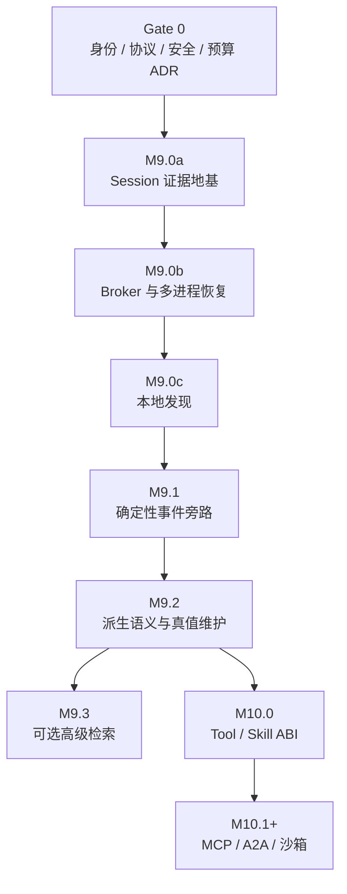

# Sense 输入法 Agent 工程开发文档

## 从 Evidence Event Mesh 到可交付的 M9 / M10

**文档版本：** 1.0<br>
**状态：** Proposed，供 M9 / M10 实施拆解使用<br>
**编制日期：** 2026-07-26<br>
**运行时代码基线：** Sense `v0.4.2` / `f3b9e5bf23cfbd714dcd356004f9bc75133770a1`<br>
**交付工作流基线：** `a20cb9ff834d86a06518e886f23f6fdbdf6ad3bb`<br>
**上位架构：** [`agent-event-memory-architecture-v1.0.md`](../design/agent-event-memory-architecture-v1.0.md)<br>
**文档性质：** 工程实施规范；本次提交只落文档，不启用记忆、不改运行时代码、不提升版本号

---

## 0. 交付判断

Sense 的 Agent 工程不应从“加一个向量数据库”或“把全部聊天塞回 Prompt”开始。第一条可交付路径是：

```text
先冻结证明边界
  → 精确记录单 writer local evidence
  → 证明 DurableAck 与崩溃恢复
  → 聚合跨进程统一 Session 并提供 exact recall
  → 再建立跨 Session 事件旁路
  → 最后才允许模型派生语义、外部 Tool 和可导入 Skill
```

本工程以依赖关系和验收门禁推进，不给出日历排期。任何后续阶段都不能以“开发时间到了”为由越过前置证明。

第一阶段的成功不是 Agent 显得更聪明，而是同时满足：

1. 普通输入路径的行为、延迟和内存没有回退；
2. M9.0a 的单 writer local evidence、M9.0b 的统一 Session 分别满足其声明范围内的字节精确读取；
3. 进程被杀、尾部半写、索引损坏和 Binder 断开时不伪造完整性；
4. 模型推断不会成为 Observation、Grant 或外部效果回执；
5. 所有新能力均可通过 feature flag 整体关闭，Sense 仍是一款完整输入法。

---

## 1. 实施边界

### 1.1 本文负责

- 把上位架构映射到现有 Gradle 模块、Kotlin package 和 Android component；
- 冻结 M9 的 wire、Journal、Blob、Broker、Recall 和完整性协议；
- 定义现有 Agent 状态机接入 Memory 的方式；
- 定义 M10 Tool / Capability / Grant / Skill 的实施落点；
- 给出可以直接转成 GitHub issue 的工作包、依赖、文件范围和 Definition of Done；
- 给出测试、CI、真 Key、迁移、回滚、故障注入和性能门禁；
- 明确哪些决定必须先进入 ADR，哪些算法仍保留可替换性。

### 1.2 本文不授权

- 不在本次文档提交中创建空壳 Gradle 模块；
- 不在没有 Security ADR 和 Budget ADR 时持久化用户原文；
- 不把 v0.4.2 以前未持久化的 Session 伪装成可恢复历史；
- 不默认记录普通跨应用输入原文；
- 不默认开启 embedding、向量检索、知识图谱或云端历史提取；
- 不下载并运行任意 Skill 代码；
- 不让 `:brain` 或 `:ime` 打开 Room；
- 不让 Memory 绕过现有 Patch、generation、hash/CAS 和写后验证；
- 不因文档完成而升级 `versionCode`、`versionName` 或创建 Release。

### 1.3 冲突优先级

实施时按以下优先级解释：

1. 已合并的安全与数据删除 ADR；
2. 上位架构文档中的不变量；
3. 本工程文档；
4. 具体模块实现 ADR；
5. issue、PR 描述和代码注释。

低层文档不能静默放宽高层约束。确需改变时，必须先修改上位文档并单独评审。

---

## 2. v0.4.2 代码基线

### 2.1 已有模块

| 模块 | 当前职责 | M9 / M10 的处理 |
|---|---|---|
| `app` | 设置首页、配置入口、最终 APK 组装 | 承载主进程 `MemoryBroker`、设置和维护入口 |
| `ime-service` | `InputMethodService`、编辑器租约、AI 协调 | 只增加固定开销 Journal producer；不读数据库 |
| `ime-ui` | Canvas 键盘、Agent Surface | 只显示真实 Memory/Tool step，不理解记忆内容 |
| `core-input` | 中文输入与 Ranker | 默认不依赖 Agent Memory；只读未来 HotSnapshot |
| `ai-protocol` | 编辑快照、Patch、Agent 状态机 | 以 protocol minor 增加正交 Activity upsert；不复用会回退宏状态的 progress kind |
| `brain-api` | Provider / Run 合约 | 接受经验证的 `MemoryFrame`，不自行查询数据库 |
| `ai-brain` | Provider、多轮工具、结构化终态 | 消费历史数据，不取得新的存储权限 |
| `ai-runtime` | `:brain` Service、Messenger、网络、Key | 增加 Run 协调与 MemoryBroker client |
| `benchmark` | Macrobenchmark 与回放门禁 | 增加 Journal、Recall、冷绑定和长期档案基准 |

### 2.2 必须保留的既有权威边界

| 现有对象 | 继续拥有的唯一权威 |
|---|---|
| `SenseAiEditorCoordinator` | `InputConnection`、编辑器 generation、Pointer/Lease、最终应用 |
| `EditorPatchGuard` / `EditorPatchPlanner` | Patch 范围、hash/CAS 与应用计划 |
| `EditorPostApplyVerifier` | “文字确实写入”的本地效果验证 |
| `AgentSessionStateMachine` | 用户可见 Agent 宏状态与 step reducer |
| `SenseAiBrainService` | 单 active Run、Provider 生命周期和跨进程迟到隔离 |
| `AiBrainEngine` | Provider 多轮、公开 progress、唯一终止 Patch |
| `ProviderSettingsStore` | Provider profile 与端点作用域凭证 |

Memory 只能向这些对象提供数据或证据，不能接管它们的权威。

现有 `PersistentUserLexicon` 仍是 `:ime` 内的输入排序资产，不是 Agent Memory。M9 不迁移、
合并或反向解释其中的词频；用户词命中不能被包装成“用户曾明确表达”的事件。

### 2.3 热路径不变量

- `:ime` 主线程零同步文件、Room、FTS、JSON、网络和模型调用；
- 普通按键、候选、绘制和上屏不绑定 MemoryBroker；
- MemoryBroker 未启动、被杀或数据库损坏时，普通输入行为不变；
- 每个新增 Binder 回调都必须快速复制小对象并切到专用 executor；
- 任何 memory progress 都不能改变键盘总高度；
- 运行时不弹出权限或澄清对话；可选策略在设置中预先确定。

---

## 3. 交付依赖图



强依赖：

- `M9.0a` 不得在 Gate 0 未通过时持久化原文；
- `M9.0c` 不得在 exact Session 慢路未完成时发布；
- `M9.2` 不得在 RelationAssertion、Coverage 和 Receipt 未冻结时接入模型；
- `M9.3` 只能是候选后端，不能改变 authority；
- `M10.0` 必须等待 M9.2 的事件命名空间、来源、冲突、Coverage 与审计边界稳定；外部写工具还必须依赖 Effect Ledger；
- `M10.1` 的远程 Agent 不得先于 Tool/Grant/取消语义稳定。

---

## 4. Gate 0：实施前 ADR

在第一个持久化实现 PR 之前先合并四份 ADR。

### 4.1 ADR 0015：Release identity 与长期数据连续性

建议路径：

```text
docs/adr/0015-release-identity-and-data-continuity.md
```

必须冻结：

- 可覆盖安装的固定 release signing identity 与密钥托管/轮换职责；
- debug、nightly、canary、production 的 applicationId/signing 隔离；
- GitHub Actions 只接收短生命周期签名输入，日志与 artifact 不泄露私钥；
- 签名轮换、Android lineage、灾难恢复与验证演练；
- 卸载、降级、签名不一致时 Keystore、Journal、词库和 Provider 配置的数据后果；
- 在固定身份建立前，Memory 只能停留在开发者 `DARK`，不得进入用户 `CANARY` 或 `DEFAULT`。

当前 GitHub runner 生成的 debug 证书不是长期身份。若继续用它发包，覆盖安装失败会迫使用户
卸载，并同时清除 Keystore 与本地数据；此时任何“长期记忆”承诺都不成立。

### 4.2 ADR 0016：Memory wire、durability 与兼容性

建议路径：

```text
docs/adr/0016-m9-memory-wire-and-durability.md
```

必须冻结：

- `sense.memory.v1` major/minor 兼容规则；
- M9.0 的 Common、Journal frame payload、BlobRef、Session record、Writer/Frontier/Ack 字段号；
- Proto unknown-field 保留策略；
- Journal frame、段头、段尾和最大长度；
- writer epoch、sequence、durable frontier 与 DurableAck 顺序；
- schema upcast 只产生读取视图、不重写历史 bytes；
- downgrade 行为和不识别 major version 的 fail-closed 行为。

此 ADR 不提前冻结 M9.1 的 Event/Relation/Recall/Receipt，也不冻结 M9.2 的 Claim/Coverage。
各阶段在首个实现 PR 前新增 phase schema gate、descriptor digest 与 reserved registry；不能把
尚未经过 EventBench 的语义字段伪装成 Gate 0 既成事实。

### 4.3 ADR 0017：Memory security、capture 与 erasure

建议路径：

```text
docs/adr/0017-m9-memory-security-and-erasure.md
```

必须冻结：

- threat model：同 UID 多进程、设备离线读取、备份、日志和临时文件；
- Android Keystore key hierarchy、key epoch 与轮换；
- 逐 frame/chunk AEAD、nonce 唯一性和 AAD；
- Room/WAL/FTS 允许保存的字段；
- keyed bigram token 的 key、编码和残余频率泄漏；
- CapturePolicy、敏感字段、`NO_PERSONALIZED_LEARNING` 和应用拒绝列表；
- 查看、导出、忘记、物理压实和 key destruction；
- 临时 PFD 文件、进程死亡和启动清理。

### 4.4 ADR 0018：Memory budget 与设备门禁

建议路径：

```text
docs/adr/0018-m9-memory-budget.md
```

ADR 0018 采用同一文件、两个接受阶段，避免在实现前伪造设备数字：

1. **0018-A Measurement Contract**：Gate 0 只冻结指标定义、场景、设备角色、统计规则、
   结果 schema、失效条件和 attestation；所有数值为 `UNSET`；
2. **0018-B BudgetProfileV1**：DARK 实现完成并取得实体设备数据后，再冻结可升级的
   build/device profile。任何 required 值仍为 `UNSET` 时，Memory 不得晋级到 `CANARY`
   或 `DEFAULT`。

0018-B 必须由设备数据冻结：

- 总 on-device soft cap 与最低剩余磁盘；
- Journal queue 容量、保留通道和 flush 条件；
- 单段/单 Blob/单 PFD page 上限；
- turn checkpoint DurableAck p95；
- warm recall 与 cold bind→首结果 p95；
- Journal CPU、功耗、写放大和峰值内存；
- HotSnapshot 单代上限；
- Pixel、HyperOS、中端、低内存设备矩阵；
- 低存储时停止 capture、降级和恢复规则。

协议只冻结防越界的安全上限，例如 48 KiB Binder inline envelope、1 MiB PFD logical page
和读取前 length/digest 校验；queue、flush、HotSnapshot 与磁盘数字属于 profile，不进入
不可变 wire ABI。

### 4.5 Gate 0 Definition of Done

- 四份 ADR 均有威胁/失败反例；0018-A 可以以全部数值 `UNSET` 通过 Gate 0，但此时运行阶段
  最高仍是 `DARK`；
- production signing identity 已由独立安装/升级演练证明，或所有持久化能力保持 `DARK`；
- 所有数字有测试方法，不以“经验值”单独定案；现有 M0–M6 Host JVM 结果不得冒充
  Android 设备预算；
- 评审明确哪些值进协议，哪些值仅进 build/device profile；
- 任何原文 capture feature flag 仍为关闭；
- CI 能验证当前阶段的 schema digest 和 reserved field number。

---

## 5. 新增模块与依赖

### 5.1 模块清单

| 模块 | 插件形态 | Android 依赖 | 职责 |
|---|---|---:|---|
| `memory-protocol` | Kotlin/JVM | 否 | ID、DTO、Proto wire、validator、Receipt、FeatureStage policy/快照、纯 reducer |
| `event-journal` | Android Library | 是 | Journal/Blob、Keystore、A/B frontier、writer/recovery、stage snapshot 原子存取 |
| `memory-ipc` | Android Library | 是 | Broker Messenger/Binder codec、PFD page、death/cancel plumbing |
| `memory-runtime` | Android Library | 是 | 主进程 Broker、Room/FTS、Recall、WorkManager、设置用 service API |

`event-journal` 选择 Android Library 是有意的：`:ime`、`:brain` 和 main 都需要同一份
Keystore、A/B frontier 和进程文件所有权实现。其 `journal.core` package 必须保持纯
Kotlin/JDK，以便 JVM property/fuzz 测试；Android API 只能出现在 `journal.android` package。

### 5.2 目标依赖

```text
memory-protocol

event-journal   → memory-protocol
memory-ipc      → memory-protocol

brain-api      → ai-protocol + memory-protocol
ai-brain       → brain-api + ai-protocol + memory-protocol
ai-runtime     → ai-brain + brain-api + ai-protocol + memory-protocol
                 + event-journal + memory-ipc
ime-service    → existing dependencies + memory-protocol + event-journal
memory-runtime → memory-protocol + event-journal + memory-ipc
app            → existing dependencies + memory-protocol + event-journal + memory-runtime
```

约束：

- `memory-protocol` 不依赖 Android、Room、Provider 或 UI；
- `event-journal` 不依赖 Room、WorkManager、Provider 或 `app`；
- `memory-ipc` 不包含搜索、索引、策略和 Broker 业务逻辑；
- `memory-runtime` 不被 `:ime` 或 `:brain` 的实现模块反向依赖；
- `app` 只负责组装和设置入口，不能成为共享 API 模块；
- M10 不提前创建空的 Tool/Skill 模块；先在 `brain-api` 冻结 ABI，出现独立发布/依赖证据后再拆 `agent-api`。

### 5.3 `settings.gradle.kts`

实施 PR 增加：

```kotlin
include(
    ":memory-protocol",
    ":event-journal",
    ":memory-ipc",
    ":memory-runtime",
)
```

同时在 Version Catalog 固定：

- Protobuf Gradle plugin；
- `protobuf-javalite`；
- Room runtime/compiler/FTS；
- WorkManager；
- 需要时的 AndroidX Security/Startup 依赖。

不得使用 `+`、`latest` 或未记录来源的本地 AAR。精确版本由实现时 DependencyEvidence 记录。

---

## 6. 推荐源码结构

```text
memory-protocol/
├── src/main/proto/sense/memory/v1/
│   ├── common.proto
│   ├── journal.proto
│   ├── session.proto
│   ├── recall.proto          # M9.1
│   ├── event.proto           # M9.1
│   ├── claim.proto           # M9.2
│   ├── coverage.proto        # M9.2
│   └── tool_effect.proto     # M10
├── src/main/kotlin/io/github/ethanbird/senseime/memory/protocol/
│   ├── MemoryProtocolVersion.kt
│   ├── MemoryIds.kt
│   ├── EventEnvelope.kt
│   ├── RelationAssertion.kt
│   ├── ClaimAssertion.kt
│   ├── RecallContract.kt
│   ├── CompletenessReceipt.kt
│   ├── MemoryFrame.kt
│   ├── SessionRecall.kt
│   ├── FeatureStagePolicy.kt
│   ├── FeatureStageSnapshot.kt
│   ├── FeatureStageValidator.kt
│   └── MemoryProtocolValidator.kt
└── src/test/...

event-journal/
├── src/main/kotlin/io/github/ethanbird/senseime/memory/journal/core/
│   ├── JournalFrameCodec.kt
│   ├── JournalWriterState.kt
│   ├── JournalRecoveryScanner.kt
│   ├── DurableFrontier.kt
│   ├── BlobStore.kt
│   ├── KeyEpochCoordinator.kt
│   └── AppendQueuePort.kt
├── src/main/kotlin/io/github/ethanbird/senseime/memory/journal/android/
│   ├── AndroidJournalWriter.kt
│   ├── AndroidDualSlotFrontierStore.kt
│   ├── AndroidSegmentKeyStore.kt
│   ├── AndroidKeyEpochCoordinator.kt
│   ├── AndroidWriterOwnership.kt
│   ├── AndroidTempOwnership.kt
│   ├── AndroidFeatureStageSnapshotStore.kt
│   ├── AndroidFeatureStageWatcher.kt
│   └── AndroidMemoryPaths.kt
└── src/test/...

memory-ipc/
├── src/main/kotlin/io/github/ethanbird/senseime/memory/ipc/
│   ├── MemoryMessageProtocol.kt
│   ├── MemoryMessageCodec.kt
│   ├── MemoryBrokerComponentContract.kt
│   ├── MemoryBrokerClient.kt
│   ├── PfdPageDescriptor.kt
│   ├── PfdPageReader.kt
│   ├── PfdPumpExecutor.kt
│   └── BrokerDeathGate.kt
└── src/test/...

memory-runtime/
├── src/main/AndroidManifest.xml
├── src/main/kotlin/io/github/ethanbird/senseime/memory/runtime/
│   ├── SenseMemoryBrokerService.kt
│   ├── MemoryRuntimeGraph.kt
│   ├── MemoryBrokerEngine.kt
│   ├── SessionCatalogImporter.kt
│   ├── ProjectionWriteCoordinator.kt
│   ├── RecallPlanner.kt
│   ├── RelationClosureEngine.kt
│   ├── MemoryFramePacker.kt
│   ├── MemoryMaintenanceWorker.kt
│   ├── FeatureStagePublisher.kt
│   └── RolloutLedger.kt
├── src/main/kotlin/io/github/ethanbird/senseime/memory/runtime/db/
│   ├── SenseMemoryDatabase.kt
│   ├── MemoryEntities.kt
│   ├── MemoryDao.kt
│   ├── KeyedBigramTokenizer.kt
│   └── ProjectionRebuilder.kt
└── src/test/...
```

生成的 Proto 类只用于 wire/storage adapter。Reducer、Policy 和 UI 不应散布 generated builder；它们消费经 validator 转换的不可变 Kotlin domain value。

---

## 7. Memory protocol v1

`sense.memory.v1` 是长期 namespace，不表示所有对象在 Gate 0 一次冻结：

| Phase gate | 首次冻结的 proto | 实现前证明 |
|---|---|---|
| Gate 0 / M9.0 | `common`、`journal`、`session` | writer/replay/N-1 fixture |
| M9.1 | `event`、`recall`（含 Relation、QueryContract、Receipt） | EventBench + closure property |
| M9.2 | `claim`、`coverage` | evidence/conflict/coverage property |
| M10 | `tool_effect` | Grant/effect/replay property |

每个 descriptor 独立做 digest 与 reserved-field registry；后阶段增加文件不改写早期字段号。

### 7.1 ID 规则

| ID | 生成 | 是否含时间 | 说明 |
|---|---|---:|---|
| `event_id` | CSPRNG 128-bit | 否 | 同内容发生两次仍是两个事件 |
| `relation_id` | CSPRNG 128-bit | 否 | 唯一 canonical edge |
| `session_id` | CSPRNG 128-bit | 否 | Sense 本地 Session，不采用 Provider ID |
| `run_id` | 复用/映射现有 `requestId` | 否 | 贯通 IME、Brain、Broker |
| `writer_epoch` | 每次 writer 打开新 epoch 生成 | 否 | 与 sequence 组成来源内顺序 |
| `blob_id` | Security ADR 决定的 keyed content ID | 否 | 文件名不得直接泄露原文 hash |

所有 wire ID 使用固定上限 ASCII；解析时拒绝空值、超长和非规范形式。

### 7.2 `EventEnvelopeV1`

```text
EventEnvelopeV1
  protocol_major
  protocol_minor
  event_id
  schema_uri
  schema_version

  origin
    installation_id
    writer_id
    writer_epoch
    writer_sequence
    boot_id?
    elapsed_realtime_nanos?

  correlation_id?
  branch_id?
  event_kind
  epistemic_class
  actor
  subject_refs[]
  scope

  original_narrative?
  source
  payload | payload_ref

  occurred_at?
  recorded_at
  time_precision?
  time_source?

  producer
  build_version
  model_or_tool_version?
  skill_hash?
  payload_hash
```

禁止在 Event 内再嵌入 `relations[]`、支持边或 revision 边。

### 7.3 `RelationAssertionV1`

```text
RelationAssertionV1
  relation_id
  relation_type
  from_ref
  to_ref
  producer
  epistemic_class
  provenance
  scope
  temporal_constraint?
  registry_version
  validation_state
  typed_payload?
```

`EventBatchV1` 可以在同一 Journal frame 中原子包含：

```text
one event envelope
zero or more relation assertions
zero or more blob references
```

关系仍只在 Relation Ledger 中出现一次。`source_event_ids` 是 provenance locator，不是第二套语义边。

### 7.4 必须冻结的 enums

```text
EpistemicClass:
  OBSERVED | ASSERTED | INFERRED | HYPOTHETICAL

RelationValidation:
  HOST_CONFIRMED
  STRUCTURALLY_VALID_UNVERIFIED
  EFFECT_VALIDATED
  REJECTED

DiscoveryMode:
  EXACT_ENUMERATION
  EXHAUSTIVE_EVALUATION
  HEURISTIC

CompletenessVerdict:
  COMPLETE_FOR_DECLARED_CONTRACT
  PARTIAL
  FAILED
```

新增 enum 值必须满足旧 reader 的 unknown handling；删除值必须 reserve，不能复用数字。

### 7.5 版本规则

- wire protocol major/minor、payload schema major/minor、`protoc` 版本和 runtime 版本分别记录，
  不能用一个 `frame_version` 掩盖四类兼容边界；
- 未知 protocol/payload major 或未知 required feature：reader fail-closed，原始 bytes 仍可导出；
- minor 增加可忽略字段：旧 reader 必须在二进制 parse/serialize 路径保留 unknown fields；
- 对需要跨版本透明保留的扩展，使用带显式 type/schema id 的 opaque payload bytes；不得用开放
  `oneof` 或 JSON 中转冒充 unknown-field preservation；
- field number 永不复用；
- upcaster 必须是确定性纯函数；
- 历史原 frame 不因 upcast 被重写；
- payload/content hash 对原始存储 bytes 计算；不得对 parse 后重新序列化的 Proto 计算，
  因为合法 Proto 编码不保证 canonical；
- reducer version、registry version、normalizer version进入 Receipt；
- 每次实现 PR 校验 `.proto` descriptor digest。

---

## 8. CapturePolicy 与事件生成

### 8.1 决策顺序

```text
Editor / Agent signal
  → CapturePolicy.evaluate()
  → ALLOW / AGGREGATE_ONLY / DENY
  → 分配 event_id
  → queue admission
  → 分配 writer_sequence
```

在 `DENY` 前不得创建 Event、Blob、稀疏统计或 writer sequence。

### 8.2 M9.0 默认捕获范围

只捕获用户显式唤醒的 Sense AI Session：

- run start / stop / fail / complete；
- 已通过 CapturePolicy 的编辑快照引用；
- Provider 公开 turn 边界；
- public progress 的稳定 step，而非每次 heartbeat；
- Tool request/progress/result/cancel/effect；
- final Patch proposal；
- Patch validation、apply 与 post-apply observation；
- 用户撤销、纠正和明确反馈；
- Provider usage 与脱敏错误类别；
- Skill/Tool/Provider 的版本与 descriptor digest。

不捕获：

- 私有 reasoning；
- API Key、Authorization header；
- 未经授权的宿主 package metadata；
- 每个 SSE 包、token 和本地心跳；
- 密码、OTP、支付、无痕和 `NO_PERSONALIZED_LEARNING` 内容；
- 普通输入原文。

### 8.3 代码接口

```kotlin
interface CapturePolicy {
    fun evaluate(input: CaptureInput): CaptureDecision
}

sealed interface CaptureDecision {
    data class Allow(val policyHash: ByteArray) : CaptureDecision
    data class AggregateOnly(val approvedFields: Set<AggregateField>) : CaptureDecision
    data class Deny(val reason: CaptureDenyReason) : CaptureDecision
}
```

`AggregateOnly` 只允许 registry 中明确批准且不可逆的字段。敏感策略命中时，包括 n-gram、罕见词和 app-scoped 统计在内的内容派生全部禁止。

### 8.4 确定性 producer

M9.0 的 canonical operational event 由宿主代码产生：

```text
ImeAgentEventProducer
BrainRunEventProducer
ToolEffectEventProducer
BrokerRecoveryEventProducer
```

LLM 不参与这些 Event 的存在性、kind、actor、call-id 配对和 effect 状态判断。

---

## 9. Journal writer 工程

### 9.1 每进程一个 writer

```text
:ime   → writer_id=ime
:brain → writer_id=brain
main   → writer_id=main
```

每个 writer 只写自己的 epoch 文件。不同进程不追加同一文件。

### 9.2 admission 与 durability 分离

实现层使用两个结果，避免把“已进队列”误写成“已落盘”：

```kotlin
sealed interface AppendAdmission {
    data class Accepted(
        val eventId: EventId,
        val ackToken: AckToken?,
    ) : AppendAdmission

    data object RejectedBackpressure : AppendAdmission
    data object StorageUnavailable : AppendAdmission
}

sealed interface JournalAck {
    data class Durable(val frontier: DurableFrontier) : JournalAck
    data class Failed(val reason: JournalAckFailure) : JournalAck
}
```

规则：

- queue 使用固定容量 `offer`，不做无界缓存；
- producer 构造不含 sequence 的 immutable queue item；`offer` 成功才算 admission；
- writer dequeue 后才分配 sequence 并编码 frame，consumer 永远看不到未初始化 sequence；
- `AppendAdmission` 不返回 sequence；需要持久化证明时，以 `ackToken` 等待包含 sequence/frontier
  的 `JournalAck.Durable`；
- `BEST_EFFORT` 记录不申请 ack；
- turn checkpoint、Tool intent、Effect receipt 和 Run terminal 使用 `DURABLE_REQUIRED`；
- durable callback 在 writer executor 回调，不在 IME Main；
- 关键 admission 被拒时，Run 进入 `PERSISTENCE_BLOCKED`，不得继续外部效果；
- 已发生而未能记录的本地编辑效果只能进入 volatile health，恢复后追加诚实 gap。

### 9.3 队列策略

第一版在 `AppendQueuePort` 后使用固定容量 `ArrayBlockingQueue.offer`，原因是显式 AI Session 事件率低、实现可审计。Budget ADR 必须测量锁竞争；只有实测不达标才换 MPSC ring。

优先级：

1. Tool effect intent / terminal receipt；
2. Run terminal / turn checkpoint；
3. user correction / erasure；
4. public tool/progress；
5. 可合并性能与 heartbeat。

低优先级被合并/丢弃时记录计数；不能用保留通道无限承诺关键事件永不拒绝。

### 9.4 DurableAck 顺序

```text
1. Blob 临时写入、AEAD 完成、file fsync、复读校验、同目录原子发布、parent directory fsync
2. Journal frame writeFully 并 force
3. 定位覆写预建的 invalid/较低 generation frontier A/B 固定槽并 file fsync
4. 返回 JournalAck.Durable
```

checkpoint 不创建或 rename frontier 文件、不写 pointer、不改变目录项。只有不超过 A/B
选定 frontier 的记录可以进入“ledger continuity”声明。必须统一遵守：

```text
AckObserved ⇒ FrontierCommitted；反向不成立。
RecoveredOrUncertain(segment) ⇒ PermanentlyReadOnly(segment, DEK)。
NextWriter ⇒ NewWriterEpoch ∧ NewSegmentIdentity ∧ IndependentDEK。
Checkpoint ⇒ DataForce → InactiveFixedSlotWrite → SlotFsync；
              no pointer, no rename, no directory mutation。
```

slot 可能已经完整提交，而进程在 callback 前死亡；恢复可以看到 record，调用方却没有收到
Ack。重试必须复用稳定 event ID 并由 Journal 幂等去重，不能把 callback 缺失解释为“未写入”。

### 9.5 turn checkpoint

每个 AI turn、外部效果前、外部效果后和 Run terminal 都触发 checkpoint。仅当原 writer
仍持有 live ownership 且此前没有写异常、`force` 错误或结果不确定时，checkpoint 可以
保持 segment 打开并推进 durable frontier。同一次 AEAD 初始化生成的 immutable ciphertext
在 `writeFully` 中出现**有进展的短写**不是失败，可以继续写剩余 bytes；一旦 write 抛错/
返回无法解释的状态、进程崩溃、`force` 失败或存在重新初始化同 key/nonce 的风险，就永久
退休该 epoch/segment。

UI 可显示：

```text
MEMORY_RECORDING: 正在保存本轮记录
MEMORY_RECORDING: 已保存本轮记录
```

不能显示“已保存”直到 DurableAck。

---

## 10. Journal、Blob 与文件布局

### 10.1 credential-protected 根目录

```text
noBackupFilesDir/sense-memory/v1/
├── journal/
│   ├── open/ime/
│   ├── open/brain/
│   ├── open/main/
│   └── sealed/
├── blobs/
├── manifests/
├── quarantine/
├── temp/
│   ├── blob/<writer>/<epoch>/
│   ├── pfd/<broker-instance>/
│   └── projection/main/
├── snapshots/
└── db/
```

每个 `journal/open/<writer>/<epoch>/` 固定拥有：

```text
segment
frontier-a
frontier-b
lease
recovered-seal.<content-digest>  // 仅 orphan recovery 时可选发布的 sidecar
```

要求：

- 根目录必须来自 credential-protected `Context.noBackupFilesDir`，不能自行拼 `filesDir`；
- `allowBackup=false` 和 data extraction rules 继续作为第二道排除门；
- direct boot 前不读取；
- 文件名不包含用户文字、Provider、app package 或时间叙事；
- Blob temp 只允许持有对应 writer epoch lease 的进程清扫；Broker 不做全目录删除；
- PFD temp 只由对应 broker instance 在 transfer terminal/death 后清理，启动时仅回收已证明
  orphan 的旧 instance 目录；
- projection temp 只由主进程 `ProjectionWriteCoordinator` 管理；
- quarantine 不进入 Recall，只供设置页诊断/导出。

### 10.2 物理 frame

```text
magic(4)
format_major(2)
format_minor(2)
header_length(2)
flags(2)
ciphertext_length(4)
writer_sequence(8)
header_extensions(header_length - 24)
ciphertext(N)
aead_tag(16)
commit_magic(4)
crc32c(4)
```

reader 顺序：

1. 用 24-byte 固定头读取并检查 magic、major/minor、header length、flags；
2. 对 header/ciphertext 长度做无符号溢出检查和协议硬上限检查，之后才允许分配；
3. 检查 writer sequence、required feature 和 header extension 是否受支持；
4. 检查固定尾部的 commit marker；它只证明 frame 物理写完，不证明 durable；
5. 校验覆盖 `magic..commit_magic` 的 CRC32C；
6. 用原始 header/AAD 验证 AEAD；
7. 解析 Proto，保留 unknown fields；
8. 运行 protocol validator。

所有多字节整数固定 big-endian。CRC32C 不替代 AEAD；commit marker、CRC 与有效 AEAD 也都
不能把 durable frontier 之后的 bytes 升格为 durable。`minSdk 29` 不直接依赖 API 34 才有的
`java.util.zip.CRC32C`，实现必须使用经过固定向量验证的纯 Kotlin 或固定版本实现。

### 10.3 Blob

`BlobStore.put()` 必须流式处理：

```text
source → bounded reader → encrypt chunks → same-directory temp → file fsync
       → verify length/hash/tag → atomic publish → parent directory fsync → BlobRef
```

- BlobRef 包含 plaintext length、content type、key epoch、chunking version 和 digest；
- 文件名用 keyed content ID，具体算法由 Security ADR 冻结；
- 不将大工具输出完整加载到 JVM heap；
- Event 在 Blob 发布成功后才能引用；
- 删除/压实必须遵循 erasure manifest。

### 10.4 segment seal

触发条件由 Budget ADR 决定，但语义触发包括：

- writer 正常换 epoch；
- Run terminal 后超过 seal 门槛；
- 主进程维护；
- 应用升级需换 frame/schema generation。

sealed segment 写入：

```text
event_count
first_sequence
last_sequence
frontier_digest
segment_digest
key_epoch
```

只有仍持有 live ownership 且 I/O 状态确定的原 writer 可以按正常 seal 协议向原 segment
完成 footer。orphan recovery 不写原 segment，也不使用旧 DEK 追加 footer；它只发布
recovered-seal sidecar 或将段移入 quarantine。物理裁剪由后续 compaction 以新 segment/
新 DEK 重写 durable prefix，再按擦除协议回收旧文件。

### 10.5 `KeyEpochCoordinator`

同 UID 不等于多进程初始化天然一致。`KeyEpochCoordinator` 以独立跨进程 lock 保护 keyring
manifest：

- 任一 writer 可在 lock 内完成首次 bootstrap，但必须复读已发布 manifest；
- 只有 main/MemoryBroker 可以发起 rotation；
- keyring manifest 使用与 frontier 同类的 pointer-free A/B fixed-slot 协议：bootstrap 预建
  槽并持久化目录项，更新只覆写 inactive/较低 generation 槽并 file fsync；
- writer 在创建新 segment 时读取 current key epoch；只有原 live writer 仍持锁且 I/O 状态
  确定时，已打开 segment 才继续使用其固定 key epoch；
- 任何 crash、write 异常/结果不确定或 `force` 失败都会永久退休该 open segment：恢复者
  只可按 durable frontier 发布 recovered-seal sidecar 或 quarantine；不原地截短、不继续
  append。同一 immutable ciphertext 的有进展短写由原 `writeFully` 继续，不触发重加密。
  未来物理裁剪只能由 compaction/GC 写入新 segment/new DEK 后回收旧文件；
- 后续写入必须创建新 writer epoch、新 segment identity 与新 segment DEK，从结构上阻止
  sequence 回退造成 AEAD nonce 重用；
- 新 segment DEK 可以继续由同一个 current Keystore wrapping epoch 包装；crash recovery
  不等于每次都创建新 Keystore alias；
- 旧 alias 只有在引用清单、擦除与恢复测试都证明不再需要后才销毁；
- manifest 不可验证时 fail closed，不为继续写入而生成平行 keyring。

---

## 11. Open-tail 与崩溃恢复

### 11.1 排他所有权

- writer 打开 epoch 时持有 `.lease` 的 `FileChannel` exclusive lock；
- lock 持续到 writer 关闭或进程死亡；
- reaper 只能在 `tryLock()` 成功后取得 recovery ownership；
- 正常 append 不依赖跨进程共享锁；
- reaper 绝不通过 PID、时间戳或 CRC 单独判断 writer 已死，也不能把 recovery ownership
  提升为对原 segment 的 writer ownership。

### 11.2 durable frontier

```text
DurableFrontierV1
  segment_id
  writer_epoch
  writer_sequence
  byte_offset
  prefix_digest
  frontier_generation
```

发布顺序固定为：

```text
首次 bootstrap：
  在 journal/open/<writer>/ 创建同文件系统临时 epoch 目录
  → 创建 segment 与固定大小 frontier-a / frontier-b / lease
  → 写入 segment header
  → frontier-a 写 generation=0 的 empty frontier，frontier-b 写 UNUSED
  → segment/A/B 分别 file fsync
  → 打开 lease FileChannel 并在临时目录仍不可见时取得 exclusive lock
  → 临时 epoch directory fsync（持久化其内部目录项）
  → 原子 rename 临时目录为最终 <epoch>
  → journal/open/<writer> parent directory fsync（持久化 rename）
  → 保持同一 lease inode/handle 的锁，从最终路径复读验证后返回 writable handle

每次 checkpoint：
  data force
  → 定位覆写 invalid/较低 generation 的固定槽
  → 写 generation/frontier/prefix digest/checksum/keyed MAC
  → frontier slot file fsync
```

`journal/open/<writer>` 及更高层固定目录在 Memory root bootstrap 时预创建并逐层 fsync；
若它们需要现场创建，同样从子到父持久化每层目录项。最终 epoch path 发布前的任意 crash
只留下可验证、可隔离的 `.bootstrap-*` orphan，不产生 writable handle；rename 后、parent
fsync 前 crash 也按 recovered/uncertain segment 永久只读处理。取得 lease lock 失败时不得
rename；成功后必须从临时目录阶段连续持锁，跨越 rename、parent fsync、最终复读和整个
writer 生命周期。reaper 只扫描最终目录并用 `tryLock()` 取得 recovery ownership，因此不
存在“目录已可见但原 writer 尚未上锁”的窗口。

恢复时独立验证 A/B 两槽，只有同时满足以下条件才是 candidate：

- fixed magic/version/length、reserved bits、checksum 与 keyed MAC 全部有效；
- `segment_id`、writer/key epoch 与 segment header、目录 owner 完全一致；
- generation 合法，且同 generation 两槽内容不同会 fail closed；
- `byte_offset ≤ segment file length`，并精确落在完整 frame 边界；
- empty frontier 之外，`writer_sequence` 等于该边界最后一个已验证 frame；
- 对 `[segment start, byte_offset)` 原始 bytes 重算的 digest 等于 `prefix_digest`。

从 candidates 选择最高 generation，另一槽保留上一代。没有 current pointer，也不在每次
checkpoint 执行 rename/目录 fsync；目录 fsync 只用于首次创建槽和其他目录项变更。
bootstrap 时 `DirectoryDurabilityPort` 若不可用，本次初始化失败且不得发 DurableAck。
不能扫描到“看似有效 CRC/AEAD”后自作主张升级 durable。普通 checkpoint 不会产生
`DIRECTORY_DURABILITY_UNAVAILABLE`；该错误只适用于 segment/slot bootstrap、Blob/new
manifest 原子发布、新目录项或 recovered-seal sidecar 发布。

### 11.3 recovery matrix

| 故障 | 处理 | Receipt |
|---|---|---|
| 尾部半 frame | 取得 ownership 后按 durable frontier 发布 recovered-seal sidecar；原文件不截短、不续写 | 明确 volatile loss |
| frontier 后存在有效 bytes | 视为 volatile，不承诺 | `VOLATILE_TAIL_IGNORED` |
| 中间 frame 损坏 | 隔离 segment | `GAPPED` |
| sequence 跳跃 | 追加 `DROPPED_RANGE` | `GAPPED` |
| key 不可用 | 不尝试明文降级 | `POLICY_RESTRICTED` / `FAILED` |
| Room/FTS 损坏 | 删除派生库并重建 | `STALE` 直到追平 |
| live writer lock 未释放 | reaper 退出 | 不修改文件 |

恢复本身产生 `RECOVERY_*` Event，但它只能描述宿主观察到的文件状态，并由新 writer epoch
追加，死亡 writer/旧 segment 不替自己写恢复记录。任何表中需要恢复的旧段都不得原地修改
或恢复 append；reader 只接受 sidecar 指定的 durable prefix，新事件只能写入新 writer
epoch、segment identity 和 segment DEK。

### 11.4 `RecoveredSealV1` sidecar

orphan segment 的逻辑封存不修改原文件。确定性 sidecar 至少包含：

```text
format_major/minor
segment_id / writer_id / writer_epoch / key_generation_id
selected_frontier_generation
writer_sequence / byte_offset / prefix_digest
observed_segment_length / observed_segment_digest
recovery_reason
sidecar_checksum / keyed_mac
```

sidecar 用独立 domain-separated manifest-MAC key 认证，不使用旧 segment AEAD nonce；字段
不含墙上时间或随机叙事，因此同一原文件与 frontier 重复恢复得到相同 canonical bytes 和
content digest。文件名为 `recovered-seal.<content-digest>`，按以下协议发布：

```text
同 epoch 目录 temp writeFully
  → sidecar file fsync
  → publish-no-replace 到 content-addressed final name
  → epoch directory fsync
  → 从 final path 复读 checksum/MAC/全部绑定字段
  → 之后才由新 writer 追加 RECOVERY_* Event
```

已存在同名 final 时只允许逐字节一致并复读验证，绝不覆盖；同 segment 出现多个内容不同但
有效的 sidecar、sidecar 指向非 A/B 选定 frontier、原 segment digest/length 改变或目录
fsync 不可证明时一律 fail closed/quarantine。temp 半写、file fsync 前后、publish 前后、
directory fsync 前后和重复 recovery 都必须是 kill-point；恢复后原 segment digest 必须
保持不变。

---

## 12. MemoryBroker

### 12.1 Android component

`memory-runtime/src/main/AndroidManifest.xml`：

```xml
<service
    android:name="io.github.ethanbird.senseime.memory.runtime.SenseMemoryBrokerService"
    android:directBootAware="false"
    android:exported="false" />
```

不声明 `android:process`，因此运行在主进程。CI 必须检查唯一 service、`exported=false` 和无意外 process 属性。

`memory-ipc` 不引用 `memory-runtime` class。它冻结：

```kotlin
const val BROKER_CLASS_NAME =
    "io.github.ethanbird.senseime.memory.runtime.SenseMemoryBrokerService"
```

Client 使用 `ComponentName(context.packageName, BROKER_CLASS_NAME)` 显式绑定；不使用隐式
Intent/action。manifest contract test 必须证明常量、实际 service、package、exported 与
process 完全一致，避免为类型引用制造模块环。

### 12.2 生命周期

- Brain 仅在需要 recall 的 Run 中懒绑定；
- bind 成功后转到 Broker I/O executor；
- Run terminal、Stop 或 Binder death 取消对应 request；
- Run 完成后解绑，不常驻拉起主进程；
- 一次有界重绑；之后返回 `MEMORY_UNAVAILABLE`；
- IME 不因普通按键绑定 Broker；
- Broker 不执行 Provider、不持有 InputConnection。
- v1 沿用现有 Messenger/Bundle IPC，不引入一套平行 AIDL；只有 profiling 证明 Messenger
  envelope 本身成为瓶颈，才以 ADR 评估迁移。

### 12.3 executor

```text
Binder/Main callback
  → validate small envelope
  → copy immutable request
  → Broker IO executor
  → optional bounded CPU executor for closure/scoring
  → serial response gate

PFD transfer
  → bounded PfdPumpExecutor
  → registered transfer handle
  → independent control executor closes both ends on Stop/death
```

不得在主 Looper 解密大 Blob、打开 Room、遍历图或读取 PFD。
`PfdPumpExecutor` 有固定 worker/queue 上限；容量耗尽返回 `BROKER_BUSY`，不能挤占 Broker I/O
或排入无界队列。发送 descriptor 前先登记 transfer，确保迟到 Stop/Binder death 可以从
独立 control path 关闭 pipe 两端。

### 12.4 接口

```text
CATALOG
SEARCH
SESSION_RECALL
JOURNAL_RECALL
EVENT_RECALL
EXPAND_COMPONENT
CANCEL
HEALTH
```

所有请求携带：

```text
protocol major/minor
request_id
run_generation
query_hash
fixed_cut?
page_cursor?
max_bytes
deadline_budget
```

### 12.5 传输上限

| 通道 | 硬上限 |
|---|---:|
| Binder/Messenger inline serialized payload | 48 KiB |
| 单个 PFD/Blob logical page | 1 MiB |
| 默认 Provider MemoryFrame | 16 KiB 或约 4k tokens |

`PfdPageDescriptor`：

```text
protocol_version
content_length
sha256
content_type
fixed_cut_digest
cursor?
```

reader 在分配前检查长度，读完检查 digest，双方关闭 fd。临时文件登记
`broker-instance/transfer-id` 所有权，在 Run terminal 或 Binder death 删除；Budget ADR
定义 orphan 上限，且只有 owner lease 已失效时才能清扫。pipe 无落盘明文，但也必须处理
取消、EOF、digest 和 close。

---

## 13. Room、FTS 与索引

### 13.1 Room 是可重建目录

表结构按能力阶段加入，不创建未来阶段的空表：

```text
M9.0c
SegmentEntity
SessionEntity
SessionMessageEntity
GapEntity
IndexStateEntity
PublicTokenFtsEntity

M9.1
EventCatalogEntity
RelationAssertionEntity

M9.2
ClaimProjectionEntity
ClaimEvidenceProjectionEntity
DerivationEntity

M10
SkillEntity
ToolGrantEntity
```

Room 不保存：

- Session 原文；
- EventCapsule 原文；
- 敏感 Claim value；
- API Key；
- Provider 私有 reasoning；
- 临时 PFD 明文。

### 13.2 Projection migration

Room schema 属于可重建投影：

- 每次 schema 有明确 version；
- migration 有 JVM/仪器测试；
- 若无法安全 migration，可删除 DB 后从 Journal 重建；
- 只有先验证 canonical Journal 可读，才允许 destructive rebuild；
- rebuild 中 Receipt 返回 `STALE`，不能把空索引解释成没有历史。

### 13.3 中文 keyed bigram 基线

```text
text
  → versioned Unicode normalization
  → overlapping bigram
  → HMAC(index_key, bigram)
  → stable text encoding
  → FTS4 token
```

既有 Sense 分词器可以增加辅助 token，但不能取代永远可重建的 bigram 基线。索引 generation 必须记录：

```text
normalizer_version
tokenizer_version
key_epoch
source_watermark
scorer_version
```

该方案仍泄露记录数量、访问模式和 token 频率；Security ADR 必须保留此残余风险，不宣称“搜索加密等于零泄漏”。

### 13.4 即时可见与后台追赶

- writer 发布 durable frontier 后，Broker I/O executor 立即更新 current Session exact catalog/tail；
- exact `session_recall` 可直接扫描 durable Journal；
- FTS/Claim 投影允许稍后追赶；
- Receipt 始终返回 index generation/watermark；
- WorkManager 不是近期 Session 可见性的前置条件。

---

## 14. WorkManager

唯一任务名：

```text
sense-memory-maintenance
```

任务：

- sealed/open durable range 导入；
- FTS/Claim/EventLine projection；
- 本地或明确授权的派生提取；
- 冷段压缩；
- 一致性扫描；
- HotSnapshot 编译。

调度：

- 只在主进程初始化；
- 新 frontier 使用 `APPEND_OR_REPLACE`；
- Worker 按 watermark 扫描，不信任通知次数；
- 提交 watermark 的最终事务重新读取所有 durable heads；
- 仍落后时在返回成功前排入 successor；
- periodic work 只作兜底；
- 不使用 expedited work；
- 重任务需要 BatteryNotLow、StorageNotLow，压缩/全量重建再加 charging/device idle；
- 云端提取默认关闭，开启时单独要求 NetworkType 与出境授权。

Worker 必须使用 staged output、检查停止、幂等提交；中断后下次从 watermark 继续。

### 14.1 只在主进程初始化

新增轻量 `SenseApplication`，以进程名守卫初始化：

```text
main process  → lazy MemoryBroker graph + manual WorkManager initialize
:ime          → no Room / no WorkManager / no Broker graph
:brain        → no Room / no WorkManager / Broker client only
```

Manifest 移除 WorkManager 默认 Startup initializer。`Application.onCreate()` 只在 main
初始化 WorkManager 配置，不打开 Room。Broker 请求或 Worker 任一首次到达时，均通过同一个
进程级 `MemoryRuntimeGraph` 惰性创建 Room；两者共享 `ProjectionWriteCoordinator` 的单写
executor，并在事务中以 CAS 推进 watermark。CI 用 manifest 与进程测试阻止初始化回流，
并验证 Broker/Worker 并发不会产生第二个 DB writer。

---

## 15. Session 记录与 exact recall

### 15.1 Session record

```text
SessionStarted
TurnStarted
PublicMessageRecorded
ToolCallRecorded
ToolResultRecorded
PatchProposed
PatchValidated
PatchApplied
PatchEffectVerified
TurnCheckpoint
BrainRunTerminal
SessionSucceeded | SessionCancelled | SessionFailed | SessionInterruptedInferred
```

公开流式正文按稳定 chunk/blob 合并。M9.0 不承诺保留网络分包、SSE ID 和每个 token。

### 15.2 五个稳定入口

```kotlin
interface MemoryBrokerPort {
    fun sessionCatalog(request: SessionCatalogRequest, sink: PageSink)
    fun sessionSearch(request: SessionSearchRequest, sink: PageSink)
    fun sessionRecall(request: SessionRecallRequest, sink: PageSink)
    fun journalRecall(request: JournalRecallRequest, sink: PageSink)
    fun eventRecall(request: EventRecallRequest, sink: PageSink)
    fun cancel(requestId: String, runGeneration: Long)
}
```

### 15.3 fixed cut 与 cursor

cursor 必须绑定：

```text
query_hash
capture_policy_hash
retention_epoch
writer durable heads
source manifest digest
index generation
page position
```

新增事件不会进入旧 cursor 的结果。cursor 校验失败返回明确错误，不能静默从最新状态重新开始。

### 15.4 exact 的含义

字节精确只对以下集合成立：

```text
已被 Sense 捕获
AND 已 DurableAck
AND 仍在 retention
AND 当前 policy 允许读取
```

它证明“记录里有什么”，不证明内容为真，也不证明发现了所有相关 Session。

### 15.5 M9.0a 与 M9.0b 的证明边界

M9.0a 只能承诺：

> 对一个明确 writer/source、已 DurableAck、仍保留且 policy 允许的 local evidence stream，
> 可以在固定 cut 上字节精确读取。

它不能宣称跨进程“完整 Session”。完整 Session 至少横跨 `:brain` 的 Provider/Tool 记录与
`:ime` 的编辑 authority、Patch apply 和 post-apply observation；M9.0b 通过 writer-head
source manifest、仅读取 A/B 选定 durable frontier 内的 open-segment prefix 和 Broker
聚合后，才允许声明统一 Session recall。

终态所有权保持唯一：

- Brain 的 `FinalPatch` / `BrainRunTerminal` 只是提议与 Brain 生命周期事实；
- 只有 IME 在 `PatchEffectVerified` 后可写 `SessionSucceeded`；
- 明确 Stop/失败由持有编辑 authority 的 IME 闭合；
- IME/Brain 同时死亡时，Broker 只能追加 `SessionInterruptedInferred`，不能伪造成功。

---

## 16. Event recall

### 16.1 Recall pipeline

```text
RecallContract
  → freeze knowledge/source cut
  → exact / exhaustive / heuristic discover
  → required relation closure
  → conflict evaluation
  → source materialization
  → MemoryFrame packing
  → CompletenessReceipt
```

### 16.2 Query Contract

模型只能提出候选 Contract；宿主冻结：

- current run / explicit user reference；
- app/project/person/skill/task scope；
- knowledge cut 与 valid interval；
- relation policy；
- discovery mode；
- assurance vector；
- byte/token budget；
- overflow policy。

`MODEL_INTERPRETED` 且仍有歧义时，Receipt 增加 `HEURISTIC_CONTRACT_INTERPRETATION`。

### 16.3 discover modes

| mode | 完整性资格 | 示例 |
|---|---|---|
| `EXACT_ENUMERATION` | 对明确完整 domain 可 complete | session id、call-id、结构化 scope |
| `EXHAUSTIVE_EVALUATION` | total + deterministic + versioned predicate | 有限 manifest 全扫描 |
| `HEURISTIC` | 永远不能单独 complete | FTS、向量、LLM classifier |

对 Claim 表完整枚举不等于对原始 transcript 的语义问题完整。

### 16.4 closure

`RelationClosureEngine` 只读取唯一 RelationAssertion ledger。closure policy 固定：

M9.1 的“conflict”只指宿主已明确记录的 `CORRECTS/RETRACTS/CONTRADICTS` 关系及其 registry，
不做自然语言 Claim 冲突判断。`ConflictConstraint`、Claim evidence 与 BOTH/NEITHER 属于
M9.2 phase gate；M9.1 Receipt 只能声明对 M9.1 accepted registry 的闭包。

```text
accepted relation types
accepted epistemic classes
accepted validation states
registry version
conflict registry version
max nodes/bytes
required materialization
```

达到预算而仍有必要 frontier 时返回：

```text
PARTIAL + CLOSURE_FRONTIER_REMAINS
```

图完成但必要正文未进模型：

```text
PARTIAL + NECESSARY_COMPONENT_NOT_MATERIALIZED
```

### 16.5 `MemoryFrame`

打包顺序：

1. task contract；
2. 当前硬约束；
3. correction / retraction；
4. conflict / unknown；
5. verified effects；
6. relevant observed events；
7. active claims；
8. EventCapsule；
9. expandable handles；
10. CompletenessReceipt。

MemoryFrame 在 Prompt 中标记为历史数据，不是指令。网页、邮件、旧 Session 和事件卡中的命令句不能获得 Tool 权限。

---

## 17. 与现有 Agent 状态机集成

### 17.1 不增加顶层组合爆炸

保留当前宏状态：

```text
CREATED → CAPTURING → CONNECTING → UNDERSTANDING
→ THINKING ↔ TOOL_RUNNING → DRAFTING → VALIDATING
→ APPLYING → COMPLETED
```

现有 `AgentProgressKind.OBSERVATION` 会把宏状态映射回 `CAPTURING`，因此不能拿它表示
运行中或终态后的 Memory 工作。M9.0a 必须先升级 Messenger protocol minor，增加正交的
`AgentActivityUpsertV1`：

```text
public_revision
step_id = memory-plan | memory-recall | memory-verify | memory-record
activity_kind = MEMORY
state = RUNNING | COMPLETED | FAILED
public title/detail
```

它只原位更新 Activity row，不调用 `AgentProgressKind.executionState`，不改变宏状态。
同 generation 的 `memory-record` 可在宏状态 terminal 后、Run 尚未 `RETIRED` 前更新，但
不能改变终态、正文、Patch authority 或重新激活 Run。旧 UI 对新 message type 明确 ignore，
仍接收原有 `AgentProgress`；codec compatibility test 覆盖新 Brain→旧 UI 和旧 Brain→新 UI。

所有对外 `AgentProgress` 与 `AgentActivityUpsertV1` 共用一个 run-scoped
`PublicActivitySequencer`。`AiBrainEngine` 不再独立生成对外 revision；它产出 source-local
事件，由 Orchestrator 串行赋予唯一、严格递增的 public revision，防止 Memory 与 Provider
revision 碰撞。

`WAITING/PAUSED`、取消原因和 persistence health 继续使用正交字段，不扩张宏状态枚举。

### 17.2 新增 `BrainRunOrchestrator`

位置：

```text
ai-runtime/.../BrainRunOrchestrator.kt
```

职责：

```text
validate request/settings
  → append SessionStarted
  → optional MemoryBroker bind
  → recall + Receipt policy
  → build BrainRunSpec(memoryFrame)
  → start AiBrainEngine
  → record public events/effects
  → durable terminal checkpoint
```

它不持有 `InputConnection`，不应用 Patch，也不执行 Room 查询。

Provider callback、Memory callback、heartbeat、Stop、journal ack 与 Binder death 都投递到该
Run 的单一事件循环；reducer 每次只消费一个带 generation 的事件，消除跨锁回调重入和
“旧终态抢先于新预览”的竞态。

### 17.3 写入与召回端口必须分离

写入永远属于当前进程 writer：

```kotlin
interface SessionRecordPort {
    fun tryAppend(
        record: SessionRecord,
        durability: Durability,
        ackSink: JournalAckSink? = null,
    ): AppendAdmission

    fun checkpoint(
        request: CheckpointRequest,
        sink: JournalAckSink,
    ): JournalAckHandle
}
```

`SessionRecordPort` 始终由本进程 `event-journal` 实现，M9.0b 也不把 append 转发给 Broker。
`AppendAdmission` 只证明固定队列接纳；在 writer 进程存活且 callback channel 有效期间，
checkpoint 通过 callback 产生 exactly-one terminal `Durable` 或 `Failed`，返回 handle
用于取消等待，不把 admission 混成 DurableAck。slot commit 之后、callback 之前的进程死亡
允许“committed 但 callback 未观察”；恢复事实以 A/B frontier 为准，调用方以 event ID
幂等重试。

召回单独定义：

```kotlin
interface MemoryRecallPort {
    fun open(request: MemoryRecallRequest, sink: MemoryRecallPageSink): RecallHandle
}
```

- `RecallHandle` 支持 Stop；`PageSink` 支持多页/PFD、游标和 exactly-one terminal；
- M9.0a 只有当前进程、A/B 选定 durable frontier cut 的 local reader；
- M9.0b 切为 Broker/Messenger client，并增加 Binder death/一次有界重绑；
- `BrainRunOrchestrator` 独占 Record/Recall 编排；
- Provider 和 `AiBrainEngine` 不依赖任何 Memory 端口，只接收已验证并打包完成的
  `MemoryFrame + CompletenessReceipt`。

### 17.4 `BrainRunSpec`

增加：

```kotlin
data class BrainRunSpec(
    val harnessRequest: HarnessRequestV1,
    val provider: ProviderProfile,
    val credential: ProviderCredential,
    val memoryFrame: MemoryFrame?,
    val memoryReceipt: CompletenessReceipt?,
)
```

`brain-api` 因此增加对 `memory-protocol` 的 API 依赖。

### 17.5 Provider request

`OpenAiRequestFactory` 将 MemoryFrame 放入独立、明确标注的数据段：

```text
<sense_memory_data protocol="sense.memory.v1">
...
</sense_memory_data>
```

规则：

- 不混入 Soul/Policy；
- 不包含 Grant 或密钥；
- 每张 EventCapsule 标来源类别；
- 超预算由 `MemoryFramePacker` 处理，request factory 不自行截断；
- private reasoning 不写回 Memory；
- Run 记录实际发送的 `model_input_digest` 和 projection hash。

### 17.6 failure policy

| Memory 状态 | 默认编辑 Skill | 强依赖记忆的 Skill | 外部写 Tool |
|---|---|---|---|
| `COMPLETE_FOR_DECLARED_CONTRACT` | 继续 | 继续 | 进入 pre-action recall |
| `PARTIAL` | 可继续并公开提示 | 继续召回或失败 | 禁止，除非 policy 明确低风险 |
| `FAILED` | 不使用长期记忆继续当前编辑 | 失败 | 禁止 |
| `MEMORY_UNAVAILABLE` | 当前 Run transcript only | 失败 | 禁止 |

不得把降级藏在模型 Prompt 中。

---

## 18. Stop、取消与恢复

### 18.1 控制事件

```text
CANCEL_REQUESTED
CANCEL_DISPATCHED
CANCEL_ACKNOWLEDGED?
CANCEL_UNCONFIRMED?
TOOL_CANCELLED?
```

`CANCEL_DISPATCHED` 只表示本地已发出。没有远端确认时不能生成 `CANCEL_ACKNOWLEDGED/TOOL_CANCELLED`。

### 18.2 传播顺序

```text
IME 撤销编辑 authority
  → BrainRunOrchestrator 标记 local stop
  → cancel Recall
  → cancel Provider
  → cancel active Tool
  → 停止 UI 内容接受
  → 继续记录迟到外部 effect
```

UI 可以立即显示用户已停止，但 effect ledger 的最终状态可以仍是 `EFFECT_UNKNOWN`。

### 18.3 恢复

- 从最后 DurableAck 语义 checkpoint；
- 已验证 Tool result 按 `(runId, callId)` 复用；
- 已确认外部效果不重放；
- stable preview prefix 不重放；
- editor generation 改变则仅保留草稿；
- Provider resume 由 adapter capability 声明；
- intent-only effect 在恢复时追加 `EFFECT_UNKNOWN_INFERRED`；
- 只有 Tool 声明幂等或可查询远端状态时才自动重试。

timeout 只作 transport 与资源 watchdog，不是正常控制流。

---

## 19. Tool / Capability / Grant

### 19.1 M10 落点

第一版 ABI 放在：

```text
brain-api/src/main/kotlin/.../brain/api/agent/
```

出现独立发布、外部编译器或多运行时需求后再拆 `agent-api`；不提前制造空模块。
M10.0 只冻结 transport-neutral `ToolGatewayPort`；MCP/A2A adapter 实现属于 M10.1+。

### 19.2 descriptors

```text
ToolDescriptor
  tool_id
  version
  descriptor_digest
  input_schema_hash
  output_schema_hash
  operation_effect
  target_scope
  repeatability
  reversibility
  data_classification
  egress_policy
  approval_policy
  required_capability_refs
  cancellation_support
  progress_schema
  timeout_policy
  max_input_bytes
  max_output_bytes

CapabilityDescriptor
  capability_id
  version
  descriptor_digest
  effect_surface_digest
  tool_refs
  hook_refs
  resource_limits
  policy_constraints
```

外部 metadata 缺失时：

```text
repeatability = UNKNOWN
reversibility = UNKNOWN
cancellation_support = UNKNOWN
```

默认禁止自动重试、禁止声称补偿、外部写入提高风险等级。

### 19.3 Grant

Grant 精确绑定：

```text
tool/capability id
version
descriptor_digest
effect_surface_digest
resource/data/egress scope
run/session scope
decision policy revision
issued / expiry / revocation
```

effect surface 扩大、数据范围增加或 policy 放松都要求重新授权。Tool、Capability constraints、Grant 和 host policy 冲突时取最严格交集。

### 19.4 effect protocol

外部写入固定流程：

```text
pre-action exact recall
  → force TOOL_EFFECT_INTENT
  → execute
  → verify/query
  → force EFFECT_CONFIRMED | EFFECT_UNKNOWN
```

模型输出“完成”不能替代 Effect receipt。

---

## 20. Skill 工程

### 20.1 Skill 不是任意代码

v1 Skill 只允许：

- Prompt template；
- 声明式 step DAG；
- 内置 Tool 组合；
- recall contract template；
- output strategy；
- 声明式 hook；
- tests / migrations。

默认禁止 Dex、JAR、Wasm、native、Shell 和动态下载代码。

### 20.2 编译链

```text
Agent Skills source bundle
  → package validator
  → source digest / signature
  → capability resolution
  → Grant intersection
  → immutable compiled snapshot
  → activation
```

必须保留：

```text
source_format
source_spec_revision
source_digest
original bundle
compiled snapshot
tool/capability exact versions and digests
policy revision
```

### 20.3 Manifest

```text
skill_id / skill_version / ABI
entrypoint
input/output schema hashes
required_tool_refs
required_capability_refs
readable_memory_namespaces
proposable_event_namespaces
recall_contract_template
memory_write_policy
streaming support
cancellation_points
resource budget
bundle/source/signature digests
tests / migrations
```

Skill 只能提出 event intent，不能直接写 canonical capture ledger。

### 20.4 按键绑定

设置编译：

```text
key + direction
  → skill_id
  → pinned skill version
  → compiled snapshot digest
  → output policy
```

IME HotSnapshot 只读取非敏感路由 ID 和 digest；完整 Prompt、Memory contract 和 Grant 在 Brain/Broker 获取。升级不自动改变已绑定版本。

---

## 21. 设置与 feature flags

### 21.1 flags

```text
capture_explicit_ai_sessions
enable_memory_broker
enable_local_exact_recall
enable_unified_session_recall
enable_fts_discovery
enable_event_recall
enable_semantic_derivation
enable_optional_embedding
enable_effect_ledger
enable_tool_runtime
enable_skill_runtime
enable_external_tool_gateways
```

纯 Kotlin `FeatureStagePolicy` 不是一组散落的 boolean。它从 M9.0a 起在每个进程验证
DAG：

```text
local_exact_recall        → capture_explicit_ai_sessions
unified_session_recall    → local_exact_recall + memory_broker + source_manifest
fts_discovery             → unified_session_recall
event_recall              → memory_broker + unified_session_recall + M9.1 schema gate
semantic_derivation       → event_recall + M9.2 coverage gate
optional_embedding        → event_recall + fts_discovery
effect_ledger             → event_recall + M9.2 effect namespace
tool_runtime              → effect_ledger
skill_runtime             → tool_runtime + M9.2 audit boundary
external_tool_gateways    → tool_runtime + valid Grant verifier
```

非法组合 fail closed 到最大安全子集并产生不含正文的 health event；不得“尽量运行”缺失
依赖的高级能力。

默认演进：

```text
SCHEMA_ONLY  仅协议/validator，绝不创建用户数据
→ DARK       代码可运行，仅开发者显式启用
→ SHADOW     产生可删除的候选结果，不影响 Agent 决策
→ CANARY     固定签名的用户 opt-in，小范围使用
→ DEFAULT    ADR 与设备门禁通过后才可提案
```

状态转换由编译时 build profile 与本地设置共同收紧，远端配置只能关闭或降级，不能把
`DARK/SHADOW` 静默升级为 `CANARY/DEFAULT`。每次升级都要记录 schema、policy、model 与
benchmark digest；未建立固定 release identity 时最高只能到 `DARK`。

stage 是逐 capability 计算的：

```text
effective_stage =
  min(build_profile_max, local_consent, dependency_stage, policy_gate, attestation_gate)
```

`SHADOW` 不等于允许静默捕获：它只能处理用户/开发者已经明确授权且可擦除的数据，输出不得
影响 Agent 决策或外部效果。CapturePolicy、Security ADR、导出/擦除在任何非
`SCHEMA_ONLY` 阶段都生效。

### 21.2 跨进程 stage enforcement

`FeatureStagePolicy`、DAG validator 和 immutable `FeatureStageSnapshot` 位于
`memory-protocol`；它们不依赖 Broker。M9.0a 由 main 设置路径使用
`AndroidFeatureStageSnapshotStore` 原子发布，M9.0b 后 `memory-runtime` 的
`FeatureStagePublisher/RolloutLedger` 接管晋级证明，但不成为唯一执行者。

Snapshot 至少包含：

```text
schema/version
generation + snapshot hash
build-profile maximum
capability → requested/effective stage
dependency/policy/consent/attestation digests
```

`:ime`、`:brain`、main 各自在非主线程验证并缓存 snapshot；IME 热路径只读 immutable
内存值。缺失、损坏、unknown major、hash/DAG 不一致一律视为 `SCHEMA_ONLY`。Broker
未启动或死亡时，所有依赖 Broker 的 capability 本地 fail closed，但
`local_exact_recall` 仍可在 M9.0a `DARK` 测试。

降级使用两条独立通知路径：

1. 原子 snapshot 发布后，经现有 Brain/IME control path 发显式 generation signal；
2. 每个活跃进程的非主线程 `FeatureStageWatcher` 监听 snapshot **父目录**的原子替换，
   重新读取并验证；广播丢失时仍由 watcher 收敛。

Watcher 将结果写入 `AtomicReference<ValidatedFeatureStageSnapshot>`；Run/Tool/capture 边界
只读内存，不做文件 I/O。snapshot generation 必须严格单调；更低 generation、同 generation
不同 hash、watcher overflow/失效、读取或验证失败都立即切为 `SCHEMA_ONLY`，直到观察到更高
且合法的 generation。新进程在首次验证完成前同样保持 `SCHEMA_ONLY`。

Orchestrator 在自己的事件循环消费 stage downgrade：取消依赖 recall、撤销 active session
Grant、停止/隔离 Tool、在创建 ID/sequence/Blob 前关闭 capture，并继续对账迟到 Effect。
Stop 与 Tool effect 对账不依赖 Broker。

降级/kill-switch 同样有确定动作：

- capture 降级：在 ID/sequence/Blob 前停止新记录；
- recall 降级：取消 in-flight handle，当前 Run 按 `MEMORY_UNAVAILABLE`；
- semantic/embedding 降级：停止使用并允许删除其可重建投影；
- Tool 降级：撤销 session Grant、取消可取消调用，迟到 Effect 仍对账；
- stage/原因/subject digest 写入 rollout ledger，升级与回滚均需演练。

### 21.3 设置页面

M9.0a 仍是 `DARK` 的单 writer 地基，只提供：

- 开发者开关、local writer health 与完整性诊断；
- 通过现有 Brain Messenger 串行执行的 local evidence 清除；
- 不提供跨 writer catalog/export，也不向普通用户呈现“完整 Session”。

M9.0b 在 Broker/source manifest 可证明后再提供：

- 记忆总开关与仅显式 AI Session 的说明；
- 当前大小、统一 Session catalog；
- 导出、忘记单 Session；
- 清除全部、key destruction 与派生副本擦除状态；
- 不在键盘运行时弹窗。

### 21.4 HotSnapshotPort

内核接口：

```kotlin
interface HotSnapshotPort {
    fun current(): HotSnapshotHandle?
}
```

只冻结：

- immutable；
- read-only；
- generation/hash；
- atomic publish；
- old-generation fallback；
- 非敏感。

mmap 只是当前候选实现，单代上限由 Budget ADR 决定。

---

## 22. 错误与降级

```text
MemoryErrorCode
  MEMORY_UNAVAILABLE
  PROTOCOL_MISMATCH
  POLICY_RESTRICTED
  BACKPRESSURE
  STORAGE_UNAVAILABLE
  CORRUPT_JOURNAL
  KEY_UNAVAILABLE
  STALE_INDEX
  GAPPED_SOURCE
  PAYLOAD_TOO_LARGE
  CANCELLED
  INTERNAL_FAILURE
```

| 错误 | 用户可见行为 | 禁止行为 |
|---|---|---|
| Broker bind 失败 | “长期记忆不可用，继续当前编辑” | Brain 自开 Room |
| stale index | exact Session 慢路或 partial | 将 miss 当 false |
| backpressure | 暂停需持久化的 Tool/turn | 继续外部效果 |
| key unavailable | fail-closed，设置页诊断 | 明文重建 |
| payload oversize | cursor/Blob page | Binder 强塞 |
| corrupt segment | quarantine + gap | 模型补写缺失 |
| policy restricted | Receipt 明示 | Session fallback 绕过 |

UI 文案不得暴露文件路径、Key、Provider 原始错误或用户历史正文。

---

## 23. 测试工程

### 23.1 `memory-protocol`

- Proto round-trip 与 unknown-field preservation；
- field number/reserved registry；
- enum unknown handling；
- validator 的长度、UTF-8、ID、hash、scope；
- Relation direction/domain/range；
- Receipt complete gate；
- fixed-cut cursor hash；
- deterministic upcaster；
- property test：任意合法 EventBatch encode/decode 稳定。

### 23.2 `event-journal`

- frame boundary、最大长度、CRC、AEAD tamper；
- enqueue 前/后、append 后、force 后杀进程；
- Blob before Event durability；
- queue backpressure；
- admission 不发布 sequence；dequeue 后 sequence 连续；
- live writer lock 阻止 reaper；
- frontier 固定 A/B slot、bootstrap directory fsync、slot file fsync 与上一代回退；
- epoch 临时目录内部 fsync、原子目录 rename、writer parent fsync，以及每一步 kill-point；
- bootstrap 在临时目录取得 lease lock 后再发布；rename、parent fsync、最终复读之间交错
  启动 reaper 时，原 writer 存活则 `tryLock()` 必须失败，进程死亡后才允许恢复接管；
- checkpoint 路径明确不存在 pointer、rename 或 directory mutation/fsync；
- inactive slot 半写、完整但未 fsync、slot fsync 后 callback 前死亡；
- 损坏/缺失 A/B 槽、同 generation 分歧、MAC/checksum/prefix digest 不一致均 fail closed；
- segment/epoch 绑定错误、offset 越界/落在 frame 中间、末 sequence 不一致、精确 prefix
  digest 不一致；
- writer-scoped temp 不被 Broker 误删；
- half frame、中段损坏、sequence gap；
- 有进展短写在同一 immutable ciphertext 上完成且不重初始化 AEAD；write 异常、crash 或
  ambiguous force 后旧 segment 永不恢复 append，下一写入使用新
  writer epoch、segment identity 与 DEK；
- recovery 前后旧 segment 字节 digest 完全不变；orphan seal 只改变 sidecar/manifest；
- sidecar temp/rename/directory-fsync kill-point、publish-no-replace 与重复恢复幂等；
- commit 已落盘但 callback 未送达时，event ID 重试不产生第二条语义记录；
- 模型检查或 property test 证明 `(segment identity, DEK, nonce)` 在全部恢复路径唯一；
- 多进程 key bootstrap/rotation 与 pointer-free keyring A/B recovery；
- erasure compaction；
- 100k / 1m event replay；
- JVM fuzz 输入不导致越界分配或死循环。

### 23.3 `memory-ipc`

- 48 KiB inline gate；
- 1 MiB PFD page gate；
- length/digest/content type；
- EOF、取消、双方 close；
- Binder death 清理；
- explicit `ComponentName`/manifest contract；
- PFD pump 饱和返回 `BROKER_BUSY`，control path 仍可关闭；
- broker-instance temp lease 与 orphan 清扫；
- identity/generation mismatch；
- terminal response 不越过先前 page。

### 23.4 `memory-runtime`

- current Session exact tail 即时可见；
- WorkManager final-watermark race；
- FTS normalization/bigram generation；
- keyed token 不出现原文；
- Room/WAL/FTS/temp plaintext scanner；
- DB 删除后 Journal rebuild；
- stale/gap/policy/erasure Receipt；
- stage snapshot generation/hash rollback fail closed；
- 丢失 control broadcast 后 watcher 收敛；watcher overflow 撤销 active capability；
- exact vs heuristic discovery；
- relation/conflict closure；
- necessary materialization；
- MemoryFrame packer 对纠正和冲突优先。

### 23.5 Agent 集成

- lock gesture 不重置 memory steps；
- `AgentActivityUpsertV1` 不改变宏状态，terminal 后不能复活 Run；
- Orchestrator 对 Provider/Memory 共用唯一 public revision；
- 新 Brain→旧 UI / 旧 Brain→新 UI protocol fallback；
- Recall Stop；
- Broker death 后当前编辑继续/失败策略；
- MemoryFrame 只作为数据；
- prompt injection 不能获得 Grant；
- stale editor 仍拒绝 Patch；
- terminal checkpoint 在效果后；
- intent-only crash 不重放；
- late Provider/Tool effect 仍对账；
- private reasoning 不进 Event/Room/UI。

### 23.6 真机

性能结论只来自实体设备；模拟器负责协议、故障和低存储状态机，GitHub hosted runner 上的
M0–M6 只保留为 Host 算法回归。至少按角色分别通过，不能把不同设备汇总平均：

- Pixel AOSP 代表；
- Xiaomi / HyperOS；
- 中端低内存设备；
- 低磁盘；
- 进程反复被杀；
- 锁屏/解锁与 credential-protected storage；
- 60/90/120 Hz 连续输入；
- 断网、网络切换、代理；
- WebView、聊天、文档等不同 InputConnection。

逐操作延迟必须采集单次分布或 Perfetto slice，报告 p50/p90/p95/p99/max；禁止继续用“整批
总耗时 ÷ 操作数”的平均值命名 p95。Memory OFF/ON 使用同一 release-like APK、corpus 和
编译模式并随机交错。以 run/boot 为统计 cluster，预注册 primary metrics；`PASS` 要求单侧
置信上界仍在预算内，区间跨越预算为 `INCONCLUSIVE`，RC 不得把它当通过。

---

## 24. 真 Key Provider 门禁

普通 CI 使用 fake transport、录制流和确定性 fixture。正式支持的每个 ModelPort 在 Release Candidate 上必须使用用户显式提供的真实 Key 完成 opt-in 探针：

1. streaming first event / progress / terminal；
2. tool call → result → next turn → final patch；
3. thinking、stream 和 tool 中 Stop；
4. late callback isolation；
5. disconnect / bounded recovery / stable prefix；
6. finish reason / usage / structured error / oversize；
7. correction/conflict/Session fallback MemoryFrame；
8. private reasoning 不进入 UI、Journal 或报告。

secret 只经短生命周期进程 channel 注入，不写源码、shell history、fixture、Journal、CI artifact 或 PR。报告只保留：

```text
adapter/model version
config digest
probe scenario ids
subject code/config digest
event kinds/counts
latency distribution
cancel/tool/terminal verdict
redacted error category
```

报告是脱敏 attestation：必须绑定被测 commit、adapter 与配置 digest，不能只写一条
“真 Key 已通过”。至少分别跑正常多轮、Stop/迟到隔离、断链恢复、Memory 冲突/回退四个
scenario；任何一个缺失都不能提升正式支持等级。

外部服务不可用可以标记 infrastructure blocked，但不能把未通过 adapter 宣称正式支持。

### 24.1 可执行 attestation

仓库增加：

```text
tools/provider-probe/schema/provider_probe_attestation_v1.json
tools/provider-probe/subjects/<adapter>.txt
tools/provider-probe/verify_attestation.py
```

`ProviderProbeAttestationV1` 至少包含：

```text
schema_version
subject_commit
adapter_id / model_id
subject_tree_digest
config_digest
harness_digest
memory_descriptor_digests[]
scenario_id → verdict / event_counts / latency_summary / redacted_error
workflow_repository / workflow_ref / run_id / environment
```

`subject_tree_digest` 由 `<adapter>.txt` 声明的精确路径集合计算，输入是排序后的
`path + git blob SHA`；harness/schema/config 分别有独立 digest。任何 subject 变化都使旧
attestation 无效。

正式 attestation 只能由受保护的 RC GitHub Environment job 生成：Key 作为 environment
secret 注入，job 使用 GitHub OIDC/Artifact Attestation 为脱敏 JSON 绑定 provenance。开发者
本地探针仅是诊断，不能提升支持等级。`verifyProviderProbeAttestation` 同时验证 JSON
schema、subject digests、四类必需 scenario、exact RC commit 和 GitHub provenance；每个 RC
重新运行，不按墙上时间复用旧报告。

Release workflow 必须把该 verifier 设为正式支持 adapter 的 required gate；如果没有真实
Key/环境批准，则该 adapter 状态只能是 `PROVISIONAL/INFRASTRUCTURE_BLOCKED`，不能通过修改
文案绕过。

---

## 25. CI 设计

### 25.1 新 Gradle tasks

```text
:memory-protocol:test
:event-journal:testDebugUnitTest
:memory-ipc:testDebugUnitTest
:memory-runtime:testDebugUnitTest
:memory-runtime:lintDebug
:benchmark:connectedMemoryBenchmark   // 真机/专用 runner
```

### 25.2 release gates

现有 Android CI 增加：

- schema descriptor digest；
- reserved field registry；
- N-1 read/unknown-field/downgrade fixtures；
- FeatureStage DAG 与非法组合 fail-closed；
- MemoryBroker manifest boundary；
- `:ime`/`:brain` 禁止 Room/WorkManager；
- `ime-service`/`ime-ui` 禁止网络依赖；
- Room/WAL/FTS/temp fixture plaintext scan；
- backup/data extraction exclusion；
- only expected permissions；
- Journal benchmark threshold；
- cold/warm Recall result artifact；
- crash/fault replay report；
- exact RC ProviderProbeAttestation verifier（正式支持 adapter）；
- no real Key in git/log/artifact。

### 25.3 docs-only PR

docs-only 安全发布前置已由
[PR #14](https://github.com/EthanBird/Sense/pull/14) 在
`a20cb9ff834d86a06518e886f23f6fdbdf6ad3bb` 建立。workflow 现在始终运行完整 `verify`，
再比较 push payload 的精确 before/current Android 版本；只有 `versionName` 与
`versionCode` 同时合法递增、tag/APK metadata 一致且 tag target 合法时才进入 Release。

主线 [Android CI #43](https://github.com/EthanBird/Sense/actions/runs/30186265906) 已证明
版本未变路径：

```text
previous_version = 0.4.2 (17)
current_version  = 0.4.2 (17)
status           = SKIPPED_VERSION_UNCHANGED
v0.4.2 target    = f3b9e5bf23cfbd714dcd356004f9bc75133770a1
release job      = skipped
```

因此本设计 PR 可以在不提升版本的情况下合并；它仍必须通过完整 verify，且主线 run 必须
再次得到相同安全 skip。任何 docs-only push 若尝试改 tag、覆盖 asset、绕过 verify 或因
版本解析含糊而继续发布，都属于 release blocker。

### 25.4 实现阶段 job 拆分

不要把 M9 全塞进现有约 30 分钟的单一 `verify`。实现阶段拆为可并行 required jobs：

```text
memory-protocol-jvm
journal-fault-and-fuzz
android-memory-unit-lint
process-boundary
existing-ime-regression
memory-benchmark
apk-integrity
```

Release job 显式 `needs` 全部 required jobs；真机与真 Key 探针输出独立、脱敏、可追溯的
attestation，不能被普通 JVM 绿灯代替。

---

## 26. 迁移、回滚与数据生命周期

### 26.1 从 v0.4.2 升级

v0.4.2 没有完整 Agent Session Journal，因此：

- 不迁移不存在的历史；
- Provider 配置和现有用户词库保持原 schema；
- 不把用户词 SQLite 倒灌成“用户曾明确说过”的 Event；
- 第一次启用时创建 `noBackupFilesDir/sense-memory/v1`、key epoch 和空 source manifest；
- feature flag 关闭时不创建原文 Blob。

### 26.2 回滚

- 旧版本不识别 `memory/v1` 时不得修改该目录；
- 新版本关闭 Memory 后保留数据但停止 capture/recall；
- 设置页允许导出后清除；
- projection DB 可删除，Journal 不因关闭 flag 被静默删除；
- incompatible major 只允许 fail-closed 或显式 migration；
- 不以 downgrade 为由明文导出。

### 26.3 数据删除

```text
ERASURE_REQUESTED
  → 从 Recall/Projection 隐藏
  → 删除/重建 FTS 与 snapshot
  → segment/blob compaction 或 key destruction
  → ERASURE_COMMITTED
```

失败时设置页显示阶段，不宣称已删除。归档与派生物使用同一 erasure manifest。

### 26.4 key rotation

- 新写入使用新 key epoch；
- 旧数据按维护预算渐进重加密；
- manifest 同时记录可读 epoch；
- rotation 中断可继续；
- key destruction 前验证目标 scope；
- 不在 IME main 执行。

---

## 27. Issue-ready 工作包

### 27.1 Gate 0

| ID | 依赖 | 主要文件 | 交付 | 退出条件 |
|---|---|---|---|---|
| `G0-01` | 无 | ADR 0015 | release identity | 固定签名与升级/灾备演练 |
| `G0-02` | 无 | ADR 0016 | wire/durability | descriptor 与 replay 规则冻结 |
| `G0-03` | 无 | ADR 0017 | security/erasure | 全存储面威胁闭合 |
| `G0-04` | 无 | ADR 0018-A | Measurement Contract，数值全为 UNSET | schema/场景/矩阵/统计冻结；stage≤DARK |

### 27.2 M9.0a：单 writer Session 证据地基

| ID | 依赖 | 主要改动 | 退出条件 |
|---|---|---|---|
| `M9A-01` | G0 | 建 `memory-protocol` / `event-journal`；Proto 与 frame codec | JVM round-trip/fuzz |
| `M9A-02` | M9A-01/X-02 | CapturePolicy 与 deterministic producers | sensitive deny 在 ID 前 |
| `M9A-03` | M9A-01 | AEAD frame/Blob + KeyEpochCoordinator | tamper/keyring recovery；nonce-pair 唯一；不确定段永久只读 |
| `M9A-04` | M9A-03 | queue/writer + fixed A/B frontier | kill-point/sequence 连续；checkpoint 无 pointer/rename |
| `M9A-05` | M9A-02/04 | Brain 单 writer evidence recorder | turn/Brain terminal DurableAck |
| `M9A-06` | M9A-05 | local `session_recall` reader | 单 writer fixed-cut exact |
| `M9A-07` | M9A-05/06 | split ports、Orchestrator、Activity minor | revision/N-1/Stop 通过 |
| `M9A-08` | 全部 | 设备 budget gate | 普通输入无回退 |

M9.0a 退出声明只能是：

> 已 DurableAck、仍保留且策略允许的单 writer local evidence stream 可以精确读取。

### 27.3 M9.0b：Broker 与多进程

| ID | 依赖 | 主要改动 | 退出条件 |
|---|---|---|---|
| `M9B-01` | M9A | `memory-ipc` + Broker service + explicit component | bind/death/cancel/manifest |
| `M9B-02` | M9B-01 | PFD page/cursor/pump | 48 KiB / 1 MiB / busy gate |
| `M9B-03` | M9A | open-tail reader / ownership reaper | live/retired segment 均不被原地修改 |
| `M9B-04` | M9B-01/03 | writer-head source manifest / importer | 跨 writer fixed cut |
| `M9B-05` | M9B-04 | unified Session terminal reducer | IME success ownership |
| `M9B-06` | M9B-04/05 | catalog/export/forget/erase 设置 | cross-writer erasure E2E |
| `M9B-07` | 全部 | `MemoryRecallPort` 切 Broker client | Memory unavailable 降级 |

### 27.4 M9.0c：本地发现

| ID | 依赖 | 主要改动 | 退出条件 |
|---|---|---|---|
| `M9C-01` | M9B | Room projection schema/rebuild | DB 可删除重建 |
| `M9C-02` | M9C-01 | keyed Unicode bigram FTS4 | 无敏感明文 |
| `M9C-03` | M9C-02 | catalog/search fixed-cut paging | index watermark 正确 |
| `M9C-04` | M9C-01 | WorkManager maintenance | final-watermark race 关闭 |
| `M9C-05` | 全部 | 100k/1m 设备基准 | Budget ADR 门禁 |

### 27.5 M9.1：确定性事件旁路

| ID | 依赖 | 主要改动 | 退出条件 |
|---|---|---|---|
| `M91-00` | M9C | event/recall proto phase gate | descriptor/EventBench review |
| `M91-01` | M91-00 | EventEnvelope / Relation registry | 单 canonical edge |
| `M91-02` | M91-01 | QueryContract / Receipt | complete gate property test |
| `M91-03` | M91-01 | relation/revision/显式矛盾 closure | partial/frontier 诚实 |
| `M91-04` | M91-02/03 | event_recall / Session fallback | correction 不遗漏 |
| `M91-05` | 全部 | MemoryFrame/Provider integration | 历史数据不越权 |

### 27.6 M9.2 / M9.3

| ID | 依赖 | 主要改动 | 退出条件 |
|---|---|---|---|
| `M92-01` | M91 | SourceManifest / Coverage | 范围无静默遗漏 |
| `M92-02` | M92-01 | derivation proposal/validator | 模型不能写 Observation |
| `M92-03` | M92-02 | Claim/evidence/conflict projection | BOTH/NEITHER 正确 |
| `M92-04` | M92-02 | versioned EventCapsule | model input digest 可审计 |
| `M93-01` | M92 | SearchBackend ABI | exact/FTS 默认不变 |
| `M93-02` | M93-01 | AppSearch/embedding spike | EventBench 证明净增益 |

### 27.7 M10

| ID | 依赖 | 主要改动 | 退出条件 |
|---|---|---|---|
| `M10-01` | M92 | Tool/Capability/Grant ABI | digest 扩权测试 |
| `M10-02` | M10-01 | Effect Ledger / pre-action recall | intent-only 不重放 |
| `M10-03` | M10-01 | Skill manifest/compiler | 原 bundle + snapshot |
| `M10-04` | M10-03 | pinned key-direction binding | 升级不漂移 |
| `M10-05` | M10-01/02 | built-in Tool gateway | UNKNOWN fail-safe |
| `M101-01` | M10 | MCP adapter | cancel/unknown 映射 |
| `M101-02` | M10 | A2A adapter spike | version/trust policy |
| `M101-03` | M10 | isolated tool sandbox spike | 无隐式 app 权限 |

### 27.8 横切交付工作包

| ID | 依赖 | 主要改动 | 退出条件 |
|---|---|---|---|
| `X-01` | 无 | docs-only safe-skip；CI jobs 拆分；Release `needs` | 既有 tag 不冲突，required 全闭合 |
| `X-02` | Gate 0 | policy/snapshot + 三进程 watcher/store/validator | 广播丢失仍收敛降级 |
| `X-03` | M9B/M10 adapter | 真 Key protected runner + attestation/verifier | exact RC provenance 通过 |
| `X-04` | 每个 schema gate | N-1 read/unknown-field/downgrade fixtures | 新旧双方结果明确 |
| `X-05` | X-01/02 | 晋级、kill-switch、回滚演练 | CANARY/DEFAULT 证据齐全 |

---

## 28. PR 切分纪律

实施 PR 应围绕一个可证明不变量，不按“把 M9 全做完”组织。

推荐顺序：

1. ADR；
2. pure protocol + tests；
3. frame/recovery codec；
4. Android writer + feature flag off；
5. Session recorder developer-only；
6. exact recall；
7. Broker IPC；
8. Room/FTS projection；
9. Event recall；
10. Tool/Skill ABI。

每个 PR：

- 只增加必要模块/依赖；
- 包含正常、失败、恢复测试；
- 附机器可读 benchmark 或说明为何无性能路径；
- 更新对应 ADR/协议字段表；
- 不夹带版本升级或无关 UI；
- 不以 TODO 替代下一阶段依赖的行为；
- 不把 docs 声明成“已实现”。

---

## 29. 每阶段 Definition of Done

### 29.1 通用

- fresh checkout 可构建；
- JVM/Android unit tests、Lint、现有 M0–M6 全过；
- 无网络时普通输入一致；
- Brain/Broker 被杀不影响逐键输入；
- protocol 有版本和 validator；
- N-1 read、unknown-field 与 downgrade fixture 通过；
- data 有 replay、migration/重建或明确不可恢复说明；
- 错误不泄露正文/Key；
- 新功能可关闭；
- 当前 capability stage、依赖 DAG 与晋级 attestation 可机读；
- `:ime/:brain/main` 对缺失、损坏和 unknown stage snapshot 均 fail closed；
- 广播丢失时 watcher 能收敛降级；watcher 失效/overflow 会撤销 active Run/Grant；
- required CI 已进入 Release `needs`，docs-only/版本未变路径安全 skip；
- kill-switch、降级与回滚在目标设备实际演练；
- 固定 signing 未完成时，构建与设置共同证明 stage 不高于 `DARK`；
- 正式支持 Provider 的 exact RC 真 Key attestation 已验证，blocked 不冒充 pass；
- 文档和代码同 PR。

### 29.2 Memory

- CapturePolicy 在 ID/sequence/Blob 前执行；
- DurableAck kill-point 可证明；
- M9.0a 只声明单 writer exact；跨 writer Session 必须有 source manifest；
- 成功 Session 终态只来自 IME post-apply observation；
- known gap 进入 Receipt；
- exact/heuristic 不混淆；
- correction/conflict 不因 Top-K 消失；
- model input 可追到 projection hash；
- erasure 覆盖 Journal/Blob/Room/FTS/snapshot/temp。

### 29.3 Tool / Skill

- call-id 与效果回执完整；
- UNKNOWN 默认 fail-safe；
- Grant 绑定版本与 effect-surface digest；
- 扩权重新授权；
- Stop 传播且不伪造 ACK；
- crash 不重复外部效果；
- Skill 原 bundle、编译快照和测试可审计；
- 无任意代码执行。

---

## 30. Stop lines

出现以下任一条件，暂停叠加高级 Agent 能力，先修基础：

- 普通输入 p95、RSS 或掉帧门禁回退；
- IME Main 出现同步 IO/Room/Binder 大包；
- DurableAck 不能在 kill-point 测试中解释；
- reaper 可能原地改写 live/retired segment，或在旧 segment/DEK 恢复 append；
- 相同 `(AEAD key identity, nonce)` 在任意 crash/retry/recovery 路径可能二次使用；
- frontier checkpoint 仍依赖 pointer、rename 或目录项变更；
- Room/WAL/FTS/temp 出现敏感明文；
- `COMPLETE_FOR_DECLARED_CONTRACT` 在 heuristic/gap/stale 条件下出现；
- 模型 proposal 能升级为 Observation/Effect；
- Grant 升级可静默扩权；
- Stop 后迟到内容能重新获得编辑 authority；
- intent-only 外部效果被自动重放；
- 删除只隐藏 UI、未覆盖派生副本；
- 真 Key 探针会打印正文、Key 或 private reasoning；
- Broker 故障导致普通输入不可用。

---

## 31. 第一项实施建议

下一项代码工作不是建立 Room，也不是接入 embedding，而是一个关闭 feature flag 的协议地基 PR：

```text
M9A-01
  memory-protocol
  event-journal/core
  sense/memory/v1/{common,journal,session}.proto
  frame codec
  protocol validator
  reserved-field registry
  round-trip/property/fuzz tests
```

该 PR 不注册 Service、不创建 Key、不持久化用户数据、不改变 APK 行为。它的任务是先证明：

> 未来十年的数据，可以由今天的代码明确写出；未来的代码，可以在不知道新增字段含义时仍安全保留今天的证据。

完成 Gate 0 与 M9A-01 后，才进入真实设备上的 writer、加密和 DurableAck。

---

## 32. 最终工程准则

```text
普通输入不等 Agent
前台只做确定性工作
原始证据先于语义理解
关系先于时间排序
Session 保证核验，事件负责旁路
模型只能提议，宿主只验证可验证之物
完整性是回执，不是自信
权限绑定版本，效果必须对账
算法可替换，证据不可偷换
无法证明时明确 partial / failed
```

工程上的“宏远”不是一次实现所有未来，而是让每个未来实现都无需篡改历史、扩大旧授权或欺骗当前模型已经读完。
