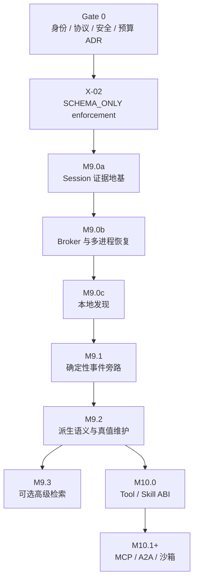

# Sense 输入法 Agent 工程开发文档

## 从 Evidence Event Mesh 到可交付的 M9 / M10

**文档版本：** 1.0<br>
**状态：** Gate 0 决策基线 Accepted；M9.1+ / M10 phase schema 仍为 Proposed；Memory
runtime 未实现<br>
**编制日期：** 2026-07-26<br>
**运行时代码基线：** Sense `v0.4.2` / `f3b9e5bf23cfbd714dcd356004f9bc75133770a1`<br>
**交付工作流基线：** `a20cb9ff834d86a06518e886f23f6fdbdf6ad3bb`<br>
**上位架构：** [`agent-event-memory-architecture-v1.0.md`](../design/agent-event-memory-architecture-v1.0.md)<br>
**文档性质：** 工程实施规范；本次提交只落文档，不启用记忆、不改运行时代码、不提升版本号

---

## 0. 交付判断

Sense 的 Agent 工程不应从“加一个向量数据库”或“把全部聊天塞回 Prompt”开始。第一条可交付路径是：

```text
先冻结证明边界
  → 精确记录单 writer local evidence
  → 证明 DurableAck 与崩溃恢复
  → 聚合跨进程统一 Session 并提供 exact recall
  → 再建立跨 Session 事件旁路
  → 最后才允许模型派生语义、外部 Tool 和可导入 Skill
```

本工程以依赖关系和验收门禁推进，不给出日历排期。任何后续阶段都不能以“开发时间到了”为由越过前置证明。

第一阶段的成功不是 Agent 显得更聪明，而是同时满足：

1. 普通输入路径的行为、延迟和内存没有回退；
2. M9.0a 的单 writer local evidence、M9.0b 的统一 Session 分别满足其声明范围内的字节精确读取；
3. 进程被杀、尾部半写、索引损坏和 Binder 断开时不伪造完整性；
4. 模型推断不会成为 Observation、Grant 或外部效果回执；
5. 新增 capture/recall/index/Provider/Tool/Skill 等 data-plane能力均可收缩关闭，Sense 仍是
   一款完整输入法；一旦已有持久 root，erasure fence、reconciliation、cleanup、重试与
   whole-reset safety path仍必须可达，不能被普通 feature flag、consent、budget或
   freshness关掉。

---

## 1. 实施边界

### 1.1 本文负责

- 把上位架构映射到现有 Gradle 模块、Kotlin package 和 Android component；
- 冻结 M9 的 wire、Journal、Blob、Broker、Recall 和完整性协议；
- 定义现有 Agent 状态机接入 Memory 的方式；
- 定义 M10 Tool / Capability / Grant / Skill 的实施落点；
- 给出可以直接转成 GitHub issue 的工作包、依赖、文件范围和 Definition of Done；
- 给出测试、CI、真 Key、迁移、回滚、故障注入和性能门禁；
- 明确哪些决定必须先进入 ADR，哪些算法仍保留可替换性。

### 1.2 本文不授权

- 不在本次文档提交中创建空壳 Gradle 模块；
- 不在没有 Security ADR 和 Budget ADR 时持久化用户原文；
- 不把 v0.4.2 以前未持久化的 Session 伪装成可恢复历史；
- 不默认记录普通跨应用输入原文；
- 不默认开启 embedding、向量检索、知识图谱或云端历史提取；
- 不下载并运行任意 Skill 代码；
- 不让 `:brain` 或 `:ime` 打开 Room；
- 不让 Memory 绕过现有 Patch、generation、hash/CAS 和写后验证；
- 不因文档完成而升级 `versionCode`、`versionName` 或创建 Release。

### 1.3 冲突优先级

实施时按以下优先级解释：

1. 已接受的 ADR（包括 0015–0018 与未来 phase ADR）；
2. 上位架构文档中的不变量；
3. 本工程文档；
4. 尚未接受的具体模块提案；
5. issue、PR 描述和代码注释。

任何已接受 ADR 都不能被本计划中的镜像/pseudocode 放宽；镜像不一致时以 ADR 为准并立即
修正文档。确需改变时，必须先更新对应 authority 并单独评审。

---

## 2. v0.4.2 代码基线

### 2.1 已有模块

| 模块 | 当前职责 | M9 / M10 的处理 |
|---|---|---|
| `app` | 设置首页、配置入口、最终 APK 组装 | 承载主进程 `MemoryBroker`、设置和维护入口 |
| `ime-service` | `InputMethodService`、编辑器租约、AI 协调 | 只增加固定开销 Journal producer；不读数据库 |
| `ime-ui` | Canvas 键盘、Agent Surface | 只显示真实 Memory/Tool step，不理解记忆内容 |
| `core-input` | 中文输入与 Ranker | 默认不依赖 Agent Memory；只读未来 HotSnapshot |
| `ai-protocol` | 编辑快照、Patch、Agent 状态机 | 以 protocol minor 增加正交 Activity upsert；不复用会回退宏状态的 progress kind |
| `brain-api` | Provider / Run 合约 | M92-06 前没有 MemoryFrame overload；之后只接受不可伪造的 `AuthorizedProviderMemoryFrameV1` |
| `ai-brain` | Provider、多轮工具、结构化终态 | 不查询 Broker；M92-06 后只消费 host 已授权的数据帧 |
| `ai-runtime` | `:brain` Service、Messenger、网络、Key | 保持 Run/Provider 边界；不增加通用 MemoryBroker client |
| `benchmark` | Macrobenchmark 与回放门禁 | 增加 Journal、Recall、冷绑定和长期档案基准 |

### 2.2 必须保留的既有权威边界

| 现有对象 | 继续拥有的唯一权威 |
|---|---|
| `SenseAiEditorCoordinator` | `InputConnection`、编辑器 generation、Pointer/Lease、最终应用 |
| `EditorPatchGuard` / `EditorPatchPlanner` | Patch 范围、hash/CAS 与应用计划 |
| `EditorPostApplyVerifier` | “文字确实写入”的本地效果验证 |
| `AgentSessionStateMachine` | 用户可见 Agent 宏状态与 step reducer |
| `SenseAiBrainService` | 单 active Run、Provider 生命周期和跨进程迟到隔离 |
| `AiBrainEngine` | Provider 多轮、公开 progress、唯一终止 Patch |
| `ProviderSettingsStore` | Provider profile 与端点作用域凭证 |

Memory 只能向这些对象提供数据或证据，不能接管它们的权威。

现有 `PersistentUserLexicon` 仍是 `:ime` 内的输入排序资产，不是 Agent Memory。M9 不迁移、
合并或反向解释其中的词频；用户词命中不能被包装成“用户曾明确表达”的事件。

### 2.3 热路径不变量

- `:ime` 主线程零同步文件、Room、FTS、JSON、网络和模型调用；
- 普通按键、候选、绘制和上屏不绑定 MemoryBroker；
- MemoryBroker 未启动、被杀或数据库损坏时，普通输入行为不变；
- 每个新增 Binder 回调都必须快速复制小对象并切到专用 executor；
- 任何 memory progress 都不能改变键盘总高度；
- 运行时不弹出权限或澄清对话；可选策略在设置中预先确定。

---

## 3. 交付依赖图



强依赖：

- `M9.0a` 不得在 Gate 0 未通过时持久化原文；
- `X-02` 必须先提供非空 `memory-protocol`/`event-journal` scaffolding 与 fail-closed
  FeatureStage snapshot；它本身不创建 Memory 数据；
- normal product 在 `ReleaseOwnerContinuityGateV1` 未通过前禁止创建或写入任何 persistent
  Memory 数据。唯一 future exception是 accepted pre-cert candidate decision +
  root-epoch三 permit + pristine zero-root containment的不可转正 measurement-only branch；
  该 phase当前 BLOCKED，所以现时仍然零写；
- M9A local-erasure phase schema/store、cumulative tombstone 与 admission/egress gate 未
  通过前，任何 capture 与 `DARK` 数据路径都保持 blocked；
- `M9.0c` 不得在 exact Session 慢路未完成时发布；
- `M9.2` 不得在 RelationAssertion、Coverage 和 Receipt 未冻结时接入模型；
- `M9.3` 只能是候选后端，不能改变 authority；
- `M10.0` 必须等待 M9.2 的事件命名空间、来源、冲突、Coverage 与审计边界稳定；外部写工具还必须依赖 Effect Ledger；
- `M10.1` 的远程 Agent 不得先于 Tool/Grant/取消语义稳定。

---

## 4. Gate 0：实施前 ADR

四份 ADR 已作为 Gate 0 决策基线接受，但这不代表 operational gate、wire/store runtime 或
设备预算已经实现。

### 4.1 ADR 0015：Release identity 与长期数据连续性

必须冻结：

- 可覆盖安装的固定 release signing identity 与密钥托管/轮换职责；
- debug、nightly、canary、production 的 applicationId/signing 隔离；
- GitHub Actions 只接收短生命周期签名输入，日志与 artifact 不泄露私钥；
- 签名轮换、Android lineage、灾难恢复与验证演练；
- 卸载、降级、签名不一致时 Keystore、Journal、词库和 Provider 配置的数据后果；
- stable `DataOwnerIdentityV1` 与可演进 `ReleaseIdentityV1` 分离；
- APK 只 pin stable DataOwner/root/discovery；绑定 full signed APK digest 的
  ReleaseIdentity/OwnerManifest/Certification 必须在签名后由 external owner ledger 发布，
  不得写回 APK 形成自引用；
- `ReleaseOwnerManifestV1` 的统一 monotonic artifact-advance、old-valid single slot/full-old
  A/B pair replay 限制与 freshness 职责分离；
- `ReleaseIdentityGateV1`、`ReleaseOwnerContinuityGateV1`、
  `ReleaseSigningAuthorityGateV1` 与 `PlatformCertificationGateV1` 独立输出；signing
  authority 只控制 release entry，不成为设备在线依赖；
- release policy 在 ADR 0015 中只有 opaque revision/length/digest continuity；
  `ReleasePolicySemanticsPhaseGateV1=BLOCKED`，policy-dependent publication/capability
  在 closed schema/evaluator/caps 接受前不得解释其 bytes；
- `RootBootstrapControlPhaseGateV1` 与非 FeatureStage 的
  `AuthorityBootstrapPermitV1` 负责无循环建立 owner-signed local A/B。

当前上述 operational/phase gate 均 `BLOCKED`。identity 单项不授予任何 FeatureStage；
synthetic/lab product `DARK` 也必须消费 ADR 0018 的 authoritative capability DAG。owner
continuity 未通过时禁止任何 data-plane persistent Memory。未来 narrow authority
bootstrap 也只能创建 root shell/owner control，不能创建 Keyring 或正文。

### 4.2 ADR 0016：Memory wire、durability 与兼容性

必须冻结：

- `sense.memory.v1` major/minor 兼容规则；
- M9.0 的 Common、Journal frame payload、BlobRef、Session record、Writer/Frontier/Ack 字段号；
- Proto unknown-field 保留策略；
- Journal frame、段头、段尾和最大长度；
- writer epoch、sequence、durable frontier 与 DurableAck 顺序；
- schema upcast 只产生读取视图、不重写历史 bytes；
- downgrade 行为和不识别 major version 的 fail-closed 行为。

此 ADR 不提前冻结 M9.1 的 Event/Relation/Recall/Receipt，也不冻结 M9.2 的 Claim/Coverage。
各阶段在首个实现 PR 前新增 phase schema gate、descriptor digest 与 reserved registry；不能把
尚未经过 EventBench 的语义字段伪装成 Gate 0 既成事实。

### 4.3 ADR 0017：Memory security、capture 与 erasure

必须冻结：

- threat model：同 UID 多进程、设备离线读取、备份、日志和临时文件；
- Android Keystore key hierarchy、key epoch 与轮换；
- 逐 frame/chunk AEAD、nonce 唯一性和 AAD；
- Room/WAL/FTS 允许保存的字段；
- keyed bigram token 的 key、编码和残余频率泄漏；
- CapturePolicy、敏感字段、`NO_PERSONALIZED_LEARNING` 和应用拒绝列表；
- 查看、导出、忘记、物理压实和 key destruction；
- reliable pipe/PFD 边界、进程死亡和启动清理；
- local erasure 拆成 zero-root `LocalErasureControlPhaseGateV1` 与 synthetic runtime
  evidence `LocalErasureCapabilityGateV1`；source/rotation、purpose-5 attempted-use
  frontier/receipt 仍必须由后续 phase work 冻结，当前均 `BLOCKED`。

### 4.4 ADR 0018：Memory budget 与设备门禁

ADR 0018 采用同一文件、三个独立状态，避免在实现前伪造设备数字或 canonical wire：

1. **0018-A Semantic Measurement Contract**：Gate 0 冻结 metric/profile JSON、workload、
   required tuple、统计、verdict/reason 与 capability DAG 语义；本阶段 Accepted；
2. **0018-E Evidence Wire**：`DeviceSuiteManifest`、raw rows、outcome ledgers、
   evidence bundle、digest/signature/cap 的 exact schema 尚未冻结，当前
   `BudgetEvidenceWirePhaseGateV1=BLOCKED`；
3. **0018-B BudgetProfile values**：只能在非 FeatureStage 的
   `SyntheticMeasurementPermitV1` 下先做 calibration，再提出完整 profile 并预绑定唯一
   confirmatory run，完成第二套实体设备 S0–S8 后冻结。本阶段 Pending，99 个字段中 90 个
   required 产品值仍为 `UNSET`；Memory 不得据此取得产品 `PASS`。

0018-B 必须由设备数据冻结：

- 总 on-device soft cap 与最低剩余磁盘；
- Journal queue 容量、保留通道和 flush 条件；
- 单段/单 Blob/单 PFD page 上限；
- turn checkpoint DurableAck p95；
- warm recall 与 cold bind→首结果 p95；
- Journal CPU、功耗、写放大和峰值内存；
- HotSnapshot 单代上限；
- Pixel、HyperOS、中端、低内存设备矩阵；
- 低存储时停止 capture、降级和恢复规则。

协议只冻结防越界的安全上限，例如 48 KiB Binder inline envelope、1 MiB PFD logical page
和读取前 length/digest 校验；queue、flush、HotSnapshot 与磁盘数字属于 profile，不进入
不可变 wire ABI。

预算 verdict 不得把“缺数字”包装为成功：

```text
EvidenceValidityV1 = VALID | INVALID | UNSUPPORTED | MISSING
MetricGateVerdictV1 = PASS | FAIL | INCONCLUSIVE | MEASURED_NO_BUDGET
OverallVerdictV1 = PASS | FAIL | INVALID | INCONCLUSIVE | MEASURED_NO_BUDGET
```

逐指标先验证 evidence；非 `VALID` 证据只能得到 `INCONCLUSIVE`，`VALID + required UNSET`
才是 `MEASURED_NO_BUDGET`，有效违反已冻结预算才是 `FAIL`。overall 的确定优先级是
`FAIL > INVALID > INCONCLUSIVE > MEASURED_NO_BUDGET > PASS`，reason code 使用封闭 registry、
去重并 canonical sort。`segment_max_bytes` 是 storage policy，不是协议总段长上限。

任何 storage profile 必须用 checked-u64 同时证明：

```text
steady_reachable ≤ steady_reachable_soft_cap
peak = steady_reachable_soft_cap
       + active_duplicate_peak
       + durable_orphan_or_quarantine_peak
peak ≤ supported_volume_capacity_floor
       - minimum_free
       - recovery_reserve
```

`active_duplicate_peak` 覆盖 shared normal publish（writer/Blob/recovered-seal/
HotSnapshot/control/export staging）与 exclusive rewrite的 checked max，不只是 maintenance。
schema 1.0 的 `supported_volume_capacity_rules` 当前同样是 required `UNSET`，且只允许
`sense-memory/v1` 下所有对象位于一个经认证的 volume；不得以 host runner 数字替代实体
设备证据。

DurableAck 测量使用守恒 ledger，而不是只统计收到 callback 的快样本：

```text
admitted_durable_required
  = durable_ack
  + failed_proven_excluded
  + indeterminate
  + callback_lost
  + pending_observation_deadline
```

ambiguous reconciliation 最终只能收敛为 durable、failed-proven-excluded 或仍
indeterminate；丢样本、超时样本和被杀进程不得从分母消失。

### 4.5 Gate 0 Definition of Done

Gate 0 的 DoD 只接受决策文档，不伪造未来实现证据：

- G0-01..04 与 G0-JOINT 逐项通过独立 cross-audit；
- wire/security/cap/status/phase 术语一致，未把 M9.1 Event 解释成 M9.0 record；
- future descriptor/golden/fuzz/kill/device tests 已成为 M9A exit criteria，但不得写成已运行；
- 0015 identity/owner/signing-authority/policy-semantics/platform-certification/root-bootstrap
  gate 保持 `BLOCKED`；0018-E evidence wire 与 synthetic-measurement control 保持
  `BLOCKED`，0018-B 保持 Pending/`UNSET`；
- local-erasure control/capability 与 owner-continuity gate 未通过时 effective stage 为
  `SCHEMA_ONLY`/blocked；任何 capture flag 均关闭；
- 本次不升级 versionCode/versionName，不创建 Release。

---

## 5. 新增模块与依赖

### 5.1 模块清单

| 模块 | 插件形态 | Android 依赖 | 职责 |
|---|---|---:|---|
| `memory-protocol` | Kotlin/JVM | 否 | ID、DTO、Proto wire、validator、Receipt、FeatureStage policy/快照、纯 reducer |
| `event-journal` | Android Library | 是 | Journal/Blob、Keystore、A/B frontier、writer/recovery、stage snapshot 原子存取 |
| `memory-ipc` | Android Library | 是 | Broker Messenger/Binder codec、PFD page、death/cancel plumbing |
| `memory-runtime` | Android Library | 是 | 主进程 Broker、Room/FTS、Recall、WorkManager、设置用 service API |

`event-journal` 选择 Android Library 是有意的：`:ime`、`:brain` 和 main 都需要同一份
Keystore、A/B frontier 和进程文件所有权实现。其 `journal.core` package 必须保持纯
Kotlin/JDK，以便 JVM property/fuzz 测试；Android API 只能出现在 `journal.android` package。

### 5.2 目标依赖

```text
memory-protocol

event-journal   → memory-protocol
memory-ipc      → memory-protocol

brain-api      → ai-protocol
ai-brain       → brain-api + ai-protocol
ai-runtime     → ai-brain + brain-api + ai-protocol + memory-protocol
                 + event-journal
ime-service    → existing dependencies + memory-protocol + event-journal + memory-ipc
memory-runtime → memory-protocol + event-journal + memory-ipc
app            → existing dependencies + memory-runtime
```

`brain-api` 只有到 `M92-06` 才允许新增 `memory-protocol` 依赖，并且只暴露
`AuthorizedProviderMemoryFrameV1` typed boundary；这不允许 Brain 查询 Broker、接收裸
`MemoryFrame` 或把 generic receipt 当模型输入。`ai-runtime` 的 `event-journal` 依赖只用于
`:brain` 自有 writer append/recovery，不包含 Broker/Recall。

约束：

- `memory-protocol` 不依赖 Android、Room、Provider 或 UI；
- `event-journal` 不依赖 Room、WorkManager、Provider 或 `app`；
- `memory-ipc` 不包含搜索、索引、策略和 Broker 业务逻辑；
- `memory-runtime` 不被 `:ime` 或 `:brain` 的实现模块反向依赖；
- `:brain` 的 compile/runtime graph 均不得出现 `memory-runtime`、`memory-ipc`、Room、
  WorkManager或 `MemoryBrokerClient`；其 merged manifest不得声明/查询/bind Broker
  component。Broker read client只在 host/IME coordinator；
- `app` 只负责组装和设置入口，不能成为共享 API 模块，也不得直接依赖
  `memory-protocol`/`event-journal`；设置所需只读/控制 API由 `memory-runtime`封装；
- M10 不提前创建空的 Tool/Skill 模块；先在 `brain-api` 冻结 ABI，出现独立发布/依赖证据后再拆 `agent-api`。

### 5.3 `settings.gradle.kts`

实施 PR 增加：

```kotlin
include(
    ":memory-protocol",
    ":event-journal",
    ":memory-ipc",
    ":memory-runtime",
)
```

同时在 Version Catalog 固定：

- Protobuf Gradle plugin；
- `protobuf-javalite`；
- Room runtime/compiler/FTS；
- WorkManager；
- 需要时的 AndroidX Security/Startup 依赖。

不得使用 `+`、`latest` 或未记录来源的本地 AAR。精确版本由实现时 DependencyEvidence 记录。

---

## 6. 推荐源码结构

```text
memory-protocol/
├── src/main/proto/sense/memory/v1/
│   ├── common.proto
│   ├── journal.proto
│   ├── session.proto
│   ├── recall.proto          # M9.1
│   ├── event.proto           # M9.1
│   ├── claim.proto           # M9.2
│   ├── coverage.proto        # M9.2
│   ├── provider_disclosure.proto # M91-00D
│   ├── provider_attempt.proto    # M92-06
│   ├── maintenance_dispatch.proto # M9C-04P；未接受前不生成
│   └── tool_effect.proto     # M10
├── src/main/kotlin/io/github/ethanbird/senseime/memory/protocol/
│   ├── MemoryProtocolVersion.kt
│   ├── MemoryIds.kt
│   ├── EventEnvelope.kt
│   ├── EventOriginCoordinate.kt
│   ├── PersistedRecordProvenanceLocator.kt
│   ├── RelationAssertion.kt
│   ├── ClaimAssertion.kt
│   ├── RecallContract.kt
│   ├── AssemblyCompletenessReceipt.kt      # M9.1；只证明本地 assembly
│   ├── ModelInputMaterializationIntent.kt  # M92-06；:brain Provider-attempt Journal
│   ├── ModelInputMaterializationReceipt.kt # M92-06；:brain Provider-attempt Journal
│   ├── ProjectionStoreBootstrapIntent.kt   # M9.0c；Room side effect 前
│   ├── ProjectionStoreBootstrapReceipt.kt  # M9.0c；open/reconcile 后
│   ├── WorkFrontierState.kt                # M9C-04P
│   ├── CompletedTargetCoverageReceipt.kt   # M9C-04P
│   ├── MemoryFrame.kt
│   ├── SessionRecall.kt
│   ├── FeatureStagePolicy.kt
│   ├── FeatureStageSnapshot.kt
│   ├── FeatureStageValidator.kt
│   └── MemoryProtocolValidator.kt
└── src/test/...

event-journal/
├── src/main/kotlin/io/github/ethanbird/senseime/memory/journal/core/
│   ├── JournalFrameCodec.kt
│   ├── JournalWriterState.kt
│   ├── JournalRecoveryScanner.kt
│   ├── DurableFrontier.kt
│   ├── BlobStore.kt
│   ├── KeyEpochCoordinator.kt
│   └── AppendQueuePort.kt
├── src/main/kotlin/io/github/ethanbird/senseime/memory/journal/android/
│   ├── AndroidJournalWriter.kt
│   ├── AndroidDualSlotFrontierStore.kt
│   ├── AndroidSegmentKeyStore.kt
│   ├── AndroidKeyEpochCoordinator.kt
│   ├── AndroidWriterOwnership.kt
│   ├── AndroidTempOwnership.kt
│   ├── AndroidFeatureStageSnapshotStore.kt
│   ├── AndroidFeatureStageWatcher.kt
│   └── AndroidMemoryPaths.kt
└── src/test/...

memory-ipc/
├── src/main/kotlin/io/github/ethanbird/senseime/memory/ipc/
│   ├── MemoryMessageProtocol.kt
│   ├── MemoryMessageCodec.kt
│   ├── MemoryBrokerComponentContract.kt
│   ├── MemoryBrokerClient.kt
│   ├── PfdPageDescriptor.kt
│   ├── PfdPageReader.kt
│   ├── PfdPumpExecutor.kt
│   └── BrokerDeathGate.kt
└── src/test/...

memory-runtime/
├── src/main/AndroidManifest.xml
├── src/main/kotlin/io/github/ethanbird/senseime/memory/runtime/
│   ├── SenseMemoryBrokerService.kt
│   ├── MemoryRuntimeGraph.kt
│   ├── MemoryBrokerEngine.kt
│   ├── SessionCatalogImporter.kt
│   ├── ProjectionWriteCoordinator.kt
│   ├── ProjectionStorageCapacityPort.kt
│   ├── WorkManagerExternalOverheadPort.kt # M9C-04P acceptance 后
│   ├── WorkDispatchControlStore.kt         # exact two-lane non-Room A/B
│   ├── WorkDispatchReconciler.kt
│   ├── RecallPlanner.kt
│   ├── RelationClosureEngine.kt
│   ├── ClaimNormalizer.kt                  # M92-03
│   ├── ClaimKeyedProjection.kt             # M92-03；purpose-3
│   ├── MemoryFramePacker.kt
│   ├── AllocationRebuildWorker.kt
│   ├── DeleteOnlyCleanupWorker.kt
│   ├── HotSnapshotCompiler.kt
│   ├── HotSnapshotStore.kt
│   ├── HotSnapshotValidator.kt
│   ├── HotSnapshotPublisher.kt
│   ├── EncryptedSkillBindingPageAssembler.kt
│   ├── FeatureStagePublisher.kt
│   └── RolloutLedger.kt
├── src/main/kotlin/io/github/ethanbird/senseime/memory/runtime/db/
│   ├── SenseMemoryDatabase.kt
│   ├── MemoryEntities.kt
│   ├── MemoryDao.kt
│   ├── KeyedBigramTokenizer.kt
│   └── ProjectionRebuilder.kt
└── src/test/...

ai-brain/
└── src/main/kotlin/.../
    └── ProviderFinalRequestFactory.kt       # M92-06；exact application body + envelope

ai-runtime/
└── src/main/kotlin/.../
    ├── ProviderAttemptJournalReducer.kt     # M92-06；intent/terminal唯一 successor
    └── BodySinkVerifyingAdapter.kt          # M92-06；只证明 application body sink

ime-service/
└── src/main/kotlin/.../
    └── EphemeralSkillBindingCache.kt        # user binding授权页的有界内存副本
```

生成的 Proto 类只用于 wire/storage adapter。Reducer、Policy 和 UI 不应散布 generated builder；它们消费经 validator 转换的不可变 Kotlin domain value。

---

## 7. Memory protocol v1

`sense.memory.v1` 是长期 namespace，不表示所有对象在 Gate 0 一次冻结：

| Phase gate | 首次冻结的 proto | 实现前证明 |
|---|---|---|
| Gate 0 / M9.0 | `common`、`journal`、`session` | record writer/replay/N-1 fixture |
| M9C-04P | `maintenance_dispatch`（two-lane A/B control/coverage；future） | root/lock/key/cap ADR acceptance + golden/kill |
| M9.1 | `event`、`recall`（含 Relation、QueryContract、`AssemblyCompletenessReceipt`） | EventBench + closure property |
| M91-00D | `provider_disclosure`（仅 authority/grant；无 body/attempt receipt） | destination/tenant/model/retention/revoke fixtures |
| M9.2 | `claim`、`coverage` | evidence/conflict/coverage property |
| M92-06 | `provider_attempt`（ModelInput intent/receipt） | encrypted Journal、body-sink kill matrix、N-1 fixture |
| M10 | `tool_effect` | Grant/effect/replay property |

每个 descriptor 独立做 digest 与 reserved-field registry；后阶段增加文件不改写早期字段号。

### 7.1 ID 规则

| ID | 生成 | 是否含时间 | 说明 |
|---|---|---:|---|
| `record_id` | CSPRNG 128-bit | 否 | M9.0 Journal record 身份；不得冒充事件身份 |
| `session_id` | CSPRNG 128-bit | 否 | Sense 本地 Session，不采用 Provider ID |
| `run_id` | 复用/映射现有 `requestId` | 否 | 贯通 IME、Brain、Broker |
| `writer_epoch` | 每次 writer 打开新 epoch 生成 | 否 | 与 sequence 组成来源内顺序 |
| `blob_id` | CSPRNG 128-bit | 否 | 稳定随机逻辑身份；不从原文或 digest 派生 |
| `event_id` | CSPRNG 128-bit | 否 | **M9.1 phase gate 后**的事件身份；同内容发生两次仍是两个事件 |
| `relation_id` | CSPRNG 128-bit | 否 | **M9.1 phase gate 后**的唯一 canonical edge |
| `claim_id` | CSPRNG 128-bit | 否 | **M9.2 phase gate 后**的 canonical 身份；禁止从 normalized proposition、摘要或明文派生 |

M9.0 的 `record_id` 与 M9.1 的 `event_id` 永不复用、转换或按同一字段解释。所有 wire ID
使用对应 ADR 固定的 canonical 编码；解析时拒绝空值、超长和非规范形式。Proto
`fixed32/fixed64` 遵循 Protobuf 标准 little-endian；ADR 0016 明确列出的 hand-rolled
physical/canonical integer 才使用 big-endian。

Claim 的匹配、lineage 与 conflict 不复用公开 `claim_id`，也不保存
`hash(normalized proposition)` 这类可离线枚举的字典 oracle。`M92-03` 必须由 host 在
purpose-3 generation-scoped key 下计算 domain-separated keyed projection，并在命中后对
canonical normalized bytes 做 byte-equal 复验；这些 projection key/value 与公开 ID 都按
`SENSITIVE_DERIVED_COMMITMENT` 处理，purpose-3 rotation 后重建，erase 后不可继续命中。
这里的 `SENSITIVE_DERIVED_COMMITMENT` 只是 future M92设计标签，不是 Gate 0/ADR 0017已
接受的 classification token。`M92-03`必须先冻结 closed classification/security
descriptor与 Claim映射，`M92-06`再冻结 Provider-attempt映射、retention/erase/export规则
及 unknown/downgrade fixtures；对应 gate接受前早期 writer不得持久化、reader不得接受这类
record。

“match token未命中”不等于“这是新 Claim”。mint前必须取得覆盖 exact source cut且
`COMPLETE/non-STALE/non-GAPPED/current-key-generation/rebuild-complete` 的 projection
receipt；DB删除、rotation切换、rebuild中或任何 gap都返回
`CLAIM_MATCH_INDETERMINATE`，不得 mint。host canonicalization single-writer串行化
decision；Room transaction只按 `(key_generation_id,match_token)` 重查全部 candidates并
逐个解密 canonical normalized bytes做 byte-equal，不与 Journal伪造跨 store原子事务：

- 恰好一个 equal：复用其 CSPRNG `claim_id`，只 append新 evidence；
- zero equal且 complete资格仍成立：才 mint新 CSPRNG `claim_id`；
- 多个 equal、candidate无法解密/验证、cut或generation在事务中变化：fail closed并记录 gap，
不让模型挑 ID。

不同 normalized bytes发生 token collision时保留多候选并逐字节消歧；同 bytes映射多个 ID
是 canonical fork。决定 append前再次确认 receipt cut byte-equal current selected Journal
head且 key generation未变；canonical Claim/evidence Journal `DurableAck` 是唯一线性化点。
其后 projection apply是独立、幂等派生；Ack后到 projection watermark追平前立即标
`STALE`，kill后从 Journal replay，后续 miss必须先追平，避免 crash窗口重复 mint。并发
proposal由同一 single-writer/CAS串行化。

### 7.2 M9.0 record 与 M9.1 `EventEnvelopeV1`

Gate 0 只冻结 M9.0 Journal/Session record wire。下列 `EventEnvelopeV1` 是 M9.1 phase schema
的设计目标，在 `M91-00` descriptor、registry、EventBench 与兼容性评审通过前不得生成、
持久化或被 M9.0 reader 接受：

```text
EventEnvelopeV1
  protocol_major
  protocol_minor
  event_id
  schema_uri
  schema_version

  durable_source_locator?     # 已经 durable 的来源证据；不是本 Event 自身坐标

  correlation_id?
  branch_id?
  event_kind
  epistemic_class
  actor
  subject_refs[]
  scope

  original_narrative?
  source
  payload | payload_ref

  occurred_at?
  recorded_at
  time_precision?
  time_source?

  producer
  build_version
  model_or_tool_version?
  skill_hash?
  payload_hash
```

禁止在 Event 内再嵌入 `relations[]`、支持边或 revision 边。
Event payload 在 queue admission 前完成一次 canonical serialize，因而不得自存尚未分配的
writer epoch/sequence。持久坐标只能从已认证的外层
`JournalFramePayloadV1.writer/writer_sequence` 与已认证 enclosing SessionRecord的
`record_id` 派生为
`EventOriginCoordinateV1(writer,writer_sequence,record_id)`；outer record validator必须将
exact record ID/commitment绑定到同一 frame，projection、Receipt 与导出均引用该
out-of-band 坐标。producer 提交自带 origin/sequence、dequeue 后回写 payload 或 epoch
retire/retry 时重序列化都必须拒绝。

### 7.3 M9.1 `RelationAssertionV1`

```text
RelationAssertionV1
  relation_id
  relation_type
  from_ref
  to_ref
  producer
  epistemic_class
  provenance
  scope
  temporal_constraint?
  registry_version
  typed_payload?
```

关系内容与验证结论不能在同一 mutable record 中迭代。验证另行 append：

```text
RelationValidationDecisionV1
  decision_id
  relation_id
  verifier_id
  verifier_version
  registry_version
  decision
  evidence_refs[]
  predecessor_decision_digest?
  decision_provenance
  host_append_ordinal
  recorded_at?                 # audit only
```

projection只在 fixed ledger cut内沿 `predecessor_decision_digest` 的唯一 committed
successor链归约；genesis predecessor absent恰好一次，同 predecessor出现两个 successor、
链断裂、ordinal倒退或 unknown verifier/decision均是 fork/fail closed，并在 receipt暴露
gap。`host_append_ordinal` 只验证同 writer committed链连续性；`recorded_at` 即使存在也
仅供审计，绝不参与排序、latest判断或 authority。原 `RelationAssertionV1` 永不覆写。

M9.1 接受后，`EventBatchV1` 可以在同一 Journal frame 中原子包含：

```text
one event envelope
zero or more relation assertions
zero or more blob references
```

关系仍只在 Relation Ledger 中出现一次。`source_event_ids` 是 provenance locator，不是第二套语义边。

### 7.4 M9.1 phase 必须冻结的 enums

```text
EpistemicClass:
  OBSERVED | ASSERTED | INFERRED | HYPOTHETICAL

RelationValidation:
  HOST_CONFIRMED
  STRUCTURALLY_VALID_UNVERIFIED
  EFFECT_VALIDATED
  REJECTED

DiscoveryMode:
  EXACT_ENUMERATION
  EXHAUSTIVE_EVALUATION
  HEURISTIC

CompletenessVerdict:
  COMPLETE_FOR_DECLARED_CONTRACT
  PARTIAL
  FAILED
```

新增 enum 值必须满足旧 reader 的 unknown handling；删除值必须 reserve，不能复用数字。

### 7.5 版本规则

- wire protocol major/minor、payload schema major/minor、`protoc` 版本和 runtime 版本分别记录，
  不能用一个 `frame_version` 掩盖四类兼容边界；
- 未知 protocol/payload major 或未知 required feature：reader fail-closed，原始 bytes 仍可导出；
- minor 增加可忽略字段：旧 reader 必须在二进制 parse/serialize 路径保留 unknown fields；
- 对需要跨版本透明保留的扩展，使用带显式 type/schema id 的 opaque payload bytes；不得用开放
  `oneof` 或 JSON 中转冒充 unknown-field preservation；
- field number 永不复用；
- upcaster 必须是确定性纯函数；
- 历史原 frame 不因 upcast 被重写；
- payload/content hash 对原始存储 bytes 计算；不得对 parse 后重新序列化的 Proto 计算，
  因为合法 Proto 编码不保证 canonical；
- reducer version、registry version、normalizer version进入 Receipt；
- 每次实现 PR 校验 `.proto` descriptor digest。

---

## 8. CapturePolicy 与 record 生成

### 8.1 决策顺序

Capture 采用不可绕过的双阶段判定：

```text
shared stage/owner/erasure/key-use gate snapshot PASS
  → metadata-only signal
  → CapturePolicy.preflight(metadata)
  → DENY：立即结束
  → ALLOW_TO_MATERIALIZE(read_cap, sealed INLINE | BLOB plan)
      → 取得 GlobalPlaintextReadReservationV1
      → 复验 gate/fence
      → INLINE:
          原子取得 fixed-slot + conservative full-inline queue byte reservation
      → BLOB:
          原子取得 fixed-slot + fixed-BlobRef queue reservation
          + BlobPlaintextReservationV1(F047/F048)
          + per-volume BlobFailureContingencyReservationV1
      → 复验 gate/fence
      → 对来源至多执行一次有界读取
      → CapturePolicy.finalize(metadata, bounded_body, same_sealed_plan)
      → DENY：zeroize并释放全部 reservations
      → ALLOW：复验 gate/fence并原子转交 read plaintext ownership到已持 reservations
      → INLINE:
          分配 record_id → bounded inline builder
      → BLOB:
          → 分配 record/blob/physical IDs
          → 在任何 DEK/Cipher/persistent I/O 前 durable bind exact BlobMaterializationIntentV1
          → bounded single-pass Blob materialization
      → 构造并保留 exact ProducerAppendAttempt
      → commit 到同一 queue reservation（不得第二次 backpressure）
      → AppendAdmission
      → writer dequeue 后分配 writer_sequence
      → 每次 Cipher/write/locator/frame/frontier byte handoff 前复验
```

preflight 发生在读取正文、创建 ID/token、占用 persistence queue、分配 sequence、创建
Blob、初始化 `Cipher` 或生成任何内容派生之前。正文最多按 preflight 返回的上限读取一次；
finalize 不得重新访问来源，也不得切换 sealed INLINE/BLOB plan。不确定能否 inline时
preflight必须保守选择 BLOB。`GlobalPlaintextReadReservationV1` 绑定 installation/root、
process epoch、Run/source、conservative max bytes、slot、policy/fence、owner generation
与有限 monotonic lease，并同时约束全局 slot count和 known/unknown worst-case bytes；
取不到就不读正文。M9.0a 只有 stage/manifest机械证明**恰好一个 enabled writer process**
时，才可由该进程的 epoch-scoped in-memory singleton ledger签发；M9.0b+ 必须在读第一 byte前由
Broker/coordinator原子签发。Broker不可达、unknown length无保守上界、checked sum overflow
或 ownership census不闭合一律 DENY/BUSY，不能退回各进程 local counter。process/Binder
death使该 epoch全部 in-memory reservations失效，coordinator再按 epoch/fd/buffer census
terminal；read reservation本身不得写盘或留下可观察 token，只有已开始 Blob materialization
后转交的 class/contingency charge才 durable。旧 local token不能在阶段切换/rebind
时升级或转移。

final `DENY`、取消或异常会零化 buffer 并释放 charge。在调用 body reader前，inline
record必须已取得覆盖 conservative full inline bytes的 queue reservation；Blob
record必须已**同时**取得 queue 的固定 BlobRef charge与
`BlobPlaintextReservationV1`（受 F047/F048 installation-global ledger约束）以及
per-volume `BlobFailureContingencyReservationV1`。任一项不可得就不得读取正文。final
accept只把 plaintext ownership原子转入这些**已持有**的 reservations；buffer携带
sealed `PlaintextOwnershipTokenV1` 进入 builder/Blob pipeline，不能以裸 ByteArray跨边界。
这三类 authority不可互 cast：plaintext reservation只约束 live heap/plaintext，
pre-ID failure-contingency reservation同时预留 F019 live、F010/F012/F014成功和 F020/F051失败
headroom（以及 F029/F052 count），但不把同一 physical bytes计费三次；分配 exact
record/blob/physical IDs后，
必须在任何 DEK/Cipher/persistent I/O前把它们 durable bind成
`BlobMaterializationIntentV1(ids,worst_case_charge,locator,cleanup)`。bind失败永久 burn IDs、
零 I/O并释放 live reservations；不得出现 materialized plaintext 无 read/queue/Blob任一
resource charge 的窗口。

queue/plaintext/pre-ID capacity reservations 必须在 record/blob ID、DEK 或持久 I/O 前成功；
不足时返回
`REJECTED_BACKPRESSURE` 且零 orphan。若 Blob I/O 将开始，reservation 先原子绑定 ADR 0016
要求的 authenticated durable class-transition intent；first allocation恰计 F019，
durable Journal引用后按 inode转 F010/F012/F014，失败/不确定转 F020/F051。live slot后续释放不能取消
该 charge；F020直到 unlink、parent fsync、reopen census与 cleanup receipt完成才释放。
任一阶段 `DENY` 均不得留下
Event、record、Blob、稀疏统计、token、sequence 或临时明文。gate snapshot 只可缓存并收紧
授权；finalize 后到 durable frontier 的每个副作用点都必须重读 current
generation/fence，不能把 preflight 时的 PASS 当成长寿命 grant。

M9A-02 phase必须冻结该 reservation 的 exact slot/byte ceilings、canonical IPC/control、
death/expiry reducer和与 queue reservation的原子 ownership transfer；ceilings未进入
accepted profile/manifest前 capture BLOCKED。model/device test覆盖 IME/Brain/main并发、
Broker death/rebind、unknown length、lease terminal、ceiling equality/±1、sum overflow与旧
token重放，以及 read→inline/read→Blob两种转交在目标 ledger已满、取消/进程死时的 exact
守恒。

### 8.2 M9.0 默认捕获范围

只捕获用户显式唤醒的 Sense AI Session：

- run start / stop / fail / complete；
- 已通过 CapturePolicy 的编辑快照引用；
- Provider 公开 turn 边界；
- public progress 的稳定 step，而非每次 heartbeat；
- Tool request/progress/result/cancel/effect；
- final Patch proposal；
- Patch validation、apply 与 post-apply observation；
- 用户撤销、纠正和明确反馈；
- Provider usage 与脱敏错误类别；
- Skill/Tool/Provider 的版本与 descriptor digest。

不捕获：

- 私有 reasoning；
- API Key、Authorization header；
- 未经授权的宿主 package metadata；
- 每个 SSE 包、token 和本地心跳；
- 密码、OTP、支付、无痕和 `NO_PERSONALIZED_LEARNING` 内容；
- 普通输入原文。

### 8.3 代码接口

```kotlin
interface CapturePolicy {
    fun preflight(metadata: CaptureMetadata): CapturePreflight
    fun finalize(
        permit: CaptureReadPermit,
        metadata: CaptureMetadata,
        body: BoundedCaptureBody,
        materializationPlan: AppendMaterializationPlanV1,
    ): CaptureFinalDecision
}

sealed interface CapturePreflight {
    data class AllowToMaterialize(val permit: CaptureReadPermit) : CapturePreflight
    data class AggregateOnlyMetadata(
        val approvedFields: Set<AggregateField>,
        val policyHash: Digest32,
    ) : CapturePreflight
    data class Deny(val reason: CaptureDenyReason) : CapturePreflight
}

data class CaptureReadPermit internal constructor(
    val metadataDigest: Digest32,
    val materializationPlan: AppendMaterializationPlanV1,
    val maximumBytes: UInt,
    val policySnapshotDigest: Digest32,
    val erasureFenceGeneration: ULong,
    val oneShotPermitId: CapturePermitId,
)

sealed interface CaptureFinalDecision {
    data class Allow(
        val policyHash: Digest32,
        val consumedPermitId: CapturePermitId,
        val materializationPlanDigest: Digest32,
    ) : CaptureFinalDecision
    data class Deny(val reason: CaptureDenyReason) : CaptureFinalDecision
}
```

`preflight` 必须一次性冻结 canonical metadata digest、sealed INLINE/BLOB plan与正文上限；
`finalize` 重新计算 metadata digest，要求传入 plan与 permit中的 exact typed plan/digest相等，
并原子消费 one-shot permit。wrong metadata/plan、重复 consume、fence变化或 body超
`maximumBytes` 均 DENY且不能切换分支。`AggregateOnlyMetadata` 在读取正文前终止，只允许
registry 中明确批准且不可逆的 metadata字段，绝不能成为“先读再聚合”旁路。敏感策略命中
时，包括 n-gram、罕见词和 app-scoped 统计在内的内容派生全部禁止。
若 aggregate 会生成 M9 record，其 `policyHash` 必须逐字节进入
`capture_policy_digest`；完全不生成 record 的纯内存计数也不得借
`AggregateOnlyMetadata` 绕过 stage/erasure gate。

### 8.4 确定性 producer

M9.0 的 canonical operational record 由宿主代码产生：

```text
ImeAgentRecordProducer
BrainRunRecordProducer
ToolEffectRecordProducer
BrokerRecoveryRecordProducer
```

LLM 不参与这些 record 的存在性、kind、actor、call-id 配对和 effect 状态判断。M9.1
Event producer 必须保留来源 `record_id`/writer/frontier provenance，但 record/event 身份
永不混用；对尚未 append 的 Event，producer只写已 durable source locator，Event自身
`EventOriginCoordinateV1(writer,writer_sequence,record_id)` 必须由 authenticated outer
frame + enclosing SessionRecord派生，不能提前猜测/回填 writer sequence或自带 record ID。

---

## 9. Journal writer 工程

### 9.1 每进程一个 writer

```text
`:ime` process   → WriterKindV1.IME   → directory token `ime`
`:brain` process → WriterKindV1.BRAIN → directory token `brain`
main process     → WriterKindV1.MAIN  → directory token `main`
```

每个 writer 只写自己的 epoch 文件。不同进程不追加同一文件。wire只接受完整 canonical
`WriterRefV1(installation_id,writer_kind,writer_epoch)`；自由文本 `writer_id`、字符串
kind alias、unknown enum或 WriterRef/segment/path token不一致必须在任何 append前拒绝，
并有 descriptor/golden negative fixtures。

### 9.2 admission 与 durability 分离

实现层使用两个结果，避免把“已进队列”误写成“已落盘”：

```kotlin
sealed interface AppendAdmission {
    data class Accepted(
        val recordId: RecordId,
        val ackToken: AckToken?,
    ) : AppendAdmission

    data object RejectedBackpressure : AppendAdmission
    data object StorageUnavailable : AppendAdmission
}

sealed interface JournalAck {
    data class Durable(
        val ackToken: AckToken,
        val recordId: RecordId,
        val recordCommitment: Commitment256,
        val writerSequence: ULong,
        val frontier: DurableFrontierRefV1,
    ) : JournalAck

    data class Failed(
        val ackToken: AckToken,
        val recordId: RecordId,
        val recordCommitment: Commitment256,
        val reason: JournalAckFailure,
        val detail: FailureDetail?,
    ) : JournalAck

    data class Indeterminate(
        val ackToken: AckToken,
        val recordId: RecordId,
        val recordCommitment: Commitment256,
        val reason: JournalAckIndeterminate,
        val detail: FailureDetail?,
    ) : JournalAck
}
```

这只是 ADR 0016 `AppendAdmissionV1`/`JournalAckV1` 的 typed Kotlin projection；wire
presence matrix、reason registry、detail pairing 与
`DurableFrontierRefV1`（含 segment/writer/key-generation/sequence/offset/prefix
digest/frontier-generation/frame-count）完全导入，不得另造少字段的近似类型。

规则：

- queue 先用 bounded `tryReserve(slot=1, conservativeByteCharge)` 取得容量，不做无界缓存；
  直接“先构造含 ID 的 item 再 `ArrayBlockingQueue.offer`”禁止；
- reservation 成功后 producer 才构造不含 sequence 的 immutable exact attempt，并用
  `reservation.commit(attempt)` 进入队列；commit 不能再次因容量 backpressure；
- writer dequeue 后才分配 sequence 并编码 frame，consumer 永远看不到未初始化 sequence；
- `DURABLE_REQUIRED` 的 accepted admission 必须同时返回 `recordId + ackToken`；
  `BEST_EFFORT` accepted admission 必须返回 `recordId` 且 `ackToken` 缺失；所有 rejected
  admission 两者都缺失；
- `AppendAdmission` 不返回 sequence；需要持久化证明时，以 `ackToken` 等待与该 admission
  身份一致的 terminal `Durable | Failed | Indeterminate`。同一 writer/channel 存活时
  exactly-one；dispatch 前进程/Binder 死亡允许 zero，但全局 at-most-one，并进入
  `CALLBACK_LOST` + exact record/commitment reconciliation/new-token；
- `BEST_EFFORT` 记录不申请 token，也不得产生 Ack；
- 每个 Ack 的 token、record ID 与 commitment 必须逐字节等于该 waiter 保留的 admission/
  exact attempt；`DURABLE` 还要求 sequence 与 close/reopen 后重新选出的 exact frontier
  覆盖该 frame；
- turn checkpoint、Tool intent、Effect receipt 和 Run terminal 使用 `DURABLE_REQUIRED`；
- durable callback 在 writer executor 回调，不在 IME Main；
- 关键 admission 被拒时，Run 进入 `PERSISTENCE_BLOCKED`，不得继续外部效果；
- 已发生而未能记录的本地编辑效果只能进入 volatile health，恢复后追加诚实 gap。

`FAILED` 只表示 ADR 0016 枚举的、相对于精确 `(record_id, record_commitment)` 尝试已证明未
进入所选 frontier 的失败；无法证明排除、callback 丢失或仍待恢复判定必须是
`INDETERMINATE`。unknown status/failure code fail closed 并保留原始 bytes。

### 9.3 队列策略

第一版在 `AppendQueuePort` 后可使用固定容量 `ArrayBlockingQueue` 作为已提交 attempt 的
容器，但其前方必须有同一容量/byte ledger 的 reservation API；裸 `offer` 不能承担
admission，因为那会迫使 producer 在背压确定前生成身份或 materialize Blob。Budget ADR
必须测量 reservation/锁竞争；只有实测不达标才换 MPSC ring，任何替代仍保持
reserve-before-ID 与 commit-no-second-backpressure。

priority queue **不能**冒充 ADR 0018 F032/F033 的 liveness reservation。实现必须有三份
互不借用的 slot+byte ledgers：

```text
ERASURE_RESERVED:
  ERASURE_REQUEST | ERASURE_FENCE | ERASURE_TOMBSTONE |
  ERASURE_RECEIPT | WHOLE_RESET_CONTROL

TERMINAL_RESERVED:
  TOOL_EFFECT_INTENT | TOOL_EFFECT_RECEIPT | RUN_TERMINAL |
  TURN_CHECKPOINT | DURABLE_ACK_RECONCILIATION | PERSISTENCE_GAP

NORMAL:
  every other registered record kind, including correction/progress/heartbeat
```

unknown kind无默认 lane并 schema reject。erasure dispatch priority最高，但 erasure不能借
terminal，terminal不能借 erasure，二者及 normal互不透支。每 lane 的 reservation同时扣
record slot与 conservative byte charge；normal双饱和时仍必须各自接受一个最大合法 erasure
与 terminal attempt，terminal满时也不能阻断 erasure。Tool intent与receipt同属 terminal，
但每个仍需独立 charge，不能以同一 slot“预占两个未来 record”。

可合并 progress/heartbeat只能在 admission前按 closed aggregation rule合并；一旦 reservation
accepted就不得丢弃。拒绝/合并计数进入下一份可接纳 health record，不能为了写计数消耗
erasure/terminal lane。model/并发/kill tests穷举 record-kind→lane mapping、三 lane
slot/byte equality/±1、normal flood、terminal flood、erasure flood、commit异常与 process
death，证明 reserve-before-ID 和 commit-no-second-backpressure。

### 9.4 DurableAck 顺序

```text
1. Blob temp write/AEAD → file fsync → close/reopen full verify
2. publish-no-replace physical final → parent directory fsync → final path full reread
3. locator PREPARED → peer ACTIVE → original ACTIVE；每步 slot fsync/close/reopen/full-pair
   reread，最终必须 adjacent-generation + byte-equal mapping 的 ACTIVE/ACTIVE
4. Journal frame `writeFully` → segment file-data fsync-equivalent
5. deterministic first target写 `g+1` → slot fsync/close/reopen/full reread并验证 adjacent
   `(g,g+1)` → peer写 exact same `g+1` bytes → fsync/close/reopen/full-pair reread
6. 返回 JournalAck.Durable
```

checkpoint 不创建或 rename frontier 文件、不写 pointer、不改变目录项。只有不超过 A/B
选定 frontier 的记录可以进入“ledger continuity”声明。必须统一遵守：

```text
DurableAckObserved ⇒ FrontierCommitted；反向不成立。
RecoveredOrUncertain(segment) ⇒ PermanentlyReadOnly(segment, DEK)。
NextWriter ⇒ NewWriterEpoch ∧ NewSegmentIdentity ∧ IndependentDEK。
Checkpoint ⇒ DataForce → FirstTarget(g+1) → SlotFsync/Reopen/AdjacentValidate；
              PeerExactMirror(g+1) → SlotFsync/Reopen/ExactPairValidate；
              no pointer, no rename, no directory mutation。
```

slot 可能已经完整提交，而进程在 callback 前死亡；恢复可以看到 record，调用方却没有收到
Ack。只有 producer 仍持有完整 immutable `ProducerAppendAttempt`（相同 `record_id`、首次
序列化的精确 bytes 与 commitment）时才允许重试并幂等对账。producer 状态丢失时禁止盲重试
或换新 ID 重放原效果；必须等待恢复、按固定 cut 对账，或追加不声称原尝试存在/不存在的
`PRODUCER_ATTEMPT_STATE_LOST` gap record。

### 9.5 turn checkpoint

每个 AI turn、外部效果前、外部效果后和 Run terminal 都触发 checkpoint。仅当原 writer
仍持有 live ownership 且此前没有写异常、fsync-equivalent 错误或结果不确定时，checkpoint 可以
保持 segment 打开并推进 durable frontier。同一次 AEAD 初始化生成的 immutable ciphertext
在 `writeFully` 中出现**有进展的短写**不是失败，可以继续写剩余 bytes；一旦 write 抛错/
返回无法解释的状态、进程崩溃、fsync-equivalent 失败或存在重新初始化同 key/nonce 的风险，就永久
退休该 epoch/segment。

UI 可显示：

```text
MEMORY_RECORDING: 正在保存本轮记录
MEMORY_RECORDING: 已保存本轮记录
```

不能显示“已保存”直到 DurableAck。

---

## 10. Journal、Blob 与文件布局

### 10.1 credential-protected 根目录

```text
noBackupFilesDir/sense-memory/v1/
├── control/
│   ├── .sense-memory.bootstrap.lock
│   ├── owner-a
│   └── owner-b
├── journal/
│   ├── open/ime/owner.lease
│   ├── open/brain/owner.lease
│   └── open/main/owner.lease
├── blobs/
├── manifests/
│   ├── keyring/
│   ├── operation-frontier/
│   ├── blob-locator/
│   │   └── bootstrap-control/
│   └── erasure-control/
│       ├── slot-a
│       └── slot-b
├── quarantine/
├── temp/
└── index/
    ├── projection/
    └── hot-snapshot/
```

这是 owner continuity 与 Keyring bootstrap 完成后的最终 layout；其中只有 `control/` 的
fixed bootstrap lock与 owner-signed A/B属于 control plane。future
`AuthorityBootstrapPermitV1` 只允许 fixed root shell和这三个 control children，不能创建
其余 data-plane parents；当前
`RootBootstrapControlPhaseGateV1=BLOCKED`，所以连 root shell 都不创建。
Keyring bootstrap还必须物理预分配
`manifests/erasure-control/slot-a|slot-b`；只有 accepted purpose-6 ENABLED transaction把
它们初始化为 authenticated `ERASURE_IDLE` 并 joint commit后，才可允许 capture。此前它们
只是全零/UNUSED placeholder。F033仅是内存 erasure queue lane，F018仅是 recovery free
margin，二者都不替代 persistent slot。Room/FTS与 HotSnapshot分别只允许
进入 `index/projection`、`index/hot-snapshot`，不得创建 top-level `db/`/`snapshots/`。
图中省略的 fixed lock与 dynamic child lock必须逐项等于 ADR 0017
`NamespaceMutationLockMapV1`；`bootstrap-control` closed entries也以该表与 locator
descriptor为准，extra lock/child fail closed。

每个 `journal/open/<writer>/<epoch>/` 固定拥有：

```text
segment
frontier-a
frontier-b
lease
recovered-seal.<content-digest>  // 仅 orphan recovery 时可选发布的 sidecar
```

要求：

- 根目录必须来自 credential-protected `Context.noBackupFilesDir`，不能自行拼 `filesDir`；
- `allowBackup=false` 和 data extraction rules 继续作为第二道排除门；
- direct boot 前不读取；
- 文件名不包含用户文字、Provider、app package 或时间叙事；
- Blob temp 必须与目标 physical Blob 同目录。live writer只可在仍持 exact attempt
  ownership且终态已知时完成本 attempt的 abort cleanup；writer epoch lease本身绝不是删除
  authority。crash residual只能由主进程 Broker同时持 canonical physical-attempt cleanup
  lease、`blobs/.sense-memory.namespace.lock` 与 durable terminal/locator census后按 exact
  inode unlink/fsync/reopen；live/unknown attempt不得删，也不存在共享 `temp/blob` 或
  “全目录清空”旁路；
- PFD 大页只走 reliable pipe，不创建 file-backed PFD temp；
- projection DB/WAL/SHM/rollback/staging只能位于 `index/projection` 的 closed grammar；
  禁止任何第二 projection authority；
- quarantine 不进入 Recall，只供设置页诊断/导出。

### 10.2 物理 frame

ADR 0016 是 segment header、frame、normal footer、256-byte frontier slot 与 256-byte
`RecoveredSealV1` 的唯一 normative physical/canonical authority；本计划不复制 offset/
length 表。实现 reader 保留下列抽象顺序：

1. 用 ADR 固定的小 header 缓冲读取 magic/version/length/flags；
2. checked-u64 验证全部 length/cap/offset 与 required feature，之后才允许分配；
3. 验证 commit marker 与 CRC32C；它们只证明物理完整性，不证明 durable；
4. 用原始 header/AAD 验证 AEAD；
5. 解析 Proto、保留 unknown fields并运行 protocol validator；
6. 只接受不超过选定 authenticated durable frontier 的 record。

hand-rolled physical integer 使用 ADR 指定的 big-endian；Proto `fixed32/fixed64` 仍为标准
little-endian。CRC32C 不替代 AEAD，两者也不能把 frontier 后 bytes 升格。`minSdk 29`
实现必须使用经固定向量验证且 API 可用的 CRC32C 方案。

### 10.3 Blob

`BlobStore.put()` 必须流式处理：

```text
source → bounded reader → encrypt chunks → same-directory temp → file fsync
       → close/reopen verify length/hash/tag → publish-no-replace
       → parent directory fsync → final-path full reread
       → locator PREPARED/ACTIVE/ACTIVE full-pair convergence → BlobRef
```

- `BlobRefV1` **只**含随机 logical `blob_id`、plaintext length、content type、
  plaintext digest 与 required features；不得塞入 key epoch、chunking version 或物理路径；
- content type/plaintext digest 只出现在 encrypted Journal BlobRef 与 ADR 0017 fixed
  encrypted wrap payload；clear header/footer/locator 仅保留 purpose-9 keyed commitment，
  禁止离线字典/equality oracle；
- 物理对象名是独立随机身份，logical→physical 解析只经 ADR 0017 的 authenticated A/B
  locator；文件名不得由 plaintext/hash 派生；
- 不将大工具输出完整加载到 JVM heap；
- record 在 Blob/locator 达到可恢复状态后才能引用；
- 删除/压实必须遵循 erasure manifest。

### 10.4 segment seal

触发条件由 Budget ADR 决定，但语义触发包括：

- writer 正常换 epoch；
- Run terminal 后超过 seal 门槛；
- 主进程维护；
- 应用升级需换 frame/schema generation。

正常 seal 由仍持有 live ownership 的原 writer 把 ADR 0016 的精确 footer 追加到原
`journal/open/<writer>/<epoch>/segment`；没有 `journal/sealed` catalog、pointer 或 rename。
本文不复制 footer wire 字段，以 ADR 0016 的 normative layout 为唯一 authority。

只有仍持有 live ownership 且 I/O 状态确定的原 writer 可以按正常 seal 协议向原 segment
完成 footer。orphan recovery 不写原 segment，也不使用旧 DEK 追加 footer；它只发布
recovered-seal sidecar 或将段移入 quarantine。物理裁剪由后续 compaction 以新 segment/
新 DEK 重写 durable prefix，再按擦除协议回收旧文件；但该能力当前 phase-blocked，必须先
接受 relocation wire/selector/manifest-switch/kill matrix，不能由 M9C-04调度权隐式开启。

### 10.5 `KeyEpochCoordinator`

同 UID 不等于多进程初始化天然一致。`KeyEpochCoordinator` 以独立跨进程 lock 保护 keyring
manifest：

- owner-signed local A/B 必须先 durable close/reopen，且
  `ReleaseOwnerContinuityGateV1=PASS`；`:ime/:brain` writer 绝不因“看见空目录”生成
  installation/keyring/alias；
- 首次 Keyring 只由 main/MemoryBroker 在 fixed root bootstrap lock 内、依据 future
  canonical bootstrap intent/recovery/receipt 执行；aliases、operation frontiers、A/B
  Keyring、purpose13 owner leases 的顺序和每个 kill point 均由
  `KeyringBootstrapControlPhaseGateV1` 冻结；normal product 还需独立
  `KeyringBootstrapCapabilityGateV1` 的实体 kill/reopen evidence。两 gate 当前 BLOCKED；
- 只有 main/MemoryBroker 可以发起 rotation；
- keyring manifest 使用与 frontier 同类的 pointer-free A/B fixed-slot 协议：bootstrap 预建
  槽并持久化目录项，更新只覆写 inactive/较低 generation 槽并 file fsync；
- writer 在创建新 segment 时读取 current key epoch；只有原 live writer 仍持锁且 I/O 状态
  确定时，已打开 segment 才继续使用其固定 key epoch；
- 任何 crash、write 异常/结果不确定或 fsync-equivalent 失败都会永久退休该 open segment：恢复者
  只可按 durable frontier 发布 recovered-seal sidecar 或 quarantine；不原地截短、不继续
  append。同一 immutable ciphertext 的有进展短写由原 `writeFully` 继续，不触发重加密。
  未来物理裁剪只能在独立 relocation phase接受后由 compaction/GC 写入新 segment/new DEK
  后回收旧文件；
- 后续写入必须创建新 writer epoch、新 segment identity 与新 segment DEK，从结构上阻止
  sequence 回退造成 AEAD nonce 重用；
- 新 segment DEK 可以继续由同一个 current Keystore wrapping epoch 包装；crash recovery
  不等于每次都创建新 Keystore alias；
- 旧 alias 只有在引用清单、擦除与恢复测试都证明不再需要后才销毁；
- manifest 不可验证时 fail closed，不为继续写入而生成平行 keyring。

---

## 11. Open-tail 与崩溃恢复

### 11.1 排他所有权

- writer 固定按 `journal/open/<writer>/owner.lease → <epoch>/lease` 取得两个
  `LeaseLockPortV1` opaque exclusive handle，并持续持有原 inode/handle 到关闭或进程死亡；
- reaper 先取得同一 writer-kind owner handle，再对 epoch调用
  `tryAcquireExclusive()`；`CONTENDED` 返回 busy/零 mutation，只有 `ACQUIRED` 才取得
  recovery ownership；
- 正常 append 依赖这两个 ownership lock，但不会让多个进程共享写同一 segment；
- reaper 绝不通过 PID、时间戳或 CRC 单独判断 writer 已死，也不能把 recovery ownership
  提升为对原 segment 的 writer ownership。

`LeaseLockPortV1` 只接受由 `FileIdentitySafetyPortV1` 从 pinned dirfd/openat no-follow
得到并复验 `(st_dev,st_ino,nlink,type,size)` 的 opaque lock descriptor与 closed lock role；
不接受 path或 raw fd。`ACQUIRED` handle持有到 close/process death，duplicate必须禁止或纳入
同一 ref-count lifetime；path替换、split-lock inode、unsupported `flock`、异常 error均
fail closed。Java `FileChannel` 最多是 validated descriptor内部实现，不能自行按 path打开。
测试覆盖 contention、EINTR、path replacement、hardlink、hidden duplicate、process-death
release与 owner/epoch锁序。

### 11.2 durable frontier

Proto Ack 引用、physical A/B frontier slot 与 selector 的唯一 normative authority 是
ADR 0016。工程代码使用其完整 `DurableFrontierRefV1`，不得在本计划另造遗漏
`key_generation_id` 或 `frame_count` 的六字段 `DurableFrontierV1`。

发布顺序固定为：

```text
首次 bootstrap：
  取得并持续持有 writer-kind owner.lease exclusive lock
  在 journal/open/<writer>/ 创建同文件系统临时 epoch 目录
  → 创建 segment 与固定大小 frontier-a / frontier-b / lease
  → 写入 segment header
  → frontier-a / frontier-b 写 byte-identical generation=0 empty COMMITTED frontier
  → segment/A/B 分别 file fsync
  → 通过 LeaseLockPortV1打开/复验 lease并在临时目录仍不可见时取得 exclusive handle
  → 临时 epoch directory fsync（持久化其内部目录项）
  → publish-no-replace 临时目录为最终 <epoch>（目标存在即失败）
  → journal/open/<writer> parent directory fsync（持久化 rename）
  → 保持同一 lease inode/handle 的锁，从最终路径复读验证后返回 writable handle

每次 checkpoint：
  segment file-data fsync-equivalent
  → deterministic first target写 generation g+1/frontier/prefix digest/checksum/keyed MAC
  → first target file fsync + close/reopen/full reread，验证与 peer恰为 adjacent (g,g+1)
  → peer写 exact same canonical g+1 bytes
  → peer file fsync + close/reopen/full-pair rere读
  → 只有 same-generation byte-identical committed pair覆盖 exact frame才可 dispatch Ack
```

`journal/open/<writer>` 及更高层 data-plane 固定目录只在 owner continuity +
Keyring bootstrap 完成后预创建并逐层 fsync；narrow `AUTHORITY_BOOTSTRAP` 不得创建它们。
若它们需要现场创建，同样从子到父持久化每层目录项。最终 epoch path 发布前的任意 crash
只留下可验证、可隔离的 `.bootstrap-*` orphan，不产生 writable handle；rename 后、parent
fsync 前 crash 也按 recovered/uncertain segment 永久只读处理。取得 lease lock 失败时不得
rename；成功后必须从临时目录阶段连续持锁，跨越 rename、parent fsync、最终复读和整个
writer 生命周期。reaper 只扫描最终目录并用 `LeaseLockPortV1.tryAcquireExclusive()` 取得
recovery ownership，因此不
存在“目录已可见但原 writer 尚未上锁”的窗口。

恢复时独立验证 A/B 两槽，只有同时满足以下条件才是 candidate：

- fixed magic/version/length、reserved bits、checksum 与 keyed MAC 全部有效；
- `segment_id`、writer/key epoch 与 segment header、目录 owner 完全一致；
- generation 合法，且同 generation 两槽内容不同会 fail closed；
- `byte_offset ≤ segment file length`，并精确落在完整 frame 边界；
- empty frontier 之外，`writer_sequence` 等于该边界最后一个已验证 frame；
- 对 `[segment start, byte_offset)` 原始 bytes 重算的 digest 等于 `prefix_digest`。

正常可写状态不仅要求同 generation byte-identical pair，还要求原 writer lifetime、lease、
DEK-usage witness与 last-committed exact frontier witness连续存在。crash/reopen/unknown后，
恰一槽、adjacent pair或 exact mirrored pair都只能只读 reconcile；不得镜像 peer或从 disk
重构 writable handle。发布 recovered seal并永久退休旧 segment/epoch/DEK，再以新
epoch/segment/DEK继续。只有同一连续 writer、first-slot outcome确定且 live witness完整时，
才可完成当前 interrupted mirror。完整旧 pair rollback仍是 ADR 0018 freshness显式限制。没有 current pointer，也不在
每次 checkpoint 执行 rename/目录 fsync；目录 fsync 只用于首次创建槽和其他目录项变更。
bootstrap 时 `DirectoryDurabilityPort` 若不可用，本次初始化失败且不得发 DurableAck。
不能扫描到“看似有效 CRC/AEAD”后自作主张升级 durable。普通 checkpoint 不会产生
`DIRECTORY_DURABILITY_UNAVAILABLE`；该错误只适用于 segment/slot bootstrap、Blob/new
manifest 原子发布、新目录项或 recovered-seal sidecar 发布。

### 11.3 recovery matrix

| 故障 | 处理 | Receipt |
|---|---|---|
| 尾部半 frame | 取得 ownership 后按 durable frontier 发布 recovered-seal sidecar；原文件不截短、不续写 | 明确 volatile loss |
| frontier 后存在有效 bytes | 视为 volatile，不承诺 | `VOLATILE_TAIL_IGNORED` |
| 中间 frame 损坏 | 隔离 segment | `GAPPED` |
| sequence 跳跃 | 追加 `DROPPED_RANGE` | `GAPPED` |
| key 不可用 | 不尝试明文降级 | `POLICY_RESTRICTED` / `FAILED` |
| Room/FTS 损坏 | 删除派生库并重建 | `STALE` 直到追平 |
| live writer lock 未释放 | reaper 退出 | 不修改文件 |

恢复本身产生 `RECOVERY_*` record，但它只能描述宿主观察到的文件状态，并由新 writer epoch
追加，死亡 writer/旧 segment 不替自己写恢复记录。任何表中需要恢复的旧段都不得原地修改
或恢复 append；reader 只接受 sidecar 指定的 durable prefix，新 record 只能写入新 writer
epoch、segment identity 和 segment DEK。

### 11.4 `RecoveredSealV1` sidecar

orphan segment 的逻辑封存不修改原文件。`RecoveredSealV1` 的 256-byte physical/canonical
layout、字段顺序、reserved bytes、checksum/MAC coverage 与 cap **只**以 ADR 0016 为
normative authority；本计划不维护第二份易漂移字段镜像。

sidecar 用 ADR 0017 purpose 11 `RECOVERY_SEAL_MAC` 的独立、domain-separated key 认证，
绝不复用 purpose 5 `MANIFEST_SEAL`，也不使用旧 segment AEAD nonce；字段
不含墙上时间或随机叙事，因此同一原文件与 frontier 重复恢复得到相同 canonical bytes 和
content digest。文件名为 `recovered-seal.<content-digest>`，按以下协议发布：

```text
同 epoch 目录 temp writeFully
  → sidecar file fsync
  → publish-no-replace 到 content-addressed final name
  → epoch directory fsync
  → 从 final path 复读 checksum/MAC/全部绑定字段
  → 之后才由新 writer 追加 RECOVERY_* record
```

已存在同名 final 时只允许逐字节一致并复读验证，绝不覆盖；同 segment 出现多个内容不同但
有效的 sidecar、sidecar 指向非 A/B 选定 frontier、原 segment digest/length 改变或目录
fsync 不可证明时一律 fail closed/quarantine。temp 半写、file fsync 前后、publish 前后、
directory fsync 前后和重复 recovery 都必须是 kill-point；恢复后原 segment digest 必须
保持不变。

---

## 12. MemoryBroker

### 12.1 Android component

`memory-runtime/src/main/AndroidManifest.xml`：

```xml
<service
    android:name="io.github.ethanbird.senseime.memory.runtime.SenseMemoryBrokerService"
    android:directBootAware="false"
    android:exported="false" />
```

不声明 `android:process`，因此运行在主进程。CI 必须检查唯一 service、`exported=false` 和无意外 process 属性。

`memory-ipc` 不引用 `memory-runtime` class。它冻结：

```kotlin
const val BROKER_CLASS_NAME =
    "io.github.ethanbird.senseime.memory.runtime.SenseMemoryBrokerService"
```

Client 使用 `ComponentName(context.packageName, BROKER_CLASS_NAME)` 显式绑定；不使用隐式
Intent/action。manifest contract test 必须证明常量、实际 service、package、exported 与
process 完全一致，避免为类型引用制造模块环。

### 12.2 生命周期

- host/IME侧 `ImeRunMemoryCoordinator` 仅在需要 recall 的 Run 中懒绑定；
- bind 成功后转到 Broker I/O executor；
- Run terminal、Stop 或 Binder death 取消对应 request；
- Run 完成后解绑，不常驻拉起主进程；
- 一次有界重绑；之后返回 `MEMORY_UNAVAILABLE`；
- IME 不因普通按键绑定 Broker；
- 绑定已存在时，coordinator 可转发有界、可丢的 frontier wake hint；hint 不是 durable
  authority，丢失或 Broker 未运行时不得为了投递 hint 额外 bind、阻塞 writer/IME 或延长
  Run 生命周期；
- 每次新 bind 上的首个 recall 必须先从 authenticated writer source manifest 与 selected
  durable heads补追 catalog，再选择本次 fixed cut；只有 recovery/authority ambiguity
  出现时才进入既有 bounded physical census，未闭合前不得声称 complete；
- `:brain` 从不 bind/query Broker，也不持有 `MemoryBrokerClient`；
- Broker 不执行 Provider、不持有 InputConnection。
- v1 沿用现有 Messenger/Bundle IPC，不引入一套平行 AIDL；只有 profiling 证明 Messenger
  envelope 本身成为瓶颈，才以 ADR 评估迁移。

### 12.3 executor

```text
Binder/Main callback
  → validate small envelope
  → copy immutable request
  → Broker IO executor
  → optional bounded CPU executor for closure/scoring
  → serial response gate

PFD transfer
  → bounded PfdPumpExecutor
  → registered transfer handle
  → independent control executor closes both ends on Stop/death
```

不得在主 Looper 解密大 Blob、打开 Room、遍历图或读取 PFD。
`PfdPumpExecutor` 有固定 worker/queue 上限；容量耗尽返回 `BROKER_BUSY`，不能挤占 Broker I/O
或排入无界队列。发送 descriptor 前先登记 transfer，确保迟到 Stop/Binder death 可以从
独立 control path 关闭 pipe 两端。

### 12.4 接口

```text
CATALOG
SEARCH
SESSION_RECALL
JOURNAL_RECALL
EVENT_RECALL
EXPAND_COMPONENT
CANCEL
HEALTH
```

所有请求携带：

```text
protocol major/minor
request_id
run_generation
query_hash
fixed_cut?
page_cursor?
max_bytes
deadline_budget
```

### 12.5 传输上限

| 通道 | 硬上限 |
|---|---:|
| Binder/Messenger inline serialized payload | 48 KiB |
| 单个 PFD/Blob logical page | 1 MiB |

Provider `MemoryFrame` 的 byte/token budget 在 ADR 0018-B 前为 `UNSET`；16 KiB/4k tokens
只能作为显式标注、不可晋级的实验参数，不能写成默认或 hard gate。

`PfdPageDescriptor`：

```text
protocol_version
content_length
sha256
content_type
fixed_cut_digest
cursor?
```

reader 在分配前检查长度，读完检查 digest，双方关闭 fd。reliable pipe handle 只登记在
broker-instance 的**内存** transfer registry；Run terminal、Stop 或 Binder death 从独立
control path 关闭两端，不创建/删除任何 file-backed PFD temp。pipe 无落盘明文，但也必须
处理取消、short read、trailing bytes、EOF、digest、`closeWithError` 和 double close。
具体外层 request 还必须在 phase schema 中冻结 finite
`max_page_count/max_total_content_bytes` 并由 cut descriptor + BudgetProfile 共同收紧；
缺失时 `FEATURE_STAGE_BLOCKED`，不能靠单页 1 MiB 无限续页。

---

## 13. Room、FTS 与索引

### 13.1 Room 是可重建目录

表结构按能力阶段加入，不创建未来阶段的空表：

```text
M9.0c
SegmentEntity
SessionEntity
SessionMessageEntity
GapEntity
IndexStateEntity
PublicTokenFtsEntity

M9.1
EventCatalogEntity
RelationAssertionEntity

M9.2
ClaimProjectionEntity
ClaimEvidenceProjectionEntity
DerivationEntity

M10
SkillEntity
ToolGrantEntity
```

Room 不保存：

- Session 原文；
- EventCapsule 原文；
- 敏感 Claim value；
- API Key；
- Provider 私有 reasoning；
- 任何 PFD temp（基线不允许创建 file-backed PFD temp）。

### 13.2 Projection storage capacity

`ProjectionStorageCapacityPortV1` 在 **Room首次 open、reopen、upgrade和任何
transaction之前**工作。首次 open/upgrade先持 projection namespace lock，durable append
`ProjectionStoreBootstrapIntentV1`，再按 approved WAL/rollback两支的 conservative union
预留 main DB、WAL、SHM、rollback journal、Room/schema pages、bounded migration scratch、
parent-directory delta及 F013/F014/F019/F020/F022 terminal closure；缺 intent Ack或
reservation时不得调用 Room builder/open。open后才认证 exact
Room/SQLite build、resolved WAL/rollback journal mode、page size、closed filenames、
DB/WAL(or rollback)/SHM/parent identity与 F022 volume，完成 physical reconcile后
durable append `ProjectionStoreBootstrapReceiptV1(intent_digest,resolved_build,
resolved_mode,page_size,closed_file_set,volume_identity,actual_charge,terminal)`；只有
receipt唯一 predecessor/successor闭合后才可发布 store ready，并只可释放未用
reservation。它强制单 writer、closed
max-changed-pages、reader lifetime、checkpoint gap，并在 transaction前保守预留 F013/F014
及 F019/F020 failure closure；terminal checkpoint/rollback后按 physical counter reconcile。
`journal_size_limit`/`max_page_count`不是 transaction写前 hard cap。WAL starvation、OEM
mode变化、首次 open/upgrade side effect、SHM/temp未知或无法推出有限 worst case时，
projection/index/HotSnapshot写入均
`FEATURE_STAGE_BLOCKED`。

### 13.3 Projection migration

Room schema 属于可重建投影：

- 每次 schema 有明确 version；
- migration 有 JVM/仪器测试；
- 若无法安全 migration，可删除 DB 后从 Journal 重建；
- 只有先验证 canonical Journal 可读，才允许 destructive rebuild；
- rebuild 中 Receipt 返回 `STALE`，不能把空索引解释成没有历史。

### 13.4 中文 keyed bigram 基线

```text
text
  → versioned Unicode normalization
  → overlapping bigram
  → HMAC(index_key, bigram)
  → stable text encoding
  → FTS4 token
```

既有 Sense 分词器可以增加辅助 token，但不能取代永远可重建的 bigram 基线。索引 generation 必须记录：

```text
normalizer_version
tokenizer_version
key_generation_id
source_watermark
scorer_version
```

该方案仍泄露记录数量、访问模式和 token 频率；Security ADR 必须保留此残余风险，不宣称“搜索加密等于零泄漏”。

### 13.5 即时可见与后台追赶

- writer 发布 durable frontier 时只提交自己的 canonical durability authority；若 host
  coordinator 此刻已有有效 Broker binding，可发送 bounded wake hint，Broker I/O executor
  必须先按 authenticated durable heads验证后再加速更新 current Session exact catalog/tail；
- Broker 未运行、未绑定、hint 丢失或 Binder death 都不形成 gap，也不得触发常驻/额外 bind。
  下次 bind 或 exact `session_recall` admission 从 authenticated writer source manifest
  与 selected durable heads幂等补追 catalog，并在补追后冻结本次 recall cut；若发现
  recovery/authority ambiguity，先进入既有 bounded physical census，闭合前 Receipt只能
  `PARTIAL`；
- exact `session_recall` 对该 fixed cut 直接扫描 durable Journal；正确性与近期可见性不依赖
  wake hint、Broker 常驻、FTS 或 Worker；
- FTS/Claim 投影允许稍后追赶；
- Receipt 始终返回 chosen durable cut 与 index generation/watermark；
- WorkManager 不是近期 Session 可见性的前置条件。

---

## 14. WorkManager

WorkManager 只是可丢失、可重复的执行触发器，不是 coalescing、watermark 或删除 authority。
[Android `ExistingWorkPolicy`](https://developer.android.com/reference/androidx/work/ExistingWorkPolicy)
明确说明 `APPEND_OR_REPLACE` 仍会 append 到全部 leaf，只在 prerequisite
failed/cancelled 时创建新链，因此本设计禁止把它解释成合并通知，也禁止建立无界 append
chain。[`WorkManager`](https://developer.android.com/reference/androidx/work/WorkManager.html)
自有持久数据库，默认 initializer 还可能早于 `Application`；它的 WorkSpec、InputData、
progress/output 与数据库/sidecar 均属于受测 APK 的**外部物理预算**，不能藏在 Memory
root预算外。ADR 0018 v1 的 JOURNAL/INDEX/MANIFEST三类并未覆盖 WorkManager DB，故
`M9C-04`当前明确 `BLOCKED`；其纯 prerequisite包 `M9C-04P` 必须先接受 BudgetProfile
schema bump，并由 profile
绑定 exact `WorkManagerExternalOverheadDescriptorV1` digest及 whole WorkManager
DB/WAL/SHM的有限 bytes/row/WorkSpec cap、prune策略、close/reopen physical census与
failure contingency；descriptor不能脱离 profile单独授予 normal PASS，也不得直接记入现有
F010–F020。candidate measurement仍只可使用 one-shot external envelope，不是 normal
product verdict。另一条合法路线是先以 Accepted ADR替换为具有可证明固定 external bound的
scheduler，再重写本节与 BudgetProfile，而不是绕过 profile。

V1 exact lane registry恰为 `{ALLOCATION_REBUILD, DELETE_ONLY_CLEANUP}`；caller、source ID、
动态 `frontier_key`或“每 Session一个 lane”都不能开槽。每个 lane恰有一个 future
由 `M9C-04P` phase-accepted、authenticated、non-Room fixed A/B control。它不能放在 rank-90
`index/projection` namespace：Room目录损坏/重建时 delete-only cleanup仍必须可达，而且
ADR 0017当前把 rank 90只归类为 INDEX/F013。future phase ADR必须先扩展 exact root child
为 `manifests/maintenance-dispatch/{allocation-rebuild,delete-only-cleanup}`，分配独立
`MAINTENANCE_DISPATCH_LOCK_RANK`（当前 `UNSET`，且必须早于任何 projection lock）、映射
MANIFEST/F014、冻结 bootstrap/recovery/capacity；`M9C-04P`只冻结而不创建，`M9C-04`
runtime之前不得创建该路径。control exact wire冻结
`WorkFrontierStateV1(lane,state,control_epoch_id,requested_generation,
processed_generation,overflow_pending,active_work_id?,active_slice_ordinal,
active_slice_lease_fence?,active_slice_terminal?,transient_retry_count,
failure_fence?)`、A/B selector/anti-fork、file/slot
length和 key binding。slice terminal closed set至少区分
`RETRY_REQUESTED|RETURNING_SUCCESS|RETURNING_FAILURE|STOPPED_CONFIRMED|
INTERRUPTED_INFERRED`；failure fence reason与可解除它的 authenticated
repair/config/authority generation也必须是 closed registry。Room或 WorkManager DB损坏/
删除不影响 requested/processed authority；
缺 exact wire、key binding、独立 maintenance-dispatch lock mapping、A/B slot/EOF/
anti-fork或 capacity closure
一律保持 BLOCKED。

```text
state = IDLE | QUEUED | RUNNING
control_epoch_id = CSPRNG 128-bit
0 <= processed_generation <= requested_generation <= UINT64_MAX

notify(lane):
  under coordinator lock:
    requested_generation < UINT64_MAX -> checked increment
    requested_generation == UINT64_MAX -> durable overflow_pending=true，不 wrap
  failure_fence active -> 只 coalesce generation，不 enqueue
  IDLE -> QUEUED，先 durable写入一个 stable active_work_id，再 enqueue exact UUID
  QUEUED/RUNNING 只更新 requested_generation，不 enqueue

worker start:
  仅接受与 active_work_id byte-equal 的 WorkRequest
  取得 per-lane exclusive execution lease + fresh fence token
  若同 UUID新 ListenableWorker instance看见 RUNNING:
    只有前 slice已有 durable RETRY_REQUESTED/STOPPED_CONFIRMED，
    或 owner/process death已证明且transaction ledger reconcile完成并先写INTERRUPTED_INFERRED，
    才能 checked increment active_slice_ordinal并claim新 slice
    live旧 lease/缺 terminal/未完成 reconcile -> duplicate no-op
  首 slice执行 QUEUED -> RUNNING；retry/constraint-resume slice保持 RUNNING
  冻结 target_generation、exact durable-head/census target vector及active_slice_ordinal

worker slice:
  每个 projection/census transaction只推进自身 exact watermark
  只有 `CompletedTargetCoverageReceiptV1`证明 frozen target vector的全部 required
    projection watermark/cleanup terminal已 durable覆盖，才推进
    processed_generation := target_generation
  若 transient且 retry_count仍低于 frozen ceiling：先 durable RETRY_REQUESTED并释放lease，
    保持 RUNNING + same active_work_id，再 Result.retry
  若 permanent schema/Room/config error、explicit cancel、capacity cap breach或retry耗尽：
    durable写 failure_fence + RETURNING_FAILURE并释放lease，不 enqueue successor
  若 coverage COMPLETE准备返回 success：先 durable
    RETURNING_SUCCESS(coverage_receipt_digest)并释放lease，
    保持 RUNNING + same active_work_id，不 enqueue successor
  onStopped()只请求停止；不是 durable STOPPED proof，不推进processed/terminal
  target只完成一部分时，transient/permanent/stop/kill均保留processed_generation在
    上一个完整 coverage generation；下一 slice从各 projection exact watermark续跑

main-process reconciler after exact WorkInfo finished:
  under coordinator lock重验 active_work_id与 durable heads
  若 failure_fence active:
    durable RUNNING -> IDLE并清除 active_work_id；保留 requested/processed gap
  否则若 requested_generation > processed_generation:
    分配一个新 stable work_id，durable RUNNING -> QUEUED，再 enqueue exact UUID
  否则 durable RUNNING -> IDLE并清除 active_work_id

overflow handoff:
  worker追平旧 epoch的 requested_generation后，在 accepted maintenance-dispatch lock内
  执行 durable-head census
  原子生成新 control_epoch_id；旧/new epoch不可排序或混用
  census仍落后或 overflow_pending代表未覆盖通知时，新 epoch只合并成
  requested=1, processed=0；否则 requested=processed=0
  清除 overflow_pending，再按同一 state machine决定 QUEUED或IDLE

repair:
  只有 closed registry允许且authenticated repair/config/authority generation已推进，
  才能 durable清除 failure_fence
  若 requested_generation > processed_generation，至多创建一个新 work_id；否则IDLE
```

`lane/control_epoch_id/work_id/target_generation` 是 WorkSpec/InputData 允许的完整
closed set，不含
正文、token、query、Claim/Event value、digest oracle、Key、Grant 或路径。authoritative
state 存在于 Broker control substrate；WorkManager completed/failed/cancelled 状态不能
推进 watermark。Worker绝不能在旧 WorkSpec仍 unfinished时 enqueue successor，也不能先
切 `IDLE` 再等 WorkManager标 finished：两者都会让 `KEEP` 静默丢通知。main-process
reconciler由 exact WorkInfo observer、boot、Broker bind和每次 notify触发；WorkInfo只触发
重验，不提供 processed watermark。它仅在 exact active WorkInfo已 finished后执行上述
两阶段 successor transition；同 active id 的 `ENQUEUED/RUNNING/BLOCKED`（包括
`Result.retry` backoff）都属于 unfinished，不可误造 successor。enqueue 前后、Worker
start/return、`Result.retry`、
cancel/failure、WorkManager DB丢失与进程死亡之间的 reconciliation在同一 coordinator
lock 下把 `QUEUED但无 live work` 用**相同 UUID**重投，把 `RUNNING但 WorkInfo缺失/finished`
按 durable requested/processed重建为至多一个新 attempt，并把重复 Worker压成一个 owner；
replacement在旧 per-lane execution lease仍 live时不得执行任何 side effect；只有
允许的前 slice terminal或owner/process death + transaction-ledger reconcile后才能接管；
单独 `onStopped()`、constraint stop、WorkInfo state或ignored `Result`均不足。任何 worker
side effect仍由该 lease、自身
transaction/authority/census保证幂等。WorkManager
`STOPPED_CONFIRMED`只能由 main reconciler在旧 fence不再 live、exact transaction ledger
与 physical census均闭合后写入；process death走独立 `INTERRUPTED_INFERRED`，不能让新
ListenableWorker凭 callback自证前实例已停。
FAILED/CANCELLED、永久 schema/Room错误、capacity cap breach或 transient retry ceiling耗尽
只设置 durable failure fence，不因 backlog自动创建新 UUID；普通 notify也不能清 fence。
这样 `10^N` 永久失败不会累积 WorkSpec/CPU。只有上述 authenticated repair transition可
重新排至多一个 work；retry/backoff ceiling及 retained finished rows/prune bytes属于
`WorkManagerExternalOverheadDescriptorV1`。

unique work name恰为 `sense-memory-v1-allocation-rebuild` 或
`sense-memory-v1-delete-only-cleanup`。`beginUniqueWork(..., KEEP, ...)`只作重复抑制，
绝不承担上述状态机正确性；新 one-time
work实际插入可能 prune同 unique name的 previous rows，所以 authoritative history不能放
在 WorkManager DB。每 lane最多一个 unfinished WorkSpec；finished row、retry attempt与
whole DB physical bytes仍由上述 future accepted descriptor/profile hard cap、prune和
census约束，超限返回 `MAINTENANCE_BACKPRESSURE`，不能动态扩表或再排链。

调度分成两条不能互相 fallback 的 lane：

- allocation/rebuild lane：导入 durable range、Room/FTS/Event/Claim可重建 projection、
  HotSnapshot 编译与全量 projection rebuild；要求 `StorageNotLow`，重任务再要求
  `BatteryNotLow`，全量重建可再加 charging/device idle。每个 transaction 都重新
  取得 MemoryUseGrant 与 capacity reservation；
- delete-only cleanup lane：只消费已经 durable 的 erase/cleanup authority，对 exact
  physical-attempt census 做 unlink、parent fsync、close/reopen census 与 terminal
  receipt；**不要求 `StorageNotLow`**，不得分配新 projection/Blob/HotSnapshot、不得借
  cleanup 运行 compaction/rebuild，也不得因低存储无限延迟擦除。

M9C-04只提供 bounded dispatch，不授予 segment/Event-bearing Journal relocation。
Blob exact-attempt unlink和可重建 projection cleanup也不等于 Event relocation。任何 archive/
segment re-pack在新的 explicit work package接受 relocation record/selector与
new-DEK-write→fsync→manifest-switch→old-unlink kill matrix前都保持 BLOCKED。

两条 lane 都只在主进程运行，按 watermark/census执行而不信任通知次数；periodic work只作
兜底，不使用 expedited work。普通 Worker按官方约束通常最多运行约十分钟，故必须视为
有界执行片，并 staged、
频繁检查停止、幂等提交并可从 watermark恢复；云端提取默认关闭，开启时另需 NetworkType
与出境授权，不能进入 delete-only lane。

### 14.1 只在主进程初始化

新增轻量 `SenseApplication`，以进程名守卫初始化：

```text
main process  → lazy MemoryBroker graph + manual WorkManager initialize
:ime          → no Room / no WorkManager / no Broker graph
:brain        → no Room / no WorkManager / no Broker client / no Broker graph
```

Manifest 移除 WorkManager 默认 Startup initializer。`Application.onCreate()` 只在 main
初始化 WorkManager 配置，不打开 Room。Broker 请求或 Worker 任一首次到达时，均通过同一个
进程级 `MemoryRuntimeGraph` 惰性创建 Room；两者共享 `ProjectionWriteCoordinator` 的单写
executor，并在事务中以 CAS 推进 watermark。CI 用 manifest 与进程测试阻止初始化回流，
并验证 Broker/Worker 并发不会产生第二个 DB writer。唯一 Broker client 是
host/IME侧 `ImeRunMemoryCoordinator`；`:brain` 只接收 `M92-06` 后的 typed
`AuthorizedProviderMemoryFrameV1`，其 Gradle graph、DEX引用与 merged manifest必须同时
证明不存在 `memory-runtime`、Room、WorkManager、`MemoryBrokerClient` 和 Broker
`ComponentName`。`ProjectionWriteCoordinator`只串行化 Room projection transaction；
future `MaintenanceDispatchCoordinator`独占 `manifests/maintenance-dispatch` namespace
lock/A/B authority，两者不得互相代替。

---

## 15. Session 记录与 exact recall

### 15.1 Session record

```text
SessionStarted
TurnStarted
PublicMessageRecorded
ToolCallRecorded
ToolResultRecorded
PatchProposed
PatchValidated
PatchApplied
PatchEffectVerified
TurnCheckpoint
BrainRunTerminal
SessionSucceeded | SessionCancelled | SessionFailed | SessionInterruptedInferred
```

公开流式正文按稳定 chunk/blob 合并。M9.0 不承诺保留网络分包、SSE ID 和每个 token。

### 15.2 phase-gated 稳定入口

```kotlin
interface MemoryBrokerPort {
    fun sessionCatalog(request: SessionCatalogRequest, sink: PageSink)
    fun sessionSearch(request: SessionSearchRequest, sink: PageSink)
    fun sessionRecall(request: SessionRecallRequest, sink: PageSink)
    fun journalRecall(request: JournalRecallRequest, sink: PageSink)
    fun eventRecall(request: EventRecallRequest, sink: PageSink)
    fun cancel(requestId: String, runGeneration: Long)
}
```

前四个入口属于 M9.0；`eventRecall` 的方法号、request/response wire 与行为只有在 `M91-00`
接受后才注册。M9.0 peer 对该未知 capability 必须 fail closed，不得把 `journalRecall`
别名解释成 Event recall。

### 15.3 fixed cut 与 cursor

cursor 必须绑定：

```text
query_hash
capture_policy_hash
retention_epoch
writer durable heads
WriterSourceAuthorityManifestV1 digest
index generation
page position
```

新增 record 不会进入旧 cursor 的结果。cursor 校验失败返回明确错误，不能静默从最新状态重新开始。

### 15.4 exact 的含义

字节精确只对以下集合成立：

```text
已被 Sense 捕获
AND 已 DurableAck
AND 仍在 retention
AND 当前 policy 允许读取
```

它证明“记录里有什么”，不证明内容为真，也不证明发现了所有相关 Session。

### 15.5 M9.0a 与 M9.0b 的证明边界

M9.0a 只能承诺：

> 对一个明确 writer/source、已 DurableAck、仍保留且 policy 允许的 local evidence stream，
> 可以在固定 cut 上字节精确读取。

它不能宣称跨进程“完整 Session”。完整 Session 至少横跨 `:brain` 的 Provider/Tool 记录与
`:ime` 的编辑 authority、Patch apply 和 post-apply observation；M9.0b 通过 writer-head
WriterSourceAuthorityManifestV1、仅读取 A/B 选定 durable frontier 内的 open-segment prefix 和 Broker
聚合后，才允许声明统一 Session recall。

终态所有权保持唯一：

- Brain 的 `FinalPatch` / `BrainRunTerminal` 只是提议与 Brain 生命周期事实；
- 只有 IME 在 `PatchEffectVerified` 后可写 `SessionSucceeded`；
- 明确 Stop/失败由持有编辑 authority 的 IME 闭合；
- IME/Brain 同时死亡时，Broker 只能追加 `SessionInterruptedInferred`，不能伪造成功。

---

## 16. Event recall

### 16.1 Recall pipeline

```text
RecallContract
  → freeze knowledge/source cut
  → exact / exhaustive / heuristic discover
  → required relation closure
  → conflict evaluation
  → source materialization
  → MemoryFrame packing
  → AssemblyCompletenessReceipt
```

### 16.2 Query Contract

模型只能提出候选 Contract；宿主冻结：

- current run / explicit user reference；
- app/project/person/skill/task scope；
- knowledge cut 与 valid interval；
- relation policy；
- discovery mode；
- assurance vector；
- byte/token budget；
- overflow policy。

`MODEL_INTERPRETED` 且仍有歧义时，Receipt 增加 `HEURISTIC_CONTRACT_INTERPRETATION`。

### 16.3 discover modes

| mode | 完整性资格 | 示例 |
|---|---|---|
| `EXACT_ENUMERATION` | 对明确完整 domain 可 complete | session id、call-id、结构化 scope |
| `EXHAUSTIVE_EVALUATION` | total + deterministic + versioned predicate | 有限 manifest 全扫描 |
| `HEURISTIC` | 永远不能单独 complete | FTS、向量、LLM classifier |

对 Claim 表完整枚举不等于对原始 transcript 的语义问题完整。

### 16.4 closure

`RelationClosureEngine` 只读取唯一 RelationAssertion ledger。closure policy 固定：

M9.1 的“conflict”只指宿主已明确记录的 `CORRECTS/RETRACTS/CONTRADICTS` 关系及其 registry，
不做自然语言 Claim 冲突判断。`ConflictConstraint`、Claim evidence 与 BOTH/NEITHER 属于
M9.2 phase gate；M9.1 Receipt 只能声明对 M9.1 accepted registry 的闭包。

```text
accepted relation types
accepted epistemic classes
accepted validation states
registry version
conflict registry version
max nodes/bytes
required materialization
```

达到预算而仍有必要 frontier 时返回：

```text
PARTIAL + CLOSURE_FRONTIER_REMAINS
```

图完成但必要正文未进模型：

```text
PARTIAL + NECESSARY_COMPONENT_NOT_MATERIALIZED
```

### 16.5 `MemoryFrame`

打包顺序：

1. task contract；
2. 当前硬约束；
3. correction / retraction；
4. conflict / unknown；
5. verified effects；
6. relevant observed events；
7. active claims；
8. EventCapsule；
9. expandable handles；
10. AssemblyCompletenessReceipt。

MemoryFrame 在 Prompt 中标记为历史数据，不是指令。网页、邮件、旧 Session 和事件卡中的命令句不能获得 Tool 权限。

---

## 17. 与现有 Agent 状态机集成

### 17.1 不增加顶层组合爆炸

保留当前宏状态：

```text
CREATED → CAPTURING → CONNECTING → UNDERSTANDING
→ THINKING ↔ TOOL_RUNNING → DRAFTING → VALIDATING
→ APPLYING → COMPLETED
```

现有 `AgentProgressKind.OBSERVATION` 会把宏状态映射回 `CAPTURING`，因此不能拿它表示
运行中或终态后的 Memory 工作。M9.0a 必须先升级 Messenger protocol minor，增加正交的
`AgentActivityUpsertV1`：

```text
public_revision
step_id = memory-plan | memory-recall | memory-verify | memory-record
activity_kind = MEMORY
state = RUNNING | COMPLETED | FAILED
public title/detail
```

它只原位更新 Activity row，不调用 `AgentProgressKind.executionState`，不改变宏状态。
同 generation 的 `memory-record` 可在宏状态 terminal 后、Run 尚未 `RETIRED` 前更新，但
不能改变终态、正文、Patch authority 或重新激活 Run。旧 UI 对新 message type 明确 ignore，
仍接收原有 `AgentProgress`；codec compatibility test 覆盖新 Brain→旧 UI 和旧 Brain→新 UI。

所有对外 `AgentProgress` 与 `AgentActivityUpsertV1` 共用一个 run-scoped
`PublicActivitySequencer`，且唯一 owner 是 IME/host coordinator。`AiBrainEngine` 不再独立
生成对外 revision；它只产出带 source-local ordinal 的事件，由 host 串行赋予唯一、严格
递增的 public revision，防止 Memory 与 Provider revision 碰撞。

`WAITING/PAUSED`、取消原因和 persistence health 继续使用正交字段，不扩张宏状态枚举。

### 17.2 分离 host Memory 与 Brain orchestration

位置：

```text
ime-service/.../ImeRunMemoryCoordinator.kt
ai-runtime/.../BrainRunOrchestrator.kt
```

`ImeRunMemoryCoordinator` 的职责：

```text
validate host request / editing authority
  → append IME SessionStarted
  → optional MemoryBroker bind
  → recall + AssemblyCompletenessReceipt policy
  → build host-local MemoryFrame
  → build BrainRunSpec(without MemoryFrame before M92-06)
  → start AiBrainEngine
  → merge source-local Brain/Memory activity through PublicActivitySequencer
  → verify edit effect and append IME terminal
```

`BrainRunOrchestrator` 只负责：

```text
validate Provider/settings + BrainRunSpec
  → start AiBrainEngine
  → Provider/tool loop
  → append :brain-owned records
  → emit source-local progress/terminal proposal
```

它不持有 `InputConnection`，不应用 Patch，不绑定/query MemoryBroker，不组装 local
MemoryFrame，也不拥有 public revision。Provider callback、Tool callback、heartbeat、Stop
与 Brain journal ack 投递到 Brain Run 的单一事件循环；Memory callback、Broker death、
host Stop 与编辑 authority则投递到 host Run 的单一事件循环。跨循环消息都绑定
`request_id + run_generation + source_ordinal`；host reducer一次只消费一个事件并负责最终
公开排序，消除跨锁回调重入和“旧终态抢先于新预览”的竞态。

### 17.3 写入与召回端口必须分离

写入永远属于当前进程 writer：

```kotlin
interface SessionRecordPort {
    fun reserveAppend(
        preflightBound: AppendPreflightBoundV1,
        materializationPlan: AppendMaterializationPlanV1,
        readLease: GlobalPlaintextReadReservationV1?,
    ): AppendReservation

    fun reserveCheckpoint(
        preflightBound: CheckpointPreflightBoundV1,
        conservativeCharge: QueueByteCharge,
    ): CheckpointReservation
}

sealed interface AppendMaterializationPlanV1 {
    data class Inline(
        val fullInlineQueueCharge: QueueByteCharge,
    ) : AppendMaterializationPlanV1

    data class Blob(
        val fixedBlobRefQueueCharge: QueueByteCharge,
        val plaintextReservation: BlobPlaintextReservationRequestV1,
        val failureContingencyReservation: BlobFailureContingencyReservationRequestV1,
    ) : AppendMaterializationPlanV1
}

interface AppendReservation {
    fun commit(
        builder: OneShotBoundedRecordBuilder,
        durability: Durability,
        ackSink: JournalAckSink? = null,
    ): AppendAdmission
}

internal interface ReconciliationAppendPort {
    fun appendExact(
        attempt: ProducerAppendAttempt,
        ackSink: JournalAckSink?,
    ): AppendAdmission
}
```

`SessionRecord`/serialized payload/record ID/Blob identity 不得成为 admission 参数。port 必须先
在对应 normal/terminal/erasure fixed slot+byte ledger 原子 reserve。Inline plan取得完整
inline queue charge；Blob plan同时取得固定 BlobRef queue charge、
`BlobPlaintextReservationV1` 与 pre-ID per-volume
`BlobFailureContingencyReservationV1`，并返回带 sealed `PlaintextOwnershipTokenV1` 的 typed
reservation。两种 reservation/builder不可互 cast，Blob builder只能消费 Blob型
reservation。只有成功后才单次调用
`OneShotBoundedRecordBuilder`；Blob型在分配 IDs 后、DEK/Cipher/I/O前还必须 durable bind
exact `BlobMaterializationIntentV1`。builder受 preflight/read lease/各资源charge上限约束并
产出 exact `ProducerAppendAttempt`。commit消费同一 reservation，不得第二次 backpressure。builder
throw/oversize/cancel会 burn已分配 identity、zeroize plaintext并按 ledger terminal；不能
改用另一个 reservation重跑隐藏失败。`appendExact` 只对恢复/reconciliation可见，并要求
完整 attempt byte equality，public/source API与依赖图静态检查禁止调用。

`SessionRecordPort` 始终由本进程 `event-journal` 实现，M9.0b 也不把 append 转发给 Broker。
`AppendAdmission` 只证明固定队列接纳；在 writer 进程存活且 callback channel 有效期间，
checkpoint 通过 callback 产生 exactly-one terminal `Durable | Failed | Indeterminate`，返回 handle
用于取消等待，不把 admission 混成 DurableAck。slot commit 之后、callback 之前的进程死亡
允许“committed 但 callback 未观察”；恢复事实以 A/B frontier 为准。调用方只有仍持有
ADR 0016 定义的完整 `ProducerAppendAttempt` 时才可按相同 `record_id`、精确 bytes 与
commitment 幂等重试；否则只能恢复对账或记录诚实 gap。

召回单独定义：

```kotlin
interface MemoryRecallPort {
    fun open(request: MemoryRecallRequest, sink: MemoryRecallPageSink): RecallHandle
}
```

- caller 的 request 只提供 query/fixed-cut/cursor候选；不能自带
  `ErasureReadBindingV1`。port 从 coordinator/source authority取得并把 binding封装进
  `RecallHandle`/transfer state，每页、Blob chunk、PFD/pipe write、MemoryFrame build与任何
  byte handoff前内部重验；binding变化时exact terminal并清理，绝不拼接新旧 cut；
- `RecallHandle` 支持 Stop；`PageSink` 支持多页/PFD、游标和 exactly-one terminal；
- M9.0a 只有当前进程、A/B 选定 durable frontier cut 的 local reader；
- M9.0b 切为 Broker/Messenger client，并增加 Binder death/一次有界重绑；
- 各进程 orchestrator只编排本进程 `SessionRecordPort`；任何 writer都不能借 Broker
  代写；
- `ImeRunMemoryCoordinator` 独占 Broker Recall、host-local MemoryFrame assembly、
  `AssemblyCompletenessReceipt` 和 public activity sequencing；
- Provider、`AiBrainEngine` 与 `BrainRunOrchestrator` 在 `M92-06` 前不依赖任何 Memory
  recall端口，也不接收裸/本地 `MemoryFrame` 或 assembly receipt；`M92-06` 后只能接收
  host铸造的 `AuthorizedProviderMemoryFrameV1`。

API/compile tests必须证明不存在 `tryAppend(SessionRecord,...)`、materialized record admission、
public `appendExact`、caller-supplied erasure binding；property tests覆盖 reservation前 builder
零调用、normal/terminal/erasure lane饱和、builder oversize/throw、read→queue ownership
原子转交、per-page erase、Broker death与迟到 callback。

### 17.4 `BrainRunSpec`

增加：

```kotlin
data class BrainRunSpec(
    val harnessRequest: HarnessRequestV1,
    val provider: ProviderProfile,
    val credential: ProviderCredential,
)
```

M9/M91 只允许 local recall/receipt影响 host本地编排与可见降级，不把 receipt或历史正文
塞入 Brain spec。`M91-00D` 只冻结 `ProviderMemoryDisclosureGrantV1` authority wire；
`M92-05` 才接受 disclosure capability/evidence；只有 `M92-06` 可为 `BrainRunSpec` 新增
不可伪造的
`AuthorizedProviderMemoryFrameV1(frame,assemblyReceipt,disclosureDecision,
erasureBinding)` 字段。裸 `MemoryFrame`、generic receipt 或 grant永远不是 Provider
admission type；`brain-api` 到该包才新增的 `memory-protocol` 依赖不能绕过 typed boundary。
host/IME coordinator只负责 assembly、授权与 typed handoff，不能生成、hash、缓存或声明
Provider最终 application request body；exact application body bytes、canonical non-secret
envelope descriptor及其 attempt审计只有 `:brain` request factory/transport adapter拥有。

### 17.5 Provider request

`M92-06` 前 `OpenAiRequestFactory` 没有接受 MemoryFrame 的 overload，任何历史 Memory
handoff返回 `FEATURE_STAGE_BLOCKED`。`M91-00D` 的 grant schema和 `M91-05` 的 local
MemoryFrame都不构成出境许可；必须等 `M92-05` 接受完整
`PROVIDER_MEMORY_DISCLOSURE` capability/evidence且一次 parent grant已被 host原子消费，
`M92-06` 的 request factory才可接受 `AuthorizedProviderMemoryFrameV1`，并把 frame 放入
独立、明确标注的数据段：

```text
<sense_memory_data protocol="sense.memory.v1">
...
</sense_memory_data>
```

规则：

- 不混入 Soul/Policy；
- 不包含 Grant 或密钥；
- 每张 EventCapsule 标来源类别；
- 超预算由 `MemoryFramePacker` 处理，request factory 不自行截断；
- private reasoning 不写回 Memory；
- 每次 body byte、retry、redirect、rebind、endpoint/model fallback 前重验 disclosure
  decision、destination/tenant/model/retention、byte/token/retry cap与 current
  `ErasureReadBindingV1`；变化即停止，不能把 local MemoryUse/Export grant替代；
- `:brain` request factory先在内存中一次性构造有界、不可变的
  `exact_application_request_body_bytes`，验证其 byte/token/body cap；另行冻结 canonical
  non-secret envelope descriptor：method、normalized destination、content type/encoding、
  provider/model/credential revision、explicit header allowlist entries及
  renderer/request-factory/adapter version。它明确排除 Authorization/Cookie等 secret、
  HTTP/2/TLS framing、自动 transport header、chunking/compression packetization和 socket
  bytes，因为这些不受应用层精确控制。host提供的
  `AuthorizedProviderMemoryFrameV1` 只是 body中的一个 typed data segment，host不得
  预序列化最终 application body；
- exact application body与 descriptor冻结后、创建 HTTP call/request-body sink/socket或
  发送任一 byte前，`:brain`
  的 Provider-attempt encrypted Journal必须追加
  `ModelInputMaterializationIntentV1(intent_id,run_id,provider_operation_id,attempt_id,
  attempt_ordinal,non_secret_envelope_descriptor_commitment,assembly_receipt_digest,
  disclosure_grant_digest,provider_attempt_lease_digest,erasure_read_binding_digest,
  application_request_body_length,commitment_salt,application_request_body_commitment,
  renderer_and_request_factory_versions)` 并取得 `DURABLE_REQUIRED` Ack；Ack未到、
  callback不确定且未完成 recovery reconciliation、authority已变、body或 descriptor已变化都
  不得创建 transport sink；
- attempt收敛后追加完整 `ModelInputMaterializationReceiptV1`：除逐字节重复上述 binding，
  还含 `receipt_id/intent_id/intent_digest/predecessor_state_digest/terminal/
  verifier_version`，且 predecessor在 V1恰为 intent digest。terminal closed set是
  `CLOSED_WITHOUT_SEND|CANCELLED_BEFORE_SEND|REQUEST_BODY_TRANSPORT_ACCEPTED|
  SEND_INDETERMINATE`；每 intent恰好一个 committed successor，同 predecessor fork拒绝；
- `REQUEST_BODY_TRANSPORT_ACCEPTED` 只在 transport确认 exact length全部写入并正常关闭
  request-body sink时成立；它只证明 sink接受并正常 close恰好 N 个 application body
  bytes，不证明 socket/TLS/HTTP framing byte count、远端完整接收、处理或响应。early
  response headers不能替代 full-body sink证明。恢复看到 durable intent但无 terminal时，
  除非 authenticated transport ledger证明 sink未创建且零 application byte，否则只能追加
  `SEND_INDETERMINATE`；不能 blind retry同 attempt/lease；
- disconnect、retry、endpoint/model fallback和可重复请求也必须分配新
  `attempt_id/attempt_ordinal/lease/intent`，但保持同一 logical
  `provider_operation_id`，形成连续 lineage；没有应用语义证明时不得自动重试潜在非幂等请求，遵循
  [RFC 9110 §9.2.2](https://www.rfc-editor.org/rfc/rfc9110.html#section-9.2.2)；消息不完整
  按 [RFC 9112 §8](https://www.rfc-editor.org/rfc/rfc9112.html#section-8) 保守归为
  `SEND_INDETERMINATE`；
- 自动 redirect默认关闭；若 adapter明确支持，每一 hop都视为新的 destination和 HTTP
  attempt，回到 host取得匹配 destination/tenant/model/retention 的新 disclosure lease，
  保持 logical `provider_operation_id`，分配新
  `attempt_id/attempt_ordinal/intent`，重新冻结 application body与 envelope descriptor并
  执行新 intent→Ack→sink→terminal；绝不能沿用旧 hop的 lease/intent/body commitment；
- intent与 full receipt都是 `SENSITIVE_DERIVED_COMMITMENT`，只允许进入`:brain`自己的
  encrypted Provider-attempt Journal并要求 DurableAck；V1不能借用尚不存在的 M10 Effect
  Ledger。V1使用一次 256-bit CSPRNG salt，并计算
  `application_request_body_commitment =
  SHA-256(domain || intent_id || commitment_salt ||
  exact_application_request_body_bytes)`，另以不同固定 domain计算
  `non_secret_envelope_descriptor_commitment =
  SHA-256(envelope_domain || intent_id || commitment_salt ||
  canonical_non_secret_envelope_descriptor_bytes)`；V1 wire不保存 exact descriptor bytes，
  它只作为 Brain factory的 immutable in-memory验证输入。未来若需保存 descriptor payload，
  phase wire必须新增显式 encrypted field并继承同一 retention/erase scope；
  salt与 commitment必须和 intent一起只存在于密文域，不能跨 attempt复用。若未来需要让
  commitment离开该密文域，M92 phase ADR必须先新增并接受独立 Keyring purpose，再改成
  keyed MAC；禁止复用 purpose 3或凭空手写 key。无 salt的裸 digest、可跨 attempt比较的
  稳定 digest及仅凭 `digest+length` 的 equality/dictionary oracle均禁止；
  它们位于 Provider body之外，
  不能递归嵌入被 hash 的 input、不能冒充 `AssemblyCompletenessReceipt`，也不复制 exact
  Provider body/MemoryFrame正文；
- intent、receipt、envelope descriptor commitment、salt、commitment和全部 binding digest不得进入 cleartext
  header/AAD/path、Room/FTS、HotSnapshot、log、UI、telemetry、crash report或默认 export；
  仅在同一授权 Journal解密域内，以 later candidate application bytes验证 commitment，不能声称
  仅凭 commitment重建原文。salted SHA不是保密机制：一旦 Journal已解密，低熵候选仍有
  per-record guessing残余；primary confidentiality仍来自 Journal encryption/access
  control，intent/receipt必须随其 source scope erase/whole-reset一起 cryptographic erase，
  不能比源数据保留更久。

request factory测试必须使用固定 synthetic non-user Memory corpus、隔离 test account/
endpoint与预签 retention policy，attestation绑定 corpus/account/endpoint policy；日志/
artifact不得打印 key、正文、intent/receipt commitment或私有推理。kill matrix至少覆盖：
application body冻结前、intent append前后、Ack前后、sink创建前后、零/部分/全部 body、body
close与 callback之间、early response headers、Stop/进程死亡、missing/duplicate/fork
terminal、`SEND_INDETERMINATE` reconciliation、old lease/blind retry拒绝、redirect每 hop
新授权和同 logical operation lineage；每格只验证应用层 sink观察与 encrypted Journal唯一
successor，绝不伪造 network/remote receipt。真实 Provider/key
suite独立 opt-in，不进入 local erasure proof。

### 17.6 failure policy

| Memory 状态 | 默认编辑 Skill | 强依赖记忆的 Skill | 外部写 Tool |
|---|---|---|---|
| `COMPLETE_FOR_DECLARED_CONTRACT` | 继续 | 继续 | 进入 pre-action recall |
| `PARTIAL` | 可继续并公开提示 | 继续召回或失败 | 禁止，除非 policy 明确低风险 |
| `FAILED` | 不使用长期记忆继续当前编辑 | 失败 | 禁止 |
| `MEMORY_UNAVAILABLE` | 当前 Run transcript only | 失败 | 禁止 |

不得把降级藏在模型 Prompt 中。

---

## 18. Stop、取消与恢复

### 18.1 控制事件

```text
CANCEL_REQUESTED
CANCEL_DISPATCHED
CANCEL_ACKNOWLEDGED?
CANCEL_UNCONFIRMED?
TOOL_CANCELLED?
```

`CANCEL_DISPATCHED` 只表示本地已发出。没有远端确认时不能生成 `CANCEL_ACKNOWLEDGED/TOOL_CANCELLED`。

### 18.2 传播顺序

```text
IME 撤销编辑 authority
  → BrainRunOrchestrator 标记 local stop
  → cancel Recall
  → cancel Provider
  → cancel active Tool
  → 停止 UI 内容接受
  → 继续记录迟到外部 effect
```

UI 可以立即显示用户已停止，但 effect ledger 的最终状态可以仍是 `EFFECT_UNKNOWN`。

### 18.3 恢复

- 从最后 DurableAck 语义 checkpoint；
- 已验证 Tool result 按 `(runId, callId)` 复用；
- 已确认外部效果不重放；
- stable preview prefix 不重放；
- editor generation 改变则仅保留草稿；
- Provider resume 由 adapter capability 声明；
- intent-only effect 在恢复时追加 `EFFECT_UNKNOWN_INFERRED`；
- 只有 Tool 声明幂等或可查询远端状态时才自动重试。

timeout 只作 transport 与资源 watchdog，不是正常控制流。

---

## 19. Tool / Capability / Grant

### 19.1 M10 落点

第一版 ABI 放在：

```text
brain-api/src/main/kotlin/.../brain/api/agent/
```

出现独立发布、外部编译器或多运行时需求后再拆 `agent-api`；不提前制造空模块。
M10.0 只冻结 transport-neutral `ToolGatewayPort`；MCP/A2A adapter 实现属于 M10.1+。

### 19.2 descriptors

```text
ToolDescriptor
  tool_id
  version
  descriptor_digest
  input_schema_hash
  output_schema_hash
  operation_effect
  target_scope
  repeatability
  reversibility
  data_classification
  egress_policy
  approval_policy
  required_capability_refs
  cancellation_support
  progress_schema
  timeout_policy
  max_input_bytes
  max_output_bytes

CapabilityDescriptor
  capability_id
  version
  descriptor_digest
  effect_surface_digest
  tool_refs
  hook_refs
  resource_limits
  policy_constraints
```

外部 metadata 缺失时：

```text
repeatability = UNKNOWN
reversibility = UNKNOWN
cancellation_support = UNKNOWN
```

默认禁止自动重试、禁止声称补偿、外部写入提高风险等级。

### 19.3 Grant

Grant 精确绑定：

```text
tool/capability id
version
descriptor_digest
effect_surface_digest
resource/data/egress scope
run/session scope
decision policy revision
issued / expiry / revocation
```

effect surface 扩大、数据范围增加或 policy 放松都要求重新授权。Tool、Capability constraints、Grant 和 host policy 冲突时取最严格交集。

### 19.4 effect protocol

外部写入固定流程：

```text
pre-action exact recall
  → durable checkpoint TOOL_EFFECT_INTENT
  → execute
  → verify/query
  → durable checkpoint EFFECT_CONFIRMED | EFFECT_UNKNOWN
```

模型输出“完成”不能替代 Effect receipt。

---

## 20. Skill 工程

### 20.1 Skill 不是任意代码

v1 Skill 只允许：

- Prompt template；
- 声明式 step DAG；
- 内置 Tool 组合；
- recall contract template；
- output strategy；
- 声明式 hook；
- tests / migrations。

默认禁止 Dex、JAR、Wasm、native、Shell 和动态下载代码。

### 20.2 编译链

```text
Agent Skills source bundle
  → package validator
  → source digest / signature
  → capability resolution
  → Grant intersection
  → immutable compiled snapshot
  → activation
```

必须保留：

```text
source_format
source_spec_revision
source_digest
original bundle
compiled snapshot
tool/capability exact versions and digests
policy revision
```

### 20.3 Manifest

```text
skill_id / skill_version / ABI
entrypoint
input/output schema hashes
required_tool_refs
required_capability_refs
readable_memory_namespaces
proposable_event_namespaces
recall_contract_template
memory_write_policy
streaming support
cancellation_points
resource budget
bundle/source/signature digests
tests / migrations
```

Skill 只能提出 event intent，不能直接写 canonical capture ledger。

### 20.4 按键绑定

设置编译产生的是**用户绑定记录**：

```text
key + direction
  → skill_id
  → pinned skill version
  → compiled snapshot digest
  → output policy
```

该记录由用户决定，所以不进入 HotSnapshot。HotSnapshot plaintext只是一份**内置 artifact
catalog**，closed set为与任何用户无关的 opaque
`built_in_skill_id/built_in_route_id/version/compiled_bundle_digest/stage_generation` 及格式
校验 metadata；不能包含用户选择的 subset/order/binding、最近使用或“当前 route”。把用户
binding生成的 route ID/compiled digest伪装成 opaque也必须拒绝。

用户绑定、个人词汇与风格只能经 host/IME coordinator从加密 Broker page按 current
ErasureReadBinding读取。普通按键、候选、输入视图启动和 built-in/default route解析绝不
bind Broker；只有用户明确触发 Agent gesture、host已经创建对应 Run后，off-main
coordinator才可懒绑定并解析该 Run的加密 binding page。为满足后续 Run内热路径，
coordinator验证 page、policy与 generation后，只把当前 Run所需的有界 binding复制到
`EphemeralSkillBindingCache`；cache只在内存，绑定 session/settings/erasure generation，
锁屏、revoke、erase、generation变化、input view结束或进程死亡即清零，缺失时回退内置默认，
不得写入 snapshot/Room明文/file/log/telemetry。既有 `PersistentUserLexicon`仍是独立、
显式授权的数据面，不得借 HotSnapshot复制。完整 Prompt、Memory contract和 Grant在
Brain/Broker获取；升级不自动改变已绑定版本。

---

## 21. 设置与 feature flags

### 21.1 flags

```text
capture_requires_local_erasure_capability
capture_explicit_ai_sessions
enable_memory_broker
enable_unified_session_recall
enable_fts_discovery
enable_event_recall
enable_semantic_derivation
enable_optional_embedding
enable_effect_ledger
enable_tool_runtime
enable_skill_runtime
enable_external_tool_gateways
```

纯 Kotlin `FeatureStagePolicy` 不是一组散落的 boolean。它从 M9.0a 起在每个进程验证
DAG：

```text
capture_explicit_ai_sessions → capture_requires_local_erasure_capability
unified_session_recall    → capture_explicit_ai_sessions + memory_broker + source_manifest
fts_discovery             → unified_session_recall
event_recall              → memory_broker + unified_session_recall + M9.1 schema gate
semantic_derivation       → event_recall + M9.2 coverage gate
optional_embedding        → event_recall + fts_discovery
effect_ledger             → event_recall + M9.2 effect namespace
tool_runtime              → effect_ledger
skill_runtime             → tool_runtime + M9.2 audit boundary
external_tool_gateways    → tool_runtime + valid Grant verifier
```

`capture_requires_local_erasure_capability` 是不可关闭的安全前置观察，不是一个可把
erasure dispatcher 关掉的产品开关；它只能阻止新 capture。任何 flag 组合、stage 降级、
kill switch 或 consent 撤销都不得停止 existing-data 的 erasure dispatcher、fence、重试、
whole-reset 与用户可见进度。非法组合 fail closed 到最大安全子集并产生不含正文的
volatile health signal；不得“尽量运行”缺失依赖的高级能力。属性测试必须枚举全部 flag
组合并证明：只要存在已持久化 root，erasure control path始终可达，而新 capture 在 capability
缺失时始终为零副作用 DENY。

默认演进：

```text
SCHEMA_ONLY  仅协议/validator，绝不创建用户数据
→ DARK       仅在 authoritative capability DAG（含 erasure capability + BudgetProfile）全通过后，
             允许产品意义的合成/实验室数据
→ SHADOW     产生可删除的候选结果，不影响 Agent 决策
→ CANARY     固定签名的用户 opt-in，小范围使用
→ DEFAULT    ADR 与设备门禁通过后才可提案
```

`MEASUREMENT_ONLY` 不在这条 FeatureStage 全序中。BudgetProfile 与
`LocalErasureCapabilityGateV1` 尚未 PASS 时，只有 ADR 0018 的一次性
`SyntheticMeasurementPermitV1` 可以让 exact production candidate APK/applicationId 在
pristine candidate-only root 上处理 known synthetic bytes；独立 companion harness负责外部
ledger/census。permit 受 typed admission、预承诺有限 config、evidence wire、control phase、
candidate root/key-use receipts 与 attested harness 约束。它不能读取真实输入、产生产品
DurableAck、晋级 DARK 或把被测 gate 预设为 PASS。

状态转换由编译时 build profile 与本地设置共同收紧，远端配置只能关闭或降级，不能把
`DARK/SHADOW` 静默升级为 `CANARY/DEFAULT`。每次升级都要记录 schema、policy、model 与
benchmark digest。

stage 是逐 capability 计算的，唯一 gate authority 是 ADR 0018 的 closed
`GateIdV1` registry/capability DAG；本计划不维护一份容易漂移的平铺副本：

```text
static_prerequisite_set =
  ADR0018_CAPABILITY_DAG_V1.staticPrerequisites(
    capability_id,
    requested_stage,
    ProfileExecutionClassV1,
    ProfileContextDigestV1(
      finite_flags,
      WriterScopeKindV1,
      SourceWriterShapeV1,
      projection_rule_version
    )
  )

all_prerequisites_pass =
  every exact GateIdV1 in static_prerequisite_set is present exactly once
  AND its closed GateVerdictV1 is exactly PASS

prerequisite_stage_ceiling =
  requested_stage if all_prerequisites_pass
  else min(requested_stage, SCHEMA_ONLY)

effective_stage =
  min(
    build_profile_max,
    local_requested_stage,
    dependency_stage,
    prerequisite_stage_ceiling
  )
```

该 reducer 机械合并 capability branch、`NORMAL_PRODUCT_SHARED_V1` 与按 data class
条件加入的 `REAL_DATA_OVERLAY_V1`；`MEASUREMENT_ONLY` 只走 typed permit prerequisites，
不返回 FeatureStage。`profile_execution_class` 必须由 ADR 0018
`ProfileExecutionClassAuthorityV1` 根据 namespace/record/cut/cursor taint 派生；public API 不接收
caller-supplied enum，mixed/unknown/root-wide history 一律 `REAL_DATA`。`WireCompatibilityGateV1`、release-policy semantics、keyring
bootstrap recovery、四个 key-use gate、Journal/Blob/source/tombstone/erasure/capacity 等
条件是否属于某 capability，都从该 authoritative DAG 导入；不得在代码里使用未注册的泛称
`storage_health_gate`。`ReleaseSigningAuthorityGateV1` 只属于 release publication branch，
不进入已安装设备 runtime。

`GateVerdictV1` 与 `FeatureStage` 是不相交的 sealed domain；不得直接把 gate verdict
放进 stage `min()`，也不得比较两者 ordinal。missing、unknown、duplicate、extra gate 或
任何非 `PASS` verdict 都使 prerequisite ceiling 恰为
`min(requested_stage,SCHEMA_ONLY)`。measurement-only
reducer 只返回 `PermitDecisionV1(ALLOW|NOT_RUN_BLOCKED)`，不返回 FeatureStage。纯 reducer
property test 穷举全部 verdict/stage/class/context，并验证 unknown input fail closed。
`OFF` 的 prerequisite set 为空且 unconditional effective stage=OFF；必须证明
`effective_stage <= min(requested_stage,build_profile_max,local_requested_stage,
dependency_stage)`，不能因 fallback 到 SCHEMA_ONLY 把 OFF 向上抬升。

`AuthorityBootstrapPermitV1` 与 `SyntheticMeasurementPermitV1` 是两条窄 control/
measurement 事务，都不是 FeatureStage 或 GateId：前者只创建 owner control shell，后者
只运行隔离 synthetic measurement。normal `DARK`、任何 real-data capture 和
`SHADOW+` 仍必须满足各自 authoritative full prerequisite set；permit 不能修改 gate verdict。

`SHADOW` 不等于允许静默捕获：它只能处理用户/开发者已经明确授权且可擦除的数据，输出不得
影响 Agent 决策或外部效果。CapturePolicy、Security ADR、导出/擦除在任何非
`SCHEMA_ONLY` 阶段都生效。

### 21.2 跨进程 stage enforcement

`FeatureStagePolicy`、DAG validator 和 immutable `FeatureStageSnapshot` 位于
`memory-protocol`；它们不依赖 Broker。M9.0a 由 main 设置路径使用
`AndroidFeatureStageSnapshotStore` 原子发布，M9.0b 后 `memory-runtime` 的
`FeatureStagePublisher/RolloutLedger` 接管晋级证明，但不成为唯一执行者。

`FeatureStageSnapshotV1` 不是“写一个 hash 的共享配置”。它的 authenticated subject key
恰为 `(capability,ProfileExecutionClassV1,ProfileContextDigestV1)`，stage map 也必须以
这个有限三元组为 key，不能只按 capability覆盖，更不能放具体 Run/source epoch/cut。
Snapshot 至少包含：

```text
schema/version + exact byte length
installation/owner/root identity
snapshot generation + previous accepted generation/digest
exact BuildSubject/signed APK/applicationId/signer identity
attested device fingerprint/API/OEM facts
selected device role
external profile-set/classifier revision+length+digest（可共同 canonical absent）
profile-acceptance-receipt revision+length+digest（与前两者共同 canonical absent/present）
platform-certification sequence+length+digest
final owner-manifest sequence+length+digest
selected profile digest + immutable validated resolved limits
(capability,profile_execution_class,profile_context_digest)
  → requested/effective stage + exact STATIC_SNAPSHOT GateId set
sorted GateObservationReceiptV1 array
canonical body digest + authentication envelope
```

每份 `GateObservationReceiptV1` 必须独立绑定：

```text
GateIdV1 + GateVerdictV1 + evaluation_scope=STATIC_SNAPSHOT
capability + profile execution class + ProfileContextDigestV1
build subject + exact APK/signer
device/fingerprint + selected role
profile-set/classifier/profile-acceptance-receipt/selected-profile digest
platform-certification + final owner-manifest exact tuple
installation + owner + root
gate-specific subject/evidence digest
snapshot generation + authority sequence
issued/expiry/freshness authority
canonical digest + owner/installation authentication
```

receiver 必须重算 finite profile class/context与 ADR 0018 static DAG closure，要求 receipt
key set exact equality，并验证每份 receipt 的 scope、
签名/MAC、freshness、subject、profile 与 generation；不能信 publisher 提供的
`effective_stage` 或无 scope 的 `GateId→verdict` map。stage snapshot authentication 使用
后续 phase 冻结的独立 key purpose/owner signing authority、canonical bytes、A/B recovery 与
anti-replay；普通 SHA-256 只能检错，不能认证。该 wire/key-purpose/freshness authority未被
Accepted 与实测前，snapshot 只能收缩到 `SCHEMA_ONLY`，不得凭 hash 提升。

profile set/classifier/acceptance receipt必须满足 ADR 0015 coherent all-absent/all-present
规则并来自同一单调 owner state：all-absent时 snapshot只能 SCHEMA_ONLY；all-present时由
同一 certification+final manifest exact tuples外层绑定，runtime selected profile也必须由
该 classifier和certification唯一导出。half-mix、跨 revision拼接、旧 receipt配新 profile
或 manifest未绑定同一 tuple均拒绝。snapshot builder若收到任何 live
`OPERATION_DYNAMIC` grant/verdict必须 schema reject，不能忽略或缓存。

concrete `TrustedOperationProvenanceV1` 与 `OperationContextDigestV1`（destination/source
IDs/epochs、authority、cut/resource）不进入共享 snapshot。每次 Run/Tool/capture/export
边界调用 `OperationAdmissionDecisionV1`：证明 concrete operation是 snapshot finite profile
context的合法 instance，取 exact `OPERATION_DYNAMIC` authority set，并按 GateId固定模式
观察重验 current unlock/consent/source/cumulative-erasure authority，原子消费 one-shot
MemoryUse/Export/ProviderDisclosure grant；随后才铸 one-shot
`CapabilityChildDecisionV1(effect,resource,cut,byte cap)`。snapshot PASS不能代替 current
unlock、consent、source/erasure fence或 grant，operation denial也不要求全局重发 snapshot。
每次 admission还以 external monotonic authority重验 static receipt freshness（尤其
StageRevocationFreshness），并生成绑定所有 static/dynamic bounds 的
`OperationValidityLeaseV1`；每个 child effect/byte/page/commit boundary都重验该向量。
即使没有 watcher/file事件，任一 static receipt过期、snapshot换代或 dynamic fence/revoke
都必须在下一副作用前收缩/取消。

`:ime`、`:brain`、main 各自在非主线程验证并缓存 snapshot；IME 热路径只读 immutable
内存值。缺失、损坏、unknown major、认证/receipt scope/expiry/hash/DAG 不一致一律视为
`SCHEMA_ONLY`。Broker
未启动或死亡时，所有依赖 Broker 的 capability 本地 fail closed。只有 owner continuity、
`LocalErasureControlPhaseGateV1`、`LocalErasureCapabilityGateV1`、BudgetProfile 与该
capability 的其余 authoritative prerequisites 都通过，且 M9B
`TransferOutcomeConservationGateV1` 已认证，Broker WARM/COLD recall才可 normal运行。
M9A 的 in-process fixed-cut recall始终只是 exact `SyntheticMeasurementPermitV1` 约束的
measurement-only implementation path，不设产品 flag、不单独激活。

pointer-free A/B snapshot 能检测单槽/混合 generation，但无法在无硬件单调锚点时识别
“完整旧 A/B pair + 完整旧 app/dependency”的一致回放。`StageRevocationFreshnessGateV1`
在 real-data `SHADOW+` 前必须由后续 phase ADR 冻结并通过；在此之前不得把 generation
比较表述为全历史 anti-rollback。

降级使用两条独立通知路径：

1. phase reducer接受 snapshot transition后，经现有 Brain/IME control path发显式
   generation signal；
2. 每个活跃进程的非主线程 `FeatureStageWatcher` 监听 future phase ADR冻结的 slot
   transition signal，并始终全量重读/验证 A/B；广播丢失时仍由 watcher 收敛。不得预设
   transition一定通过父目录 rename/replace实现。

Watcher 将结果写入 `AtomicReference<ValidatedFeatureStageSnapshot>`；Run/Tool/capture 边界
只读 snapshot内存后，仍由 operation authority coordinator完成上述 dynamic admission，不在
IME main做文件 I/O。snapshot generation 必须严格单调；更低 generation、同 generation
不同 hash、watcher overflow/失效、adjacent/torn/unknown transition、读取或验证失败都立即
切为 `SCHEMA_ONLY`。只有 phase reducer允许且验证完整的 valid higher state才可恢复；新进程
在首次验证完成前同样保持 `SCHEMA_ONLY`。

snapshot 只管理 normal capability。`ErasureRequestAuthorityV1` 与
`ErasureControlDecisionV1` 走独立 fail-safe dispatcher；snapshot 缺失、损坏、stale 或把
normal stage 降到 OFF/SCHEMA_ONLY 不能关闭已存在数据的 selective-erasure/whole-reset
义务。negative tests 必须覆盖 wrong build/device/role/profile/owner/root/capability/
execution class/profile context、operation-context instance proof、dynamic grant replay、
receipt swap、extra/missing gate、tamper、old whole pair、同
generation fork、publisher伪造更高 stage，以及 erasure 在上述每个 failure 下仍可进入
delete-only control path。

Orchestrator 在自己的事件循环消费 stage downgrade：取消依赖 recall、撤销 active session
Grant、停止/隔离 Tool、在创建 ID/sequence/Blob 前关闭 capture，并继续对账迟到 Effect。
Stop 与 Tool effect 对账不依赖 Broker。

降级/kill-switch 同样有确定动作：

- capture 降级：在 ID/sequence/Blob 前停止新记录；
- recall 降级：取消 in-flight handle，当前 Run 按 `MEMORY_UNAVAILABLE`；
- semantic/embedding 降级：停止使用并允许删除其可重建投影；
- Tool 降级：撤销 session Grant、取消可取消调用，迟到 Effect 仍对账；
- stage/原因/subject digest 写入 rollout ledger，升级与回滚均需演练。

### 21.3 设置页面

owner continuity、root/keyring bootstrap、local-erasure runtime、key-use、
durability/storage 与 accepted BudgetProfile 均通过后，M9.0a 才可作为 synthetic/lab
product `DARK` 的单 writer 地基提供：

- 开发者开关、local writer health 与完整性诊断；
- 通过 typed erasure control先 fence/drain，再由 host/main erasure coordinator取得
  `owner.lease → epoch lease` 做 delete-only local evidence清除；Brain死亡、Provider失败
  或网络不可用都不能阻断；
- 不提供跨 writer catalog/export，也不向普通用户呈现“完整 Session”。

M9.0b 在 Broker/WriterSourceAuthorityManifestV1 可证明后再提供：

- 记忆总开关与仅显式 AI Session 的说明；
- 当前大小、统一 Session catalog；
- 导出、忘记单 Session；
- 清除全部、key destruction 与派生副本擦除状态；
- 不在键盘运行时弹窗。

### 21.4 HotSnapshotPort

内核接口：

```kotlin
interface HotSnapshotPort {
    fun current(): HotSnapshotHandle?
}
```

只冻结：

- immutable；
- read-only；
- generation/hash；
- atomic publish；
- old-generation fallback；
- plaintext字段closed set仅内置 catalog的 `built_in_skill_id/built_in_route_id/version/compiled_bundle_digest/
  stage_generation` 与格式校验 metadata，且全部与用户无关；
- 用户/Session/Event/Claim/app/person/project ID或 digest、词频/风格/个性化权重及
  lineage/conflict commitment一律拒绝；用户选择的 binding/route/compiled digest也不得
  因“opaque”入 snapshot。个人内容只走 encrypted Broker page，热路径只持有绑定
  session/settings/erasure generation的有界 `EphemeralSkillBindingCache`，
  `PersistentUserLexicon`保持独立。

mmap 只是当前候选实现，单代上限由 Budget ADR 决定。

---

## 22. 错误与降级

```text
MemoryErrorCode
  MEMORY_UNAVAILABLE
  PROTOCOL_MISMATCH
  POLICY_RESTRICTED
  BACKPRESSURE
  STORAGE_UNAVAILABLE
  CORRUPT_JOURNAL
  KEY_UNAVAILABLE
  STALE_INDEX
  GAPPED_SOURCE
  PAYLOAD_TOO_LARGE
  CANCELLED
  INTERNAL_FAILURE
```

| 错误 | 用户可见行为 | 禁止行为 |
|---|---|---|
| Broker bind 失败 | “长期记忆不可用，继续当前编辑” | Brain 自开 Room |
| stale index | exact Session 慢路或 partial | 将 miss 当 false |
| backpressure | 暂停需持久化的 Tool/turn | 继续外部效果 |
| key unavailable | fail-closed，设置页诊断 | 明文重建 |
| payload oversize | cursor/Blob page | Binder 强塞 |
| corrupt segment | quarantine + gap | 模型补写缺失 |
| policy restricted | Receipt 明示 | Session fallback 绕过 |

UI 文案不得暴露文件路径、Key、Provider 原始错误或用户历史正文。

---

## 23. 测试工程

### 23.1 `memory-protocol`

- Proto round-trip 与 unknown-field preservation；
- field number/reserved registry；
- enum unknown handling；
- validator 的长度、UTF-8、ID、hash、scope；
- Relation direction/domain/range；
- Receipt complete gate；
- fixed-cut cursor hash；
- deterministic upcaster；
- Gate 0/M9.0 property test：任意合法 Session record encode/decode 稳定；
- M9.1 phase gate 后才增加 EventBatch/Relation/`AssemblyCompletenessReceipt` 的
  descriptor与 property tests；M9.1 descriptor明确不存在
  `ModelInputMaterializationIntent/Receipt`；
- Event payload带 producer-supplied origin/sequence必须拒绝；不同 dequeue epoch/retry的
  canonical payload byte-equal，projection坐标严格等于 authenticated outer
  `(writer,writer_sequence,record_id)`，outer SessionRecord的 record ID/commitment错绑拒绝；
- M9.2 `claim_id` CSPRNG统计/重复 fixture、proposition-derived ID与裸 normalized digest
  拒绝、purpose-3 keyed match命中后 byte-equal复验；mint-miss只接受
  COMPLETE/non-STALE/non-GAPPED/current-generation/rebuild-complete receipt，覆盖并发
  proposal、DB删除重建、rotation切换、stale miss、forced token collision、多 equal fork和
  hit仅追加 evidence；erase后旧 key不命中；
- future `SENSITIVE_DERIVED_COMMITMENT` closed classification/security descriptor只在
  M92 gate接受后可用；早期 writer/reader、unknown token、N-1/downgrade及错误
  retention/erase/export mapping全部 fail closed；
- `ModelInputMaterializationIntent/Receipt` 只在 M92-06 descriptor出现，并覆盖 encrypted-only
  classification、closed terminal、unique predecessor/successor和 unknown/downgrade；
  per-intent 256-bit CSPRNG salt不复用、salted commitment确定性复验，无 salt/稳定 digest
  拒绝；canonical non-secret envelope对 method/destination/content type+encoding/
  provider+model+credential revision/header allowlist做 golden，Authorization/Cookie、
  自动 header与 HTTP/TLS framing拒绝；body/envelope使用同 per-intent salt但不同固定
  domain，wire只含 `non_secret_envelope_descriptor_commitment`且拒绝偷塞 exact descriptor；
  任何 commitment出密文域的 fixture在独立 Keyring purpose接受前必须 blocked。

### 23.2 `event-journal`

- frame boundary、最大长度、CRC、AEAD tamper；
- enqueue 前/后、append 后、segment fsync-equivalent 后杀进程；
- Blob/locator before record durability；
- queue backpressure；
- admission 不发布 sequence；dequeue 后 sequence 连续；
- live writer lock 阻止 reaper；
- frontier 固定 A/B slot、bootstrap directory fsync、slot file fsync 与上一代回退；
- epoch 临时目录内部 fsync、原子目录 rename、writer parent fsync，以及每一步 kill-point；
- bootstrap 在临时目录取得 lease lock 后再发布；rename、parent fsync、最终复读之间交错
  启动 reaper 时，原 writer存活则
  `LeaseLockPortV1.tryAcquireExclusive()` 必须返回 `CONTENDED`，进程死亡后才允许恢复
  接管；
- checkpoint 路径明确不存在 pointer、rename 或 directory mutation/fsync；
- inactive slot 半写、完整但未 fsync、slot fsync 后 callback 前死亡；
- 损坏/缺失 A/B 槽、同 generation 分歧、MAC/checksum/prefix digest 不一致均 fail closed；
- segment/epoch 绑定错误、offset 越界/落在 frame 中间、末 sequence 不一致、精确 prefix
  digest 不一致；
- writer-scoped temp 不被 Broker 误删；
- half frame、中段损坏、sequence gap；
- 有进展短写在同一 immutable ciphertext 上完成且不重初始化 AEAD；write 异常、crash 或
  ambiguous fsync-equivalent 后旧 segment 永不恢复 append，下一写入使用新
  writer epoch、segment identity 与 DEK；
- recovery 前后旧 segment 字节 digest 完全不变；orphan seal 只改变 sidecar/manifest；
- future archive/relocation phase fixture（未接受前 BLOCKED）覆盖 new-DEK write/fsync、
  manifest switch、old unlink/parent fsync每个 kill点；重写前后
  `(WriterRef,writer_sequence,record_id,record_commitment)` byte-equal，old/new恰一
  canonical可达，双可达/双不可达均拒绝；
- sidecar temp/rename/directory-fsync kill-point、publish-no-replace 与重复恢复幂等；
- 正常 footer 仅由 live owner 追加在 `journal/open` 原 segment；覆盖完整/半写/footer
  fsync/callback 前死亡与重复 seal，不出现 `journal/sealed`、catalog 或 pointer；
- commit 已落盘但 callback 未送达时，精确 `ProducerAppendAttempt` 重试不产生第二条
  record；丢失 immutable attempt 时禁止盲重试，并验证 recovery/gap 路径；
- 相同 `record_id` 配不同 commitment 必须产生显式 conflict/GAP 并 fail closed；
- 模型检查/property test证明同一 DEK handle/ordinal在全部恢复路径不重用且 per-DEK
  nonce编码注入；跨独立随机 256-bit DEK只按 ADR 0017 lifetime `q` cap/birthday bound
  陈述，不伪造绝对零碰撞；
- 多进程 key bootstrap/rotation 与 pointer-free keyring A/B recovery；
- rotation `PREPARED` veto 高 generation generic slot；两个新槽有效但 receipt 未
  `COMMITTED` 时 writer 仍 blocked；mixed alias/pair fail closed；
- Keystore requested authorization 与 observed authorization 分离：API 29–30 因官方
  symmetric-operation unlocked-device 例外，persistent Memory 固定
  `UNSUPPORTED/SCHEMA_ONLY`；API 31–34 对 documented compatibility defects 单列 exact
  device/OEM behavior，API 35–36.0 也保持 getter `UNOBSERVABLE`，两支都只能由 behavior
  + synchronous runtime fence 独立裁决，不能跨 fingerprint 继承；API 36.1+ 必须同时
  getter MATCH 与 behavior PASS；
- credential-protected root：`isDeviceProtectedStorage=false`、解锁前不访问、
  `directBootAware=false`，device-protected root census 为空；
- Blob chunk/cap/locator PREPARED↔ACTIVE kill matrix、lease fence 与 random logical ID
  不随 digest 暴露或碰撞；
- erasure PREPARING fence、跨进程 drain、cumulative tombstone、compaction、
  unlink/parent-fsync/close-reopen census；
- 100k / 1m record replay；
- JVM fuzz 输入不导致越界分配或死循环。

### 23.3 `memory-ipc`

- 48 KiB inline gate；
- 1 MiB PFD page gate；
- length/digest/content type；
- EOF、trailing bytes、取消、双方 close；
- cursor/fixed-cut mismatch、`closeWithError`/`checkError`、late terminal 与 double terminal；
- Binder death 清理；
- explicit `ComponentName`/manifest contract；
- PFD pump 饱和返回 `BROKER_BUSY`，control path 仍可关闭；
- reliable pipe 不落盘，关闭/取消/death 不遗留 broker-instance temp；
- identity/generation mismatch；
- terminal response 不越过先前 page。

### 23.4 `memory-runtime`

- current Session exact tail 即时可见；
- Broker/Room/WorkManager只在 main初始化；`:brain` Gradle/DEX/merged-manifest静态扫描证明
  没有 Room、WorkManager、`MemoryBrokerClient`、Broker component或 `memory-runtime/ipc`
  依赖，host/IME coordinator是唯一 recall client；
- WorkManager exact two-lane状态机模型检查：caller/arbitrary frontier开槽均拒绝，`10^N`
  notify/lane仍各自至多一个 QUEUED/RUNNING owner；同 control epoch内
  requested/processed generation单调，stable UUID durable
  transition、enqueue前后、start/return、`Result.retry`、success/failure/cancel、
  WorkInfo finished observer、WorkManager DB丢失与进程重启每个 kill point均不漏 successor、
  不生成无界 chain；专门交错“旧 WorkSpec未 finished + notify”和“reconciler final check +
  notify”证明 `KEEP` 不吞通知，DB丢失时旧 execution lease仍 live则 replacement零副作用；
  同 UUID新 ListenableWorker对 active slice ordinal/fence/terminal做模型检查，覆盖
  `Result.retry`、constraint stop、process kill、ignored Result、duplicate instance和
  `onStopped()`早到/丢失；缺 durable RETRY/STOPPED或death+census reconcile时新 slice零副作用；
  frozen target只完成一半后 transient/permanent/kill时，processed generation仍停在上一个
  COMPLETE coverage receipt，各 projection watermark保留已完成 transaction且retry从其续跑；
  forged/partial/wrong-target coverage digest不能推进 processed；
  `UINT64_MAX`不 wrap、overflow_pending kill matrix、新 CSPRNG epoch与 durable-head census
  只合并成零或一个请求，old/new epoch混用拒绝；`10^N` permanent failure/cancel/cap
  breach只留下一个 durable failure fence、零 successor，直到 authenticated repair
  generation推进；unfinished owner≤1，retained rows/CPU受 future external cap约束；
- maintenance-dispatch control位于 future独立 `manifests` child且使用自己的 namespace
  lock/MANIFEST charge；把它放进 rank-90 projection、Room删除时丢 authority、A/B
  anti-fork/EOF失败或缺 phase acceptance全部 blocked；
- 长期 `StorageNotLow=false` 时 allocation/rebuild不运行，delete-only cleanup仍可闭合；
  cleanup试图 allocation/compaction必须拒绝；WorkSpec/Input/progress/output及 WorkManager
  DB/WAL/SHM physical bytes在 accepted BudgetProfile schema bump绑定 exact
  `WorkManagerExternalOverheadDescriptorV1` digest/caps前保持 BLOCKED；接受后验证
  cap/prune/close-reopen census与 failure contingency，禁止冒充 F010–F020或用
  one-shot candidate envelope授予 normal PASS；
- FTS normalization/bigram generation；
- keyed token 不出现原文；
- Room/WAL/FTS/temp plaintext scanner；
- DB 删除后 Journal rebuild；
- stale/gap/policy/erasure Receipt；
- stage snapshot generation/hash rollback fail closed；
- 丢失 control broadcast 后 watcher 收敛；watcher overflow 撤销 active capability；
- exact vs heuristic discovery；
- relation/conflict closure；
- Claim mint-miss reducer只在 exact projection receipt COMPLETE/non-STALE/non-GAPPED/
  current-keygen/rebuild-complete时 mint；single-writer token重查 + candidate解密 byte-equal
  覆盖并发proposal、DB删除/rebuild、rotation切换、stale miss、forced collision及 hit只加
  evidence；
- necessary materialization；
- MemoryFrame packer 对纠正和冲突优先；
- HotSnapshot plaintext scanner只接受 built-in catalog的 non-user opaque
  skill/route/version/compiled-digest/stage metadata；用户/Session/Event/Claim/app/person/
  project ID或 digest、词频、风格、个性化权重、lineage/conflict commitment逐项负例；
  用户 binding生成 route/compiled digest也为负例；个人 binding/词汇/风格只经 encrypted
  Broker page，ephemeral cache在 lock/revoke/erase/generation/input-view结束时清零且不复制
  到 HotSnapshot；普通按键/候选/输入视图启动/built-in route为零 Broker bind，只有明确
  Agent gesture创建 Run后才允许 host off-main懒取 user binding；
- BudgetProfile 99-field cardinality、90 `UNSET`/9 `FIXED/METHOD/BUILD` references、checked-u64 storage
  formula、canonical reason ordering与 overall verdict priority；
- DurableAck 守恒 ledger：callback lost/pending/indeterminate 均保留在分母，reconciliation
  只能闭合到允许的三类结果。

### 23.5 Agent 集成

- lock gesture 不重置 memory steps；
- `AgentActivityUpsertV1` 不改变宏状态，terminal 后不能复活 Run；
- IME/host `PublicActivitySequencer` 对 Brain source-local事件与 Memory activity共用唯一
  public revision；Brain不能自铸 public revision；
- 新 Brain→旧 UI / 旧 Brain→新 UI protocol fallback；
- Recall Stop；
- Broker death 后当前编辑继续/失败策略；
- MemoryFrame 只作为数据；
- prompt injection 不能获得 Grant；
- `M92-06` host不能 materialize/hash Provider final application body；`:brain` 对 exact
  immutable application body bytes + canonical non-secret envelope descriptor执行
  intent Ack→sink→unique terminal，覆盖 Ack/call/sink/0-byte/partial/close/callback/
  early-header/Stop/death全部 kill point，并证明 terminal不冒充 network/remote receipt；
- Provider intent/receipt只见于 encrypted `:brain` Journal；Room/FTS/HotSnapshot/header/
  AAD/path/log/UI/telemetry/default export扫描为零，裸 digest+length oracle拒绝；
- missing/duplicate/fork terminal、`SEND_INDETERMINATE`、redirect旧 lease、blind retry与
  endpoint/model fallback复用旧 attempt/intent全部 fail closed；retry/redirect的新
  attempt id/ordinal仍保持同一 logical provider operation lineage；
- stale editor 仍拒绝 Patch；
- terminal checkpoint 在效果后；
- intent-only crash 不重放；
- late Provider/Tool effect 仍对账；
- private reasoning 不进 record/Event/Room/UI。

### 23.6 真机

性能结论只来自实体设备；模拟器负责协议、故障和低存储状态机，GitHub hosted runner 上的
M0–M6 只保留为 Host 算法回归。至少按角色分别通过，不能把不同设备汇总平均：

- Pixel AOSP 代表；
- Xiaomi / HyperOS；
- 中端低内存设备；
- 低磁盘；
- 进程反复被杀；
- 锁屏/解锁与 credential-protected storage；
- 60/90/120 Hz 连续输入；
- 断网、网络切换、代理；
- WebView、聊天、文档等不同 InputConnection。

逐操作延迟必须采集 ADR 0018 exact window的单次分布或 Perfetto slice并报告 frozen
nearest-rank/declared statistic；禁止继续用“整批总耗时 ÷ 操作数”的平均值命名 p95。
Gate 0正式 verdict不使用 Memory OFF/ON delta；可选 disabled-control run只作非权威诊断，
不能进入 required tuple、threshold、PASS/FAIL或 acceptance policy。未来若需要 delta，
先新增版本化 paired cohort/window/attribution contract。confidence interval同样只作诊断；
正式 verdict 只按 ADR 0018 statistic与 threshold直接比较，不能改变 direct-statistic 的
PASS/FAIL。样本、
attempt、row 或 outcome ledger 不完整才判 `INCONCLUSIVE`，RC 不得把它当通过。

---

## 24. 真 Key Provider 门禁

普通 CI 使用 fake transport、录制流和确定性 fixture。正式支持的每个 ModelPort 在 Release Candidate 上必须使用用户显式提供的真实 Key 完成 opt-in 探针：

1. streaming first event / progress / terminal；
2. tool call → result → next turn → final patch；
3. thinking、stream 和 tool 中 Stop；
4. late callback isolation；
5. disconnect / bounded recovery / stable prefix；
6. finish reason / usage / structured error / oversize；
7. phase-correct Memory boundary：`M92-06` 前证明 Provider request中 Memory absence且裸
   frame/grant被拒；`M92-06` 后只用固定 synthetic non-user corpus，验证 correction/
   conflict/Session fallback frame且具有 valid parent disclosure grant、每 attempt
   one-shot lease与 current erasure binding，并验证`:brain` exact application body +
   canonical non-secret envelope后的 encrypted intent Ack严格先于 sink、每 intent唯一
   terminal且不冒充 remote receipt、retry/redirect保持 logical operation但使用新
   attempt id/ordinal/lease/intent，`SEND_INDETERMINATE` 禁止 blind retry；
8. private reasoning 不进入 UI、Journal 或报告。

secret 只经短生命周期进程 channel 注入，不写源码、shell history、fixture、Journal、CI artifact 或 PR。报告只保留：

```text
adapter/model version
config digest
probe scenario ids
subject code/config digest
event kinds/counts
latency distribution
cancel/tool/terminal verdict
redacted error category
```

报告是脱敏 attestation：必须绑定被测 commit、adapter 与配置 digest，不能只写一条
“真 Key 已通过”。至少分别跑正常多轮、Stop/迟到隔离、断链恢复、Memory 冲突/回退四个
scenario；任何一个缺失都不能提升正式支持等级。

探针 scenario由被测 subject phase机械选择，不能让早期 build伪造未来 capability：

```text
subject < M92-06:
  MEMORY_ABSENT_IN_PROVIDER_BODY
  + RAW_MEMORY_FRAME_REJECTED
  + DISCLOSURE_GRANT_CANNOT_BE_CAST_TO_INPUT

subject >= M92-06:
  SYNTHETIC_AUTHORIZED_MEMORY_FRAME
  + VALID_PARENT_DISCLOSURE_GRANT
  + FRESH_PROVIDER_ATTEMPT_DISCLOSURE_LEASE_PER_HTTP_ATTEMPT
  + CURRENT_ERASURE_READ_BINDING
```

第二组不能使用用户历史、真实 Session正文或 production Memory root；错误 destination/
tenant/model/retention、重放 lease、redirect后沿用旧 lease和中途擦除都必须在发送下一
byte前 fail closed。

外部服务不可用可以标记 infrastructure blocked，但不能把未通过 adapter 宣称正式支持。

### 24.1 可执行 attestation

仓库增加：

```text
tools/provider-probe/schema/provider_probe_attestation_v1.json
tools/provider-probe/subjects/<adapter>.txt
tools/provider-probe/verify_attestation.py
```

`ProviderProbeAttestationV1` 至少包含：

```text
schema_version
subject_commit
adapter_id / model_id
subject_tree_digest
config_digest
harness_digest
memory_descriptor_digests[]
scenario_id → verdict / event_counts / latency_summary / redacted_error
workflow_repository / workflow_ref / run_id / environment
```

`subject_tree_digest` 由 `<adapter>.txt` 声明的精确路径集合计算，输入是排序后的
`path + git blob SHA`；harness/schema/config 分别有独立 digest。任何 subject 变化都使旧
attestation 无效。

正式 attestation 只能由受保护的 RC GitHub Environment job 生成：Key 作为 environment
secret 注入，job 使用 GitHub OIDC/Artifact Attestation 为脱敏 JSON 绑定 provenance。开发者
本地探针仅是诊断，不能提升支持等级。`verifyProviderProbeAttestation` 同时验证 JSON
schema、subject digests、四类必需 scenario、exact RC commit 和 GitHub provenance；每个 RC
重新运行，不按墙上时间复用旧报告。

Release workflow 必须把该 verifier 设为正式支持 adapter 的 required gate；如果没有真实
Key/环境批准，则该 adapter 状态只能是 `PROVISIONAL/INFRASTRUCTURE_BLOCKED`，不能通过修改
文案绕过。

---

## 25. CI 设计

### 25.1 新 Gradle tasks

```text
:memory-protocol:test
:event-journal:testDebugUnitTest
:memory-ipc:testDebugUnitTest
:memory-runtime:testDebugUnitTest
:memory-runtime:lintDebug
:benchmark:connectedMemoryBenchmark   // 真机/专用 runner
```

### 25.2 release gates

现有 Android CI 增加：

- schema descriptor digest；
- reserved field registry；
- N-1 read/unknown-field/downgrade fixtures；
- FeatureStage DAG 与非法组合 fail-closed；
- MemoryBroker manifest boundary；
- `:ime`/`:brain` 禁止 Room/WorkManager；
- `ime-service`/`ime-ui` 禁止网络依赖；
- Room/WAL/FTS/temp fixture plaintext scan；
- backup/data extraction exclusion；
- only expected permissions；
- Journal benchmark threshold；
- cold/warm Recall result artifact；
- crash/fault replay report；
- exact RC ProviderProbeAttestation verifier（正式支持 adapter）；
- no real Key in git/log/artifact。

### 25.3 docs-only PR

docs-only 安全发布前置已由
[PR #14](https://github.com/EthanBird/Sense/pull/14) 在
`a20cb9ff834d86a06518e886f23f6fdbdf6ad3bb` 建立。workflow 现在始终运行完整 `verify`，
再比较 push payload 的精确 before/current Android 版本；只有 `versionName` 与
`versionCode` 同时合法递增、tag/APK metadata 一致且 tag target 合法时才进入 Release。

主线 [Android CI #43](https://github.com/EthanBird/Sense/actions/runs/30186265906) 已证明
版本未变路径：

```text
previous_version = 0.4.2 (17)
current_version  = 0.4.2 (17)
status           = SKIPPED_VERSION_UNCHANGED
v0.4.2 target    = f3b9e5bf23cfbd714dcd356004f9bc75133770a1
release job      = skipped
```

因此本设计 PR 可以在不提升版本的情况下合并；它仍必须通过完整 verify，且主线 run 必须
再次得到相同安全 skip。任何 docs-only push 若尝试改 tag、覆盖 asset、绕过 verify 或因
版本解析含糊而继续发布，都属于 release blocker。

### 25.4 实现阶段 job 拆分

不要把 M9 全塞进现有约 30 分钟的单一 `verify`。实现阶段拆为可并行 required jobs：

```text
memory-protocol-jvm
journal-fault-and-fuzz
android-memory-unit-lint
process-boundary
existing-ime-regression
memory-benchmark
apk-integrity
```

Release job 显式 `needs` 全部 required jobs；真机与真 Key 探针输出独立、脱敏、可追溯的
attestation，不能被普通 JVM 绿灯代替。

---

## 26. 迁移、回滚与数据生命周期

### 26.1 从 v0.4.2 升级

v0.4.2 没有完整 Agent Session Journal，因此：

- 不迁移不存在的历史；
- Provider 配置和现有用户词库保持原 schema；
- 不把用户词 SQLite 倒灌成“用户曾明确说过”的 Event/record；
- 当前 Gate0 提交与后续 `X-02/M9A-01` 均不得创建
  `noBackupFilesDir/sense-memory/v1`、Keystore alias、key epoch 或 WriterSourceAuthorityManifestV1；
- 只有按 §27.2 的 `M9A-02E0 → M9A-02O → M9A-02K` 顺序：先接受 local-erasure contract
  与 root-bootstrap control wire，再由 narrow `AuthorityBootstrapPermitV1` 建 root
  shell/owner A/B，owner continuity PASS 后才执行 canonical Keyring bootstrap。此前
  effective stage 固定为 `SCHEMA_ONLY`，不得创建 root/keyring；
- feature flag 关闭、gate blocked 或 CapturePolicy deny 时不创建原文 Blob。

### 26.2 回滚

- 旧版本不识别 `memory/v1` 时不得修改该目录；
- 新版本关闭 Memory 后保留数据但停止 capture/recall；
- 设置页允许导出后清除；
- projection DB 可删除，Journal 不因关闭 flag 被静默删除；
- incompatible major 只允许 fail-closed 或显式 migration；
- 不以 downgrade 为由明文导出。

### 26.3 数据删除

下列只是必须由 `M9A-02E0` contract 与 `M9A-02E1` runtime phase schema 冻结的状态语义，
不是 Gate 0 已实现的 wire：

```text
PREPARING（线性化；先 durable request + fence capture/recall/egress）
  → ERASURE_REQUESTED
  → 发布新数据 generation 与累计 tombstone/root
  → drain 所有 live process epoch
  → 删除/重建 projection、FTS 与 snapshot
  → segment/blob compaction 或 scope key destruction
  → unlink + parent directory fsync + close/reopen census
  → ERASURE_COMMITTED
```

`PREPARING` 后旧 generation 不得再 admission、materialize、recall 或 egress。失败时保持
fence 并在设置页显示阶段，不宣称已删除。归档、Blob locator、Journal、Room/WAL/FTS、
snapshot、temp、导出和派生物使用同一累计 erasure root；闪存/NAND 物理覆写只作 best
effort，不包装为密码学证明。local-erasure wire/store 未被 phase gate 接受前，所有
persistent Memory（包括 synthetic）保持 blocked。

### 26.4 key rotation

- rotation-control state 必须先于 generic keyring slot selector 恢复；`PREPARED` veto
  优先于“选择最高有效 generation”；
- `PREPARED` 绑定 base/new alias、精确 `g+1/g+2` slot digests 与目标 generation；
  两个新槽即使各自有效，只要 receipt 未 `COMMITTED`，writer 仍保持 blocked；
- 混合旧/新 alias、未提交的新 pair、receipt/slot digest 不一致均 fail closed；
- `COMMITTED` 复读通过后新写入才使用新 generation；旧数据按维护预算渐进重加密，
  manifest 同时记录可读 generation；
- key destruction 前必须验证引用清单、erasure scope、unlink/fsync/census 与恢复证据；
- 所有 rotation I/O 均不在 IME main；精确 local rotation wire/store 仍由
  future `M9A-03R` phase gate 冻结，Gate 0 不声称已实现。

---

## 27. Issue-ready 工作包

本节的依赖列是机器可读 contract：只允许 `无` 或逗号分隔的 exact package ID。不得使用
范围、目录名、里程碑名、“全部”“同上”或隐式依赖。每个 package 只能定义一次；CI 必须
验证引用存在且 DAG 无环。表中“实现完成”不等于 Gate PASS、Stage 激活或数据授权。

### 27.1 Gate 0 与无数据基础设施

| ID | 依赖 | 主要交付 | 退出条件 |
|---|---|---|---|
| `G0-01` | 无 | ADR 0015 owner/release identity | 决策 Accepted；未来 gate 仍如实 BLOCKED |
| `G0-02` | 无 | ADR 0016 M9 wire/durability | layout、Ack、恢复、兼容语义 Accepted |
| `G0-03` | 无 | ADR 0017 security/erasure | primitive 与 authority 边界 Accepted |
| `G0-04` | 无 | ADR 0018 budget contract | 0018-A Accepted；0018-E/B 未实现或待测 |
| `G0-JOINT` | G0-01, G0-02, G0-03, G0-04 | 四 ADR authority/status 交叉审计 | effective stage 恰为 SCHEMA_ONLY |
| `G0-MECH` | G0-JOINT | repository executable checker 与派生 Gate0StatusReport | 45 GateId、99 fields、依赖 DAG、禁用词与文档链接机械通过 |
| `X-01` | G0-JOINT | docs-only safe-skip、CI job 与 Release needs | 文档提交不造 tag；产品发布仍 fail closed |
| `X-02` | G0-MECH | interfaces、in-memory codec harness、absence/corrupt reducer | 只到 SCHEMA_ONLY；绝不写未接受 snapshot、Key、目录或用户数据 |
| `X-02F` | X-02, G0-02, G0-03 | FileIdentitySafetyPort/LeaseLockPort 可行性与最小 JNI seam | API 30+ `*at`/no-replace/lock经 probe可用；API 29 NOREPLACE persistent path unavailable |
| `X-03K` | X-01, G0-04 | protected physical runner 基础设施 | 只有隔离、日志清洗与 attestation plumbing；尚无真实 key/permit |

`X-02F` 必须先用公开 Android API 建模；公开 `android.system.Os` 缺少所需 `*at`/no-replace
组合时，只允许最小、审计后的高层 NDK/JNI state machine：以 opaque handle和 pinned
directory fd执行
`openat/fstatat/mkdirat/renameat2(RENAME_NOREPLACE)/unlinkat/fsync/flock`；lock API只返回
`ACQUIRED/CONTENDED/UNSUPPORTED/INTEGRITY_FAILURE`，且 `CONTENDED` 零 mutation。
任何 syscall/kernel/filesystem
不支持均返回 `UNSUPPORTED`，不得退化为 path check-then-open、raw fd integer或
`renameat` overwrite。API 29因缺 no-replace为 UNSUPPORTED；API 30+使用 typed
`dlsym(renameat2)` + same-filesystem probe，base ELF不得产生该符号的未解析引用。测试覆盖
symlink swap、directory replacement、hardlink、rename collision、dirfd pinning、
parent fsync、lock contention/path replacement/process-death/hidden duplicate、
EINTR/short I/O/ENOSPC/EIO/ENOSYS/EOPNOTSUPP/EXDEV与全部 publish/delete kill点。

### 27.2 Release、profile 与 snapshot wire

| ID | 依赖 | 主要交付 | 退出条件 |
|---|---|---|---|
| `R-01` | G0-01, X-01 | signer/owner WORM、custody 与 DR | 两 ledger 可复读；不创建产品 release |
| `R-02P` | R-01 | ReleasePolicyV1 exact schema/evaluator | caps、unknown fields、revision 与 downgrade fixtures通过 |
| `R-02B` | R-01, R-02P | BuildSubjectV1 exact wire与 M/S/A diff checker | BuildSubject 不含 A；APK/commit/tree关系机械验证 |
| `R-02A` | R-02B, G0-04 | BudgetProfileSet、Classifier、ProfileAcceptanceReceipt wire | canonical、group monotonic、wrong-profile/replay fixtures通过 |
| `R-02F` | R-01, R-02P | freshness authority/frontier wire | offline、old-valid single/pair与 rollback如实非 PASS |
| `R-02S` | R-02A, R-02F | StageSnapshot static receipt/authority schema | snapshot拒绝 live dynamic grant；auth/replay fixture通过 |

### 27.3 M9.0a：单 writer evidence subject

| ID | 依赖 | 主要改动 | 退出条件 |
|---|---|---|---|
| `M9A-01` | X-02, G0-02 | common/journal/session schema、validator、纯 frame codec | round-trip/golden/fuzz；零持久副作用 |
| `M9A-01P` | M9A-01 | closed payload/effect token registry | unknown、presence、minor-version与 downgrade机械失败 |
| `M9A-02E0` | M9A-01P, G0-03 | root/erasure/source/tombstone/rotation control schema；冻结 root-scoped purpose-6 alias/profile、无 frontier、erasure A/B selector/anti-fork/receipt | exact descriptor/golden/fuzz；DISABLED/ENABLED cardinality与 backup/rotation/whole-reset语义闭合；仍为 zero-root |
| `M9A-02O` | M9A-02E0, R-01, R-02P | bootstrap lock、authority permit、owner local A/B | narrow root shell durable reopen；不创建 Key/body |
| `M9A-02K` | M9A-02O, M9A-02E0, X-02F | keyring model/control、purpose-5 ordinal、条件 purpose-6 root alias、placeholder→ERASURE_IDLE joint bootstrap与 host recovery | ENABLED才可授权 capture；alias/profile/slot/receipt kill matrix与 cap/burn/replay通过；不声称实体设备 capability PASS |
| `M9A-02U` | M9A-01P, M9A-02E0, R-02P | MemoryUse policy/grant exact wire/store | one-shot、background-purpose、revoke/replay fixtures通过 |
| `M9A-02` | M9A-01P, M9A-02E0, M9A-02U | CapturePolicy、read/queue/Blob reservations | preflight早于 ID/token/queue/Cipher；并发守恒 |
| `M9A-02M` | M9A-02K, R-02B, R-02A, R-02F, R-02S | evidence/candidate/measurement exact wire | permit、run/epoch、resume、containment schema通过；不执行实验 |
| `M9A-02R` | M9A-02E0, M9A-02M | ErasureSafetyReceipt schema/store/issuer/checker | wrong root/executor/replay/partial durability拒绝 |
| `M9A-02S` | M9A-02M, M9A-02U, R-02S | StageSnapshot store/publisher/watcher/evaluator | persistent auth、A/B、tamper/old-pair/overflow model通过 |
| `M9A-03` | M9A-02K, M9A-02M, X-02F | AEAD frame、Blob locator/lease、三向 capacity contingency/class transition | GCM/file identity/caps/tamper/unknown commit model通过 |
| `M9A-04` | M9A-02, M9A-02M, M9A-03 | queue/writer、fixed A/B frontier、open-tail snapshot | kill/fault model；callback仅在 exact mirrored frontier后 |
| `M9A-03R` | M9A-02E0, M9A-03, M9A-04 | rotation chain/frontier/retirement/destruction；新增独立 root-scoped rotation-control purpose/alias/profile/frontier | PREPARED veto、crash recovery、old-key census通过；禁止复用 purpose 5/7/13 |
| `M9A-02E1` | M9A-02R, M9A-03R, M9A-04 | erasure runtime host/emulator path | fence/drain/unlink/fsync/reboot model；不签 candidate physical evidence |
| `M9A-05` | M9A-01P, M9A-02, M9A-02E1, M9A-04 | Brain 单 writer recorder production path | typed measurement admission；terminal Ack对账 |
| `M9A-06` | M9A-05 | single-writer local recall measurement path | permit namespace fixed-cut exact；**不激活产品 recall** |
| `M9A-07` | M9A-02S, M9A-05, M9A-06 | split ports、Orchestrator、Activity integration | revision/N-1/Stop通过；FeatureStage仍 SCHEMA_ONLY |

### 27.4 M9.0b：Broker、多进程与第一条产品 recall

| ID | 依赖 | 主要改动 | 退出条件 |
|---|---|---|---|
| `M9B-01` | M9A-07 | memory-ipc与显式 Broker service | bind/death/cancel/manifest；normal bind blocked |
| `M9B-02` | M9B-01 | bounded PFD page/cursor/pump | 48 KiB/1 MiB、busy、cancel、digest与 fd close通过 |
| `M9B-03` | M9A-04, M9B-01 | open-tail reader与 ownership reaper | live/retired segment均不原地修改 |
| `M9B-04` | M9B-01, M9B-03 | WriterSourceAuthorityManifest/importer | 跨 writer fixed cut与 gap语义通过 |
| `M9B-05` | M9B-04 | unified Session terminal reducer | 只有 IME post-apply形成 success |
| `M9B-05X` | M9A-02U, M9B-05 | ExportAuthorization exact wire/store | 每个 staging/output/drain effect均消费合法 one-shot |
| `M9B-06` | M9A-02E1, M9B-04, M9B-05, M9B-05X | catalog/export/forget/erase | cross-writer erasure、source manifest与 export E2E通过 |
| `M9B-07` | M9B-02, M9B-05, M9B-06 | MemoryRecallPort Broker client | unavailable降级；产品 recall仍待 M9-ACT-B-S |

### 27.5 M9.0c：本地发现与维护

| ID | 依赖 | 主要改动 | 退出条件 |
|---|---|---|---|
| `M9C-01` | M9B-04, M9B-06 | Room projection schema/rebuild + `ProjectionStorageCapacityPortV1` + `ProjectionStoreBootstrapIntent/ReceiptV1` | first-open/reopen/upgrade intent Ack早于 Room side effect；receipt闭合 exact build/mode/page/files/capacity；WAL+rollback union reservation、reader/checkpoint/changed-page hard bound、DB/WAL/SHM/journal/migration/dir post-reconcile通过；无法证明的 OEM保持 BLOCKED |
| `M9C-02` | M9C-01 | keyed Unicode bigram FTS4 | 无敏感明文 |
| `M9C-03` | M9B-07, M9C-02 | catalog/search fixed-cut paging | watermark/stale/not-found语义通过 |
| `M9C-04P` | M9A-02K, M9A-02E1, M9C-01, R-02A | future maintenance-dispatch ADR/protocol/profile prerequisite（只冻结、不运行） | 接受 `manifests/maintenance-dispatch` root child、独立 lock rank、MANIFEST/F014、key/A-B/EOF/anti-fork、`maintenance_dispatch.proto`、`CompletedTargetCoverageReceiptV1`；BudgetProfile schema bump必须绑定 exact `WorkManagerExternalOverheadDescriptorV1` digest与有限 caps/prune/census/failure contingency，candidate仅 one-shot envelope、normal values仍 UNSET；不得创建 control/WorkSpec |
| `M9C-04` | M9C-04P, M9A-02U, M9C-01 | WorkManager exact two-lane bounded scheduler runtime | `IDLE/QUEUED/RUNNING + (CSPRNG epoch,u64 requested/processed) + overflow/failure fence + stable work/slice id`模型通过 partial-target不推进、10^N notify/lane/permanent failure、MAX不wrap、enqueue/start/return/retry/finished-observer crash、KEEP吞通知反例、duplicate Worker、DB丢失、final-check race与长期 low-storage；normal运行仍须 accepted profile values，allocation/rebuild要求 StorageNotLow，delete-only cleanup不要求 |
| `M9C-05H` | M9A-02S, M9B-07, M9C-01 | HotSnapshot compiler/store/validator/publisher；另建独立 encrypted Broker user-binding page + ephemeral IME cache（明确不属于 HotSnapshot payload） | snapshot plaintext closed set仅 built-in non-user opaque skill/route/version/compiled digest/stage metadata；用户 binding/route/digest与个人化字段负例；普通输入零 Broker bind、Agent Run后off-main获取、publish/read/tamper/retire与 cache清零通过 |
| `M9C-05` | X-03K, M9C-03, M9C-04, M9C-05H | W4 exact 100k/1m eligible SessionRecord subject与 harness readiness | 两个 ordered subplan均可由 permit驱动；index/snapshot/maintenance不签 Budget PASS |

### 27.6 兼容 fixtures、candidate 与 physical evidence

| ID | 依赖 | 主要改动 | 退出条件 |
|---|---|---|---|
| `X-04A` | M9A-02R, M9A-02S, M9A-07 | M9A N-1/unknown/downgrade fixtures | producer/consumer双向结果显式 |
| `X-04B` | M9B-05X, M9B-07 | IPC/export N-1/unknown/downgrade fixtures | old/new endpoint不静默放宽 |
| `M9-08V` | R-02A, M9C-05 | VolumeChargeRule descriptor与 profile schema bump | F022 structural reference在任何 authoritative sample前冻结 |
| `R-03` | M9A-02M, R-02S, X-03K | PreCertification authorization/run ledger/FaultSchedule/companion transport | always-enabled `signature\|knownSigner` service、密码学休眠、bounded raw Binder；API31–36.1通过，API29–30 unavailable |
| `R-04` | X-01, X-04A, X-04B, M9-08V, R-03, M9A-07, M9B-07, M9C-05 | exact production cached signed candidate | APK/BuildSubject/candidate key固定；所有路径 measurement-ready |
| `M9-08K1` | M9A-02K, R-04 | keyring special physical attempt sets | 四 role、每 kill点 fresh root/permit/terminal/wipe/census |
| `M9-08K2` | M9A-02M, R-04 | backup/restore/D2D special attempt sets | 四 role、fresh root、negative census与完整 terminal |
| `M9-08K3` | M9-08K1, M9-08K2 | calibration joint root-epoch preflight | run permit与每 epoch三 permit预承诺且未越序消费 |
| `M9-08C` | M9-08K3 | calibration primary S0–S8 | 四 role完整；只输出 MEASURED_NO_BUDGET |
| `M9-08P` | M9-08C, M9-08V, R-02A | deterministic ProfileSet/Classifier proposal | 只由 calibration raw evidence机械生成 |
| `M9-08K4` | M9-08P, R-04 | confirmatory fresh special/root preflight | 新 authorization/root/permit；不复用 calibration receipt |
| `M9-08B` | M9-08K4 | confirmatory primary S0–S8 | 四 role完整；deterministic verifier可判预算 |
| `R-05A` | M9-08B, R-02A | ProfileAcceptanceReceipt | group monotonic、one-shot、wrong profile/candidate拒绝 |
| `R-05C` | R-02B, R-02P, R-05A | PlatformCertification | exact APK/device/profile/evidence矩阵原子绑定 |
| `R-05F` | R-01, R-02S, R-05C | final owner manifest与 cached artifact publish plan | 无 hash cycle；WORM复读与 byte equality通过 |
| `R-05P` | R-05F, X-01 | closed publication-scope verifier与 one-shot publish | GateScope/机制 exact-set、artifact identity、WORM bytes、tag/Release/assets及重下载复哈希全部闭合；绝不安装 runtime receipts |
| `M9-ACT-0` | M9A-02R, M9A-02S, R-05P | 安装 erasure receipt、resolved limits与 authenticated snapshot | 只安装 static receipts；无 live grant |

calibration/confirmatory 的 result gate 是输出，不是 permit前置。任一 required tuple缺失、
任何 path仍是 stub、profile仍有 UNSET、candidate channel未闭合或 special attempt不完整，
`R-05A` 之前的链只能得到 FAIL/INCONCLUSIVE，不能换 run/device择优。

`R-05P` verifier必须机械验证 45 个 GateId在 `GateScopeKindV1` 中恰好分区一次，并对每个
advertised finite capability/stage/class/context要求输入 gate集合与
`publicationMechanismPrerequisites(...)` byte-equal；任何 `INSTALLATION_ROOT`、
`DYNAMIC_OPERATION` 或 `SPECIAL_CANDIDATE` receipt混入 publication一律拒绝。它另行验证
`ReleaseArtifactIdentityDecisionV1` exact绑定 signer/owner WORM中的 cached APK与 sidecars。
publish只消费这些 immutable bytes创建 tag、GitHub Release和 assets，不因 tag/ref重建；
随后从 Release重新下载每个 asset，复验 length/digest/signature并与 WORM逐字节一致才
terminal。installation/root/keyring/erasure/static snapshot receipts只由 `M9-ACT-0` 在
安装后创建，不能由 publication PASS伪造。

### 27.7 合成与真实数据逐 capability 激活

| ID | 依赖 | 主要改动 | 退出条件 |
|---|---|---|---|
| `M9-ACT-A-S` | M9-ACT-0, M9A-07 | M9A product-synthetic DARK | recorder/frontier/erasure逐 capability激活；**不开放 recall** |
| `M9-ACT-B-S` | M9-ACT-A-S, M9B-07 | M9B product-synthetic DARK | Broker/transfer与**第一条产品 recall**逐 capability激活 |
| `M9-ACT-C-S` | M9-ACT-B-S, M9C-05 | M9C product-synthetic DARK | index/snapshot/maintenance逐 capability激活 |
| `M9-ACT-A-R` | M9-ACT-0, M9-ACT-A-S | M9A real-data proposal | current freshness/consent/unlock在每 operation重验 |
| `M9-ACT-B-R` | M9-ACT-A-R, M9-ACT-B-S | M9B real-data proposal | 每次 recall/export消费 MemoryUse/Export authority |
| `M9-ACT-C-R` | M9-ACT-B-R, M9-ACT-C-S | M9C real-data proposal | 每个 worker transaction消费新 MemoryUse authority |
| `X-05S` | M9-ACT-0, R-05F | schema rollback演练 | old/new snapshot、unknown/downgrade均 fail closed |
| `X-05D` | M9-ACT-C-S, X-05S | product-synthetic kill/rollback演练 | stage contraction不关闭 existing-data erasure |
| `X-05R` | M9-ACT-C-R, X-05D | real-data rollout/rollback演练 | CANARY/DEFAULT仍需独立批准；无隐式晋级 |

activation package只发布 stage proposal；concrete operation仍必须用
`OperationValidityLeaseV1` 在每个 effect/byte前重验动态 authority。A-S 的 local recall仅是
measurement API，不是产品能力；产品 recall第一次出现于 B-S。

### 27.8 M9.1、M9.2 与 Provider lane

| ID | 依赖 | 主要改动 | 退出条件 |
|---|---|---|---|
| `M91-00` | M9B-07 | local Event/Relation/Query/Receipt protocol | closed tokens、canonical wire、golden/fuzz |
| `M91-00D` | M9A-02U, M91-00 | Provider disclosure policy/grant wire | 只冻结 authority；尚无历史正文出境 |
| `M91-01` | M91-00 | deterministic operational events | 宿主生成、单 canonical edge、模型不可伪造；Event payload不自存 writer sequence/record ID，origin只由 authenticated outer frame + enclosing SessionRecord派生并绑定 commitment；独立 relocation package接受前 archive重包保持 BLOCKED |
| `M91-02` | M91-01 | relation/revision/explicit-conflict closure | frontier/partial/修订属性测试通过 |
| `M91-03` | M91-02 | QueryContract与 `AssemblyCompletenessReceipt` | 只证明 local assembly/closure/materialization；没有 Provider body、send或第二种 receipt语义 |
| `M91-04` | M91-03 | local event_recall与 Session fallback | correction/gap/necessary component不遗漏 |
| `M91-05` | M91-04 | local MemoryFrame only | 历史数据不越权；**不得调用 Provider** |
| `X-04E1` | M91-00D, M91-05 | M9.1 N-1/unknown/downgrade fixtures | event/receipt/disclosure wire双向兼容明确 |
| `M91-RC` | X-04E1, R-03 | M9.1 release recertification | 新 APK/candidate/calibration/confirm/cert/manifest/activation；不继承 M9 evidence |

#### M9.2 与 M9.3 continuation

| ID | 依赖 | 主要改动 | 退出条件 |
|---|---|---|---|
| `M92-01` | M91-RC | ProcessingCoverage manifest/ledger | declared ranges exact partition；无 gap/overlap/duplicate |
| `M92-02` | M92-01 | derivation intent/output commitment/EventBatch | unknown commit exact reconcile；不重新调用随机模型 |
| `M92-03` | M92-02 | ClaimNormalizer、RelationValidationDecision与 keyed lineage/conflict projection | 先冻结 `SENSITIVE_DERIVED_COMMITMENT` closed classification/security descriptor；`claim_id`仅 CSPRNG；mint-miss要求 fixed-cut COMPLETE/non-STALE/non-GAPPED/current-keygen/rebuild-complete，Journal DurableAck线性化、Room幂等重放；hit复用ID只加 evidence，forced collision/并发/DB重建/rotation/erase及 unknown/downgrade通过 |
| `M92-04` | M92-03 | renderer-versioned EventCapsule | source/coverage/conflict provenance可审计 |
| `M92-05` | M91-00D, M92-04 | Provider disclosure capability/evidence | destination/attempt one-shot、revoke/late effect suite通过 |
| `M92-06` | M91-05, M92-05 | Provider Memory integration + `ModelInputMaterializationIntent/ReceiptV1` | 接受 Provider-attempt classification/retention/erase/export mapping；host只传 authorized typed frame；`:brain` exact application body + canonical non-secret envelope→encrypted durable intent Ack→body sink→唯一 terminal（不冒充 network/remote receipt）；同 logical operation下每 retry/redirect新 attempt id/ordinal/lease/intent；`commitment_salt`只留密文域，出域前须新增 accepted Keyring purpose；kill/unknown/downgrade/blind retry与真 Key探针通过 |
| `X-04E2` | M92-06 | M9.2 N-1/unknown/downgrade fixtures | capsule/claim/provider wire双向兼容明确 |
| `M92-RC` | X-04E2, R-03 | M9.2 release recertification | 新完整 candidate chain；旧 evidence不得继承 |
| `M93-01` | M92-RC | SearchBackend ABI与 exact/FTS baseline | replacement不改变 completeness semantics |
| `M93-02` | M93-01 | optional AppSearch/embedding/graph experiment | EventBench净增益且完整性/隐私/资源均通过才可提案 |
| `M93-RC` | M93-02, R-03 | M9.3 conditional recertification | 仅采用实现时走新完整 candidate chain |

### 27.9 M10 Tool / Skill ABI

| ID | 依赖 | 主要改动 | 退出条件 |
|---|---|---|---|
| `M10-01` | M92-RC | ToolDescriptor、Capability、EffectReceipt ABI | effect surface/digest扩权与 UNKNOWN fail-safe通过 |
| `M10-02` | M10-01 | Grant、operation lease与 Effect Ledger | pre-action intent不被当效果；one-shot/revoke/replay通过 |
| `M10-03` | M10-02 | Skill manifest/compiler/snapshot | 原 bundle、compiled digest、测试与迁移可复现 |
| `M10-04` | M10-03 | transport-neutral ToolGateway与 pinned key-direction binding | transport不改变权限；升级不漂移 |
| `X-04T` | M10-04 | Tool/Skill N-1/unknown/downgrade fixtures | old/new gateway与 bundle结果明确 |
| `M10-RC` | X-04T, R-03 | M10 release recertification | 新完整 candidate chain；Tool/Skill无证据继承 |

MCP、A2A、isolated code sandbox和 Skill 市场不属于当前 DAG；各自需要新的 phase ADR、
exact package与 recertification，不能借 `M10-RC` 的抽象接口获得运行权限。

---

## 28. PR 切分纪律

实施 PR 应围绕一个可证明不变量，不按“把 M9 全做完”组织。

推荐顺序：

1. ADR；
2. pure protocol + tests；
3. frame/recovery codec；
4. Android writer + feature flag off；
5. Session recorder developer-only；
6. exact recall；
7. Broker IPC；
8. Room/FTS projection；
9. Event recall；
10. Tool/Skill ABI。

每个 PR：

- 只增加必要模块/依赖；
- 包含正常、失败、恢复测试；
- 附机器可读 benchmark 或说明为何无性能路径；
- 更新对应 ADR/协议字段表；
- 不夹带版本升级或无关 UI；
- 不以 TODO 替代下一阶段依赖的行为；
- 不把 docs 声明成“已实现”。

---

## 29. 每阶段 Definition of Done

### 29.1 通用

- fresh checkout 可构建；
- JVM/Android unit tests、Lint、现有 M0–M6 全过；
- 无网络时普通输入一致；
- Brain/Broker 被杀不影响逐键输入；
- protocol 有版本和 validator；
- N-1 read、unknown-field 与 downgrade fixture 通过；
- data 有 replay、migration/重建或明确不可恢复说明；
- 错误不泄露正文/Key；
- 新功能可关闭；
- 当前 capability stage、依赖 DAG 与晋级 attestation 可机读；
- `:ime/:brain/main` 对缺失、损坏和 unknown stage snapshot 均 fail closed；
- 广播丢失时 watcher 能收敛降级；watcher 失效/overflow 会撤销 active Run/Grant；
- required CI 已进入 Release `needs`，docs-only/版本未变路径安全 skip；
- kill-switch、降级与回滚在目标设备实际演练；
- owner continuity 或 `LocalErasureControlPhaseGateV1` 未通过时，构建与设置共同证明
  effective stage 为 `SCHEMA_ONLY` 且无 data-plane persistent capture；
- `LocalErasureCapabilityGateV1`/BudgetProfile 未通过时，normal DARK/real data blocked；
  仅 exact one-shot measurement permit 可运行隔离 known-synthetic suite；
- 两者通过但 release identity、policy semantics、platform certification、freshness、
  consent/backup、build attestation 或该 capability 的其它 exact prerequisite 未通过时，
  该 capability 仍不得 normal 激活；是否可到 synthetic/lab product `DARK` 也只由
  authoritative DAG 决定；
- 正式支持 Provider 的 exact RC 真 Key attestation 已验证，blocked 不冒充 pass；
- 文档和代码同 PR。

### 29.2 Memory

- CapturePolicy preflight 在 body read/ID/token/queue/sequence/Blob/Cipher 前执行，
  finalize 只消费一次有界读取；
- DurableAck/Failed/Indeterminate 与 callback-lost reconciliation kill-point 可证明；
- M9.0a 只声明单 writer exact；跨 writer Session 必须有 WriterSourceAuthorityManifestV1；
- 成功 Session 终态只来自 IME post-apply observation；
- known gap 进入 Receipt；
- exact/heuristic 不混淆；
- correction/conflict 不因 Top-K 消失；
- M9.1只产出 `AssemblyCompletenessReceipt`；M92-06才允许`:brain`以 encrypted per-intent
  salted commitment把 exact application body与 canonical non-secret envelope关联到
  assembly/disclosure/lease/binding，且不形成明文
  equality oracle；
- erasure 覆盖 Journal/Blob/Room/FTS/snapshot/temp。

### 29.3 Tool / Skill

- call-id 与效果回执完整；
- UNKNOWN 默认 fail-safe；
- Grant 绑定版本与 effect-surface digest；
- 扩权重新授权；
- Stop 传播且不伪造 ACK；
- crash 不重复外部效果；
- Skill 原 bundle、编译快照和测试可审计；
- 无任意代码执行。

---

## 30. Stop lines

出现以下任一条件，暂停叠加高级 Agent 能力，先修基础：

- 普通输入 p95、RSS 或掉帧门禁回退；
- IME Main 出现同步 IO/Room/Binder 大包；
- DurableAck 不能在 kill-point 测试中解释；
- owner continuity/`LocalErasureControlPhaseGateV1` 缺失时仍可创建 data-plane
  Memory root、Key、record 或 Blob，或在 erasure capability/Budget 缺失时绕过 permit
  运行 normal DARK；
- 丢失 immutable `ProducerAppendAttempt` 后仍能盲重试原效果，或相同 record ID 可配不同
  commitment 静默去重；
- reaper 可能原地改写 live/retired segment，或在旧 segment/DEK 恢复 append；
- 相同 `(AEAD key identity, nonce)` 在任意 crash/retry/recovery 路径可能二次使用；
- frontier checkpoint 仍依赖 pointer、rename 或目录项变更；
- Room/WAL/FTS/temp 出现敏感明文；
- `COMPLETE_FOR_DECLARED_CONTRACT` 在 heuristic/gap/stale 条件下出现；
- 模型 proposal 能升级为 Observation/Effect；
- Grant 升级可静默扩权；
- Stop 后迟到内容能重新获得编辑 authority；
- intent-only 外部效果被自动重放；
- Provider intent-only/partial/unknown-send attempt被 blind retry，或 redirect沿用旧
  disclosure lease/intent；
- 删除只隐藏 UI、未覆盖派生副本；
- 真 Key 探针会打印正文、Key 或 private reasoning；
- Broker 故障导致普通输入不可用。

---

## 31. 第一项实施建议

下一项代码工作不是建立 Room，也不是接入 embedding。先交付只会收紧能力的 `X-02`：

```text
X-02
  minimal memory-protocol / event-journal scaffolding
  FeatureStagePolicy / Snapshot / Validator
  三进程 watcher/store
  default SCHEMA_ONLY
  no Memory root / no Keystore alias / no user data
```

`X-02` 证明默认与降级路径后，才交付关闭 feature flag 的协议地基 PR：

```text
M9A-01
  memory-protocol
  event-journal/core
  sense/memory/v1/{common,journal,session}.proto
  frame codec
  protocol validator
  reserved-field registry
  round-trip/property/fuzz tests
```

该 PR 不注册 Service、不创建 Key、不持久化用户数据、不改变 APK 行为。它的任务是先证明：

> 未来十年的数据，可以由今天的代码明确写出；未来的代码，可以在不知道新增字段含义时仍安全保留今天的证据。

完成 Gate 0、X-02 与 M9A substrate 后，也不能直接打开 normal `DARK`。下一条长程主线是：

```text
M9A-05 + M9A-06 + M9A-07 + M9B-07 + M9C-05
  implement production-exact subject paths
  normal admission/activation stays blocked
        ↓
M9-08V + R-03 + R-04 + M9-08K1 + M9-08K2 + M9-08K3
        ↓
M9-08C
  first permit, full UNSET calibration over F010–F099 / S0–S8
        ↓
M9-08P + M9-08K4
  complete profile proposal and fresh confirmatory preflight
        ↓
M9-08B
  second permit, full confirmatory S0–S8 + deterministic verifier
        ↓
R-05A + R-05C + R-05F + R-05P
  acceptance, certification, manifest, exact cached publication
        ↓
M9-ACT-0 → M9-ACT-A-S → M9-ACT-B-S → M9-ACT-C-S
  product-synthetic activation; first product recall is B-S, never A-S
        ↓
M9-ACT-A-R → M9-ACT-B-R → M9-ACT-C-R
  real-data proposals; every operation still consumes current authority
```

测量许可只让 exact production candidate code 在 pristine candidate-only lab root 上处理
known synthetic corpus，不是
FeatureStage。真实用户数据还需 release identity/policy semantics、platform
certification、consent/backup、freshness、build attestation 与全部
capability-specific gate。

---

## 32. 最终工程准则

```text
普通输入不等 Agent
前台只做确定性工作
原始证据先于语义理解
关系先于时间排序
Session 保证核验，事件负责旁路
模型只能提议，宿主只验证可验证之物
完整性是回执，不是自信
权限绑定版本，效果必须对账
算法可替换，证据不可偷换
无法证明时明确 partial / failed
```

工程上的“宏远”不是一次实现所有未来，而是让每个未来实现都无需篡改历史、扩大旧授权或欺骗当前模型已经读完。
