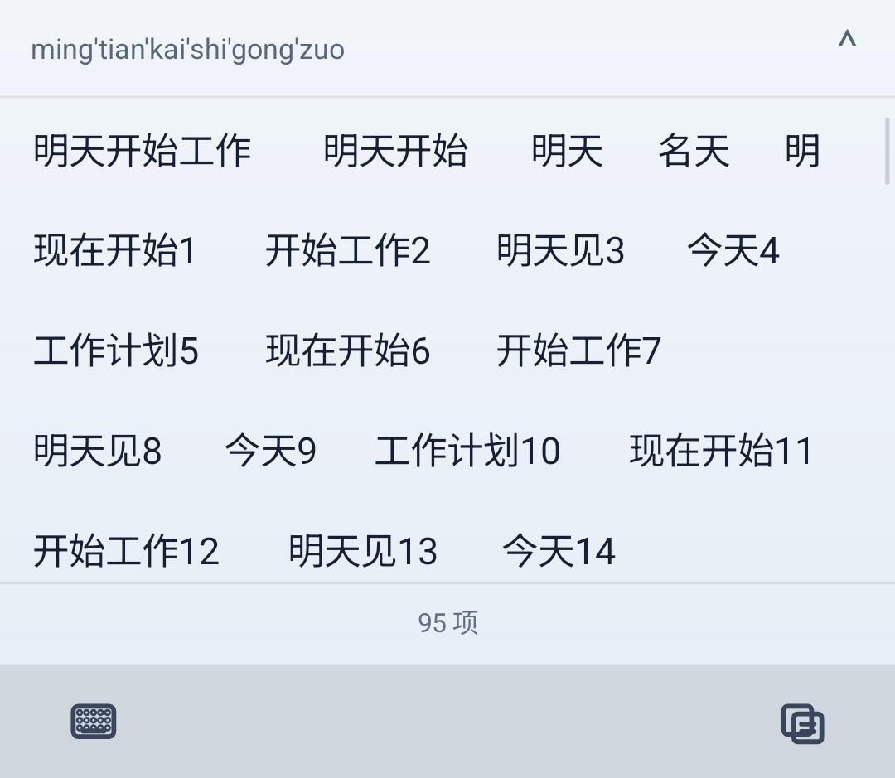

# Sense 输入质量专项：A 阶段实测

日期：2026-10-02。代码起点：`d457eecdfe938f0473fd1a6d4b0d3d43166356f0`。
开发分支：`codex/input-quality-v2`。专项仍在进行，本报告不是最终验收或发布说明。

## 结论

当前首要问题确有算法根因：旧整句搜索按每条路径各自的词段数取平均，
导致“高频单字 + 高频单字”的错误组合胜过正常词组。
在未改生产词库、未注入评测词条的情况下，修正目标函数、纠错跨路径校准和上下文裁剪，
新增日常诊断集首选由 11/40 升至 28/40。
仍有 12 条首选未命中，尤其跨词语义与新词组合，后续需要真正的句子语料模型和用户词格。

## 可比质量结果

| 集合/指标 | 修改前 | 当前 |
|---|---:|---:|
| M8 日常全拼 Top-1 | 11/40（27.5%） | 28/40（70.0%） |
| M8 Top-3 | 15/40 | 34/40 |
| M8 Top-10 | 23/40 | 39/40 |
| M8 候选覆盖（255 限额） | 35/40 | 40/40 |
| M8 MRR | 0.3709 | 0.7855 |
| M8 字符错误率 | 0.2451 | 0.0700 |
| M3 共同有效 125 条 Top-1 | 99/125 | 109/125 |

M8 的语料、字典、bigram、音节表、英语表 SHA-256 修改前后相同。
M8 没有丢失原有首选命中的案例。M3 共同 125 条里 16 条名次改善、0 条名次退步，
其中 10 条进入首选。

旧 M3 把 `zhegeshijiehenshida` 标成“这个世界很大”，多出一个 `shi`。
该行已纠正为 `zhegeshijiehenda`；其修复单列，不计入上表算法收益。
当前修正后完整 M3 为 110/126 首选、126/126 覆盖，20 条整句全部首选命中。
这两个小集都不代表真实用户人群准确率。

### 典型变化

- `jintiantianqihenhao`：今天天其很好 → 今天天气很好。
- `mingtiankaishigongzuo`：名天开是工作 → 明天开始工作。
- `womenmingtianzailiao`：我们明天在里啊哦 → 我们明天再聊。
- 长句末尾换位 `woshiyigezhongguoern`：保留“我是一个中国人”的纠正能力，6/10/64/255 限额回归通过。

## 实际修改

1. `PinyinDecoder` 加载时计算 canonical 发音条目的平滑频率总量；索引副本不重复累加。
2. 词格 beam 改为累加 log-unigram 先验和既有边界特征；公共校准接回现有候选排序。
3. 一组纠错拼写共享公共校准，避免多出高频音节的句子获得虚假优势。
4. exact 与起始词段先应用上下文，再按候选限额裁剪；最终结果不重复加上下文。
5. 静态短前缀缓存限制为 32 项 / 2048 候选，返回不可变快照，支持并发访问；用户词每次重新合并。
6. 新增逐键回放、评测器自测、生产词库记忆测试；M8 已接入本地发布门槛脚本。

未改变 SPLX/SBGM 文件、用户存储格式、签名证书或发布版本号。

## 性能：仅主机 JVM

环境：Windows、JDK 17；每轮 770 次全拼按键，候选限额 255，串行执行。

| 热身后逐键解码 | 修改前 | 当前最终运行 |
|---|---:|---:|
| P50 | 3.8432 ms | 3.0658 ms |
| P95 | 12.0122 ms | 11.1094 ms |
| P99 | 15.2232 ms | 14.5922 ms |
| 最大值 | 18.3959 ms | 19.5672 ms |

中位及分位数改善，但最大样本更高；未宣称所有尾延迟改善。
这些是单机观测，包含 JIT/GC/系统调度影响，不是手机触摸至上屏耗时，也不是缓存单独效果的严格消融。
原始时间和每行候选在 JSON 报告中保留。

## 回归与构建

- `core-input:test`：226 项通过。
- `ime-ui:testDebugUnitTest`：224 项通过。
- `ime-service:testDebugUnitTest`：248 项通过。
- 共 698 项，0 failure / 0 skipped。
- M1–M8 主机基准/门槛通过；M1 在独立运行通过，随后最终串行执行 M2–M8。
- `app:assembleDebug` 成功。此为调试验证构建，未执行签名 release 或 GitHub 发布。
- `git diff --check` 与发布脚本 PowerShell 语法解析通过。

记忆测试使用实际生产词库覆盖“程彻”“智能体”的反复查询、插入其他查询后的召回、
已记录条目重建恢复，以及静态缓存命中之后的学习和忘记。
这证明本轮排序/缓存未破坏这些契约；完整系统级输入事务继续属于后续验收。

## Android View 验证

本地 headless Pixel 2 配置模拟器，x86_64 / Android 17 API 37，1080×1920。
真实 `SenseKeyboardView` + Android `MotionEvent`，不是网页原型。
`SenseKeyboardViewLayoutDeviceTest` 9 项通过，并再次用 instrumentation 运行确认。

覆盖：候选横向拖动、拖动后点选源索引、展开后连续垂直滚动、滚动期间不重建场景、
pending 候选拒绝过时点击、ready 批次绑定新 revision、联想替换工具栏且可关闭、输入布局切换。
修正两条过期仪器断言：T9 现在显示数字副标，侧栏符号现在是可配置文本动作；生产 T9 行为未修改。

截图使用真实 View 绘制，候选内容为明确的 UI fixture；不将 fixture 截图冒充真实词库排序结果。
保留旧候选字色是已有的防闪烁设计；pending 时展开按钮变淡，点选被禁用。

### 全拼候选就绪

### 展开后的连续候选面板

### 可关闭的联想栏

### 关闭后恢复工具栏

尚未将此 View 测试等同于跨应用 InputConnection 测试、真机帧性能、大字/横屏完整矩阵。
模拟器已经停止；可复用的临时 AVD 存在原工作区 `.artifacts/input-quality/avd`，不进入版本库。

## 剩余问题与下一阶段

- “今天的菜/才”“还有多少电/点”等需真正的跨词上下文；现有字 bigram 基本来自词内搭配。
- “智能体”本身已经可学习，但在更长的新句中复用用户词仍需作为词格边参与搜索。
- 姓名/专业词、无上下文歧义需要更大、类别均衡、来源可追溯的测试集。
- 增加与真实句子 LM 的独立对照；保持常规输入离线、零网络 token、密码场景不学习。
- 补全 InputMethodService 与外部编辑框的快打/确认/撤回自动化，以及横屏/大字体渲染测试。

详见 [专项目标与设计](../development/input-quality-program-v2.md) 和
[M8 执行说明](../../benchmarks/replay/README-m8.md)。
