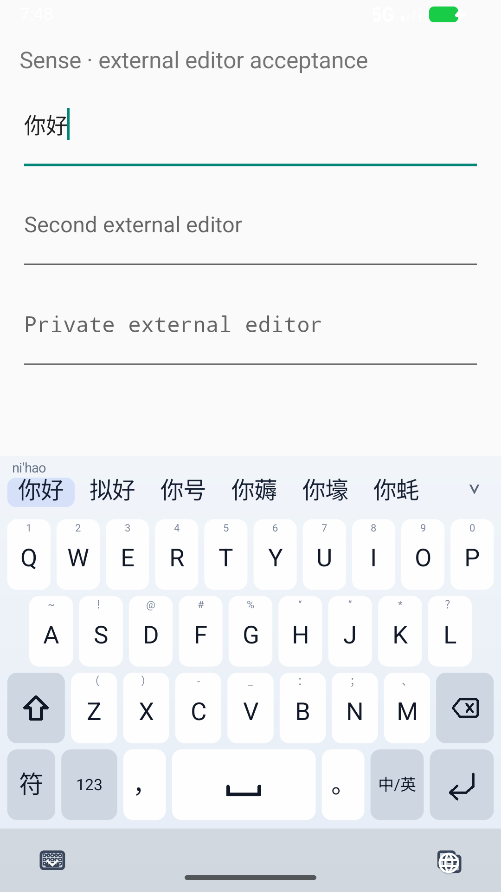
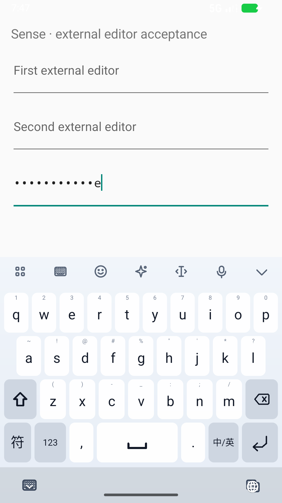

# D1：真实系统输入法到外部编辑框

日期：2026-10-02。范围：26 键全拼；API 37 x86_64 模拟器；debug APK。
本阶段不是手机性能认证，也未发布 release。

## 从 View 单体走到系统输入链路

新增独立应用模块 `input-quality-device`：与 Sense 是不同 applicationId/UID，内部是普通 EditText。
测试通过系统选择 Sense IME，再向其实际窗口注入触摸 DOWN/UP；没有直接调用 Sense 的
`handleKey`、候选 listener 或 decoder，也没有向外部编辑器发送 `adb input text` 来绕过键盘。
生产 APK 不依赖这个 fixture。

键盘当前由 Canvas 绘制，尚未提供完整虚拟无障碍键节点。因此测试从真实窗口边界和密度计算
26 键布局的中心点，并以外部编辑器最终文本为断言。该方法不代表 TalkBack、任意主题/屏幕配置验收。

自动化入口：`tools/test_external_editor.ps1`。每轮记录三个 APK 的 SHA-256、Android SDK、
instrumentation 原始日志、截图/XML 和实际注入节奏；证据目录不覆盖。
脚本解析 `OK (8 tests)`，不把 `am instrument` 常见的 shell exit 0 当作测试成功。

## 测试首先发现了什么

### 1. 模拟器硬件键盘抑制软键盘

首轮未显示键盘；模型日志 READY 且没有崩溃。`dumpsys input_method` 显示系统键盘配置为 qwerty，
`show_ime_with_hard_keyboard=0`。在 fixture 中启用软键盘并于 teardown 恢复，键盘正常显示。
没有为这一模拟器设置问题改动生产 IME 的显示策略。

### 2. 历史日志导致就绪误判，掩盖了冷启动问题

最初测试用全局日志中的 `Character language model: READY` 判断加载完成，误命中旧实例日志。
实际新实例仍在 bootstrap 解码，快速确认会把原始拼音上屏。
现在通过当前 InputMethodService 的只读 dump，等待 production runtime ready 且模型 READY。
新增诊断只输出状态/代次，不包含输入文字或用户词条。

**这修复的是测试就绪判定，不是冷启动产品问题**。模型未就绪期间如何显示候选和处理 Space
确认，继续列为 D2 的待修复项；这八项测试都明确在生产 runtime ready 后开始输入。

### 3. 密码框在候选栏暴露完整输入原文

原来密码策略只关持久化和前文读取，却仍走拼音 composing/candidate 流程。
实测外部框显示圆点，但键盘候选栏显示 fixture 密码 `senseprivate` 和中文候选。

修复：密码字段临时采用逐字直输，绕开 composing 缓冲、词典查询、候选预览和词频学习；
使用英文标点，保留 Shift 和退格。用户原来的中英选择单独保存；离开密码字段自动恢复。
Agent 自己的普通草稿输入仍保持独立目标的行为，不读取外部密码框内容。

系统回归覆盖：原文完整到达密码框、没有 composing span、退格删一个字符、切回普通框后
`nihao + Space` 仍输出 `你好`。截图中的末字短暂明文来自 Android EditText 的系统密码显示策略，
不再出现整段密码候选预览。

### 4. 生产 runtime 就绪后仍存在 120 ms 确认超时

不能用一次 8/8 通过结束诊断。重复后又发现原文上屏，三次定向重现全部失败。
短期数值探针（仅 revision/generation/耗时，无输入内容）捕获：

```text
old revision 13: decode 609 ms
latest revision 18: Space requests confirmation
120 ms later: pending timeout commits raw spelling
old work finishes; latest revision 18 then decodes for 144 ms
```

另外两次最新任务仅 95/107 ms，但排在旧任务之后仍超过确认总期限。
根因是“旧任务仍计算 + 固定过短确认期限”，并非中文答案缺失。

本轮恢复性修正：**仅 26 键全拼 Candidate 确认**采用最多 1,000 ms 异步等待，结果到达立即上屏；
不阻塞 UI 线程，不强制额外延迟，不改变 beam、候选排序或模型权重。
原有 revision/editor 验证、输入队列上限、切框清理继续生效；T9 与五笔的 120 ms 行为未变。

这不是最终性能解决方案，也不承诺所有设备都能在 1 秒内完成。全拼 worker 当前没有消费
`shouldContinue` 中途取消探针，旧任务浪费 CPU 的问题仍需处理。该保守等待先防止已重现的
普通输入误上屏，下一阶段需取消过时搜索并测量逐键分布。所有临时探针已从生产源码移除。

## 八项系统验收

1. 触摸 `nihao` 并点击候选 → 外部框 `你好`，composing 结束。
2. 快速输入 `woxihuanbeijing` 后立即 Space → `我喜欢北京`，只提交一次。
3. 中文模式输入 `sensecustomword` 后 Enter → 原文，不加换行。
4. 输入 `nihaoa`、退格、Space → `你好`。
5. 旧框打字后立即切新框，新框 `nihao` → `你好`；旧候选不跨框提交。
6. `你好` 上屏后由外部应用将光标移到开头，再 `wo` → `我你好`。
7. 收起、重开键盘，原有 `你好` 后继续 `shijie` → `你好世界`。
8. 密码直输、退格以及返回普通字段时的中文模式恢复。

实际触摸注入间隔不是代码中的 sleep 值：一次修复后记录为 61–73 ms/键。
一次 Space 到外部提交记录为 206 ms，包括事件注入、等待与轮询；不能把它当作 decoder p95。
完整重跑和 APK 身份以 `benchmarks/results/d1-system-ime.json` 为准。

最终两轮各 **8/8**；另外 force-stop IME 后重新等待生产 runtime、立即快打的三轮各 **1/1**。
两轮整套的 Space→外部提交为 249 / 159 ms；三轮重启定向为 303 / 253 / 279 ms。
这些是单次观测，不以五个点计算或宣称可靠 p95。
主机最新回归：core 258、UI 224、service 262、About 定向 3，共 **747**；Python **23**。
全部通过且没有跳过；App 的数字仅是 About 定向测试，不是整套 App 测试。

最终开发 APK SHA-256：`520e744b37e07da8293d6069bd5bf4472a927df4dff71c0c8b7aa59443efe08d`；
79,200,976 字节。成品模型/署名仍通过 `d1-apk-asset-audit.json` 检查。
复现结束已恢复模拟器键盘设置并关闭模拟器；无真机安装、commit、push 或 release 操作。

截图：





## 剩余优先级

1. **D2 / C 性能**：消费取消探针；过时 whole/prefix/纠错搜索及时退出；逐键 Android 分布与首轮 JIT 分开。
2. **D2 冷启动**：bootstrap/生产代次衔接，加载尚未完成时的 Space、继续输入、Enter 和切框。
3. 系统级个人词学习后杀进程恢复、长句/纠错更多输入轨迹；已有 SQLite/JVM 回归不冒充设备验证。
4. 候选虚拟无障碍节点、横屏/大字体、展开滚动与联想生命周期的更大系统覆盖。

模型 P2C 冻结数据、core 解码算法没有因这些 service 修复而改变；首次评测保留原始结论。
所有测试结果只表示列出的 fixture 行为，不等同于主流输入法质量目标已经完成。
