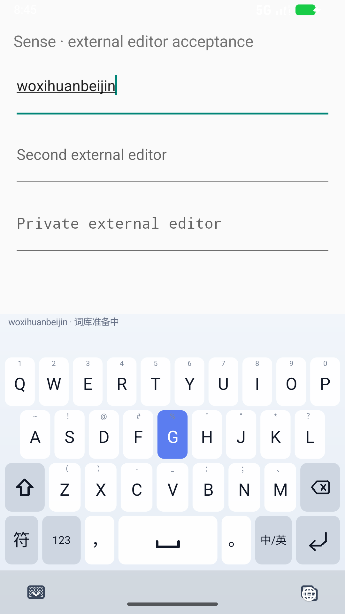
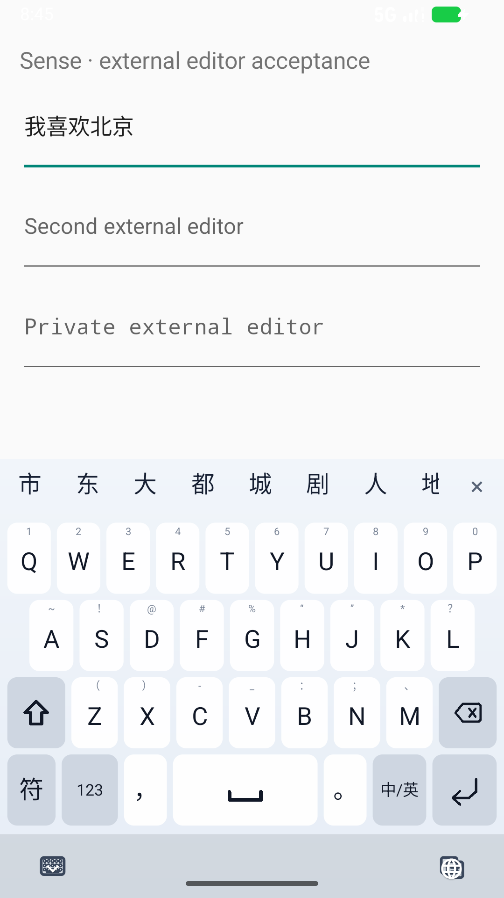

# D3：冷启动、延迟确认与词库重建

## 本阶段结果

26 键全拼的冷启动空格误上屏、确认后的连打丢失候选，以及重复建立输入法实例时的词库 OOM，均有真实 Android 系统输入链路的失败记录和修复后回归。

最终 debug APK：`03fbbc943bcc914558687fdba23182c0d91fe2c856b98dda0ea14b23e1e01739`，79,627,924 字节。仅在专用 API 37 模拟器执行，没有手机安装或 release 操作。

## 1. 冷启动的占位结果不再充当正式候选

**红色回归**：强停 debug 进程、打开独立 UID 的普通 EditText，输入 `woxihuanbeijing` 后按空格。输入前和按空格前的当前 Service dump 均为 `ready=false`，但实际提交了原始拼音。不是模型分词得到了低分结果，而是启动时 `FakeDecoder` 的占位输出提前参与了提交。

修复：

- `CandidateDecodeSession` 显式携带 `decoderReady`。正式词库未发布时保留真实 composing，状态为 pending，不启动占位搜索、不接受其结果、不开放候选点击。
- 候选区域展示“词库准备中”；不跳换键盘、不改变按键几何位置。
- 空格确认仍绑定其组合态修订号，后续按键进入原有有界 FIFO。正式词库发布后，对相同组合态的新模型代次发起搜索，候选就绪立即确认，再重放后续输入。
- 加载阶段的等待上限为 5 秒；发布后切换为正常全拼的 1 秒解码上限，保留事务而非重新创建。两者都不是强制延迟。
- 显式 Enter 仍可确认原始英文；切换外部输入框会废弃旧事务。

最后一版冷启动确认样本为 **1,688 ms**；另一次加载画面采集样本为 **1,654 ms**。正确性修复不等于首次加载已经无感；这里仍有实际可感知等待。



截图是最后一个按键帧正在更新时采集；完整拼写和最终中文通过外部编辑器断言，而非从静态截图推断。



## 2. 延迟光标回调误清除下一段输入

增加冷启动连打用例后出现第二个失败：

`woxihuanbeijing → 空格 → nihao → 空格`

预期“我喜欢北京你好”，实际“我喜欢北京nihao”。临时诊断只记录修订号、长度和坐标，没有输入内容，确认如下顺序：

1. 正式结果提交“我喜欢北京”。
2. 主线程已经把队列中的 `nihao + 空格` 重放为下一段待确认组合态。
3. Android 此时才回报上一段提交的光标位置 5、composing span `-1/-1`。
4. 已有一次性提交 fence 正确识别 `own=true`，但组合态取消策略没有使用它，仍将后续 `nihao` 的本地状态清掉。

修复让 `EditorCompositionSelectionPolicy` 消费这条已经由编辑会话、连接身份、位置及期限校验的提交确认。仅忽略这一次旧提交回执；真正外部光标移动、后续取消及切框仍清除状态。对应策略测试先红后绿；临时 `[DEBUG-d3]` 代码已移除。

## 3. 重复加载 35 MB 词库的内存问题

扩大到九项系统验收后，在词库加载路径实际捕获 `OutOfMemoryError`：模拟器应用堆上限 192 MiB，再分配约 35 MB 失败。

第一次优化用包内固定大小 **35,069,585 字节**和 SHA-256 直接读入最终数组，替代 `readBytes()` 的缓冲增长和最终复制。此修复压低单次读取的临时分配，但再次连续验收依然触发分配失败。因此**没有把它单独认定为完整修复**。

最终增加进程级、单次发布的只读基础词库缓存：

- 同一进程的不同 Service 实例复用基础字典数组及其静态索引，重建时不再各自加载 35 MB。
- 并发加载只有一个构建者；构建异常不缓存，后续实例可重试。
- 缓存对象不保存 Service、AssetManager 开启函数、用户词库、英文使用记录或个性化解码器。
- `AdaptivePinyinDecoder` 仍为每个用户存储建立独立绑定和查询缓存；全拼/T9 沿用各自既有排序配置。
- 只在后台 I/O 执行固定大小、EOF 和 SHA 检查，包数据更新需同步更新 pin；单元测试用实际包资产检验。

在不重装 APK、不强停 IME 进程的两轮九项系统验收中，PID 始终为 `25887`，18 项通过，未再次遇到该加载失败。两端 `dumpsys meminfo` 的 Dalvik Heap Alloc 约 45,014 → 55,659 KB。它们是两个时点，不是峰值测量，也不证明整个输入法不存在内存泄漏。之前失败后的堆快照仅保留于本地 `.artifacts`，没有放入发布资源。

## 最终验证矩阵

详见 `benchmarks/results/d3-system-ime.json`：

| 场景 | 结果 |
|---|---:|
| 正式模型就绪后的完整系统输入回归 | 9/9，重复两轮 |
| 未就绪时确认、继续输入、切框、Enter | 4/4 |
| 同一 IME 进程内继续重建及编辑 | 9/9，连续两轮 |
| 加载画面采集及同次空格最终提交 | 1/1 |

最终 APK 共记录 **41 次通过的场景执行**，不是 41 种不同功能。早期红色记录继续保留；不以最后一轮成功覆盖曾经失败的证据。

主机：core 263、UI 224、service 271、About 定向 3，共 **761** 项；Python **26** 项。没有跳过。App 数字仅覆盖 About，不代表整个 App 的所有业务。

生产资产工厂的 125 条已知 P2C 回归仍通过；D3 没有更改 core 排序或训练数据。相对于首次 B3 冻结，D2 的取消检查点已经改变 core 源码 pin，因此不宣称整份旧冻结 pin 与当前源代码一致，也不把重复测试称为新盲测。

成品语言模型和完整署名审计：`benchmarks/results/d3-apk-asset-audit.json`。主机结果汇总：`benchmarks/results/d3-host-validation.json`。

## 复现入口

```powershell
$env:JAVA_HOME = 'F:\Android\Jdk\jdk-17'
$env:ANDROID_HOME = 'F:\Android\Sdk'
tools/test_external_editor.ps1 -RunName fresh-warm
tools/test_external_editor.ps1 -RunName fresh-cold -ColdStart -SkipBuild
tools/test_external_editor.ps1 -RunName lifecycle-1 -SkipBuild -SkipInstall
tools/test_external_editor.ps1 -RunName lifecycle-2 -SkipBuild -SkipInstall
```

`-ColdStart` 限定专用 AVD，且断言按确认键前仍在加载，避免把热启动误记为冷启动通过。`-SkipInstall` 校验已安装三个 APK 的实际 SHA，而不是盲目信任目录中的文件；记录进程前后 PID。每次使用新证据目录，并恢复此前的系统输入法和硬件键盘显示设置。

## 仍需推进

1. 首次加载仍有约 1～2 秒等待；等待超出上限继续沿用原文恢复策略，极端加载失败的交互仍需打磨。
2. 正式完整搜索仍有数百毫秒样本：建立更大、分冷/热、逐键的 Android 延迟分布，继续压缩最新任务本身的搜索成本。
3. 个人词学习、服务/进程重启后恢复的真实系统级闭环；现有 SQLite/JVM 验证不代替它。
4. 展开候选、横屏、大字体及虚拟无障碍节点；扩大纠错和混合输入轨迹覆盖。

目标保持进行中；本阶段没有 commit、push 或 release。
