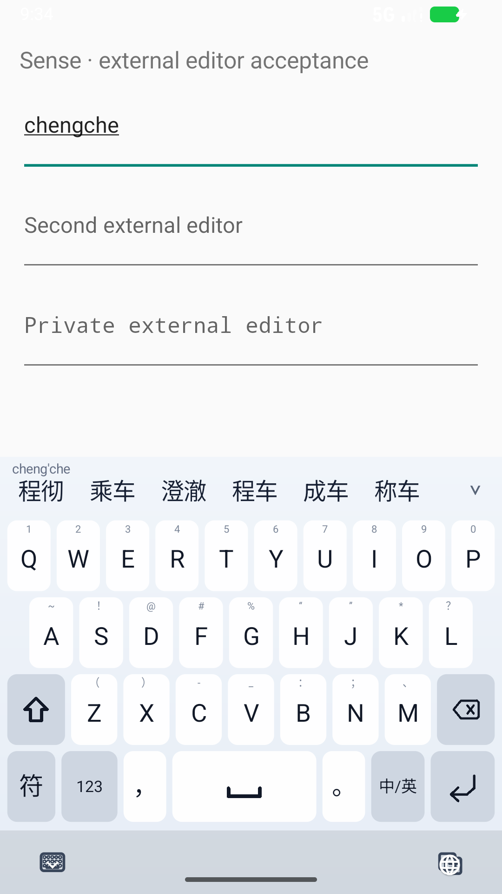
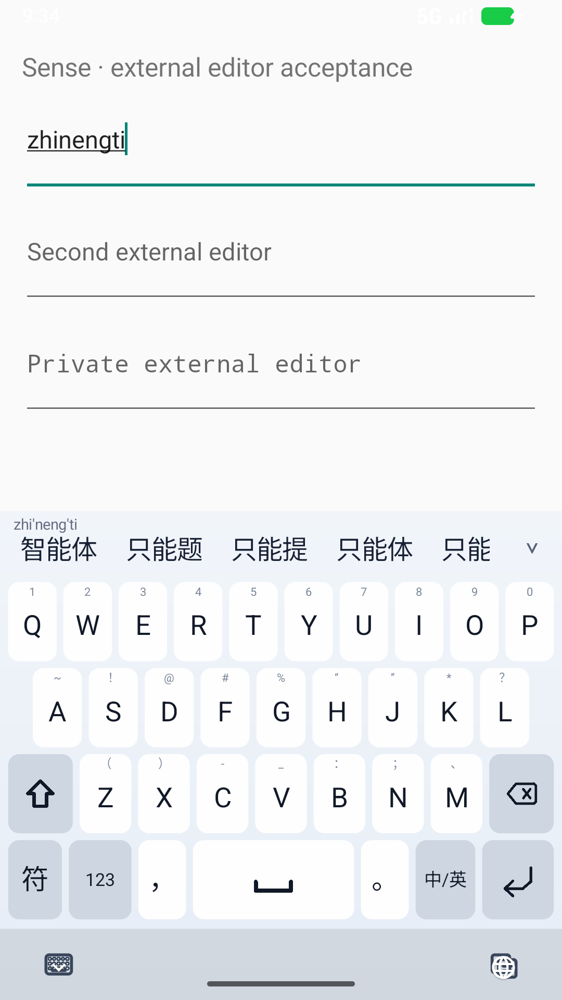

# D4：真正复现“学过又掉下去”，修复重复接受与候选可访问性

## 结论

这次用**独立应用里的真实 EditText、系统输入法窗口、26 键触摸与候选点选**，找到了此前主机测试遗漏的学习回退：

1. 输入 `chengche`，在展开候选中选择第 16 项“程”，再选择第 9 项“彻”。
2. “程彻”成功上屏，下一次输入时排第一。
3. 按空格接受“程彻”，再输入一次，首选退回“乘车”。失败截图中“程彻”仍在第 3 位，**这次复现的是偏好回退，不是词条从数据库消失**。

已修复。相同操作、连续接受、真正重启 IME 进程后，“程彻”保持首选。“智能体”从第 2 项手动选中后，复用与重启也保持首选。

这些是专用 API 37 x86_64 模拟器上的系统级证据；本阶段没有真机操作，没有 commit、push 或 release。

## 1. 根因：弱接受覆盖强偏好

`MemoryUserLexicon.record()` 虽然累加了总正反馈，却每次把 `lastPositiveEvidence` 替换成最新一次动作的强度。

- 手工点选、深候选选择及分段组词提供较强证据。
- 空格默认接受只提供 `0.18` 的弱证据。
- 排序的近期奖励依赖这个字段。第二次正常接受反而大幅减小奖励，低频人名又掉到常用同音词后面。

失败后的真实 SQLite 行：`程彻` 的 `use_count=2`、`positive_evidence≈2.8089`、`negative_evidence=0`，但 `last_positive_evidence=0.18`。因此不是清空编辑框误触发负反馈，也不是词条未落盘。使用生产字典的最小 JVM 回归同样先失败，排除了只在 Android 点击路径出现的假象。

### 修正

保留原有数据库字段与兼容加载，将其语义调整为“截至最近使用时仍保留的近期峰值证据”：

```text
recent_peak = max(new_action_strength,
                  previous_peak * decay(now - previous_last_used, half_life = 14 days))
```

- 再次接受是确认先前选择，不撤销先前偏好。
- 时间衰减继续生效；14 天后再默认接受不会把旧峰值恢复成最初强度。
- 只有默认接受的词仍只有弱近期信号；不把空格升级成手动强偏好。
- 删除、替换等负反馈独立保留，原有最大加减分边界不变。
- 不改词库、语料或 LM 权重，没有针对“程彻”写特殊词条。

新回归覆盖：生产词库上连续 4 次接受、journal 恢复、弱确认保持强偏好、两次半衰期、弱接受独立情况和负反馈保留。原有默认接受不压过更优基础候选、旧偏好衰减、删除降权等测试继续通过。

### 之前的验证漏了什么

旧测试反复调用 `decode()`，但没有在每次解码后模拟真实的 `learn(DEFAULT_ACCEPT)`。它证明词条可检索，却漏掉了“选中 → 正常使用 → 再次排序”的反馈环。现在主机测试与系统测试都执行这个闭环。

## 2. Canvas 候选变成真正可访问的操作节点

旧候选只是整块 Canvas 的绘制内容，系统 UI 树没有独立候选。新的候选层使用 [AndroidX ExploreByTouchHelper](https://developer.android.com/reference/androidx/customview/widget/ExploreByTouchHelper)，保留原有绘制和连续滚动：

- 仅为视口内候选和展开、收起、关闭联想控件提供虚拟节点；不创建 255 个实体 View。
- 节点包含词条、全局候选序号、点击动作和实际裁剪后的屏幕区域。
- 相同结果批次滚动时保持 ID；候选修订、重排或 pending/ready 切换后，旧 ID 失效，不指向新词。
- 同一文本的不同分段动作仍有不同 ID，不以词条字符串混淆动作。
- 动作经过原有命中与版本校验，再进入候选提交路径，不绕过外部编辑器或异步修订号。
- 无障碍前后滚动操作直接移动现有连续滚动位置，复用同一场景，不引入分页。
- 滚动/状态更新的节点通知合并到 80 ms，避免每个动画帧重新生成整棵节点树。
- 选词导致节点同步消失时，点击事件仍携带刚选中的词；保留的是事件标签，不重新开放旧动作。

首次系统节点测试在 D3 APK 上失败，在新 APK 上通过。Android View 测试实际执行 `AccessibilityNodeProvider.ACTION_CLICK`、前后滚动和控件操作，并收到了正确的点击事件文字。外部编辑器用系统 UIAutomation 按词条查找，再实际触摸节点位置，不调用 Sense 的候选监听器。

这覆盖的是**候选与候选控件**，不是整个字母键盘的完整读屏支持；尚未进行 TalkBack 语音体验验收。

## 3. 真实学习、重启和隐私隔离

`ExternalEditorLearningTest` 新增两条组合场景：

| 场景 | 核查 |
|---|---|
| 分段造词、再次接受、重启 | “程” + “彻”上屏；连续两次重输和空格接受；强停并重新拉起 IME；首选及最终上屏文本相同 |
| 常用技术词 | 手动选择“智能体”；再次空格接受；再次重启 IME；保持首选 |
| 禁止个性化学习的编辑框 | 在 `IME_FLAG_NO_PERSONALIZED_LEARNING` 输入框选出“程澈”；当次仍正确上屏，但再输入与重启后普通输入框都没有学到此偏好 |

学习测试只在明确匹配名称 `sense-input-quality` 的专用 AVD 上重置 `.debug` 应用数据。不会默认选择手机，也不向数据库或解码器预置答案。

测试记录真实进程 PID 改变，不把重开键盘视为进程重启。两轮独立干净配置通过后，对合成测试数据作只读 SQLite 核查：

- “程彻”使用次数至少 4；近期峰值约 2.63，负反馈为 0。
- “智能体”使用次数至少 3；近期峰值约 2.03，负反馈为 0。
- 私密场景中的完整词“程澈”没有落入个人词表。

见 `benchmarks/results/d4-learning-persistence.json`。此数据库检查是对 UI 结果的补充，不代替选词和上屏验证。





截图采于按空格前；之后另行断言外部输入框收到完整中文，且 composing span 已结束。

## 4. 验证矩阵

| 层级 | 结果 |
|---|---:|
| core 完整 JVM 套件 | 267 通过 |
| ime-ui 完整 JVM 套件 | 229 通过 |
| ime-service 完整 JVM/Robolectric 套件 | 271 通过 |
| App About 定向回归 | 3 通过 |
| 数据/模型/评测 Python 回归 | 26 通过 |
| Android View 布局、连续滚动、虚拟节点操作和事件 | 12 通过 |
| 正式模型就绪后的真实外部编辑器系统回归 | 10 通过 |
| 冷启动未就绪时确认、继续输入、切框、Enter | 4 通过 |
| 干净配置下学习与隐私组合场景 | 2 通过，重复两轮 |

主机合计 **770**，不含 Python。App 数字仅指 About，不代表所有 Agent、语音、远程信道业务。系统场景执行数和唯一用例数分开记录，见 `benchmarks/results/d4-system-ime.json`。

本表系统测试为 **12 种用例、18 次执行**；冷启动复用其中四种普通用例。表内四轮系统运行的主 APK SHA 均为 `801cca9f0ce9e2ed9c88e02bde25a1edc12050ab12ffa2adcce75699e09666bc`。

生产资产工厂的 125 条已知 P2C 回归继续通过。D4 改动了个性化 core 源码；不声称 B3 首次冻结的源码 pin 与当前完全一致，不把旧评测集再次当成盲测。训练语料、词库、语言模型、0.5 权重及署名资产未改变。包内审计见 `benchmarks/results/d4-apk-asset-audit.json`。

红色证据保留在本地 `.artifacts/input-quality/d4-learning-1*`、`d4-learning-unit-red.log`。第一次点击事件测试因为测试服务启用状态尚未传回 View 而超时，补上 `AccessibilityManager.isEnabled` 的等待后通过；没有用放宽事件断言掩盖失败。

## 复现

```powershell
$env:JAVA_HOME = 'F:\Android\Jdk\jdk-17'
$env:ANDROID_HOME = 'F:\Android\Sdk'
tools/test_external_editor.ps1 -RunName fresh-learning -Learning
python tools/audit_personalization_fixture.py --adb F:/Android/Sdk/platform-tools/adb.exe --report .artifacts/input-quality/fresh-learning-db.json
tools/test_external_editor.ps1 -RunName fresh-warm -SkipBuild -SkipInstall
tools/test_external_editor.ps1 -RunName fresh-cold -ColdStart -SkipBuild -SkipInstall
```

`-Learning` 会清空专用 AVD 的 Sense debug 配置；普通回归不清空。脚本保存 APK SHA、设备版本、PID、测试日志和截图，核验实际测试数量，并恢复原输入法和硬件键盘显示设置。`-SkipInstall` 还核对设备上三个 APK 的 SHA。

## 下一阶段

1. 扩大自然输入、切分/纠错、长句和混合输入轨迹，特别检查反馈环而不仅是静态候选列表。
2. 最新完整搜索仍有数百毫秒样本，继续优化搜索成本，建立冷热分组的 Android 延迟分布。
3. 大字体、横屏、更多编辑器与系统版本；完整字母键盘可访问性另行验收。
4. 冷启动极端加载失败和超时恢复的交互仍待打磨。

目标保持进行中。
