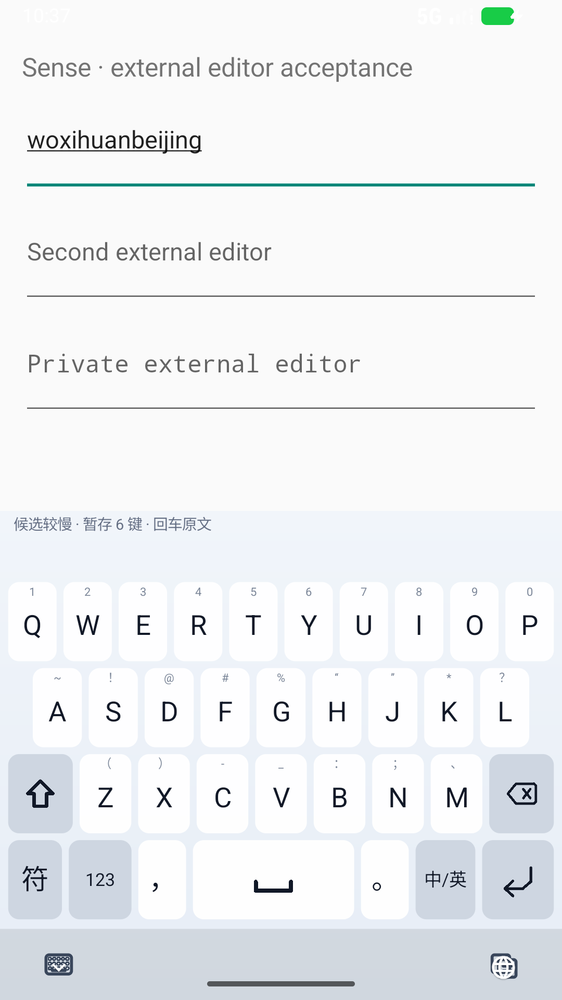

# D6：慢候选确认保持中文意图，而不是超时提交拼音

## 结论与范围

26 键全拼的空格确认现在采用**软期限**：候选较慢时显示恢复提示，保留当前 composing 和已经接受的后续输入。结果到达后仍按原顺序确认中文。期限本身不再产生原文提交；回车才是用户明确保留当前原文的操作。

本阶段修复的是等待与恢复流程，没有调整词库、LM 权重、排序或搜索预算。纠错和“累/类”等上下文歧义仍属于下一阶段工作。九宫格、五笔的既有 120 ms 恢复规则未在本轮更改。

## 1. 问题与可重复复现

D5 的 ART 方法采样曾强烈拖慢解码，使 `woxihuanbeijing` 在空格后一秒超时，被当成原文写入。D6 首先直接调用生产 Service 的超时边界：旧实现清除了确认事务和后续输入，回归先红后绿。

随后建立独立外部编辑器的确定性系统测试：

1. 正常加载生产词库和模型，热身一次，使候选线程创建并停在等待任务的位置。
2. 电脑通过 ADB 转发 JDWP，仅暂停 `sense-candidate-decoder` 这一条空闲线程，保持 IME 主线程和外部编辑器运行。
3. 真实触摸 26 键，输入、按空格、继续打第二个词，跨过生产的 1 秒期限。
4. 检查外部文本、composing span 和只读确认状态；随后恢复候选线程，检查最终中文及顺序。

没有在生产 APK 加入延迟开关、测试广播或对外测试接口。宿主脚本检查 AVD 名称 `sense-input-quality`，只连接 `.debug:ime`，检查目标线程处于 WAIT 且未暂停，再发线程级暂停。清理时恢复线程、Dispose 调试连接、移除端口转发并还原输入法设置。协议依据 [Oracle JDWP 线程控制与 Dispose 定义](https://docs.oracle.com/en/java/javase/17/docs/specs/jdwp/jdwp-protocol.html) 和 [JDWP 包格式](https://docs.oracle.com/en/java/javase/17/docs/specs/jdwp/jdwp-spec.html)。

旧基线使用已保留的 D4 APK，SHA-256 `801cca9f0ce9e2ed9c88e02bde25a1edc12050ab12ffa2adcce75699e09666bc`。它与 D5 同样具有原文超时分支。相同首项测试失败：等待期间外部文本已经从 `woxihuanbeijing` 变成 `woxihuanbeijingnihao`，原有确认边界被超时推进。基线失败日志保留，不计入通过数。

## 2. 交互规则

| 状态 / 操作 | 行为 |
|---|---|
| 候选及时返回 | 立即确认，无新增强制等待 |
| 正式解码超过 1 秒 | 显示“候选较慢”，保留空格确认意图和 FIFO |
| 首次资产加载超过 5 秒 | 同样进入提示状态，不以加载超时提交原文 |
| 慢候选返回 | 确认原词，再逐项重放已接受输入；支持第二段再次异步等待 |
| 提示后按回车 | 明确保留**当前等待的词**的原文，不附加换行；后续已接受输入保持顺序重放 |
| 提示后按退格，后面有文字输入 | 优先撤回队列最后一个可打印按键；文本按 Unicode 码点退格，保留其他内容 |
| 提示后按退格，没有后续输入 | 取消该次空格确认，删除 composing 最后一个字母，继续编辑 |
| 队列尾部是未执行的功能操作 | 不把操作任意变成删除文字；退格仍按 FIFO 等待该操作执行 |
| 收起键盘 | 关闭动作不再排在候选队列后面，生命周期清理仍使旧结果失效 |
| 切换编辑框 | 旧事务和队列失效，旧候选不会写进新框 |
| 512 项已满 | 保留已接受的 512 项；新事件不接收，显示明确提示及反馈，退格/回车/收起仍可恢复 |

512 是事件数量上限，不是声称队列可无限接收。暂存内容尚未提交给外部 App；退出原编辑会话依旧丢弃其未提交队列，避免内容串入另一个 App。单条文本的既有入口约束不在本阶段重写。

正常快速输入的既有 FIFO 语义不变；退格/回车的即时恢复行为在慢候选提示后或队列已满时生效。冷加载发布新 decoder 仍保留同一确认事务。

另一个同类路径也已处理：后台解码异常此前被包装成“成功但候选为空”，随后可能提交原文；现在异常保留当前拼音及确认意图，提示回车保留原文或退格重试。真正成功返回的空候选结果仍沿用原有处理。

## 3. 代码与验证层次

- `PendingDecodeCommitCoordinator`：增加软期限状态、满载反馈状态和未执行输入尾部编辑；完成/清理统一重置。
- `SenseInputMethodService`：软期限提示、明确原文确认、慢候选退格、收起不阻塞、失败与空成功分离，以及无输入正文的只读诊断。
- `PendingPinyinWaitServiceTest`：10 项 Service 边界测试，使用真实 Android `BaseInputConnection`/Editable 与生产 Service 私有入口的定向反射；不启动完整 Service 生命周期，也不冒称系统端到端测试。
- `PendingDecodeCommitCoordinatorTest`：新增软期限、尾部撤回和触发项保留测试。
- `ExternalEditorSlowCandidateTest` + `tools/test_slow_candidate.py`：真正的系统 IME → 另一 UID 的编辑框测试。仅宿主测试工具使用 JDWP，不直接调用 Service 或 decoder。
- Python 协议测试 3 项：分片读取、非暂停事件、线程目标、握手失败清理与异常事件拒绝。

最终 APK：`b423eb9919d927acde43885ac8430b8ed07a3cae5c6557a7a3e6f02d5fab3545`。

| 最终 APK 的故障注入案例 | 暂停时长 ms | 结果 |
|---|---:|---|
| 两段中文确认及顺序 | 3187 | 通过，恢复后为“我喜欢北京你好” |
| 主动回车保留原文 | 2859 | 通过，线程暂停时即可确认，旧结果无追加 |
| 退格改正 `nihaoa` | 2344 | 通过，恢复后为“你好” |
| 换编辑框使旧事务失效 | 3218 | 通过，新框保持为空 |

这些暂停时长是测试注入的故障窗口，**不是输入延迟测量或性能改善**。环境为 API 37、x86_64 专用模拟器、debug 包，不是实体手机或正式发布认证。首轮开发包还有 4 次通过记录，最终结论只使用上述最终包 4 次。

主机回归：core 269、UI 229、Service 282、App About 定向 3，共 **783**；专项 Python **35**。Gradle 成功，未变更模块复用已验证任务结果。APK 资产、LM 及署名审计通过，模型与词库内容未改变。

最终包的普通系统输入 **10/10**、冷启动 **4/4**、词条学习/隐私/进程重启 **2/2** 通过，另有上表故障注入 **4/4**，共 20 次验收执行（含重复场景，不称为 20 个独立场景）。真实 UI 学习后的只读数据库检查确认“程彻”4 次、“智能体”3 次，隐私词“程澈”未保存。结果见 `benchmarks/results/d6-system-ime.json`、`d6-learning-persistence.json`。



## 4. 复现

```powershell
$env:JAVA_HOME = 'F:\Android\Jdk\jdk-17'
$env:ANDROID_HOME = 'F:\Android\Sdk'
./gradlew.bat --offline --no-parallel --console=plain :app:assembleDebug :input-quality-device:assembleDebug :input-quality-device:assembleDebugAndroidTest
python tools/test_slow_candidate.py .artifacts/input-quality/new-slow-run
# 旧版本对照：仅安装指定 debug 基线，不覆盖本地构建产物
python tools/test_slow_candidate.py .artifacts/input-quality/new-old-run --apk BASELINE.apk --method delayedChineseConfirmationPreservesBothWordsAndOrder
./tools/test_external_editor.ps1 -RunName new-warm -SkipBuild
./tools/test_external_editor.ps1 -RunName new-cold -SkipBuild -SkipInstall -ColdStart
./tools/test_external_editor.ps1 -RunName new-learning -SkipBuild -SkipInstall -Learning
```

每次采用新目录保留失败证据；学习复测仅清空专用 AVD 的 debug 配置。原始日志、截图、XML、状态快照位于 `.artifacts/input-quality/d6-*`；摘要和 APK 内容审计位于 `benchmarks/results/d6-*`。

目标继续：下一阶段回到独立纠错评价和常见上下文候选质量，随后补大字体、横屏和更多系统/编辑控件覆盖。外部输入框主动拒绝 commit 的队列恢复仍沿用既有逻辑，需单独覆盖；本轮没有把成功写入场景外推成所有控件的保证。本阶段未 commit、push 或 release。
