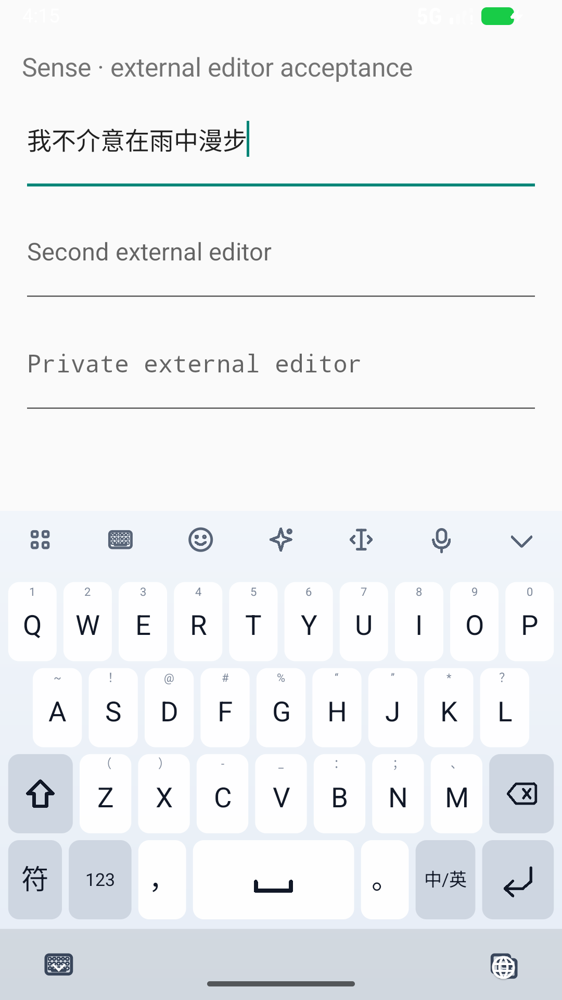

# E4：纠错来源校准、真实上屏与短词回归

## 阶段结论

这轮修改解决了一个明确的长句排序问题：原拼写即使只组成不自然的句子，也会凭来源先验把合理纠错压到很后面。
新 P2C 家族审计的 929 条记录中，首选命中 **362 → 419**，前十命中 **501 → 596**。
冻结的 62 条无错句首选和字符错误数保持；实际 Android 外部输入框也复现了旧包失败、新包通过。

**这是局部改进，不是发布完成。** 补充短词检查暴露了 `zhinengti → 智能体` 的未学习排名 **15 → 20**，
`kuahuihua → 跨会话` 的首选仍是“胯绘画”。词库覆盖和短词排序成为下一阶段优先项。
已学习的“智能体”仍通过真实选词、再次输入、进程重启回归；基础排序与个人记忆应分开评价。

## 1. 生产路径中的原因

此前的最终来源先验：

| 条件 | 普通组句 | 纠错结果 | 两者差距 |
|---|---:|---:|---:|
| 没有完整词条，但原拼写可以组句 | +6 | −8 | 14 |
| 完整词条命中 | 保持原规则 | −13 | 本阶段保持 |

LM 已参与词格搜索，但最终来源先验又把纠错压低。开发集完整候选池导出包含 945 条记录、92,115 个
同文本/来源去重条目；对同一候选池重排，复现了全部原前十结果。目标词经常已经召回，问题不是继续扩大图预算就能解决。

只在 **LM 已启用、没有完整词条、存在规范拼写组句** 时，对 `CORRECTED` 的已有分数加入 12 分残差：

```text
原来的普通组句优势：6 - (-8) = 14
校准后的普通组句优势：6 - (-8 + 12) = 2
```

拼写编辑代价、字符 LM 权重 0.5、词库、图路径 48/24 和完整组句 3/4 的预算均保持。
残差在已有 LM 映射步骤中记入 `Candidate.score` 一次；个人排序和混合候选再次经过 `CandidateRanker` 时不重复累计。
完整词条、缺模型/零 LM 权重、个人新词触发的 LM 回退均保持原路径。

这是一项**经验分数域校准**，不是概率归一化，也不是实现了新的 HMM、CRF 或神经模型。
诊断监听器仅在主机基准显式安装；常规 IME 路径不记录输入或候选池。

关键实现：

- `PinyinLanguageScorer.kt`：有范围约束的来源残差。
- `PinyinDecoder.kt`：在已有分数映射中应用一次；内部消融接口允许重放 0/12。
- `CandidateRankingDiagnostics.kt` / `M17CandidateScoreBenchmark.kt`：生产候选池观察。
- `M15TypoRecallBenchmark.kt`：记录实际残差、有效查询、来源和资产哈希。

## 2. 调参与审计隔离

只用已知的 63 家族开发集选择残差。尝试 0、4、8、10、12、13、14、16；约束是保持开发集每条无错句的首选文本，
无错 Top-1/3/10 数量不降，整体字符错误不增，在此基础上优先 Top-1、Top-10，最后选较小残差。
13 已损失无错 Top-3，14/16 改变无错首选；最终选 12。

**选择准则是在开发集探索之后制定的，不宣称预注册。** 新审计输出打开前，已固定：

- [开发决策和门槛](../../benchmarks/results/e4-development-freeze.json)
- [候选代码、数据、模型哈希](../../benchmarks/results/e4-candidate-freeze.json)
- [新审计抽样规则](../../benchmarks/corpus/e4-audit-policy.json)

新审计来源仍是相同的 Tatoeba 普通话语料测试分片；排除旧 P2C 的 192 个已提案家族，再分层选 64 个。
2 条与较早语料近重叠被排除，剩 **62 家族（30 短句、32 长句）**。标注在候选输出前由 agent 逐条检查，
修正了两处副词“地”的 `di → de`，没有按输出新增答案别名。

限制：该语料分片曾用于联想评测；这 62 家族是本轮新的 P2C 选择，不是完全未接触过的语料域。
标注不是独立人工金标，合成错误也不代表真实用户的错误分布；同一句的变体相关。

数据和署名链：

- `benchmarks/corpus/p2c-ranking-v2/`：原始提案、完整逐句署名、审核记录、冻结 TSV。
- `benchmarks/corpus/typo-ranking-v2/`：确定性合成错误与原句家族 ID。
- P2C test SHA-256：`8d078e161af2a59882dba69e5f04a2423cd8524682f790294d77c92578140f72`
- typo test SHA-256：`facbc39663bf8ce72ac3abd2089e654a5271ab37f08e0fb52a6998e068e8c535`

生成器曾把清单的 `source` 路径硬编码成 `../p2c-v1`，实际读取和固定的 source SHA、署名 SHA 都属于新版本。
原冻结文件保留，最终验收记录附明确的路径勘误；工具已修正后续生成行为，没有重写原 TSV 或重新挑选样本。

## 3. 真实生产解码重放结果

| 数据 | 条数 | 首选 | 前三 | 前十 | 目标被召回 | 字符错误 |
|---|---:|---:|---:|---:|---:|---:|
| 已知开发 | 945 | 385 → 453 | 474 → 565 | 501 → 613 | 692 → 692 | 1,121 → 939 |
| 新 P2C 家族审计 | 929 | 362 → 419 | 447 → 525 | 501 → 596 | 666 → 666 | 1,231 → 1,051 |
| 旧测试转回归 | 1,874 | 744 → 837 | 942 → 1,082 | 1,078 → 1,258 | 1,368 → 1,368 | 2,321 → 2,045 |

开发集真实解码逐条匹配固定候选池模拟；0 分消融匹配 E3 的旧结果。
三组分别有 68、57、93 条首选改善，未出现“原来首选正确、修改后首选错误”的记录。
这不代表所有候选名次都保持，短词反例见后文。

新审计分层：

| 类型 | 条数 | 首选 | 前十 |
|---|---:|---:|---:|
| 无错全拼 | 62 | 43 → 43 | 56 → 56 |
| 分隔符重复对照 | 62 | 43 → 43 | 56 → 56 |
| 漏键 | 186 | 28 → 30 | 53 → 60 |
| 重复键 | 186 | 91 → 117 | 119 → 160 |
| 邻键 | 186 | 92 → 101 | 127 → 141 |
| 换位 | 186 | 62 → 73 | 86 → 100 |
| 模糊音 | 61 | 3 → 12 | 4 → 23 |

排除无错和重复对照后，805 条合成误触的首选为 **276 → 333**，前十为 **389 → 484**。
新审计 263 条目标仍未进入 255 候选，召回没有被这项排序修改改善。

完整记录：[开发](../../benchmarks/results/e4-development-production.json)、
[新审计](../../benchmarks/results/e4-audit-comparison.json)、[旧回归](../../benchmarks/results/e4-known-comparison.json)。
所有这轮已查看的样本今后都属于已知数据。

### 分隔符评测勘误

`AdaptivePinyinDecoder.decodeProgressively` 当前对输入做只保留字母的归一化；`PinyinComposition.type` 也只接收字母。
因此 M15 的 `joints` 输入虽然含 `'`，实际前端解码等同于对应无错句。
这 62 行是**重复的无错对照，不是前端强制音节边界测试**；旧 E1/E3 同类记录也应按这个口径理解。
底层直接 `PinyinDecoder.decode("xi'an")` 的边界测试属于另一条路径。
本轮显式导出 `effectiveQuery`，保留历史原始结果，不把元数据修复包装成已完成前端分隔符支持。

## 4. Android 实际输入与成本

使用专用 API 37 x86_64 模拟器、真实触摸键盘、独立 Activity 的外部 EditText；没有向 SQLite 预置学习结果。
同一新增测试 APK 在 D8 包上两项失败，在 E4 包上成功：

| 输入 | D8 真实上屏 | E4 真实上屏 |
|---|---|---|
| `woobuxihuanzuoye` | 我哦不喜欢作业 | 我不喜欢作业 |
| `wobujieyizaiyuzongmanbu` | 我不介意在于总漫步 | 我不介意在雨中漫步 |

这两条来自已知开发案例，是红绿回归，不是新的盲测样本。
新增两项确认耗时的单次观测为 517 ms、210 ms，不作为分位数。



固定八查询 ABBA，原包/新包各 32 次确认，四个块均输出符合预定结果：

| 指标 | D8 | E4 |
|---|---:|---:|
| 中位数 | 173.5 ms | 171 ms |
| 观测 P95 | 286 ms | 326 ms |
| 最大值 | 288 ms | 376 ms |

P95 增加约 14%，在事先固定的 1.15 倍上限内，但仍是成本，不作提速结论。
`woxihuanbeijing` 的每查询中位数 186.5 → 229 ms；完整每条样本保留在
[Android 延迟结果](../../benchmarks/results/e4-android-latency.json)。样本量小且仅一台模拟器，没有实体手机尾延迟保证。

## 5. 短词检查与下一阶段优先项

长句审计之后，补查 9 个用户话题中的短词：7 个保持首选，“跨会话”保持第 7，“智能体”从第 15 退到第 20。
见 [短词诊断](../../benchmarks/results/e4-short-word-diagnostic.json)。这组是事后针对性检查，不拿它冒充独立统计评测。

这里暴露两个不同问题：

1. 基础词库/词格对现代术语的覆盖和词频不足，“智能体”不是命中的完整词条，首选仍是“只能提”。
2. 只在长句上选择的纠错来源残差，会把更多纠错挤到弱势但合法的短词前面。

本阶段保留冻结候选及负面记录，没有看过新审计后继续调残差来美化成绩。
下一阶段先建立短词、姓名、术语的词典覆盖与前十排序基准，分析词库生成/裁剪和短词纠错保护，
再与已经通过的真实个人记忆路径一起回归。发布就绪状态明确为 **false**。

## 6. 验证及复现

最终机器验收记录：[e4-final-acceptance-gate.json](../../benchmarks/results/e4-final-acceptance-gate.json)。
该记录的 `passed` 只描述冻结的本阶段门槛，`releaseReady` 分开记录，避免局部通过掩盖短词问题。

主机核心/UI/服务全量及 About 定向单测、Python 工具测试、真实系统输入、布局/超时、慢线程故障注入，
均由 `tools/report_candidate_calibration.py` 读取原始结果、绑定最终 APK 和源文件哈希后汇总。
最终通过：**823 项主机、39 项 Python、47 次 Android 场景执行**（普通 30、布局/超时 13、慢线程 4），
另有 **64 次 ABBA 延迟确认**。实体手机和 release 签名不在这轮验证范围。
原始失败也保留：0 分残差红测试、把“智能体”误当完整词条的测试夹具、历史 B3 top5 快照不一致、分隔符首次导出失败。
完整词条保护测试现会先断言确实命中了词条；Android binding 使用新的版本化主机快照，历史 M12 文件保持原样。

```powershell
$env:JAVA_HOME='F:/Android/Jdk/jdk-17'
$env:ANDROID_HOME='F:/Android/Sdk'
./gradlew.bat --offline --no-parallel --console=plain :core-input:test :ime-ui:testDebugUnitTest :ime-service:testDebugUnitTest
./gradlew.bat --offline --no-parallel --console=plain :core-input:m15TypoRecallBenchmark `
  -PtypoReplay=benchmarks/corpus/typo-ranking-v2/test.tsv -PtypoCorrectionBoost=12 `
  -PtypoReport=.artifacts/input-quality/e4-replay-new.json
```

输出文件要求使用新路径；不覆盖已有冻结结果。完整候选池可用 `:core-input:m17CandidateScoreBenchmark` 导出。
本阶段未执行 commit、push 或 release；可构建 Debug 包用于本地验收，保留原工作区其他功能的进行中改动。
