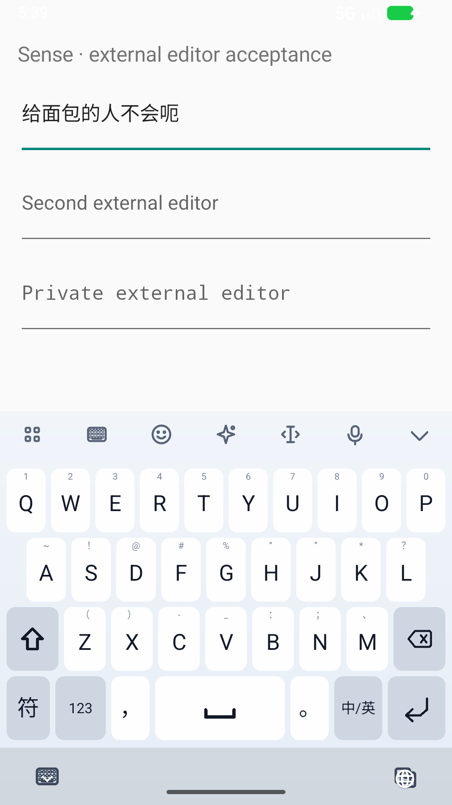
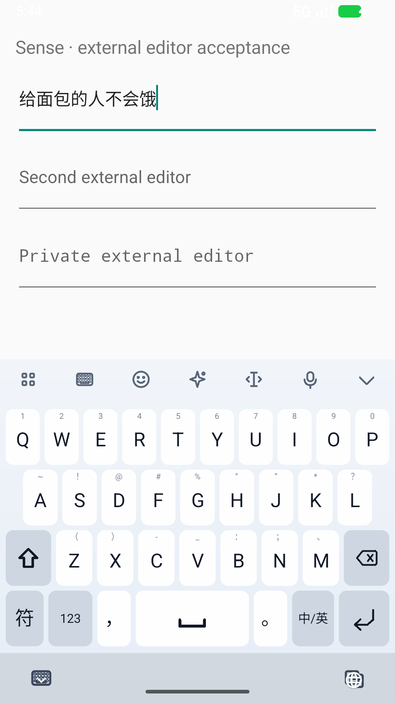

# E6：修复未收录汉字的零分优势

## 结论

在不更换词库、语言模型或联想模型的前提下，修正了一个评分偏差：
**语言模型未收录的汉字得到零特征，反而可能压过已有语料支持的常用字。**
新抽取并事前审核的 62 组句子、929 条原句/合成误触中，首选 **396 → 398**，
前三 **545 → 559**，前十 **627 → 630**；没有原本正确的首选损失。
收益有限，无错句首选仍是 **40/62**，不把这项局部修复称为完整输入质量问题已解决。

E5 的 30.7 万词补充资产仍未进入默认路径。本阶段单独修改缺字评分，避免同时换词库导致原因混淆。

- [事前冻结的候选、门槛、数据与代码](../../benchmarks/results/e6-candidate-freeze.json)
- [质量门槛、逐条变化与原型等价检查](../../benchmarks/results/e6-quality-gate.json)
- [完整阶段工程验收](../../benchmarks/results/e6-acceptance-gate.json)

## 1. 原因与实现

原有已知汉字特征为：

```text
clamp(log P(character | previous two characters) + 6, -6, 6)
```

未知汉字则直接跳过，特征为 0，但仍更新上下文状态。
例如当前模型的“跨”在句首得到负特征，“胯”未被收录而得到 0。
词频虽仍参与打分，两个来源的证据尺度叠加后，缺少语料反而变成了一种优势。

新的生产全拼绑定显式指定：

```text
oovFeature = -4
最终查询特征 = 累计字符特征 × 0.5 / max(1, 原输入字母数 / 6)
```

这是**有界的 log-linear 特征**，不是声称未知字概率等于某个常数，
也没有把整个 UNK 类的概率分给每个未知汉字。已知字概率、上下文 UNK backoff、标点复位、
字符计数方式、词频、拼音编辑代价和搜索预算均保持。

实现边界：

- `PinyinLanguageBinding` / `PinyinLanguageScorer`：每个未知汉字计入一次独立特征。
- `PinyinDecoder.withLanguageModel`：验证参数在 −6…0 且有限；通用调用默认仍为原来的 0。
- `ProductionPinyinDecoders`：只为实际 26 键全拼绑定 −4，九宫格保留原路径。
- 未加载模型、关闭模型或权重为零，仍走旧解码路径。
- 个人新词的 LM 回退条件保持；没有过滤或删除生僻字候选。显式选择仍可将其提升。

先使用主机侧模型包装器做单变量探针，再将等价运算放入正式 scorer。
两种实现对 945 开发、1,874 旧回归、929 E4 回归、48 短词、9 锚点，在 0/−4 两档下，
逐条候选名次、前五文本/分数、字符错误和拼音图诊断完全一致。耗时不参与等价断言。

## 2. 选择与独立审计

已知开发探针：

| 未知字特征 | 945 条首选 | 前三 | 前十 | 字符错误 | 无错句首选 |
|---|---:|---:|---:|---:|---:|
| 0 | 453 | 565 | 613 | 939 | 45/63 |
| −2 | 460 | 575 | 620 | 924 | 46/63 |
| −4 | 461 | 576 | 621 | 910 | 46/63 |
| −6 | 461 | 576 | 623 | 910 | 46/63 |

选取与最优开发首选和字符错误持平的最小幅度 −4，没有为了前十再增加到 −6。
此前的短词审计和 E4 审计均已作为已知回归，后续也只按已知回归统计。
选择是在开发探索后作出的，不宣称预注册；随后冻结正式候选及新审计门槛，输出打开后未调参。

新审计从固定 Tatoeba 测试分片选择 64 个家族，排除前两轮全部 256 个已提案家族及近重复文本，
2 条语料重叠被事前排除，保留 **62 组：30 短句、32 长句**。
逐条拼音及对齐在候选生成前审核；一条重复助词的生硬源句保留并明确标注，没有因预期难解而删除。
所有署名和原始提案在 `benchmarks/corpus/p2c-oov-v3/`，合成规则与冻结输出在 `typo-oov-v3/`。

限制：同一语料分片此前用于联想评测，因此是新的 P2C 家族而不是全新语料域；
agent 审核也不是独立人工金标。每句多个合成变体相关，这些计数不证明自然输入中的统计显著提升。
`joints` 行在当前 progressive 前端去掉分隔符后，是重复无错对照，不代表前端音节分隔已支持。

## 3. 正式解码结果

| 数据 | 条数 | 首选 | 前三 | 前十 | 目标召回 | 字符错误 |
|---|---:|---:|---:|---:|---:|---:|
| 已知开发 | 945 | 453 → 461 | 565 → 576 | 613 → 621 | 692 → 698 | 939 → 910 |
| 已知长句回归 | 1,874 | 837 → 854 | 1,082 → 1,092 | 1,258 → 1,267 | 1,368 → 1,386 | 2,045 → 2,005 |
| E4 已知回归 | 929 | 419 → 423 | 525 → 528 | 596 → 606 | 666 → 666 | 1,051 → 1,036 |
| 新 P2C 家族审计 | 929 | 396 → 398 | 545 → 559 | 627 → 630 | 694 → 695 | 1,062 → 1,059 |
| 48 个已知短词 | 48 | 43 → 43 | 46 → 46 | 47 → 47 | 48 → 48 | 8 → 8 |

上述各组均无原本正确首选损失，但不是所有后续名次或错误答案都保持。
新审计只增加两条首选，分别是：

- 合成重复键：`…dereen`，“……的热嗯”改为目标“……的人”。
- 合成模糊音：`…zhenminzi`，“真抿子”改为目标“真名字”。

已知短词问题没有被这项修改掩盖：“智能体”未学习排名 **20 → 17**，首选仍“只能提”；
“跨会话”**7 → 5**，首选从“胯绘画”到“跨绘画”，仍不是目标。
它们仍需要覆盖与词级证据，而不是继续放大缺字罚分。

## 4. Android 外部编辑框与个人学习

同一新版测试 APK 对照 E4 基线和 E6 开发包。基线 7 项中明确失败 2 项，另外 5 项通过；
新包两个原失败场景已经在真实系统 IME / InputConnection 路径通过：

| 全拼输入 | 基线实际提交 | 新包实际提交 |
|---|---|---|
| `geimianbaoderenbuhuie` | 给面包的人不会呃 | 给面包的人不会饿 |
| `ruguoniquwennaxiebainianrenrui` | 如果你去问那些百年人睿 | 如果你去问那些百年人瑞 |

实际截图均已查看，提交后候选收起、工具栏恢复，未见二者叠加；这仅覆盖图示状态，不替代其他字号/横屏组合。

| 基线 | 新包 |
|---|---|
|  |  |

生产工厂测试还覆盖“胯骨”“程彻”“智能体”的显式学习、默认接受后的再输入、恢复和忘记。
原有 M9 必须通过的个人词整句检查继续保留。
最终 **32 次系统场景**通过：纠错/缺字 7、普通输入 10、冷启动 4、联想 9、学习 2。
SQLite 只读审计确认“程彻”使用计数 4、“智能体”计数 3，强偏好峰值保持；隐私测试词“程澈”未写入。
ABBA 后已恢复最终新包，模拟器默认 IME、字号和方向恢复为测试前状态。

### 本轮确认延迟

使用同一专用 API 37 x86_64 模拟器、同一测试 APK，按基线/新包/新包/基线执行四个块，
每块清理测试用 Debug 配置，关闭学习。64 次确认全部得到固定的完整预期输出。
基线包 SHA 为 `9e5ec26f823139c314a4ec58971fa788817ea45bca66789f2b62db55f8ed18a8`。

| 本轮同机对照 | 基线 | 新包 |
|---|---:|---:|
| 确认到外部编辑框中位数 | 195.5 ms | 185.5 ms |
| 观测 P95 | 367 ms | 311 ms |
| 最大值 | 386 ms | 375 ms |

不概括成全面提速：`nihao` 的中位数 **101 → 128.5 ms**，
`qingfageweizhigeiwo` **176 → 176.5 ms**，第二条长句 **286 → 288.5 ms**。
每条每版本只有四个样本，包含系统调度、触摸注入与轮询，不是实体手机尾延迟保证，也不覆盖首次装载。
保留“今天有一点类”这一旧语义错误作为完整输出对照，不把延迟通过当作该句语义正确。
完整样本和各输入变化见 [延迟报告](../../benchmarks/results/e6-latency.json)。

## 5. 工程核验与边界

本阶段主机测试覆盖 **833 项**：core 301、IME UI 234、service 295、About 3，全部通过。
Python 工具测试运行 **329 项：328 通过、1 跳过**；跳过项依赖 Windows 创建符号链接权限，与输入算法无关。

保留了中途失败：原开发消融单测仍固定 45 个正确首选，新运行已是 46。
现改为读取事前 native 开发回放的版本化基准，不放宽为“任意非零结果”；历史 E4 参考未覆盖。
Android 125 条版本化绑定同时逐条核对当前生产前五和目标名次。

APK 内词库、字 LM、联想模型和完整署名审计通过，没有把 E5 补充资产混入包中。
本轮是本地 Debug 验收，没有发布 release，也没有把模拟器结果当作实体手机结果。

最终 APK：`app/build/outputs/apk/debug/app-debug.apk`，97,094,639 字节，SHA-256：
`dd8b1cef85d331f57d83fe257d4af0b42215feeb9a412c2a4445a1526fd7fb80`。
阶段验收固定了 523 个关闭文件的压缩原始证据，压缩文件和解压后的 SHA 均重新核对。

## 后续重点

1. 将补充来源和基础词频分开建模，尤其避免补词改变“个人新词”的身份而削弱学习回退。
2. 增加新术语/姓名及整句中嵌入新词的覆盖；以新的审计数据验证，不为已见例子硬加名单。
3. 继续处理真实拼音分隔符、同音上下文和联想内容质量。当前短词及新审计仍有明显错误，目标继续推进。
