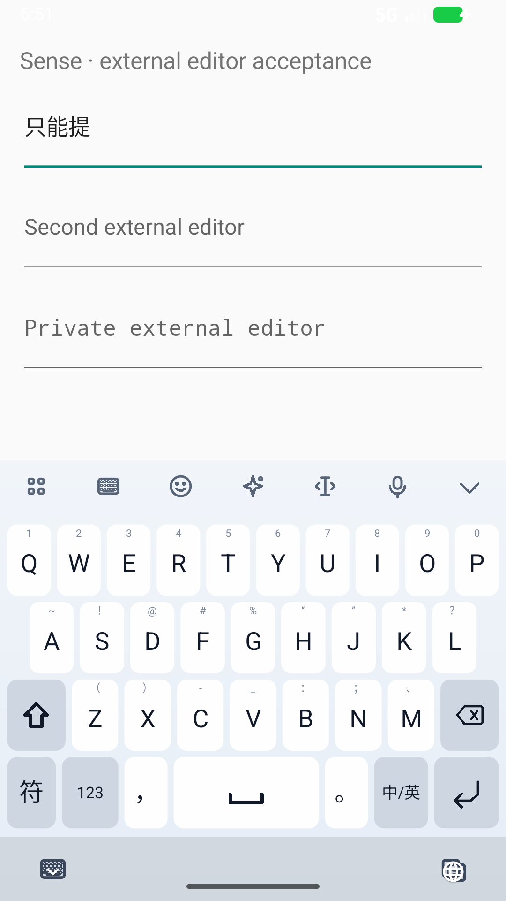
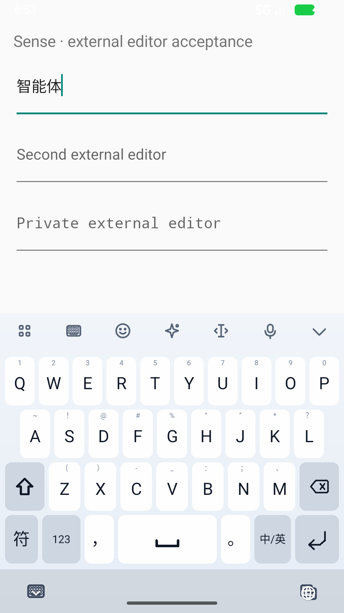
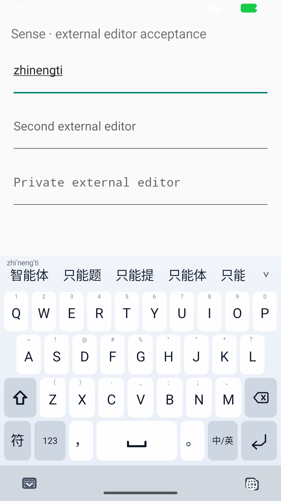

# E7：分层补词、个人词身份和旧路径隔离

状态：开发分支阶段验收；最终结果见 `benchmarks/results/e7-acceptance-gate.json`。不是 release 或真机认证。

## 本轮解决的问题

1. 原基础词库缺少“智能体”。E6 的 LM 缺字校准后，它仍为第 17 位。
2. 直接补词会改变已有个人词的身份：E5 提案中，已学习的“智能体可以帮忙”“我的智能体”从首选降到第三。
   不是用户数据没保存，而是新增基础词使“个人新词的 LM 回退保护”失效。
3. 共用补词索引还影响旧路径：完整测试发现九宫格 `64'426` 首选从“你好”变成“泥蚶”，
   简拼 `yisscp` 的“艺术收藏品”从旧路径候选中消失。全拼质量审计通过后，这两项仍阻止直接交付。

## 实现

- 新增 **SPLX/4 / tier 2**：基础层和补充来源保持独立，旧记录顺序、词频、简拼/前缀索引逐字节保留。
- 评分的 unigram 参照质量、个人词基准仍由基础层计算；不把词库扩容误称为重新归一化的语言概率模型。
- “个人新词”只与基础层比较。新增低先验词不使用户已学词失去保护；接受、重用、恢复、忘记完整闭环保持。
- **补充层只进入绑定字符 LM 的全拼路径**。同一字节资产提供基础/完整两组紧凑偏移索引；
  九宫格和未绑定 LM 的路径使用基础索引，连记录不存在与扫描预算都与原资产一致，而非最后过滤结果。
- 通用 InputStream 加载在读入阶段执行 64 MiB 上限，不信任 `available()`；短读、零字节读有回归。
  Android 生产加载继续固定包大小/散列、后台单次分配和进程内只读复用。
- 增加 About 中的雾凇来源和完整 GPL 文本。原联想模型的训练字典散列保持，APK 审计新增“移除 tier 2 后恢复原字节”的检查。

## 数据与可重建性

雾凇固定为 [iDvel/rime-ice / 3aea6d3](https://github.com/iDvel/rime-ice/tree/3aea6d3694fb3d94ec663641f021f788822897ad)，
使用 `base / ext / others`，原文、原头部和 GPL-3.0 文本保留在源码目录。
按预设规则取基础层缺失的 2～8 汉字/规范拼音对，**306,963 条**；不按测试答案选词。
统一弱先验选择 1，而非把上游不具可比性的原始权重与基础频率直接合并。

| 项目 | 原资产 | 分层资产 |
|---|---:|---:|
| 字节 | 35,069,585 | 46,495,514 |
| 索引记录 | 823,782 | 1,106,451 |
| exact 读音/词条对 | 610,298 | 917,261 |
| exact 不同文本 | 608,314 | 914,124 |

当前资产 SHA-256：`edc44ba08920436ee0b6fbbfed6adad7e5028ac35c2ce4af87c5394fdf046232`。
投影后的基础字节 SHA-256：`71258c3d1b4cade8693a13564ead0217a7e92068bbe554ecc806ae0f3a08e800`。

`tools/rebuild_layered_pinyin.py` 已从仓库中的原始来源离线重建出相同字节，不依赖临时缓存下载。
运行说明在 `ime-service/src/main/lexicon/README.md`。原二元/联想模型重建显式使用投影后的旧字典，
不把补词默默混入旧训练依赖。字符和联想模型本身未重训。

## 冻结、审计与诚实边界

开发阶段比较弱先验 1/16/64：945 条旧开发重放的首选为 461→462/462/461；
64 有一个原正确首选损失；1 和 16 首选相同，1 的字符错误更少，因此选 1。
选参是在查看开发集后制定的，不冒充预注册。所选方案开发字符错误仍由 910 增为 911。

`e7-candidate-freeze.json` 保存候选、数据和 79 个文件的散列；在打开新审计输出前冻结。

- 新词组审计：先人工编写 72 条日常/软件/AI 词组；排除 9 条与既有标签重叠项，不补新项；保留 63 条。
  这是开发智能体编写的词组，不是独立人类自然输入样本；仍可能共享已有词素。
- 新 P2C：排除 320 个既有提案族，从同一固定 Tatoeba 分区选 64 个新族；在输出前审阅全部标签。
  “挂著铃铛”的读音改为 `gua zhe`，原字形保留；没有看输出后改答案。
  生成 959 条无错/合成误触重放。`joints` 行在该 runner 中仍是无错对照的重复，不代表前端隔音符覆盖。
- 来源仍与此前模型评测同域。既有长句和本轮重新回放不称作新盲测。

| 数据 | 行数 | 首选（前→后） | 前十（前→后） | 字符错误（前→后） | 原正确首选损失 |
|---|---:|---:|---:|---:|---:|
| 新词组 | 63 | 51→51 | 59→59 | 23→23 | 0 |
| 新 P2C/误触 | 959 | 425→425 | 612→612 | 1130→1130 | 0 |
| 已知长句 | 1874 | 854→854 | 1267→1267 | 2005→2006 | 0 |
| 已知 E4 | 929 | 423→423 | 606→606 | 1036→1036 | 0 |
| 已知 E6 | 929 | 398→398 | 630→630 | 1059→1059 | 0 |
| 已知短词 | 48 | 43→43 | 47→48 | 8→8 | 0 |

**不宣称总体准确率显著提高。** 新 P2C 的前三仅 531→532；主要收益是特定缺词覆盖与学习语义稳定。
“智能体”由 17 到 1，“跨会话”仍第 5，首项仍为“跨绘画”。已知长句多出的一个字符错误保留，
其中一些原始单参考句本身生硬，如“我能从世界语这索取什么”；没有为改善统计而删行或改标签。

### 审计后的工程修正单独记录

最初全量测试的 T9/简拼失败保留在证据中。随后加了上述 LM-only 索引路由，
冻结于 `e7-routing-freeze.json`；这是看过结果后的兼容性修正，不是第二次盲测或调权。
重新执行 5,747 行：所有已记录候选/分数/名次/计数/拼音图诊断均与原冻结全拼结果一致，
仅计时和经审阅的源码散列不同。个人词阶段输出也一致。
另外与旧字典比较 **72 组旧解码、104 组 T9 的完整结果对象**，全部相同。

新增检查还发现 `yisscp` 在 E6 的 LM 路径就未召回“艺术收藏品”；新旧配对探针均为空。
该项保留为既有 LM 简拼缺陷，没有写成此次修复成功。旧路径的原测试则已恢复。

## Android 与输入体验

在专用 API 37 x86_64 AVD 上，通过真实 26 键触摸、系统 IME 和另一 UID 的 EditText 检查，
不是直接调用 decoder 后伪装上屏。新旧包使用相同测试 APK：

- 未学习 `zhinengti` 后按空格：旧包实际“只能提”，新包实际“智能体”。
- 快打、确认后续输入、英文 Enter、换输入框、隐私场景、冷启动等待和联想生命周期继续回归。
- 对“程彻”实际逐段选词、再次空格接受、杀进程重启；对“智能体”再检查句首与句尾组句。
- 冷加载组均在 runtime 未就绪时开始打字；候选确认不提前把拼音写出。

对照截图：

| 旧包实际上屏 | 分层词库实际上屏 | 学习并重启后的候选 |
|---|---|---|
|  |  |  |

## 成本与交付身份

- 主机：core 307、UI 234、service 297、About 3，共 **841 项**通过。
- 工具测试：**339 项执行，338 通过，1 项跳过**（Windows 符号链接权限）。
- 增量包完成 33 次系统场景；清理布局后的最终包另执行同一组 33 次场景。
  旧包的 8 项纠错测试只有新增“智能体”用例失败，其余 7 项通过；旧包另通过 4 项冷启动。
- 固定 ABBA 共 64 次热态确认：中位数 **198.5→206.5 ms**，观察到的 P95 **360→356 ms**，
  最大值 **383→438 ms**。`nihao` 中位数 118.5→136 ms，第二个长句 288→309.5 ms；
  保留退步，不因某个 P95 较低宣称提速。
- 一次冷加载确认观察为 2525→2202 ms，仅单次样本；不作冷启动提速结论。
  冷启动场景结束后的 IME **PSS 112,643→129,115 KiB**，约增加 16.1 MiB；不是峰值内存。
- 词库未压缩多 11,425,929 字节，APK 内压缩后的词库多 5,293,694 字节。

增量构建的 APK 原为 117,793,050 字节，ZIP 保留大量历史空洞。调用 Gradle 支持的
`:app:packageDebug --rerun` 后为 **85,809,812 字节**；299 个 ZIP 条目的解压字节全部相同，
APK v2 签名验证通过。没有为缩包删除词库、模型或署名。

**计时使用清理布局前的包**，最终紧凑包有独立上屏/冷启动/学习测试；没有把前者的计时冒充后者的新测量。
最终开发 APK SHA-256：`47bb32a6654a55a1aa4259f517e21de76740dc51119b854fbf0603481b02e084`。
使用本地 **debug 签名**，不是发布证书；本轮没有发布 GitHub release。

原始失败、最终日志、截图、XML、trace、源码快照和逐条输出由 `e7-evidence-manifest.json` 逐项散列归档。

## 后续优先级

1. 前端显式拼音边界的输入、显示、退格与重建生命周期；不以 runner 去掉撇号的测试代表它。
2. LM 路径的简拼召回、未学习技术短词的排名，不再只用扩词量衡量改善。
3. 扩大异域/自然输入与实体手机证据；已有同源合成错误基准保留为回归，不反复宣称独立审计。
4. 联想词边界准确率、低内存与长期编辑会话；输入质量专项继续，不把阶段通过当成全部完成。
