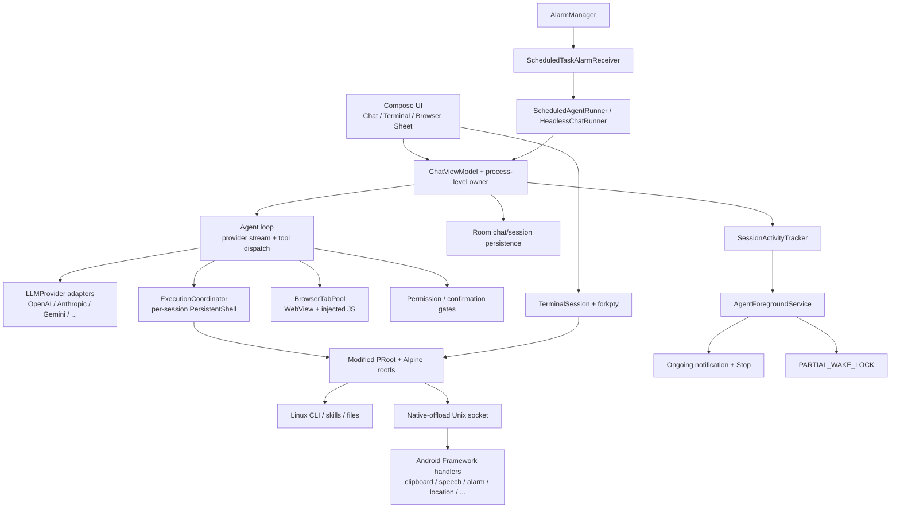
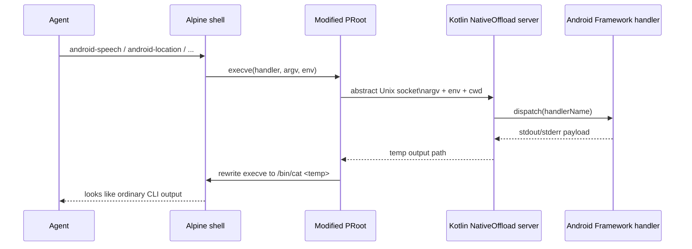
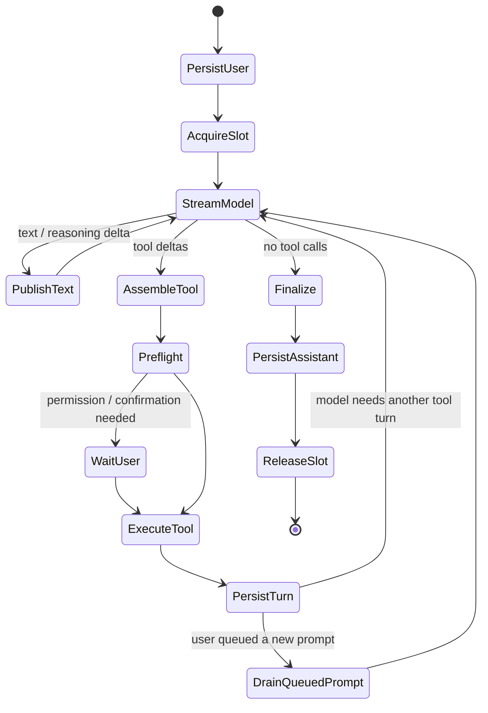

# OpenMinis Android Agent 架构深度分析

> 研究日期：2026-08-03
> 上游仓库：[OpenMinis/OpenMinis](https://github.com/OpenMinis/OpenMinis)
> 固定源码版本：[`9cf3a855fecd27bb5735b84cacbd56852a3ab8dd`](https://github.com/OpenMinis/OpenMinis/tree/9cf3a855fecd27bb5735b84cacbd56852a3ab8dd)（2026-07-25）
> PRoot 子模块版本：[`8cf13e997cdc9472997aae19df8050c073c9a86c`](https://github.com/OpenMinis/proot/tree/8cf13e997cdc9472997aae19df8050c073c9a86c)
> 分析范围：Android 端的终端、浏览器、Agent 循环、工具交互、流式 UI、后台执行、恢复语义，以及对 Sense 的可迁移设计。

## 0. 先给结论

OpenMinis 并不是把一个网页聊天框塞进 Android 壳里。它在同一应用进程中拼出了五层运行时：

1. **设备内 Linux 层**：APK 内置 Alpine rootfs 与 PRoot，在普通 Android 应用 UID 下运行 Linux 命令。
2. **两套终端执行面**：Agent 使用“每会话一个持久 shell”；用户终端使用 `forkpty`、ANSI 终端模拟器和原始字节流。
3. **Android 原生能力桥**：修改过的 PRoot 拦截指定 `execve`，经抽象 Unix socket 把命令交给 Kotlin；Linux 里的 `android-*` 命令实际由 Android Framework 执行。
4. **浏览器工具层**：使用 Android `WebView`，注入 JavaScript 完成 DOM 操作，以标签池、每标签互斥锁、Cookie 复用和位图截图构成模型可调用的浏览器。
5. **Agent 与生命周期层**：不同模型供应商的流统一成事件流，由一个多轮工具循环消费；前台服务、`PARTIAL_WAKE_LOCK`、进程级 ViewModel owner 与 Room 共同支撑后台继续执行及返回页面后的状态接续。

它的“流畅”也不只来自 SSE。源码刻意把以下频率解耦：

- 网络 token 到达频率；
- ViewModel 对 UI 发布文本的频率；
- 消息列表扁平化频率；
- Markdown 解析频率；
- 自动滚动频率；
- Room 持久化频率。

最关键的生命周期结论是：

- **按 Home、锁屏、切换应用、甚至从最近任务划掉 Activity 时，只要应用进程仍存活，正在进行的 Agent 任务可继续流式请求、执行 shell/browser 工具并更新通知。**
- **这并不是跨进程死亡的事务级续跑。**进程被系统结束后，协程、OkHttp 连接、WebView 与 PRoot 子进程均随进程消失；源码会从数据库识别被中断的会话并展示可恢复状态，但没有持久化到足以从精确 token/tool checkpoint 自动重建原任务。
- 定时 Agent 是另一条链路：`AlarmManager` 唤醒应用后新建一次 headless run；它与“恢复一个已被结束的在途 run”是两件事。

## 1. 分析口径与证据等级

本文所有上游源码链接均固定到上述 commit，避免后续主分支变化造成行号漂移。

| 标记 | 含义 |
|---|---|
| **源码事实** | 可以直接从固定 commit 的代码、Manifest 或构建脚本得到。 |
| **工程推断** | 根据源码调用链与 Android 生命周期语义推导，文中会明确标注。 |
| **系统边界** | 由 Android 官方文档给出的平台行为或时限。 |

OpenMinis README 对外描述了本地 shell、浏览器自动化、持久会话和 native offload；Android 工程本身是 Kotlin/Compose + JNI，构建会准备 PRoot 与 Alpine rootfs，见 [README 功能说明](https://github.com/OpenMinis/OpenMinis/blob/9cf3a855fecd27bb5735b84cacbd56852a3ab8dd/README.md#L8-L44)、[Android 构建说明](https://github.com/OpenMinis/OpenMinis/blob/9cf3a855fecd27bb5735b84cacbd56852a3ab8dd/README.md#L121-L153)。当前 Android 配置为 `compileSdk 36`、`minSdk 26`、`targetSdk 35`，且只打包 `arm64-v8a`，见 [`app/build.gradle.kts`](https://github.com/OpenMinis/OpenMinis/blob/9cf3a855fecd27bb5735b84cacbd56852a3ab8dd/src/android/app/build.gradle.kts#L25-L68)。

## 2. 总体架构



### 2.1 进程与线程边界

源码里没有单独的 Agent Android 进程声明，也没有把推理运行时放入远程 Service。主要对象均位于应用进程：

- Compose、`ChatViewModel`、OkHttp 流、浏览器 `WebView`、native-offload server 在同一应用进程；
- PRoot shell 和 PTY shell 是由应用进程启动的子进程；
- Room 是跨重建的数据事实源；
- 前台服务主要提升应用进程优先级、承载通知并持有唤醒锁，并不把 Agent 迁移到另一个独立执行容器。

这解释了两种表面相似、实质不同的现象：Activity 被销毁时任务仍可能继续；整个应用进程消失时，在途运行时对象也随之消失。

### 2.2 启动装配

`MinisApp` 在 `Application.onCreate` 阶段完成数据库、仓库、rootfs、执行协调器、会话跟踪器以及 native handler 的注册。注册的宿主能力包含 alarm、calendar、clipboard、contacts、device、location、notification、open、photos、player、speak、speech、weather、accessibility、model/config/browser/session/schedule 与 Shizuku 等，见 [`MinisApp.kt` 初始化](https://github.com/OpenMinis/OpenMinis/blob/9cf3a855fecd27bb5735b84cacbd56852a3ab8dd/src/android/app/src/main/java/com/openminis/app/MinisApp.kt#L286-L429)。它还接入会话完成通知、应用前后台状态和进程死亡后的 badge 对账，见 [`MinisApp.kt` 会话生命周期装配](https://github.com/OpenMinis/OpenMinis/blob/9cf3a855fecd27bb5735b84cacbd56852a3ab8dd/src/android/app/src/main/java/com/openminis/app/MinisApp.kt#L431-L555)。

## 3. 终端是如何实现的

OpenMinis 的“终端”至少包含四个彼此配合但职责不同的组件：rootfs、PRoot 内核包装、Agent shell、交互式 PTY。

### 3.1 Alpine rootfs 随应用部署

[`RootfsManager.kt`](https://github.com/OpenMinis/OpenMinis/blob/9cf3a855fecd27bb5735b84cacbd56852a3ab8dd/src/android/app/src/main/java/com/openminis/app/sandbox/RootfsManager.kt#L36-L178) 把根文件系统放在应用私有目录 `filesDir/alpine-rootfs`，并把构建产物中的 `libproot.so` 当作 PRoot 可执行文件使用。首次准备时，它解包 APK asset 中的 Alpine minirootfs，并创建：

```text
/var/minis/attachments
/var/minis/offloads
/var/minis/workspace
/var/minis/skills
/var/minis/memory
/var/minis/shared
/var/minis/mounts
```

默认挂载内容会在启动时覆盖到 rootfs，以便应用更新后同步脚本和工具；源码还移除 Python PEP 668 marker，并对随包交付的 MCP 库做只读处理，见 [`RootfsManager.kt` 默认挂载同步](https://github.com/OpenMinis/OpenMinis/blob/9cf3a855fecd27bb5735b84cacbd56852a3ab8dd/src/android/app/src/main/java/com/openminis/app/sandbox/RootfsManager.kt#L309-L365)。

这套方案的价值是：Linux 用户态、包管理器、脚本、skills 与 CLI 路径对 Agent 是统一的，而 Android 原生工程无需为每一种脚本生态分别实现解释器。

### 3.2 PRoot 提供用户态 chroot 体验

[`PRootKernel.kt`](https://github.com/OpenMinis/OpenMinis/blob/9cf3a855fecd27bb5735b84cacbd56852a3ab8dd/src/android/app/src/main/java/com/openminis/app/sandbox/PRootKernel.kt#L50-L178) 负责启动环境、DNS/proxy、bind mount 和 native-offload server。最终参数大致为：

```text
libproot.so
  -0
  --link2symlink
  -r <alpine-rootfs>
  -b /dev -b /proc -b /sys
  -w /root
  ...session bind mounts...
  --native-offload=<abstract-socket>:<handler-list>
  /bin/sh -c <command>
```

完整参数拼装位于 [`PRootKernel.kt`](https://github.com/OpenMinis/OpenMinis/blob/9cf3a855fecd27bb5735b84cacbd56852a3ab8dd/src/android/app/src/main/java/com/openminis/app/sandbox/PRootKernel.kt#L576-L647)。

这里的 “sandbox” 更接近路径翻译与 Linux 工作区。PRoot 是同一 Android UID 下的用户态 syscall/path translation，不是虚拟机或硬件隔离边界；源码还显式 bind mount `/dev`、`/proc`、`/sys` 及多个宿主目录。用它运行受信任的本地 Agent 工具很实用，把它视作强隔离执行器则会高估边界。

### 3.3 Agent shell：每个会话一个持久进程

Agent 调用 `shell` 时不会每条命令都重新解包或重启 Linux。[`ExecutionCoordinator.kt`](https://github.com/OpenMinis/OpenMinis/blob/9cf3a855fecd27bb5735b84cacbd56852a3ab8dd/src/android/app/src/main/java/com/openminis/app/sandbox/ExecutionCoordinator.kt#L11-L124) 维护：

- 一个全局 `PRootKernel`；
- `sessionId -> PersistentShell` 映射；
- `sessionId -> Mutex` 映射；
- 全局创建锁。

因此同一会话的命令串行执行，不同会话可并行；shell 的 `cwd`、环境变量、安装包与后台服务可在该会话后续命令中保留。每个会话的 attachments、offloads、workspace、browser 是独立 bind mount，memory、skills、shared、MCP servers 是全局共享，见 [`ExecutionCoordinator.kt` 挂载模型](https://github.com/OpenMinis/OpenMinis/blob/9cf3a855fecd27bb5735b84cacbd56852a3ab8dd/src/android/app/src/main/java/com/openminis/app/sandbox/ExecutionCoordinator.kt#L165-L223)。

[`PersistentShell.kt`](https://github.com/OpenMinis/OpenMinis/blob/9cf3a855fecd27bb5735b84cacbd56852a3ab8dd/src/android/app/src/main/java/com/openminis/app/sandbox/PersistentShell.kt#L16-L179) 启动长期存在的 PRoot `/bin/sh`，对每次命令追加唯一完成标记：

```text
__MINIS_DONE_<marker>_EXIT_<exit-code>__
```

独立 reader 持续读 stdout，遇到标记后完成对应请求；超时映射为 124，见 [`PersistentShell.kt` 读取与完成协议](https://github.com/OpenMinis/OpenMinis/blob/9cf3a855fecd27bb5735b84cacbd56852a3ab8dd/src/android/app/src/main/java/com/openminis/app/sandbox/PersistentShell.kt#L182-L317)。`ChatViewModel` 在执行时逐行接收输出、更新最近输出预览，并做超时、Bash 语法与敏感文本处理，见 [`ChatViewModel.kt` shell dispatch](https://github.com/OpenMinis/OpenMinis/blob/9cf3a855fecd27bb5735b84cacbd56852a3ab8dd/src/android/app/src/main/java/com/openminis/app/ui/chat/ChatViewModel.kt#L7197-L7377)。

有一处契约漂移值得记录：工具 schema 仍把 shell 描述成 fresh process，而实际 Agent 路径是 per-session persistent shell；可对照 [`AgentTools.kt`](https://github.com/OpenMinis/OpenMinis/blob/9cf3a855fecd27bb5735b84cacbd56852a3ab8dd/src/android/app/src/main/java/com/openminis/app/tools/AgentTools.kt#L39-L53) 与上述实现。对模型而言，这会影响它对 `cd`、`export` 和后台进程是否延续的判断。

### 3.4 用户终端：真正的 PTY，而非日志文本框

交互终端走另一条路径：

1. [`PtyBridge.kt`](https://github.com/OpenMinis/OpenMinis/blob/9cf3a855fecd27bb5735b84cacbd56852a3ab8dd/src/android/app/src/main/java/com/openminis/app/sandbox/PtyBridge.kt#L3-L65) 通过 JNI 暴露 `forkpty/read/write/resize/signal/wait`。
2. [`TerminalSession.kt`](https://github.com/OpenMinis/OpenMinis/blob/9cf3a855fecd27bb5735b84cacbd56852a3ab8dd/src/android/app/src/main/java/com/openminis/app/sandbox/TerminalSession.kt#L21-L203) 用 PTY 启动 PRoot 中的 `/bin/sh -l -i`，保持原始字节输入输出。
3. 同一对象处理 Ctrl+C、窗口 resize、信号与分块写入，见 [`TerminalSession.kt`](https://github.com/OpenMinis/OpenMinis/blob/9cf3a855fecd27bb5735b84cacbd56852a3ab8dd/src/android/app/src/main/java/com/openminis/app/sandbox/TerminalSession.kt#L258-L373)。
4. 自定义 terminal emulator 解析 ANSI/控制序列并维护屏幕 buffer；[`TerminalNativeView.kt`](https://github.com/OpenMinis/OpenMinis/blob/9cf3a855fecd27bb5735b84cacbd56852a3ab8dd/src/android/app/src/main/java/com/openminis/app/ui/terminal/canvas/TerminalNativeView.kt#L43-L166) 把它嵌入 Compose，并在活跃时以约 16 ms 节奏检查版本、触发绘制。
5. [`TerminalScreen.kt`](https://github.com/OpenMinis/OpenMinis/blob/9cf3a855fecd27bb5735b84cacbd56852a3ab8dd/src/android/app/src/main/java/com/openminis/app/ui/terminal/TerminalScreen.kt#L178-L220) 组合 native canvas、隐藏输入框和 PTY resize，[附件键栏](https://github.com/OpenMinis/OpenMinis/blob/9cf3a855fecd27bb5735b84cacbd56852a3ab8dd/src/android/app/src/main/java/com/openminis/app/ui/terminal/TerminalScreen.kt#L365-L409) 提供常用控制键。

所以它具备全屏程序、光标移动、颜色、交互输入和窗口尺寸语义，而不是简单把命令输出追加到 `TextView`。

### 3.5 Native offload：让 Linux CLI 调用 Android Framework

这是 OpenMinis 最有特色的一层。目标是让模型只面对统一的 CLI，但平台 API 仍在原生宿主执行。



[`NativeOffload.kt`](https://github.com/OpenMinis/OpenMinis/blob/9cf3a855fecd27bb5735b84cacbd56852a3ab8dd/src/android/app/src/main/java/com/openminis/app/sandbox/NativeOffload.kt#L15-L217) 创建抽象 Unix socket server，接收 PRoot 传来的 handler、argv、env、cwd，分派给 Kotlin handler，再把输出文件路径返回。PRoot fork 的 native extension 在 `execve/execveat` 前识别 handler，发送请求，随后把原调用改写为 `/bin/cat <result-file>`，见 [PRoot `native_offload.c` 协议](https://github.com/OpenMinis/proot/blob/8cf13e997cdc9472997aae19df8050c073c9a86c/src/extension/native_offload/native_offload.c#L3-L24)、[拦截与改写实现](https://github.com/OpenMinis/proot/blob/8cf13e997cdc9472997aae19df8050c073c9a86c/src/extension/native_offload/native_offload.c#L300-L453)。

当前协议有一个明确折衷：handler 的真实退出码未穿透，最终进程退出状态来自 `/bin/cat`；PRoot 源码注释也写明了这一点。若 Sense 后续采用类似桥，应在响应 envelope 中携带 `exitCode/stdout/stderr/contentType`，避免模型误判工具成功。

## 4. 浏览器是如何实现的

### 4.1 技术选型：WebView + 注入 JS，而非 Playwright

Android 端的浏览器工具核心是系统 `WebView`。工具 schema 暴露 navigate、screenshot、click、type、get_text、scroll、collect/find、page info、fetch、tab、cookies、DOM stable 与 viewport 等动作，并规定最多三个标签，见 [`AgentTools.kt`](https://github.com/OpenMinis/OpenMinis/blob/9cf3a855fecd27bb5735b84cacbd56852a3ab8dd/src/android/app/src/main/java/com/openminis/app/tools/AgentTools.kt#L55-L101)。

[`BrowserUseManager.kt`](https://github.com/OpenMinis/OpenMinis/blob/9cf3a855fecd27bb5735b84cacbd56852a3ab8dd/src/android/app/src/main/java/com/openminis/app/browser/BrowserUseManager.kt#L31-L214) 管理单个 WebView：开启 JavaScript、DOM storage、宽视口、mixed content 与 Cookie，并安装 WebViewClient、下载和 JS bridge。各类 DOM 动作由 [`BrowserUseJS.kt`](https://github.com/OpenMinis/OpenMinis/blob/9cf3a855fecd27bb5735b84cacbd56852a3ab8dd/src/android/app/src/main/java/com/openminis/app/browser/BrowserUseJS.kt) 中的脚本注入页面。

由于 `evaluateJavascript` 只直接返回同步 JS 结果，源码注入 `__minis__` bridge 来承接 Promise 异步回调，见 [`BrowserUseManager.kt` 异步 JS bridge](https://github.com/OpenMinis/OpenMinis/blob/9cf3a855fecd27bb5735b84cacbd56852a3ab8dd/src/android/app/src/main/java/com/openminis/app/browser/BrowserUseManager.kt#L883-L1049)。所有 WebView 操作最终切换到 Main thread，见 [`BrowserUseManager.kt`](https://github.com/OpenMinis/OpenMinis/blob/9cf3a855fecd27bb5735b84cacbd56852a3ab8dd/src/android/app/src/main/java/com/openminis/app/browser/BrowserUseManager.kt#L1227-L1243)。

### 4.2 三标签池与并发策略

[`BrowserTabPool.kt`](https://github.com/OpenMinis/OpenMinis/blob/9cf3a855fecd27bb5735b84cacbd56852a3ab8dd/src/android/app/src/main/java/com/openminis/app/browser/BrowserTabPool.kt#L28-L110) 实现：

- 最多三个 WebView 标签；
- Android 全局 Cookie store 共享登录态；
- 默认约 15 分钟 idle 回收；
- 每标签一个 mutex；
- 同一显式标签上的动作串行，不同标签可并行。

标签分配、动作路由和加锁在 [`BrowserTabPool.kt`](https://github.com/OpenMinis/OpenMinis/blob/9cf3a855fecd27bb5735b84cacbd56852a3ab8dd/src/android/app/src/main/java/com/openminis/app/browser/BrowserTabPool.kt#L522-L817)。这使模型并行收集多个页面时不会互相覆盖同一个 WebView 的导航状态，同时用上限约束内存占用。

### 4.3 截图、文件和 shell 工作区贯通

普通截图通过 WebView 绘制到 bitmap；即使 WebView 当前没有挂在可见 View 树上，代码也会先 measure/layout，再执行 `webView.draw(Canvas(bitmap))`。全页截图高度有 32768 px 上限，见 [`BrowserUseManager.kt` 截图实现](https://github.com/OpenMinis/OpenMinis/blob/9cf3a855fecd27bb5735b84cacbd56852a3ab8dd/src/android/app/src/main/java/com/openminis/app/browser/BrowserUseManager.kt#L651-L823)。

下载文件会复用 WebView Cookie 并写入当前会话 workspace，见 [`BrowserTabPool.kt` 下载处理](https://github.com/OpenMinis/OpenMinis/blob/9cf3a855fecd27bb5735b84cacbd56852a3ab8dd/src/android/app/src/main/java/com/openminis/app/browser/BrowserTabPool.kt#L369-L450)。`ChatViewModel` 把浏览器截图缩放后交给多模态模型，把截图与 fetch/download 结果持久化到会话 browser 目录，并返回 `minis://` URL，见 [`ChatViewModel.kt` browser dispatch](https://github.com/OpenMinis/OpenMinis/blob/9cf3a855fecd27bb5735b84cacbd56852a3ab8dd/src/android/app/src/main/java/com/openminis/app/ui/chat/ChatViewModel.kt#L7380-L7441)。`minis://workspace/...` 又被 WebView 映射到本地文件，见 [`BrowserUseManager.kt`](https://github.com/OpenMinis/OpenMinis/blob/9cf3a855fecd27bb5735b84cacbd56852a3ab8dd/src/android/app/src/main/java/com/openminis/app/browser/BrowserUseManager.kt#L396-L427)。

结果是浏览器和 shell 并非两个孤岛：浏览器下载的文件立刻出现在 Linux `/var/minis/workspace`，shell 处理后的 HTML/图片也可通过 `minis://workspace` 再由浏览器打开。

### 4.4 同一 WebView 可由 Agent 与用户接管

[`BrowserWebView.kt`](https://github.com/OpenMinis/OpenMinis/blob/9cf3a855fecd27bb5735b84cacbd56852a3ab8dd/src/android/app/src/main/java/com/openminis/app/ui/browser/BrowserWebView.kt#L12-L73) 并不创建一份展示副本，而是把 pool 当前持有的真实 WebView 重新挂到 Compose 的 `AndroidView` container。浏览器 sheet 在 Agent 工作时显示 busy overlay，用户选择接管后会释放 Agent 标签占用，见 [`BrowserSheet.kt`](https://github.com/OpenMinis/OpenMinis/blob/9cf3a855fecd27bb5735b84cacbd56852a3ab8dd/src/android/app/src/main/java/com/openminis/app/ui/browser/BrowserSheet.kt#L302-L340)、[接管逻辑](https://github.com/OpenMinis/OpenMinis/blob/9cf3a855fecd27bb5735b84cacbd56852a3ab8dd/src/android/app/src/main/java/com/openminis/app/ui/browser/BrowserSheet.kt#L573-L623)。

这就是工具调用与用户交互之间流畅切换的关键：两者操作的是同一标签状态、同一 DOM、同一 Cookie，而不是把截图当作伪浏览器。

## 5. 对话与工具调用是如何实现的

### 5.1 先把不同供应商统一为事件代数

[`LLMProvider.kt`](https://github.com/OpenMinis/OpenMinis/blob/9cf3a855fecd27bb5735b84cacbd56852a3ab8dd/src/android/app/src/main/java/com/openminis/app/provider/LLMProvider.kt#L13-L162) 定义统一的 provider 接口，流式输出类型为 `Flow<LLMStreamChunk>`。[`LLMStreamChunk.kt`](https://github.com/OpenMinis/OpenMinis/blob/9cf3a855fecd27bb5735b84cacbd56852a3ab8dd/src/android/app/src/main/java/com/openminis/app/data/model/LLMStreamChunk.kt#L5-L31) 把上游差异归一为：

```text
Started
Text
ThinkingDelta / ReasoningContent
ToolUseStart
ToolInputDelta
ToolCallComplete
Media
Usage
Finished
```

因此 Agent 循环不需要分别理解 OpenAI、Anthropic、Gemini 的 wire event。以 OpenAI 为例，provider 使用 `callbackFlow` 包装 OkHttp，设置首 token watchdog，解析 SSE `data:` 与 `[DONE]`，同时兼容 Responses API 和 Chat Completions 的文本、reasoning 与 tool call 增量，见 [`OpenAIProvider.kt` 请求与 watchdog](https://github.com/OpenMinis/OpenMinis/blob/9cf3a855fecd27bb5735b84cacbd56852a3ab8dd/src/android/app/src/main/java/com/openminis/app/provider/openai/OpenAIProvider.kt#L464-L590)、[SSE 事件映射](https://github.com/OpenMinis/OpenMinis/blob/9cf3a855fecd27bb5735b84cacbd56852a3ab8dd/src/android/app/src/main/java/com/openminis/app/provider/openai/OpenAIProvider.kt#L643-L866)、[tool call 聚合与收尾](https://github.com/OpenMinis/OpenMinis/blob/9cf3a855fecd27bb5735b84cacbd56852a3ab8dd/src/android/app/src/main/java/com/openminis/app/provider/openai/OpenAIProvider.kt#L962-L1152)。

### 5.2 Agent 循环是一台多阶段状态机

`ChatViewModel.kt` 是当前主编排器，文件接近一万行。简化后的每一轮如下：



关键实现：

- 最大工具轮数为 200，并对超大历史只暴露尾部窗口，见 [`ChatViewModel.kt`](https://github.com/OpenMinis/OpenMinis/blob/9cf3a855fecd27bb5735b84cacbd56852a3ab8dd/src/android/app/src/main/java/com/openminis/app/ui/chat/ChatViewModel.kt#L229-L460)。
- 点击发送时先同步切换 streaming 状态，抑制快速双击；用户消息在网络调用前先落 Room；随后在 `viewModelScope + Dispatchers.IO` 中占用会话并发槽、登记 active 状态、进入 Agent loop，见 [`sendMessage`](https://github.com/OpenMinis/OpenMinis/blob/9cf3a855fecd27bb5735b84cacbd56852a3ab8dd/src/android/app/src/main/java/com/openminis/app/ui/chat/ChatViewModel.kt#L4794-L5035)。
- 流事件消费、文本发布、工具参数聚合、重试/fallback、JSON repair、循环检测、preflight、工具执行、结果落库和下一轮组装集中在 [`runAgentLoop`](https://github.com/OpenMinis/OpenMinis/blob/9cf3a855fecd27bb5735b84cacbd56852a3ab8dd/src/android/app/src/main/java/com/openminis/app/ui/chat/ChatViewModel.kt#L5779-L7089)。
- 用户在工具运行期间发送的新消息先进入队列；当前工具形成完整 assistant/tool pair 后，再插入 bridge message，保证供应商要求的 role 顺序，见 [`ChatViewModel.kt` 排队与注入](https://github.com/OpenMinis/OpenMinis/blob/9cf3a855fecd27bb5735b84cacbd56852a3ab8dd/src/android/app/src/main/java/com/openminis/app/ui/chat/ChatViewModel.kt#L4492-L4705)。
- 全局并发管理默认最多五个 session run，且有 FIFO 等待队列，见 [`SessionConcurrencyManager.kt`](https://github.com/OpenMinis/OpenMinis/blob/9cf3a855fecd27bb5735b84cacbd56852a3ab8dd/src/android/app/src/main/java/com/openminis/app/service/SessionConcurrencyManager.kt#L11-L59)。

### 5.3 工具调用不是一次性 RPC，而是可观察的 UI 对象

工具从参数生成开始就有状态：`ToolUseStart` 创建 UI item，`ToolInputDelta` 逐步补齐参数，`ToolCallComplete` 标为 pending，preflight 后进入 running，最终写入 typed result。重型文件工具的参数刷新节奏比普通工具更低，避免大 JSON 在主线程频繁复制；相关节流可见 [`ChatViewModel.kt`](https://github.com/OpenMinis/OpenMinis/blob/9cf3a855fecd27bb5735b84cacbd56852a3ab8dd/src/android/app/src/main/java/com/openminis/app/ui/chat/ChatViewModel.kt#L6218-L6301)。

用户因而能看到“模型正在准备哪个工具、参数是什么、正在执行、结果如何”，而不是只看到最终一坨文本。

## 6. 为什么流式对话看起来流畅

### 6.1 token side channel：避免每个 token 重建整棵消息树

`ChatViewModel` 把持久/规范消息列表与正在生成的文本分开：canonical messages 存完整历史，`_streamingById` 仅存活跃消息的 delta。源码注释明确记录，过去直接修改顶层消息列表会造成约 94 ms 的重组开销，见 [`ChatViewModel.kt`](https://github.com/OpenMinis/OpenMinis/blob/9cf3a855fecd27bb5735b84cacbd56852a3ab8dd/src/android/app/src/main/java/com/openminis/app/ui/chat/ChatViewModel.kt#L417-L460)。

网络 token 也不是每次到达都立即发布到 Compose。随着内容增长，UI flush 间隔从约 150 ms 逐步增至 2 s，控制大文本复制与 Markdown 重解析成本，见 [`ChatViewModel.kt` adaptive flush](https://github.com/OpenMinis/OpenMinis/blob/9cf3a855fecd27bb5735b84cacbd56852a3ab8dd/src/android/app/src/main/java/com/openminis/app/ui/chat/ChatViewModel.kt#L5843-L5850)。

### 6.2 frozen prefix + live suffix

[`ChatFlatItems.kt`](https://github.com/OpenMinis/OpenMinis/blob/9cf3a855fecd27bb5735b84cacbd56852a3ab8dd/src/android/app/src/main/java/com/openminis/app/ui/chat/ChatFlatItems.kt#L274-L400) 定义稳定 row 类型，并手写轻量 `equals`，避免对超长字符串反复深比较。消息被扁平化为独立行，已完成的前缀保持 frozen，只有尾部 live fragment 变化；流结束时 key 继续保持稳定，见 [`ChatFlatItems.kt`](https://github.com/OpenMinis/OpenMinis/blob/9cf3a855fecd27bb5735b84cacbd56852a3ab8dd/src/android/app/src/main/java/com/openminis/app/ui/chat/ChatFlatItems.kt#L486-L735)。

`ChatScreen` 把 messages 与 streaming overlay 合并后执行 `conflate`、约 80 ms sampling，并在 `Dispatchers.Default` 重建 live suffix；LazyColumn 使用 stable key 与 `contentType`，见 [`ChatScreen.kt` 扁平化流水线](https://github.com/OpenMinis/OpenMinis/blob/9cf3a855fecd27bb5735b84cacbd56852a3ab8dd/src/android/app/src/main/java/com/openminis/app/ui/chat/ChatScreen.kt#L2601-L2815)、[`LazyColumn` 配置](https://github.com/OpenMinis/OpenMinis/blob/9cf3a855fecd27bb5735b84cacbd56852a3ab8dd/src/android/app/src/main/java/com/openminis/app/ui/chat/ChatScreen.kt#L3009-L3129)。自动滚动也单独 conflate/sample，并在流结束后 settle，见 [`ChatScreen.kt`](https://github.com/OpenMinis/OpenMinis/blob/9cf3a855fecd27bb5735b84cacbd56852a3ab8dd/src/android/app/src/main/java/com/openminis/app/ui/chat/ChatScreen.kt#L1366-L1555)。

### 6.3 Markdown 采用增量与降级策略

[`StreamingMarkdownText.kt`](https://github.com/OpenMinis/OpenMinis/blob/9cf3a855fecd27bb5735b84cacbd56852a3ab8dd/src/android/app/src/main/java/com/openminis/app/ui/chat/StreamingMarkdownText.kt#L528-L600) 在后台线程解析 Markdown，只让最后一个 block 维持 live 状态；段落与 fenced code block 使用稳定切分，已冻结 fragment 合并并缓存。进程级缓存与 cold miss 的纯文本 preview 位于 [`StreamingMarkdownText.kt`](https://github.com/OpenMinis/OpenMinis/blob/9cf3a855fecd27bb5735b84cacbd56852a3ab8dd/src/android/app/src/main/java/com/openminis/app/ui/chat/StreamingMarkdownText.kt#L848-L1003)。当 live fragment 超过约 8 KiB，会退化到有界尾部预览，而不是每次解析整个巨型块。

### 6.4 流畅性分层表

| 层 | 源频率 | UI/存储策略 | 解决的问题 |
|---|---:|---|---|
| Provider | token/SSE event | 归一化为 `LLMStreamChunk` | 隔离供应商协议差异 |
| ViewModel stream buffer | 高频 | 150 ms～2 s 自适应 flush | 降低字符串复制和顶层 state 更新 |
| Flat item projection | 中频 | `conflate + sample ~80 ms`，后台线程 | 降低列表重建 |
| Scroll | 帧/采样驱动 | 独立通道与结束 settle | 避免 token 更新绑死滚动 |
| Markdown | block 级 | frozen/live 分离、缓存、大块降级 | 降低重复解析和布局 |
| Room | 消息/工具轮边界 | 用户消息先落库，assistant/tool 成对落库 | 避免逐 token 数据库写入 |

这套分层比“收到 token 就更新一个 `mutableStateOf(fullText)`”复杂很多，却正是长会话仍能保持可操作性的原因。

## 7. 用户交互与权限暂停是如何贯穿工具调用的

### 7.1 Android 权限与工具许可共享一个 suspend 模型

[`OffloadPermissionManager.kt`](https://github.com/OpenMinis/OpenMinis/blob/9cf3a855fecd27bb5735b84cacbd56852a3ab8dd/src/android/app/src/main/java/com/openminis/app/offload/OffloadPermissionManager.kt#L19-L25) 使用 tri-state 决策，并通过 `StateFlow<PendingRequest?> + continuation` 把一次工具检查暂停最多约 120 秒：

- Android runtime permission 请求；
- 跳转系统设置的特殊权限；
- ask once / allow session / deny session。

对应实现见 [`OffloadPermissionManager.kt`](https://github.com/OpenMinis/OpenMinis/blob/9cf3a855fecd27bb5735b84cacbd56852a3ab8dd/src/android/app/src/main/java/com/openminis/app/offload/OffloadPermissionManager.kt#L118-L291)、[会话许可决策](https://github.com/OpenMinis/OpenMinis/blob/9cf3a855fecd27bb5735b84cacbd56852a3ab8dd/src/android/app/src/main/java/com/openminis/app/offload/OffloadPermissionManager.kt#L336-L413)。所有 `android-*` native handler 先经过 [`OffloadGate.kt`](https://github.com/OpenMinis/OpenMinis/blob/9cf3a855fecd27bb5735b84cacbd56852a3ab8dd/src/android/app/src/main/java/com/openminis/app/sandbox/offload/OffloadGate.kt#L9-L50)，同步 IPC worker 用 `runBlocking` 等待 suspend gate，用户选择后 continuation 恢复，结果再回给 guest shell。

`MainActivity` 将 pending request 接到 Activity Result API 和系统设置页，Compose dialog 展示决策。于是等待权限时，shell 进程仍在等本次 native-offload 响应，Agent 状态也仍是同一 tool call；用户点选后它从原位置继续，而非另起一条聊天消息。

### 7.2 配置修改采用独立 FIFO confirmation gate

[`ConfigConfirmationGate.kt`](https://github.com/OpenMinis/OpenMinis/blob/9cf3a855fecd27bb5735b84cacbd56852a3ab8dd/src/android/app/src/main/java/com/openminis/app/config/confirm/ConfigConfirmationGate.kt#L19-L184) 对配置写操作建立 FIFO 队列，同样使用 suspend/resume，超时约 120 秒。根级 dialog host 挂在 `MainActivity` 顶层，和具体页面解耦，见 [`MainActivity.kt`](https://github.com/OpenMinis/OpenMinis/blob/9cf3a855fecd27bb5735b84cacbd56852a3ab8dd/src/android/app/src/main/java/com/openminis/app/MainActivity.kt#L434-L441)。应用在后台时还可发通知，把用户 deep-link 回对应会话继续确认。

这是工具调用 UX 值得借鉴的抽象：**工具不是“调用后祈祷成功”，而是一条允许进入 `WAITING_USER` 的长期状态机；UI 只是 pending state 的一个观察者。**

## 8. 后台保活与持续输出的真实机制

### 8.1 `active` 与 `present` 分开追踪

[`SessionActivityTracker.kt`](https://github.com/OpenMinis/OpenMinis/blob/9cf3a855fecd27bb5735b84cacbd56852a3ab8dd/src/android/app/src/main/java/com/openminis/app/service/SessionActivityTracker.kt#L9-L42) 维护两组会话：

- `activeSessions`：LLM 流或工具仍在运行；
- `presentSessions`：用户仍位于聊天 route，即使当前没在生成。

任一集合非空就运行前台服务，见 [`shouldRunService`](https://github.com/OpenMinis/OpenMinis/blob/9cf3a855fecd27bb5735b84cacbd56852a3ab8dd/src/android/app/src/main/java/com/openminis/app/service/SessionActivityTracker.kt#L155-L177)。`setActive/setInactive` 还注册每会话 cancel callback，使通知中的 Stop 能结束实际 stream job，而非只隐藏通知，见 [`SessionActivityTracker.kt`](https://github.com/OpenMinis/OpenMinis/blob/9cf3a855fecd27bb5735b84cacbd56852a3ab8dd/src/android/app/src/main/java/com/openminis/app/service/SessionActivityTracker.kt#L255-L329)、[取消分发](https://github.com/OpenMinis/OpenMinis/blob/9cf3a855fecd27bb5735b84cacbd56852a3ab8dd/src/android/app/src/main/java/com/openminis/app/service/SessionActivityTracker.kt#L395-L415)。

`MainActivity` 监听 Navigation back stack：进入 chat 调 `setPresent`，离开调 `setAbsent`；按 Home/锁屏只进入后台，通常不触发 Activity `onDestroy`，presence 因而保留，见 [`MainActivity.kt`](https://github.com/OpenMinis/OpenMinis/blob/9cf3a855fecd27bb5735b84cacbd56852a3ab8dd/src/android/app/src/main/java/com/openminis/app/MainActivity.kt#L395-L420)、[`onDestroy`](https://github.com/OpenMinis/OpenMinis/blob/9cf3a855fecd27bb5735b84cacbd56852a3ab8dd/src/android/app/src/main/java/com/openminis/app/MainActivity.kt#L493-L503)。

### 8.2 前台服务、通知与唤醒锁

Manifest 声明网络、通知、wake lock、exact alarm、boot 与前台服务权限；服务类型被声明为 `mediaPlayback`。源码注释明确说它从 `dataSync` 切换而来，以避开 Android 15 对 `dataSync` 的时长上限，见 [`AndroidManifest.xml`](https://github.com/OpenMinis/OpenMinis/blob/9cf3a855fecd27bb5735b84cacbd56852a3ab8dd/src/android/app/src/main/AndroidManifest.xml#L5-L46)、[服务声明](https://github.com/OpenMinis/OpenMinis/blob/9cf3a855fecd27bb5735b84cacbd56852a3ab8dd/src/android/app/src/main/AndroidManifest.xml#L434-L441)。

[`AgentForegroundService.kt`](https://github.com/OpenMinis/OpenMinis/blob/9cf3a855fecd27bb5735b84cacbd56852a3ab8dd/src/android/app/src/main/java/com/openminis/app/service/AgentForegroundService.kt#L124-L210) 在创建时建通知 channel、取得 wake lock、启动悬浮状态观察器；`onStartCommand` 立即 `startForeground(...)` 并返回 `START_STICKY`。通知展示 session 数、工具状态和运行时长，并提供真正连接到 `cancelAllActiveStreams()` 的 Stop action，见 [`AgentForegroundService.kt`](https://github.com/OpenMinis/OpenMinis/blob/9cf3a855fecd27bb5735b84cacbd56852a3ab8dd/src/android/app/src/main/java/com/openminis/app/service/AgentForegroundService.kt#L663-L771)。

服务持有非引用计数的 `PARTIAL_WAKE_LOCK`，没有 timeout，直到 `onDestroy` 才释放，见 [`AgentForegroundService.kt`](https://github.com/OpenMinis/OpenMinis/blob/9cf3a855fecd27bb5735b84cacbd56852a3ab8dd/src/android/app/src/main/java/com/openminis/app/service/AgentForegroundService.kt#L550-L587)。这让熄屏后 CPU 继续调度网络、解析和 shell reader；代价是服务生命周期越长，耗电暴露越高。

用户从最近任务划掉应用时，`onTaskRemoved` 先清除纯 presence；若仍有 active run，就重新发布前台通知并继续服务，若没有 active run 则停止，见 [`AgentForegroundService.kt`](https://github.com/OpenMinis/OpenMinis/blob/9cf3a855fecd27bb5735b84cacbd56852a3ab8dd/src/android/app/src/main/java/com/openminis/app/service/AgentForegroundService.kt#L215-L257)。

### 8.3 为什么页面离开后，Agent API 还能跑并继续产出

把调用链连起来就很清楚：

```mermaid
sequenceDiagram
    participant U as User
    participant A as MainActivity
    participant V as Process-level ChatViewModel
    participant T as SessionActivityTracker
    participant F as ForegroundService
    participant P as Provider / Tool runtime
    participant R as Room

    U->>V: send prompt
    V->>R: persist user message
    V->>T: setActive(sessionId, cancel)
    T->>F: startForegroundService
    F->>F: ongoing notification + wake lock
    V->>P: collect streaming flow / run tools
    U->>A: Home / lock / app switch
    Note over A,V: Activity backgrounded; app process and VM remain
    P-->>V: token and tool events continue
    V->>R: persist completed message/tool boundaries
    V->>T: update status / setInactive
    U->>A: return to chat
    A->>V: attach to same process-level owner
    V-->>A: current StateFlow + Room-backed history
```

关键是 `ChatViewModelStore` 使用进程级、按 sessionId 保存的 owner；离开 Compose navigation back stack 时不会随 route owner 一起清理 `viewModelScope`。见 [`ChatViewModelStore.kt`](https://github.com/OpenMinis/OpenMinis/blob/9cf3a855fecd27bb5735b84cacbd56852a3ab8dd/src/android/app/src/main/java/com/openminis/app/ui/chat/ChatViewModelStore.kt#L7-L64) 与 [`ChatScreen.kt` owner 绑定](https://github.com/OpenMinis/OpenMinis/blob/9cf3a855fecd27bb5735b84cacbd56852a3ab8dd/src/android/app/src/main/java/com/openminis/app/ui/chat/ChatScreen.kt#L413-L438)。

因此，实际保活组合是：

```text
process-level ViewModel / CoroutineScope
        + foreground service process importance
        + PARTIAL_WAKE_LOCK CPU scheduling
        + ongoing notification user visibility
        + Room message/session persistence
        + PRoot/WebView still living in the same process
```

单独复制其中一项效果会明显缩水。例如只有前台服务而把任务协程绑在页面 ViewModel，离开 route 仍会取消任务；只有进程级 scope 而缺少 FGS，后台进程更容易进入回收候选；只有 Room，则保住历史但保不住在途 socket 与子进程。

### 8.4 进程死亡后的边界

Android 官方对 [`START_STICKY`](https://developer.android.com/reference/android/app/Service#START_STICKY) 的定义是：服务进程被结束后，系统可在稍后重建服务，重建调用可能收到 `null` intent。它并不序列化原协程栈、OkHttp connection、WebView DOM 或 PRoot 进程。

结合源码，可得到以下恢复矩阵：

| 场景 | 正在进行的网络/工具 | UI 返回 | 数据结果 |
|---|---|---|---|
| Activity 暂停、Home、锁屏 | 通常继续 | 重新观察同一个 ViewModel state | 完整 |
| Activity 真正重建，但应用进程仍在 | process-level store 中继续 | 新 UI 连接现有 owner | 完整 |
| 从最近任务划掉，active run 仍在 | `onTaskRemoved` 重新锚定 FGS，通常继续 | deep link/重开后接回 | 完整 |
| 应用进程被 LMK/OEM 结束 | 在途协程、socket、WebView、PRoot 子进程终止 | Activity/session 可重建 | 已落 Room 的边界保留；未落库的流尾可能丢失 |
| sticky Service 被系统重建 | 新 Service 与通知可重新建立 | 没有原 run 的内存状态 | 源码未实现精确 checkpoint replay |

用户消息在发请求前持久化；完整 assistant/tool turn 在边界持久化。流式 assistant 文本主要存在 side channel，突然的进程死亡可能留下最后一段尚未提交的文本。应用启动时会读取数据库尾部，把未正常结束的 session 对账为 interrupted/paused badge，见 [`SessionBadgeStore.kt`](https://github.com/OpenMinis/OpenMinis/blob/9cf3a855fecd27bb5735b84cacbd56852a3ab8dd/src/android/app/src/main/java/com/openminis/app/service/SessionBadgeStore.kt#L82-L114)、[`ChatDao.kt` interrupted 查询](https://github.com/OpenMinis/OpenMinis/blob/9cf3a855fecd27bb5735b84cacbd56852a3ab8dd/src/android/app/src/main/java/com/openminis/app/data/db/ChatDao.kt#L156-L207)。这是“检测中断并允许用户续接”，不是原执行栈的透明复活。

### 8.5 Android 15+ 的系统时限与项目当前取舍

[Android 官方前台服务超时文档](https://developer.android.com/develop/background-work/services/fgs/timeout) 说明，target Android 15 及以上时，`dataSync` 与 `mediaProcessing` 前台服务在滚动 24 小时内各有总计 6 小时时限。OpenMinis 当前 targetSdk 35，却把 Agent 服务标成 `mediaPlayback`；从源码注释看，这是为长任务规避 `dataSync` 限制的刻意做法，而非 Agent 真的持续播放媒体。

这在工程上有效延长了任务存活窗口，但 service type 与真实工作语义存在偏差，应用商店审核、未来平台校验和 OEM 行为都可能变化。Sense 迁移时应依据自身发布渠道和实际工作类型重新设计，不宜机械照搬该声明。

[Android wake lock 文档](https://developer.android.com/develop/background-work/background-tasks/awake/wakelock) 也强调 wake lock 会增加耗电，应尽量缩短持有时间。OpenMinis 把它绑定整个服务寿命，覆盖了“用户只停留在 chat 但暂无 active run”的 presence 场景；这能提升稳定性，但比“只在模型流或工具执行时持有”更耗电。

### 8.6 电池优化与 OEM 设置只是补充层

[`PowerOptimizationManager.kt`](https://github.com/OpenMinis/OpenMinis/blob/9cf3a855fecd27bb5735b84cacbd56852a3ab8dd/src/android/app/src/main/java/com/openminis/app/power/PowerOptimizationManager.kt#L14-L173) 检查 battery optimization exemption，并为 MIUI、EMUI、ColorOS 等 ROM 提供厂商设置入口。它并非 FGS/进程级 scope 的替代品，只是进一步降低 OEM 后台管控造成的中断概率。

## 9. 定时 Agent：为何它也能在后台启动

定时任务不依赖某个已经打开的 chat 页面：

1. [`ScheduledTaskManager.kt`](https://github.com/OpenMinis/OpenMinis/blob/9cf3a855fecd27bb5735b84cacbd56852a3ab8dd/src/android/app/src/main/java/com/openminis/app/scheduled/ScheduledTaskManager.kt) 使用 `setExactAndAllowWhileIdle`，并在每次触发后显式计算下一次时间。
2. [`ScheduledTaskAlarmReceiver.kt`](https://github.com/OpenMinis/OpenMinis/blob/9cf3a855fecd27bb5735b84cacbd56852a3ab8dd/src/android/app/src/main/java/com/openminis/app/scheduled/ScheduledTaskAlarmReceiver.kt#L12-L50) 通过 `goAsync()` 接收 alarm，先补排下一次，再交给 runner。
3. [`ScheduledAgentRunner.kt`](https://github.com/OpenMinis/OpenMinis/blob/9cf3a855fecd27bb5735b84cacbd56852a3ab8dd/src/android/app/src/main/java/com/openminis/app/scheduled/ScheduledAgentRunner.kt#L18-L108) 启动前台服务、解析 session，并在应用级 scope 发起 headless run。
4. [`HeadlessChatRunner.kt`](https://github.com/OpenMinis/OpenMinis/blob/9cf3a855fecd27bb5735b84cacbd56852a3ab8dd/src/android/app/src/main/java/com/openminis/app/debug/HeadlessChatRunner.kt#L16-L69) 复用 process-wide `ChatViewModelStore`；发送后观察 `isStreaming`，完成时从数据库读结果，见 [等待与结果读取](https://github.com/OpenMinis/OpenMinis/blob/9cf3a855fecd27bb5735b84cacbd56852a3ab8dd/src/android/app/src/main/java/com/openminis/app/debug/HeadlessChatRunner.kt#L153-L247)。

[Android AlarmManager 官方文档](https://developer.android.com/develop/background-work/services/alarms) 说明 alarm 可在应用未运行、设备休眠时触发；exact alarm 还受对应权限和平台规则约束。OpenMinis 的做法等价于“alarm 拉起一次新的、可见的前台 Agent 任务”，并非给旧进程续命。

## 10. 关键工程取舍与代码审阅发现

### 10.1 值得复用的设计

| 设计 | 为什么有效 |
|---|---|
| Provider event normalization | Agent loop 不与供应商 wire protocol 绑定。 |
| 每会话 persistent shell + mutex | 保留 shell 上下文，同时避免同一 shell 输出串线。 |
| 交互 PTY 与 Agent shell 分离 | 一边适合程序化标记协议，一边保留真实终端语义。 |
| Browser tab pool + per-tab mutex | 在多页并发与 WebView 内存之间取得平衡。 |
| 浏览器 workspace 与 shell bind mount 贯通 | 工具产物可以跨能力直接流转。 |
| pending request + continuation | 权限/确认进入 Agent 状态机，用户操作后原地恢复。 |
| streaming side channel | 避免每 token 改写整条消息和整个列表。 |
| frozen prefix/live suffix | 长消息和长会话只重算最小变化区域。 |
| active/present 分离 | 区分“正在工作”与“用户仍在会话页”的生命周期意图。 |
| notification Stop 连接真实 cancel callback | 通知操作与运行时状态一致。 |

### 10.2 需要谨慎处理的部分

1. **`ChatViewModel` 职责过重**：网络流、Agent loop、工具分派、浏览器、持久化、权限和 UI projection 汇聚到近万行文件，后续更适合拆成 `AgentRunEngine`、`ToolDispatcher`、`StreamProjector`、`ChatPersistence` 与 UI ViewModel。
2. **PRoot 不是强隔离层**：它以应用 UID 运行，又挂载多类宿主目录；如果未来接入第三方 skill，需要另设能力白名单、资源预算和文件范围。
3. **native-offload 丢失真实 exit code**：`/bin/cat` 改写简化了协议，却弱化了工具错误语义。
4. **shell schema 与真实持久语义不一致**：模型提示应明确 cwd/env/process 的持续范围。
5. **WebView 标签成本高**：最大三个标签和 idle 回收是必要上限；低内存设备还应按 trim-memory 主动驱逐。
6. **整个服务寿命持有 wake lock**：稳定性较强，presence-only 时段也持续耗电。
7. **`mediaPlayback` 类型与 Agent 工作语义不匹配**：这是一项面向当前 Android 时限的实现取舍，不适合作为通用模板。
8. **硬杀恢复粒度较粗**：数据库能恢复会话历史与中断标记，但尚无 append-only run event journal、工具幂等键与 checkpoint replay。
9. **并发管理值得再审计**：`SessionConcurrencyManager` 只有约 60 行，读写集合和等待队列的同步边界应加并发压力测试，而不只依赖表面 FIFO 行为。
10. **Manifest 能力面很宽**：`largeHeap`、cleartext traffic、mixed content、第三方 Cookie、广泛存储和系统能力提高兼容性，也扩大隐私、内存与维护成本，见 [`AndroidManifest.xml`](https://github.com/OpenMinis/OpenMinis/blob/9cf3a855fecd27bb5735b84cacbd56852a3ab8dd/src/android/app/src/main/AndroidManifest.xml#L154-L167)。

## 11. 对 Sense 的推荐迁移架构

Sense 是输入法，生命周期比普通 Activity 更特殊：IME Service、配置 Activity、输入法窗口、Agent 运行和通知不应都绑在同一个页面 ViewModel。建议吸收 OpenMinis 的机制，但把运行时所有权进一步下沉。

### 11.1 推荐模块

```text
agent-runtime/
  AgentRuntimeService       # 运行所有权、FGS、通知、取消
  AgentRunRegistry          # runId -> live state
  AgentRunEngine            # provider/tool loop
  AgentRunJournal           # append-only Room events + snapshots
  ToolDispatcher            # typed request/result
  UserInteractionGate       # WAITING_USER continuation

provider-runtime/
  ProviderAdapter
  StreamEvent
  RetryPolicy

terminal-runtime/
  RootfsManager
  PRootKernel
  AgentPersistentShell
  InteractivePtySession
  NativeOffloadBridge

browser-runtime/
  BrowserPool
  BrowserTab
  BrowserArtifactStore

agent-ui/
  RunProjector
  StreamingTextBuffer
  FrozenMessageRows
  Chat / IME compact surface / notification surface
```

### 11.2 把 run 设计成可持久状态机

推荐状态：

```text
QUEUED
CONNECTING
STREAMING
WAITING_TOOL
RUNNING_TOOL
WAITING_USER
COMPLETED
FAILED
INTERRUPTED
```

Room 增加 append-only `run_events`，事件至少包含：

```text
run_id, seq, session_id, kind, payload_json,
provider_request_id, tool_call_id, idempotency_key,
created_at, committed_at
```

文本 delta 可按 250～500 ms、新行或固定字节阈值批量提交，避免逐 token 写库。每个 assistant/tool 边界再写 snapshot。进程重启后：

- 纯文本生成可从最后已提交片段展示为 interrupted；
- 只读、幂等工具可按 idempotency key 重试；
- 有副作用且结果未知的工具进入 `WAITING_USER`，由用户选择查询状态或重新执行；
- Provider 若支持服务端 response/run id，可优先查询其状态；否则从已提交历史组装新的续接请求。

这样才从“后台时尽量活着”提升为“进程死亡后也有可解释、可审计的恢复”。

### 11.3 前台执行策略

1. `AgentRuntimeService` 持有 app-scope `SupervisorJob`；IME/Activity 只订阅 run state。
2. 只有 `CONNECTING/STREAMING/RUNNING_TOOL/WAITING_USER` 等真实活动状态启动 FGS。
3. wake lock 只覆盖实际 CPU 工作，并设置可续期的短 timeout；等待用户很久时释放。
4. 通知至少提供：打开会话、停止当前 run、停止全部 run；按钮必须连接真实 cancel 状态机。
5. `onTaskRemoved` 只清 UI presence，不结束 active run。
6. `START_STICKY` 仅作为重新装配入口；Service 重建后从 journal 对账，不假设旧协程仍存在。
7. service type 按实际产品行为和分发渠道做平台验证，不复制 `mediaPlayback` 捷径。

### 11.4 UI 流畅策略

Sense 可直接采用 OpenMinis 的多速率思想：

- Provider 原始事件进入无 UI 依赖的 buffer；
- ViewModel/Projector 每 100～250 ms 发布短文本，随文本体积自适应放慢；
- canonical history 与 active delta 分离；
- 已完成消息冻结，只有最后一条消息的最后一个 Markdown block 活跃；
- Markdown 解析放在 Default dispatcher，给巨型未闭合 code fence 设置尾部预览阈值；
- LazyColumn 使用稳定 key/content type；
- IME 紧凑面只投影最近状态，不装载完整聊天树；
- Room 按事件批次与语义边界写入。

### 11.5 迁移顺序

| 阶段 | 交付物 | 验证重点 |
|---|---|---|
| 1 | 抽离 `AgentRunEngine` 与统一 `StreamEvent` | 前台聊天行为不变，provider contract test |
| 2 | app-scope runtime + FGS + 通知取消 | Home、锁屏、切应用、划最近任务 |
| 3 | streaming side channel + frozen/live UI | 长回复、长会话、代码块、滚动帧时间 |
| 4 | Room run journal + interrupted reconciliation | `am kill`、LMK 模拟、重启对账 |
| 5 | BrowserPool 与 artifact workspace | 多标签互斥、Cookie、下载、内存回收 |
| 6 | 可选 PRoot/PTY/native offload | ABI、APK 大小、exit code、权限 gate |
| 7 | 定时/headless runs | exact alarm、Doze、重启补排、通知 |

终端体系是体积和维护成本最高的一层，适合最后引入；后台 run ownership、持久事件与流式 projection 对 Sense 的收益更直接，应优先实现。

## 12. 最终判断

OpenMinis 的完成度来自“运行时组合”，不是某个神奇 API：

- 终端靠 **Alpine + modified PRoot + persistent shell + PTY emulator**；
- 浏览器靠 **WebView + injected JS + tab pool + shared workspace**；
- 工具交互靠 **统一 stream event + 多轮 Agent loop + suspend gate**；
- 流畅对话靠 **side channel + sampling + frozen/live projection + off-main Markdown**；
- 后台连续运行靠 **process-level owner + FGS + wake lock + ongoing notification**；
- 数据接续靠 **Room 边界持久化与 interrupted reconciliation**；
- 后台定时启动靠 **AlarmManager + receiver + headless runner**。

对 Sense 最值得优先复制的是 run ownership、事件归一化、UI 多速率投影和用户交互 gate；最需要重新设计的是跨进程 checkpoint、工具幂等、wake lock 范围与前台服务类型。把这几层分开后，Sense 可以获得与 OpenMinis 相近的后台 Agent 体验，同时保留输入法自身更严格的生命周期和性能边界。

## 13. 主要资料索引

- [OpenMinis 固定源码树](https://github.com/OpenMinis/OpenMinis/tree/9cf3a855fecd27bb5735b84cacbd56852a3ab8dd)
- [Android Manifest](https://github.com/OpenMinis/OpenMinis/blob/9cf3a855fecd27bb5735b84cacbd56852a3ab8dd/src/android/app/src/main/AndroidManifest.xml)
- [Android 构建配置](https://github.com/OpenMinis/OpenMinis/blob/9cf3a855fecd27bb5735b84cacbd56852a3ab8dd/src/android/app/build.gradle.kts)
- [Agent 主循环 `ChatViewModel.kt`](https://github.com/OpenMinis/OpenMinis/blob/9cf3a855fecd27bb5735b84cacbd56852a3ab8dd/src/android/app/src/main/java/com/openminis/app/ui/chat/ChatViewModel.kt)
- [终端与 PRoot sandbox 目录](https://github.com/OpenMinis/OpenMinis/tree/9cf3a855fecd27bb5735b84cacbd56852a3ab8dd/src/android/app/src/main/java/com/openminis/app/sandbox)
- [浏览器实现目录](https://github.com/OpenMinis/OpenMinis/tree/9cf3a855fecd27bb5735b84cacbd56852a3ab8dd/src/android/app/src/main/java/com/openminis/app/browser)
- [前台服务与会话跟踪目录](https://github.com/OpenMinis/OpenMinis/tree/9cf3a855fecd27bb5735b84cacbd56852a3ab8dd/src/android/app/src/main/java/com/openminis/app/service)
- [OpenMinis PRoot fork 的 native-offload extension](https://github.com/OpenMinis/proot/blob/8cf13e997cdc9472997aae19df8050c073c9a86c/src/extension/native_offload/native_offload.c)
- [Android `Service.START_STICKY`](https://developer.android.com/reference/android/app/Service#START_STICKY)
- [Android 前台服务时限](https://developer.android.com/develop/background-work/services/fgs/timeout)
- [Android Wake lock](https://developer.android.com/develop/background-work/background-tasks/awake/wakelock)
- [Android AlarmManager](https://developer.android.com/develop/background-work/services/alarms)
